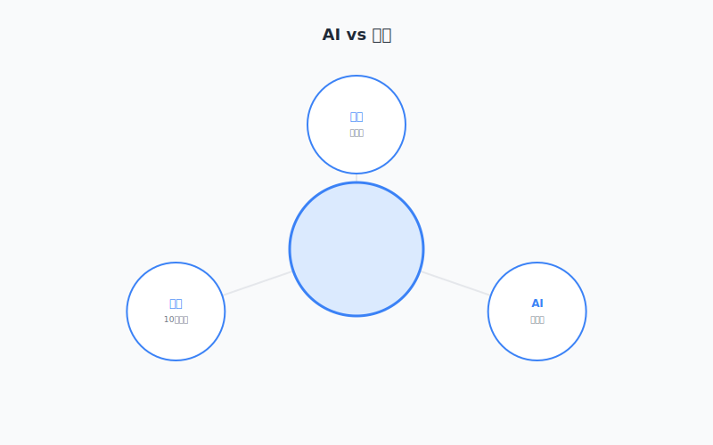
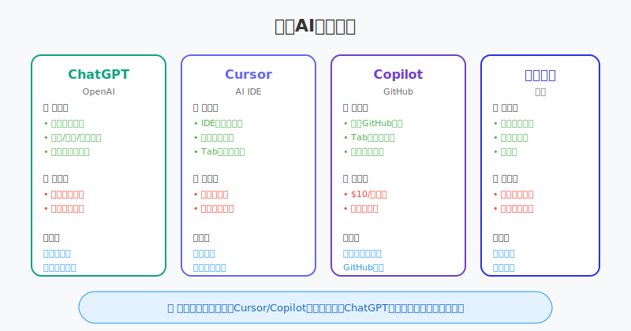
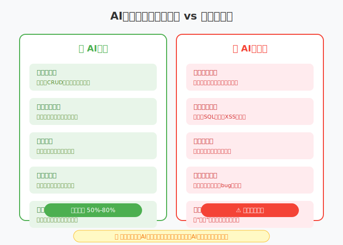
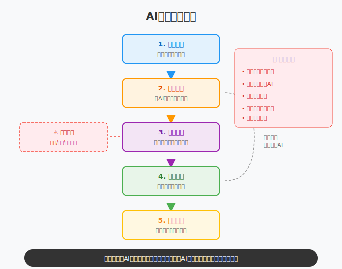

# 第1章：第一次用AI，我被惊艳到了

> **认识AI——从零开始的第一印象**

---

## 故事：小王的星期三下午

### 1:45 PM 崩溃的边缘

小王盯着屏幕上的红色报错信息，感觉额头上的血管在突突直跳。

"Invalid regular expression: nothing to repeat"

又是这个提示。他写的手机号验证正则已经改了七遍，从`/^1[3-9]\d{9}$/`改成`/^1(3[0-9]|4[5-9]|5[0-3,5-9]|6[256]|7[0-8]|8[0-9]|9[1389])\d{8}$/`，越改越复杂，越改越报错。

Stack Overflow的页面开了三个，每个答案都看起来很有道理，但复制过来就是不行。

"要不我问问老李？"小王瞥了一眼组长的工位。但老李正在开会，而且上次问正则问题被老李吐槽"这么简单的东西还要问"。

小王叹了口气，抓了抓头发。窗外的阳光透过百叶窗照进来，在键盘上投下一道道条纹。星期三下午，办公室里有节奏的键盘敲击声，咖啡机传来咕噜咕噜的声音。

这本来应该是一个普通的下午，如果不是这个该死的正则表达式的话。

"试试ChatGPT？"

小李的声音从旁边传来。他不知道什么时候已经摘下了耳机，正歪着头看小王的屏幕。

"那玩意儿？"小王撇撇嘴，"不就是高级点的搜索引擎吗？我问它还不如自己搜呢，搜出来的结果还靠谱点。"

"你先试试嘛，就描述一下你的需求。真的，我昨天用它写了个表单验证，两分钟搞定，比我吭哧吭哧写半小时强多了。"

小王半信半疑地打开浏览器，在地址栏输入chat.openai.com。注册挺麻烦的，还要手机号验证，最后还是借用了朋友的账号。

界面很简洁，就是一个输入框，下面有一行小字："有什么可以帮你的？"

小王盯着这个输入框，心里在打鼓。他想起之前在网上看到的对AI的两种极端评价：一种说AI要取代程序员了，一种说AI就是高级点的搜索，没什么用。他一直都是第二种观点的坚定支持者。

但此刻，那个该死的正则表达式还在屏幕上闪着红光，像是在嘲笑他。

"算了，试试又不会死。"他对自己说。

小王想了想，随手敲了一行字：

```
帮我写一个正则表达式，验证中国大陆手机号
```

他点了发送，靠在椅背上，心想："看你能给我什么垃圾答案。"

三秒钟后，答案出来了。

---

### 2:00 PM 第一次震惊

屏幕上显示的不只是一个正则表达式，而是一个完整的回答：

```javascript
const phoneRegex = /^1[3-9]\d{9}$/;
```

下面还有详细的解释：
- `^` 匹配字符串开头
- `1` 匹配数字1（手机号都以1开头）
- `[3-9]` 匹配3到9之间的任意数字（第二位）
- `\d{9}` 匹配9位数字（后面九位）
- `$` 匹配字符串结尾

再往下，居然还给了三个测试用例：
- ✅ 有效：`13800138000`、`15912345678`
- ❌ 无效：`23800138000`（不以1开头）、`1380013800`（只有10位）

小王愣住了。

这和搜索完全不同。搜索给他的都是链接——有的答案过期了，有的需要注册才能看，有的讲的是Python的正则不是JavaScript的。他需要一个个点进去，筛选，试错。

但这个是**直接给出答案**，而且考虑到了他可能的需求（测试用例），还解释了原理。

"还行吧，"小王嘴硬，"我自己也能写。"

但他还是忍不住多问了一句："如果是座机号码呢？"

发送。两秒后：

```javascript
// 手机和座机都能验证
const phoneRegex = /^(1[3-9]\d{9}|0\d{2,3}-?\d{7,8})$/;
```

下面列出了北京010、上海021、广州020等常见区号规则，还说明了座机号码的特点（区号3-4位，号码7-8位，中间可能有分隔符）。

小王的手指停在键盘上方。他突然意识到，如果自己去查座机号码的规则，可能需要打开好几个网页，还要分辨哪些信息是准确的。但AI直接把整理好的结果给他了。

"卧槽。"

这两个字不受控制地从嘴里蹦出来。

小李在旁边偷笑："是吧？"



*传统搜索需要多次点击筛选，AI对话直接给出完整答案*

---

### 2:15 PM 停不下来的试验

接下来的半小时，小王像发现了新大陆的探险家，充满了好奇和兴奋。

他打开自己那个半死不活的项目，里面有段CSS布局已经折磨他两天了。一个div怎么都不居中，他试了`margin: 0 auto`、`text-align: center`、`flex`的各种组合，全都不行。

他把HTML和CSS代码粘贴给AI，描述："这个div我想让它在页面正中间，垂直水平都居中，但怎么都不行。"

十秒后，AI给出了答案：

> 你的父容器没有设置`display: flex`，所以`align-items`和`justify-content`不会生效。在父容器加上：
> ```css
> .parent {
>     display: flex;
>     justify-content: center;
>     align-items: center;
>     height: 100vh; /* 确保父容器有高度 */
> }
> ```

小王试了一下，果然居中了。

"我靠，我试了两天的东西，它十秒就发现了问题..."小王喃喃自语。

他继续试验。打开GitHub上的一个开源项目，里面有段代码他怎么看都看不懂：

```javascript
const compose = (...fns) => fns.reduceRight((f, g) => (...args) => f(g(...args)));
```

这什么鬼？箭头函数套箭头函数，reduceRight又是什么？

他把代码粘贴给AI："这段代码是做什么的？我完全看不懂。"

AI回答：

> 这是一个**函数组合（compose）**工具。它把多个函数组合成一个函数，从右向左执行。
>
> **通俗理解**：就像流水线，数据从最右边的函数进入，处理完后传给左边的函数，直到最左边。
>
> **举个例子**：
> ```javascript
> const add1 = x => x + 1;      // 加1
> const mul2 = x => x * 2;      // 乘2
> const add1ThenMul2 = compose(mul2, add1);  // 先加1，再乘2
> add1ThenMul2(3); // (3+1)*2 = 8
> ```
>
> **应用场景**：函数式编程中，用来组合多个数据处理函数。

小王瞪大了眼睛。就这么几句话，比他在Stack Overflow上看半小时的英文解释还清楚。

"这就像...就像有个老师在旁边，随时给你讲解。"小王对小李说。

小李点点头："对啊，而且它永远不会不耐烦。你问多少遍都行。"

---

### 2:45 PM 从代码到文字

小王的试验范围开始扩大。

他想起来，明天要给产品经理发一封邮件，汇报这周的工作进展。这种邮件他总是写得头疼——写太短显得没干活，写太长又怕没人看，语气太随意显得不专业，太正式又显得死板。

他决定让AI试试。

```
帮我写一封工作汇报邮件，发给产品经理。
内容：
- 本周完成了用户登录功能（支持邮箱和手机号）
- 修复了3个bug：登录失效、密码错误提示不清、记住密码失效
- 下周计划开始做支付模块的接口对接
要求：
- 语气专业但不生硬
- 结构清晰，分点列出
- 包含对测试团队的感谢
```

AI生成的邮件让他惊讶：

> **主题**：本周工作进展汇报 - 用户登录功能完成
>
> 张经理，您好：
>
> 本周工作进展汇报如下：
>
> **一、本周完成工作**
>
> 1. **用户登录功能**（已完成并测试通过）
>    - 支持邮箱和手机号两种登录方式
>    - 实现记住密码、自动登录功能
>    - 完成错误提示优化，提升用户体验
>
> 2. **Bug修复**（3个，均已验证通过）
>    - #123：修复登录失效问题（session过期处理机制优化）
>    - #124：优化密码错误提示信息（提示文案更加友好明确）
>    - #125：修复记住密码功能失效（cookie存储问题修复）
>
> **二、下周工作计划**
>
> - 启动支付模块接口对接工作
> - 预计周三完成支付接口技术调研
> - 周五完成基础支付流程开发（下单+支付状态同步）
>
> **三、致谢**
>
> 感谢测试团队本周的快速反馈和细致测试，让Bug得以及时修复。如有问题，欢迎随时指正。
>
> 小王
> 2024年X月X日

小王读完，沉默了几秒。

这邮件结构清晰，语气恰到好处，甚至把bug的影响描述得让他觉得自己这周做了很多事。他自己写的话，可能就是："这周做完了登录，修了三个bug，下周做支付。"

"这东西...有点东西。"小王转头对小李说，语气里带着压抑不住的兴奋。

但小李已经重新戴上了耳机，只是竖了个大拇指，嘴角上扬。

---

### 3:00 PM 膨胀的开始

兴奋逐渐冲昏了小王的头脑。

他开始想：如果AI能写正则、解释代码、写邮件，那是不是什么都能写？以后我就不用写代码了，让AI写就行了！

他决定测试一下AI的极限。

"帮我写一个完整的用户系统，包含注册、登录、个人中心功能，使用Node.js和Express。"

AI开始生成代码。一行行代码在屏幕上滚动，小王看得眼花缭乱。

用户模型定义：
```javascript
const userSchema = new mongoose.Schema({
    username: { type: String, required: true, unique: true },
    email: { type: String, required: true, unique: true },
    password: { type: String, required: true },
    createdAt: { type: Date, default: Date.now }
});
```

注册接口：
```javascript
app.post('/api/register', async (req, res) => {
    const { username, email, password } = req.body;
    // 检查用户是否存在
    const existingUser = await User.findOne({ $or: [{ username }, { email }] });
    if (existingUser) {
        return res.status(400).json({ error: '用户已存在' });
    }
    // 创建新用户
    const user = new User({ username, email, password });
    await user.save();
    res.json({ message: '注册成功' });
});
```

登录接口：
```javascript
app.post('/api/login', async (req, res) => {
    const { username, password } = req.body;
    const user = await User.findOne({ username });
    if (!user || user.password !== password) {
        return res.status(401).json({ error: '用户名或密码错误' });
    }
    // 生成token...
});
```

一百多行代码，结构完整，注释清晰，甚至还带了错误处理。

小王的眼睛亮了。

"这也太强了吧！"他自言自语，"以后不用写代码了，让AI写就行了！我以后就是AI指挥员，告诉它我要什么，它给我写！"

他直接把代码复制到项目里，准备提交。他甚至已经在想象自己悠闲地喝着咖啡，看着AI自动写代码的场景。

"这才是程序员该有的生活嘛。"

就在这时，组长老张的声音从背后传来："小王，新来的实习生说你的登录接口有SQL注入漏洞，你看看？"

---

### 3:15 PM 一盆冷水

小王的手僵在键盘上。

他慢慢地、一点点地把刚才复制的代码滚动回去，仔细检查那段登录接口。

在`User.findOne({ username })`这一行，看起来没问题，用的是Mongoose的ORM，会自动转义。

但等等...上面那段注册接口的检查：

```javascript
const existingUser = await User.findOne({ 
    $or: [{ username }, { email }] 
});
```

这段看起来也没问题。那实习生说的漏洞在哪？

老张似乎看出了他的困惑，指着屏幕上的另一段代码——那是小王之前让AI生成的另一个版本，他差点混在一起了：

```javascript
app.post('/api/login', (req, res) => {
    const { username, password } = req.body;
    const query = `SELECT * FROM users WHERE username='${username}' AND password='${password}'`;
    db.query(query, (err, results) => {
        if (results.length > 0) {
            res.json({ success: true });
        } else {
            res.status(401).json({ error: '登录失败' });
        }
    });
});
```

小王倒吸一口凉气。

这段代码直接拼接了SQL字符串。如果用户输入的用户名是`admin' OR '1'='1`，那么SQL语句就变成了：

```sql
SELECT * FROM users WHERE username='admin' OR '1'='1' AND password='xxx'
```

由于`'1'='1'`永远为真，攻击者不需要知道密码就能以任意用户身份登录。

这是教科书级别的SQL注入漏洞。

"我...我刚才差点把这个提交上去..."小王的声音有些发抖。

老张拍拍他的肩膀："AI生成的代码要检查，不能直接上线。它不懂你的业务，也不懂安全规范。"

小王点点头，额头上有细密的汗珠。他刚才真的差点把漏洞代码推到生产环境。如果出了事，责任在他，不在AI。

---

### 3:45 PM 冷静的思考

小王把那段有问题的代码删掉，靠在椅背上，盯着天花板发呆。

窗外的阳光已经不那么强烈了，办公室里的空调发出低沉的嗡嗡声。他需要冷静下来，重新思考。

AI确实很厉害，但它不是万能的。它能写出语法正确的代码，但不懂业务规则；它能生成完整的接口，但不考虑安全问题；它能给看似完美的答案，但可能藏着隐患。

**它就像一个特别聪明的实习生**——什么都能干，学习能力强，响应速度快，但需要监督，需要指导，需要检查。你不能把关键任务直接丢给它，然后不管不顾。

小王打开笔记本，开始记录：

**AI擅长的**：
- 写模板代码（CRUD、工具函数、配置）→ 节省50%以上时间
- 解释复杂概念（比文档易懂）→ 理解速度翻倍
- 排查问题（给方向）→ 快速缩小范围
- 起草文档（邮件、方案）→ 省去措辞纠结

**AI不擅长的**：
- 理解业务上下文（不知道你的用户是谁、业务规则是什么）
- 保证安全（不会主动考虑SQL注入、XSS等漏洞）
- 架构设计（只能给通用方案，不能根据你的场景做创新设计）
- 承担责任（代码是你提交的，bug是你的责任）

**使用原则**：
1. **描述要具体**——上下文越清晰，结果越好
2. **学会迭代**——第一次不满意，继续追问、澄清
3. **保持批判**——AI可能出错，关键信息要验证
4. **理解再用**——看不懂的代码不能提交

写着写着，小王的心情平静下来。他不是找到了一个可以替代他的工具，而是找到了一个可以**增强**他的工具。

---

### 5:00 PM 工具的选择

下班前，小李凑过来："感觉怎么样？被泼冷水了吧？"

"是啊，差点把SQL注入漏洞上线。"小王苦笑，"但确实挺强的，得学会怎么用。你用的是什么？ChatGPT？"

"我用Cursor，写代码更爽，直接集成在VS Code里，按Tab就能补全。"小李说，"不过ChatGPT综合能力更强，写文档、分析问题都好使。"

"文心一言呢？国内不是也能用？"

"也能用，但代码能力弱一些。日常问答还行，复杂任务不如ChatGPT。"

小王在笔记本上记下：

**ChatGPT（OpenAI）**：
- 优点：综合能力最强，代码、写作、分析都很强；用户最多，社区资源丰富
- 缺点：需要科学上网；免费版有使用限制
- 适合：全能型需求，复杂推理任务

**Claude（Anthropic）**：
- 优点：上下文更长（能处理更长的代码和文档）；写长文本更好
- 缺点：代码能力略逊于ChatGPT；同样需要科学上网
- 适合：处理长文档、写长篇文章

**文心一言（百度）**：
- 优点：国内直接访问，速度快；对中文语境理解更好
- 缺点：代码能力不如ChatGPT；复杂推理一般
- 适合：日常问答、中文写作、不想折腾网络

**Cursor/Copilot**：
- 优点：IDE集成，写代码流畅；能读取项目上下文
- 缺点：需要下载安装；重度使用要付费
- 适合：日常编程，特别是大型项目

"没有最好的，只有最适合的。"小李总结道，"我是写代码多，所以用Cursor。你要是写文档多，ChatGPT可能更好。"

小王点点头。他意识到，选择工具也是一门学问，要根据自己的工作场景来。



*根据你的主要需求选择合适的AI工具*

---

### 6:00 PM 新的震撼

小李临走前，神秘兮兮地凑过来："给你看点更猛的。"

他打开终端，输入一行命令：`claude code`

屏幕上出现一个简洁的界面，显示着当前项目的文件结构。

"这是Claude Code，Anthropic出的终端AI编程工具。"小李说着，输入指令：

```
> 给这个项目的所有API接口添加统一的错误处理中间件
```

Claude Code开始工作。它不是一次性生成代码，而是：

1. **先分析项目结构** —— "我发现项目使用了Express，API路由在routes/目录下"
2. **制定计划** —— "我将创建一个错误处理中间件，并在所有路由中应用"
3. **执行修改** —— 自动创建了errorHandler.js，修改了app.js，还检查了每个路由文件
4. **验证结果** —— "修改完成。是否需要我运行测试验证？"

整个过程不到两分钟。小李只需要确认计划，其他都是Claude Code自动完成的。

小王看呆了："这...这比Cursor还强？"

"不一样。"小李解释，"Cursor是帮你写代码，Claude Code是**替你写代码**。它能自主规划、执行、验证，你只要把控方向就行。"

"还有别的吗？"

"多了去了。"小李扳着指头数，"OpenAI出了Codex CLI，开源的；Kimi出了Kimi Code，会员专属；国内还有字节的Trae、阿里的通义灵码、腾讯的CodeBuddy、百度的Comate..."

小王赶紧记下这些名字。他发现，AI编程工具的进化速度远超他的想象。

---

### 9:00 PM 失眠的夜晚

那天晚上，小王失眠了。

不是因为焦虑，而是因为兴奋。他躺在床上，盯着天花板，脑子里全是下午的场景：

半小时解决不了的问题，AI十秒给出答案；
看不懂的概念，用类比一讲就懂；
原本枯燥的文档工作，变得轻松愉快；
差点酿成大错的代码，提醒他要保持警惕；
Claude Code那种"自主执行"的能力，让他看到未来的可能性。

**他隐约感觉到，自己工作的样子，可能要变了。**

不是被AI取代，而是和AI一起工作——AI处理重复和繁琐，他专注于思考、判断和创造。

"让AI卷，我..."他在心里默念这个还没完全成型的概念，"我负责想，它负责做？"

不完全是。更像是**协作**——他指挥，AI执行，他检查，AI迭代。

这不是躺平，是升级。是从"体力劳动者"升级为"指挥者"。

---

### 11:00 PM 最后的测试

小王拿起手机，打开ChatGPT，输入了一个问题：

"请介绍《让AI卷，我躺平》这本书的作者和主要内容。"

AI回答："《让AI卷，我躺平》是一本关于AI辅助编程的技术书籍，作者是资深全栈工程师李明，出版于2024年..."

后面编了一大段，有鼻子有眼的，连"主要内容"都列出来了：第一部分讲AI基础，第二部分讲实战应用...

小王笑了。这本书根本还没出版，作者名字也是他刚编出来的。AI在"一本正经地胡说八道"。

**这就是AI的"幻觉"问题**——它不知道的事情，可能会编造出来，而且编造得非常像真的。如果不验证，就会被误导。

小王在笔记本上又加了一条：

**关键信息要验证，不能完全相信AI。特别是涉及事实、数据、引用的时候。**

他关上笔记本，终于有了一丝睡意。



*清楚AI的能力边界，才能正确使用它*



*遵循正确的使用流程，发挥AI最大价值*

---

## AI编程工具的进化：从补全到Agent

小王经历的，其实是AI编程工具发展的三个阶段：

### 阶段一：补全时代（2023）

**代表工具**：GitHub Copilot、TabNine

**核心能力**：根据上下文预测下一行代码

**使用方式**：像高级自动补全，按Tab接受建议

**局限性**：只能一行行补全，无法理解高层意图

### 阶段二：对话时代（2024）

**代表工具**：Cursor Chat、ChatGPT、Claude

**核心能力**：通过对话生成代码块、解释代码、回答问题

**使用方式**：描述需求，AI生成代码，人工审查后使用

**局限性**：需要手动复制粘贴，无法自动执行多步骤任务

### 阶段三：Agent时代（2025-2026）

**代表工具**：Claude Code、OpenAI Codex CLI、Cursor Agent、Kimi Code

**核心能力**：
- **自主规划**：理解任务后制定执行计划
- **自主执行**：自动修改多个文件、运行命令
- **自主验证**：检查执行结果，必要时调整

**使用方式**：描述高层需求，AI自主完成，人工把控方向

**典型工作流**：
1. 你说："给所有API添加统一的错误处理"
2. AI分析项目，制定计划
3. AI执行修改（创建中间件、修改路由、更新文档）
4. AI验证结果（运行测试、检查语法）
5. 你审查、确认、合并

这就是**Agent模式**——AI不再只是工具，而是能自主行动的助手。

---

## 主流AI编程工具全景图

| 工具 | 类型 | 特点 | 适用场景 | 价格 |
|:---|:---|:---|:---|:---|
| **GitHub Copilot** | IDE插件 | 实时补全，上下文感知 | 日常编码 | $10/月 |
| **Cursor** | AI IDE | Tab生成+Chat对话，支持Agent模式 | 复杂任务、多文件编辑 | $20/月 |
| **Claude Code** | 终端工具 | 纯CLI，SWE-bench 80.8%得分，自主执行能力强 | 大型重构、自动化任务 | 按量计费 |
| **OpenAI Codex CLI** | 终端工具 | 开源，多模态支持 | 自动化脚本、CI/CD集成 | 按量计费 |
| **Kimi Code** | 终端工具 | Kimi官方CLI，国内网络友好 | 中文项目、会员用户 | 会员专属 |
| **Trae** | AI IDE | 字节出品，国内免费，中文优化好 | 国内开发者、初学者 | 免费 |
| **通义灵码** | IDE插件 | 阿里出品，与阿里云生态集成 | Java开发者、阿里云用户 | 免费/付费 |
| **CodeBuddy** | AI IDE | 腾讯出品，与腾讯云生态集成 | 腾讯云用户、小程序开发 | 免费/付费 |
| **Comate** | IDE插件 | 百度出品，与文心大模型结合 | Python开发者、AI应用开发 | 免费/付费 |

---

## 本章小结

通过一个下午到晚上的经历，小王完成了从"怀疑"到"惊艳"到"理性认知"的转变。

**他学到的**：

1. **AI不是搜索引擎**，是对话式的智能助手，能直接给出答案
2. **AI像聪明的实习生**——能力强，但需要监督和指导
3. **AI擅长**：写重复代码、解释概念、排查问题、起草文档
4. **AI不擅长**：理解业务、保证安全、架构设计、承担责任
5. **使用原则**：描述具体、学会迭代、保持批判、理解再用
6. **工具选择**：根据场景选择——ChatGPT全能、Cursor编程强、Claude Code适合自动化、Trae国内免费
7. **警惕幻觉**：AI可能编造答案，关键信息要验证
8. **发展阶段**：AI编程工具已从"补全时代"进入"Agent时代"

**下一步**：

小王决定明天开始，每天用AI解决一个工作中的小问题。不是依赖，而是协作——让AI卷，他负责思考和判断。

---

## 本章交付物

1. **AI工具试用记录**：列出你试用过的AI工具及使用感受
2. **个人使用原则**：写下你自己的AI使用原则（至少3条）
3. **问题清单**：记录你在工作中遇到的、想用AI解决的问题

---

## 行动清单

- [ ] 注册并试用至少一个AI对话工具（ChatGPT/Claude/文心一言）
- [ ] 用它解决一个工作中的实际问题（写代码、解释概念、写文档等）
- [ ] 记录使用过程中的3个发现（惊喜或问题）
- [ ] 了解试用工具的局限性（什么时候不能用）
- [ ] 试用一个IDE集成的AI工具（Cursor/Trae/通义灵码）

---

## 本章彩蛋：2025-2026年的新选择

### Claude Code：终端里的AI工程师

Anthropic推出的终端AI编程工具，以**SWE-bench 80.8%**的得分震惊业界。

**特点**：
- 纯CLI界面，不依赖IDE
- 支持自主规划-执行-验证完整工作流
- 能理解整个代码库的上下文
- 支持多文件联动修改

**适合谁**：
- 喜欢命令行的开发者
- 需要处理大型重构任务
- 希望AI能自主执行多步骤任务

**使用方法**：
```bash
# 安装
npm install -g @anthropic-ai/claude-code

# 在项目目录运行
claude code

# 然后像聊天一样描述任务
> 给这个项目的所有组件添加单元测试
```

### OpenAI Codex CLI：开源的编程Agent

OpenAI推出的开源编程Agent，GitHub 70K+ stars。

**特点**：
- **完全开源**，可自托管和修改
- **多模态**：支持图片输入（传设计稿让AI生成代码）
- **CI/CD友好**：可集成到自动化流水线
- 在沙箱环境中安全执行命令

**典型用法**：
```bash
# 安装
pip install openai-codex

# 基本使用
codex "给所有API添加统一错误处理"

# 多模态：传设计稿生成代码
codex --image ./design.png "根据设计稿生成React组件"

# CI/CD集成
# .github/workflows/auto-fix.yml
- name: Auto Fix Code
  run: codex --approval-mode auto "修复TypeScript错误"
```

**适合谁**：
- 需要定制化AI工作流
- 希望集成到CI/CD流程
- 有多模态需求（设计稿转代码）
- 喜欢开源工具

### Kimi Code：国内开发者的选择

Kimi推出的CLI编程助手，会员专属功能。

**特点**：
- 国内网络直接访问，无需翻墙
- 针对中文项目优化
- 与Kimi的其他产品生态打通

**适合谁**：
- Kimi会员用户
- 不方便使用国外工具
- 主要开发中文项目

### Trae：字节跳动的国产AI IDE

字节跳动推出的国产AI IDE，国内免费使用。

**特点**：
- 完全免费
- 针对国内开发者习惯优化
- 中文支持好，响应速度快

**适合谁**：
- 预算有限的开发者
- 国内开发者、初学者
- 想要Cursor类似体验但不想付费

### 通义灵码 / CodeBuddy / Comate：大厂的选择

| 工具 | 出品方 | 优势 |
|:---|:---|:---|
| 通义灵码 | 阿里 | Java生态、阿里云集成 |
| CodeBuddy | 腾讯 | 小程序开发、腾讯云集成 |
| Comate | 百度 | Python生态、文心大模型 |

这些工具各有侧重，选择时可以考虑你主要使用的技术栈和云服务。

---

*下一章：AI不是万能，但确实很强——小李的踩坑实录，看看过度依赖AI会发生什么。*
