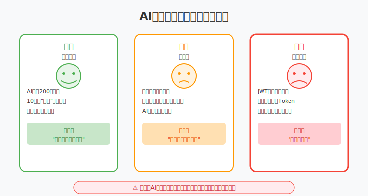
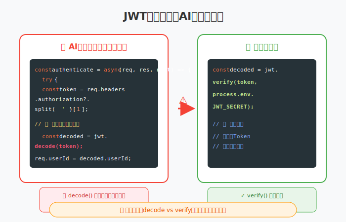

# 第2章：AI不是万能，但确实很强

> **AI的能力边界——能做什么，不能做什么**

---

## 故事：小李的"AI依赖症"一周

### 周一早晨：信心满满的开始

周一早上8:30，小李比平常早到了半小时。

他是组里的后端开发，五年经验，带过两个实习生，技术功底扎实。看着上周小王用AI写代码写得飞起，他心里有点不服："小王才三年经验，都能用得那么好，我肯定用得更好。"

他打开Cursor，把公司的项目导入进去，又打开了ChatGPT的网页。双管齐下，信心满满。

今天的任务是给新项目写一个用户权限系统。放在以前，这种需求他需要先查资料、设计模型、写接口、写测试，前前后后得两天。

但今天不一样了。

小李在编辑器里敲了一行注释：

```javascript
// 写一个完整的RBAC权限系统，包含用户、角色、权限三个模型
// 支持动态分配权限，支持权限继承，使用Node.js + Express + MongoDB
```

然后按了Tab键。

Cursor的AI开始工作了。一行行代码像瀑布一样流出来：

```javascript
// AI生成的代码开始
const mongoose = require('mongoose');

// 用户模型
const userSchema = new mongoose.Schema({
    username: { type: String, required: true, unique: true },
    email: { type: String, required: true, unique: true },
    password: { type: String, required: true },
    roles: [{ type: mongoose.Schema.Types.ObjectId, ref: 'Role' }],
    createdAt: { type: Date, default: Date.now }
});

// 角色模型
const roleSchema = new mongoose.Schema({
    name: { type: String, required: true, unique: true },
    permissions: [{ type: mongoose.Schema.Types.ObjectId, ref: 'Permission' }],
    parent: { type: mongoose.Schema.Types.ObjectId, ref: 'Role', default: null }
});

// 权限模型
const permissionSchema = new mongoose.Schema({
    name: { type: String, required: true },
    resource: { type: String, required: true },
    action: { type: String, required: true }  // create, read, update, delete
});
```

小李看着屏幕，眼睛越睁越大。这些代码结构清晰，注释完整，甚至考虑到了权限继承（parent字段）。

"这也太强了..."他喃喃自语。

AI继续生成，这次是整个权限检查中间件：

```javascript
// 权限检查中间件
const checkPermission = (resource, action) => {
    return async (req, res, next) => {
        try {
            const user = await User.findById(req.userId).populate('roles');
            if (!user) {
                return res.status(401).json({ error: '用户未登录' });
            }
            
            // 检查用户是否有权限
            let hasPermission = false;
            for (const role of user.roles) {
                const roleData = await Role.findById(role).populate('permissions');
                for (const perm of roleData.permissions) {
                    if (perm.resource === resource && perm.action === action) {
                        hasPermission = true;
                        break;
                    }
                }
                if (hasPermission) break;
            }
            
            if (!hasPermission) {
                return res.status(403).json({ error: '没有权限' });
            }
            
            next();
        } catch (error) {
            res.status(500).json({ error: '权限检查失败' });
        }
    };
};
```

两百多行代码，完整实现了一个RBAC权限系统，包括模型定义、权限检查、错误处理。

小李看了下时间：9:15。从他按下Tab键到现在，不到十分钟。

"这要是我手写，至少得半天吧？"他心里盘算着，"现在十分钟搞定。"

一种兴奋感涌上心头。他想起以前那些熬夜写代码的日子，那些和正则表达式死磕的下午，那些查文档查到眼花的时刻...如果早有AI，这些痛苦都不存在了。

"以后我还写什么代码啊，"他靠在椅背上，嘴角上扬，"让AI写就行了。我负责提需求，AI负责实现，完美。"

他甚至开始幻想以后的工作状态：每天来公司，喝喝咖啡，看看AI生成的代码，点点提交，然后准时下班。

"这才是程序员该有的生活嘛。"

他没仔细看那些代码，直接保存，提交，推送。



*周一的膨胀，周二的隐患，周三的事故——AI依赖症的完整历程*

```bash
git add .
git commit -m "feat: 完成RBAC权限系统"
git push origin main
```

搞定！才9点半，今天的主要任务就完成了。

小李打开知乎，刷起了"程序员用AI偷懒是什么体验"的帖子，心里美滋滋的。

---

### 周二上午：第一个坑

周二早上10点，测试同事小林推门进来，脸色不太好看。

"小李，你这个权限系统有问题。"

小李抬起头，心里咯噔一下："什么问题？"

"普通用户能访问管理员接口。"小林把测试报告放在他桌上，"我用普通账号登录，调管理员接口，居然返回成功了。"

"不可能吧..."小李赶紧打开代码查看。

他仔细读AI生成的权限检查逻辑，终于发现问题了：

```javascript
// AI生成的权限检查
for (const perm of roleData.permissions) {
    if (perm.resource === resource && perm.action === action) {
        hasPermission = true;
        break;
    }
}
```

这段代码只检查了"用户有没有这个权限"，但没检查"这个权限对应的资源是不是属于这个用户"。

简单说，系统知道用户A有"查看订单"的权限，但不知道这个订单是不是用户A的。所以用户A能看到用户B的订单，甚至能修改。

"这是AI生成的代码..."小李嘟囔着，"它怎么连这个都没想到..."

他突然意识到，AI生成的代码是通用的RBAC实现，适用于大多数场景。但公司的业务有特殊规则：用户只能操作自己的资源，除非他是管理员。

AI不知道这个业务规则，所以没实现资源归属检查。

小李开始修改代码，加上资源归属验证：

```javascript
// 增加资源归属检查
if (resource === 'order') {
    const order = await Order.findById(req.params.id);
    if (order.userId.toString() !== req.userId && !user.isAdmin) {
        return res.status(403).json({ error: '无权访问此资源' });
    }
}
```

改了一上午，所有涉及资源操作的接口都加上了归属检查。小李揉着太阳穴，有点沮丧。

"至少基础代码是AI生成的，"他安慰自己，"我省了一半时间。"

但他心里开始有点不安：如果AI连这么重要的业务逻辑都没考虑，那还有多少坑等着他？

---

### 周三下午：更大的坑

周三下午2点，小李正在午休，被一阵急促的电话铃声惊醒。

"小李，生产环境出事了！"是运维同事的声音，"有人能看到别人的个人信息，还有用户投诉说自己账号被登录了！"

小李瞬间清醒了，冷汗直冒。

他冲到电脑前，手都是抖的。打开生产日志，发现确实有异常：有普通用户的请求访问了管理员接口，而且成功了。

紧急排查后，他发现了问题所在：AI生成的JWT token验证代码有个致命漏洞。

这是认证中间件的代码：

```javascript
// AI生成的认证中间件
const authenticate = async (req, res, next) => {
    try {
        const token = req.headers.authorization?.split(' ')[1];
        if (!token) {
            return res.status(401).json({ error: '未提供token' });
        }
        
        // 致命问题在这里！
        const decoded = jwt.decode(token);  // 只用了decode，没有用verify！
        req.userId = decoded.userId;
        next();
    } catch (error) {
        res.status(401).json({ error: '认证失败' });
    }
};
```

`jwt.decode()`只是解码token，不验证签名。任何人都可以伪造一个token，把userId改成任意值，系统都会认为他是合法用户。

正确的做法是用`jwt.verify()`，还需要密钥验证签名：

```javascript
const decoded = jwt.verify(token, process.env.JWT_SECRET);
```



*一字之差（decode vs verify），安全与漏洞的分界*

小李的手在发抖。这是他周一提交的代码，当时他觉得AI生成的代码"看起来没问题"，就没仔细看安全相关的部分。

"我怎么能犯这种低级错误..."他懊恼地抓着头。

这个漏洞意味着，从周一到周三，整整两天时间，任何人都可以伪造身份访问系统。如果真有恶意用户发现了这个漏洞...

后果不堪设想。

---

### 周三晚上：紧急处理

公司召开了紧急会议。

CTO脸色铁青："这个漏洞可能导致所有用户数据泄露。我们需要立即修复，并评估影响范围。"

小李低着头，恨不得找个地缝钻进去。

"代码是谁写的？"CTO问。

"是我，"小李声音很小，"但我用了AI生成代码..."

"AI写的？"CTO皱眉，"那你审查了吗？测试了吗？"

"我...我看了一眼，觉得没问题就提交了..."

CTO叹了口气："AI是工具，你是使用者。代码是你提交的，责任在你。"

接下来的几个小时是噩梦：

1. 立即修复漏洞，重新部署
2. 强制所有用户重新登录，更换token
3. 检查访问日志，看是否有异常访问
4. 发公告向用户说明情况
5. 向监管部门报告（按法规要求）

幸运的是，日志显示没有发现大规模的恶意访问。但这个事故已经在公司内部造成了很大影响。

小李被组长叫去谈话。虽然没有被开除（毕竟是初犯，且及时修复），但在绩效上留了记录，今年的晋升肯定没戏了。

走出会议室，小李感觉整个人都被抽空了。

---

### 周四：反思的一天

周四，小李请了一天假。不是身体不舒服，是需要冷静思考。

他躺在家里沙发上，盯着天花板，复盘这一周的事情。

周一，他过度信任AI，没仔细看就提交代码。当时心里想的是"AI生成的肯定没问题"，完全忘记了审查。

周二，他发现AI不懂业务规则，生成的代码有逻辑漏洞。当时他安慰自己"至少省了一半时间"，但没意识到问题的严重性。

周三，因为他没审查安全相关代码，导致生产事故。这是最严重的错误——安全无小事，他却把这么重要的代码完全交给了AI。

问题不是AI，是他自己。

他把AI当成了"代码生成器"，而不是"助手"。他以为有了AI就可以不用思考，直接复制粘贴。但现实是，AI生成的代码需要审查、需要理解、需要根据业务调整。

**AI不是魔法师，它是一个能力很强的实习生——能帮你干活，但需要你指导和检查。**

小李打开笔记本，开始认真写下自己的反思。

**AI能做什么**：
- 写模板代码（省时间）——比如工具函数、CRUD接口、配置文件
- 提供实现思路（给参考）——比如多种实现方式对比、最佳实践
- 解释复杂逻辑（帮理解）——比如算法原理、框架源码
- 快速原型验证（加速迭代）——比如先跑通再优化

**AI不能做什么**：
- 理解你的业务（需要你自己补充）——AI不知道你的用户是谁、业务规则是什么
- 保证代码安全（需要你自己审查）——AI可能生成有漏洞的代码
- 做架构决策（需要你自己判断）——AI只能给通用方案，不能根据你的场景决策
- 为你的错误负责（责任在你）——代码是你提交的，出了问题你背锅

**使用原则**：
1. 生成代码后必须审查，理解每一行在做什么
2. 安全相关的代码（认证、支付、权限）必须人工检查，不能全靠AI
3. 业务逻辑复杂的部分，AI只能给参考，需要自己调整
4. 永远不要提交你看不懂的代码
5. 关键信息要验证，AI可能有"幻觉"

写到最后，小李想起周一那个自信满满的自己，不禁苦笑。

"我以为有了AI就可以躺平了，"他自言自语，"结果是需要更用心。"

---

### 周五：新工具的尝试与边界

周五，小李回到公司，心态已经变了。

他不再是那个想"让AI写代码，我喝咖啡"的人，而是想"让AI帮我写，我负责审查"。

下午，他听说Claude Code出了新版本，决定试试这个新工具。

```bash
claude code
```

他打开公司的另一个项目，让Claude Code分析代码质量。

Claude Code很快就发现了几个潜在问题：

```
> 分析项目代码质量

分析完成，发现以下问题：

1. src/utils/validation.js:18
   - 使用了已过时的正则表达式，可能导致ReDoS攻击
   
2. src/middleware/auth.js:42  
   - 未检查JWT token的过期时间
   
3. src/controllers/user.js:89
   - 未对用户输入进行充分转义，存在XSS风险

是否需要我提供修复方案？
```

小李惊讶于Claude Code的分析能力——它不仅发现了问题，还给出了具体位置和风险评估。

但他也注意到了Claude Code的**边界**：

```
> 修复这些问题

我需要先说明我的能力边界：

1. 我可以帮你生成修复代码
2. 但修复后的代码**必须**经过人工审查和测试
3. 安全相关的修改需要安全团队评估
4. 我不能保证修复方案完全符合你的业务规则

确认继续吗？(y/n)
```

"有意思，"小李想，"它比Cursor更有'自我意识'，会主动说明自己的能力边界。"

他让Claude Code生成了修复方案，然后逐行审查、测试、验证，最后才提交。

这个过程花了他两个小时，比直接让AI"自动修复"慢多了。但他知道，这才是正确的方式。

---

## 本章要点

通过小李一周的经历，我们看到AI的能力边界：

### AI能做什么（用它）

| 场景 | 效果 | 示例 |
|:---|:---|:---|
| 写模板代码 | 省50-80%时间 | CRUD、工具函数、配置 |
| 提供实现思路 | 给参考方案 | 多种实现方式对比 |
| 解释复杂逻辑 | 帮理解原理 | 算法、框架源码 |
| 快速原型验证 | 加速迭代 | 先跑通再优化 |

### AI不能做什么（别指望它）

| 场景 | 风险 | 后果 |
|:---|:---|:---|
| 理解业务规则 | 生成通用代码，不符合业务 | 逻辑错误、数据混乱 |
| 保证代码安全 | 可能有注入、越权等漏洞 | 生产事故、数据泄露 |
| 做架构决策 | 给出过时或不合适的方案 | 技术债务、性能问题 |
| 为你的错误负责 | 出问题你背锅 | 绩效、甚至解雇 |

### 不同工具的边界差异

| 工具类型 | 能力边界 | 使用建议 |
|:---|:---|:---|
| **补全类** (Copilot) | 只能补全当前上下文，无法理解高层意图 | 适合日常编码，不适合复杂任务 |
| **对话类** (Cursor Chat) | 能生成代码块，但需要手动复制粘贴 | 适合复杂逻辑生成，需要人工审查 |
| **Agent类** (Claude Code) | 能自主执行多步骤任务，但仍需人工确认 | 适合大型重构，需要严格把控 |
| **国内工具** (Trae/通义灵码) | 网络友好，但模型能力可能略逊 | 适合国内开发者，日常任务 |

### 正确使用姿势

**❌ 错误用法**：
- 让AI生成大量代码，不看直接提交
- 安全相关代码完全交给AI
- 复杂业务逻辑让AI一次生成
- 看不懂的代码也提交
- 把Agent工具当成"自动编程机"

**✅ 正确用法**：
- 分段生成，逐段审查
- 安全代码自己写或仔细审查
- 业务逻辑AI给参考，自己调整
- 看不懂的代码不提交
- 关键信息要验证
- **Agent工具的正确用法**：
  - 让AI制定计划，你审查计划
  - 让AI执行修改，你审查修改
  - 让AI验证结果，你做最终确认

### 关键认知

**AI是增强你的工具，不是替代你的魔法。**

它让你从"写每一行代码"变成"设计和审查代码"，从"体力劳动者"变成"指挥者"。

但这也意味着，**你的责任更大了**——因为最终上线的代码，是你的决策，不是AI的。

**Agent工具的出现并没有改变这一点**。它让AI能做的事更多了，但边界依然存在：
- 它不懂你的业务
- 它不能保证安全
- 它不会为你的错误负责

**区别只在于**：以前是AI生成、你审查；现在是AI规划-执行-验证、你把控方向并确认。

---

## 本章彩蛋：AI的"自信错误"

你知道吗？AI犯错的时候，往往非常自信。

它不会说"我不太确定"，而是会给出看起来完全正确的答案，哪怕答案是错的。

这叫**"过度自信"**（Overconfidence）。原因是AI的训练目标是"生成看起来像对的答案"，而不是"知道自己不知道"。

**测试**：问AI一个你确定没有答案的问题，比如"2025年诺贝尔文学奖得主是谁？"（假设还没公布），它会编出一个名字，而且语气非常确定。

**不同工具的表现**：
- **ChatGPT/Claude**：相对会给出一些限定词（"根据我的了解"、"可能是"）
- **Copilot/Cursor**：补全代码时不会提示风险
- **Claude Code**：会主动说明能力边界，这是它的设计特点

所以，**永远保持怀疑**，特别是当AI的答案看起来"太完美了"的时候。

---

*下一章：选对工具，事半功倍——小张的工具选型之旅。*
