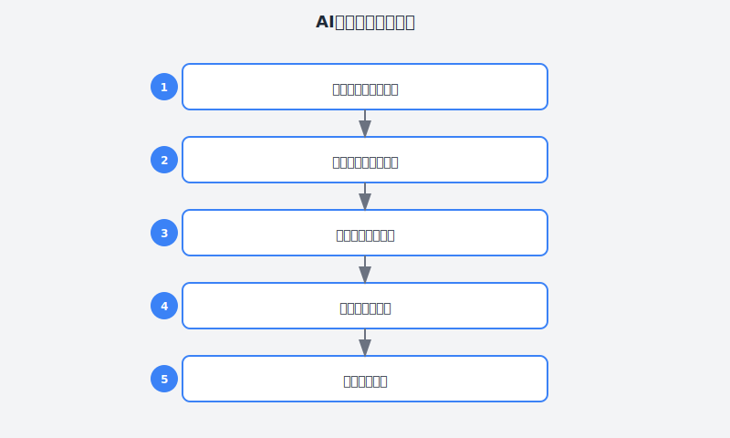
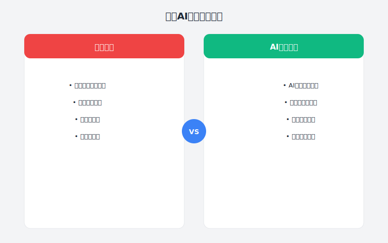

# 第3章：选对工具，事半功倍

> **AI工具选型——找到适合自己的**

---

## 故事：小张的"工具选择困难症"

### 周一：被选择淹没

周一早上，小张盯着浏览器里打开的十几个标签页，感觉脑袋嗡嗡作响。

左边是Cursor的下载页面，右边是GitHub Copilot的订阅页面，还有一个Trae的广告弹窗不知什么时候冒了出来。Slack里，前端组的同事说"Cursor最好用"，后端组的老王却说"Copilot最稳定"，产品经理阿强甚至安利起了"Claude代码神器"。

"到底该用哪个？"

小张抓了抓头发。他是全栈开发，既要写React前端，又要写Node.js后端，偶尔还要写点Python脚本。他想要的AI工具是能通吃所有场景的"瑞士军刀"，但看了一圈测评文章，每个工具都被吹得天花乱坠，又都被骂得体无完肤。

"先试试Cursor吧，好像挺火的。"

他下载安装，导入了自己的项目，兴冲冲地敲了一行注释：

```javascript
// 写一个用户登录表单，包含邮箱和密码验证
```

然后按下Tab键。

AI开始生成代码，一行行跳出来。但小张越看眉头皱得越紧——

"这用的是class组件？现在都2025年了，谁还用class写React啊？"

"而且这表单验证逻辑怎么写在组件里？不应该用react-hook-form吗？"

"还有这个样式...inline style？我的项目里明明配置好了Tailwind..."

他按了Esc取消生成，深吸一口气。

"可能是我没设置好。"

---








### 周二：配置地狱

周二一整天，小张都在研究Cursor的配置。

他发现Cursor有个".cursorrules"文件，可以自定义AI的行为。于是他照着文档开始写：

```
You are an expert React developer.
- Always use functional components with hooks
- Use TypeScript for type safety
- Style with Tailwind CSS
- Use react-hook-form for form handling
- Follow the project's existing code style
```

写完之后，他又试了一次同样的需求。这次生成的代码好多了——确实用了函数组件，也用了TypeScript。但当他仔细看表单验证逻辑时，发现问题：

```typescript
// AI生成的验证逻辑
const validateEmail = (email: string) => {
  return email.includes('@');
};
```

"这也太简单了吧？我的项目里明明有现成的email验证工具函数..."

小张突然意识到一个问题：**AI不知道他的项目里有什么**。它只能根据通用的最佳实践生成代码，但每个项目都有自己的规范、自己的工具库、自己的约定。

"也许我应该试试Copilot？它号称最懂上下文..."

---

### 周三：Copilot的惊喜与失望

周三，小张花了10美元订阅了GitHub Copilot。

打开VS Code，Copilot已经安装好了。他打开昨天那个表单文件，开始手动修改AI的验证逻辑。

```typescript
import { validateEmail } from '@/utils/validation';
```

他刚敲完这行import，Copilot就给出了建议：

```typescript
import { validateEmail, validatePassword } from '@/utils/validation';
```

"嗯？它怎么知道我还需要validatePassword？"

小张往下滚动，发现下面确实要用到密码验证。Copilot似乎"读懂"了他的意图。

他继续写：

```text
const LoginForm = () => {
  const [email, setEmail] = useState('');
  const [password, setPassword] = useState('');
// ... 以下 Copilot 自动补全
```

Copilot立刻补全了：

```text
  const [errors, setErrors] = useState<{email?: string; password?: string}>({});
  // ... 继续处理表单逻辑
```
  const handleSubmit = async (e: FormEvent) => {
    e.preventDefault();
    // TODO: 验证并提交
  };
```

小张眼睛一亮。这种"读懂上下文"的能力确实很强。而且Copilot的代码补全很轻量，不会像Cursor那样一下子生成一大段，让人感到失控。

但当他想重构一个复杂函数时，Copilot就不够用了——它只能一行行补全，不能一次性理解"把这个回调地狱改成async/await"这样的高层指令。

"Cursor适合写新代码，Copilot适合改代码..."小张在笔记本上记下一行字。

---

### 周四：意外的发现

周四下午，小张偶然在公司技术群里看到一个链接：

"我们后端组整理的AI工具对比表，需要的自取~"

他点开一看，是一张详细的表格：

| 工具 | 类型 | 代码生成 | 上下文理解 | 聊天功能 | Agent能力 | 价格 | 适合场景 |
|:---:|:---:|:---:|:---:|:---:|:---:|:---:|:---|
| Cursor | AI IDE | ⭐⭐⭐⭐⭐ | ⭐⭐⭐⭐ | ⭐⭐⭐⭐⭐ | ⭐⭐⭐⭐⭐ | $20/月 | 复杂任务、多文件编辑 |
| Copilot | IDE插件 | ⭐⭐⭐⭐ | ⭐⭐⭐⭐⭐ | ⭐⭐ | ⭐⭐ | $10/月 | 日常编码、补全优化 |
| Claude Code | CLI工具 | ⭐⭐⭐⭐ | ⭐⭐⭐⭐⭐ | ⭐⭐⭐⭐ | ⭐⭐⭐⭐⭐ | 按量计费 | 大型重构、自动化任务 |
| Trae | AI IDE | ⭐⭐⭐⭐ | ⭐⭐⭐⭐ | ⭐⭐⭐⭐ | ⭐⭐⭐⭐ | 免费 | 国内开发者、预算有限 |
| 通义灵码 | IDE插件 | ⭐⭐⭐⭐ | ⭐⭐⭐⭐ | ⭐⭐⭐ | ⭐⭐⭐ | 免费/付费 | Java开发者、阿里云用户 |
| CodeBuddy | AI IDE | ⭐⭐⭐⭐ | ⭐⭐⭐⭐ | ⭐⭐⭐⭐ | ⭐⭐⭐⭐ | 免费/付费 | 小程序开发、腾讯云用户 |

表格下面还有一段备注，以及后端组长附的一段话：

> **选型建议**：
> - 追求效率最大化？**Cursor + Copilot组合**
> - 预算有限？**Trae + 通义灵码**
> - 大型项目/企业级？**Claude Code + Copilot**
> - 国内开发者/网络限制？**Trae + 通义灵码 + CodeBuddy**
> - **自动化需求强？Codex CLI + Claude Code**

> 附：最近我们组试用了OpenAI的Codex CLI，开源的，功能很强大。特别适合自动化脚本和CI/CD集成。小张你有兴趣可以了解一下。

"Codex CLI？OpenAI不是只有Copilot吗？"

小张好奇地搜索了一下，发现OpenAI确实推出了一个开源的编程Agent工具——Codex CLI。他立即在终端安装试用：

```bash
pip install openai-codex
```

安装完成后，他尝试了一个之前一直想做但没时间搞的自动化任务：给所有API接口添加统一的日志记录。

```bash
codex "给这个项目的所有API接口添加统一的请求日志记录，包括请求方法、URL、耗时和状态码"
```

Codex的表现让他惊讶：

1. **首先分析项目结构**，识别出所有路由文件
2. **制定执行计划**，列出需要修改的文件
3. **生成代码**，创建一个日志中间件
4. **自动应用修改**，在所有路由中引入中间件
5. **验证结果**，检查语法错误

整个过程只用了不到3分钟。

"这比Cursor的Agent模式还要自动化！"小张感叹。

他对比了一下Codex CLI和Cursor的Agent模式：

| 特性 | Cursor Agent | Codex CLI |
|:---|:---|:---|
| 界面 | 图形化IDE | 纯终端 |
| 开源 | 否 | **是** |
| **多模态** | 不支持 | **支持（可以看图、生成图）** |
| **自动化集成** | 有限 | **完美支持CI/CD** |
| 可扩展性 | 插件生态 | **可本地部署修改** |
| 模型 | Claude/GPT可选 | GPT-4o |
| 适用场景 | 日常开发、复杂任务 | **自动化、批量处理、CI/CD** |

"原来不是选一个，而是组合使用？"

小张恍然大悟。他一直陷入"二选一"的思维误区，却没想到这些工具可以互补。

**更让他意外的是，表格下方后端组长还补充了几款新工具**：

---

**OpenCode：开源的Claude Code替代品**

"如果你在意开源和可控性，可以试试OpenCode，"组长备注道，"它是Claude Code的开源替代品，MIT协议，支持75+种模型，还能接入本地模型。"

小张查了一下OpenCode的资料：

- **完全开源**（MIT协议），可自托管
- **模型无关**：支持OpenAI、Claude、Gemini、DeepSeek等75+模型，也支持Ollama本地部署
- **自动压缩**：当Token接近上限时自动摘要对话，保持长任务连贯性
- **气隙模式**：适合金融、政务等强监管行业（数据不出内网）
- **多代理协作**：支持多个AI代理并行工作

```bash
# 安装OpenCode
curl -fsSL https://opencode.ai/install.sh | bash

# 使用免费模型
opencode --model kimi-k2.5-free "分析代码中的性能瓶颈"

# 规划-构建双模式
opencode --mode plan "设计一个微服务架构"
```

**适合谁**：在意开源、需要本地部署、怕"断粮"被封号的开发者

---

**Kiro：亚马逊的"规格驱动开发"IDE**

"Kiro是AWS推出的新工具，"组长继续介绍，"它最大的特点是'规格驱动开发'——写代码前先写规格文档。"

Kiro的核心亮点：

1. **Specs（规格文档）**：你描述需求"加个评论功能"，Kiro自动生成包含用户故事、验收标准、边界条件的规格文档
2. **Hooks（自动化钩子）**：保存文件时自动触发操作
   - 保存组件 → 自动更新测试文件
   - 修改API → 自动刷新README
   - 准备提交 → 自动扫描安全问题
3. **与AWS深度集成**：适合云原生项目

```
用户：为产品添加评论系统

Kiro自动生成：
├── requirements.md    # 需求文档
│   ├── 查看评论       # 用户故事+验收标准
│   ├── 创建评论       # 包含边界条件（必须登录、不能重复评论）
│   └── 评分功能
├── design.md          # 系统设计
│   ├── 数据流图
│   ├── API端点设计
│   └── 数据库结构
└── tasks.md           # 任务清单
    ├── 后端API实现
    ├── 前端组件
    └── 测试用例
```

**适合谁**：需要严格需求管理、从原型到生产的企业级项目

---

**Antigravity：谷歌的"Agent-First"IDE**

"还有谷歌的Antigravity，"组长最后提到，"这是真正的Agent-First IDE，连模式选择都没有，上来就是Agent。"

Antigravity的特点：

- **三表面架构**：Editor（编辑）+ Terminal（终端）+ Browser（浏览器）
- **Browser Surface**：AI可以启动浏览器，截图验证UI，甚至点击按钮测试功能
- **Gemini 3驱动**：SWE-bench 76.2%，支持多模态（可以看图生成代码）
- **Planning Mode**：复杂任务先生成结构化计划，人工审查后再执行
- **Mission Control**：支持后台并行运行多个Agent

```
用户：根据这个设计稿实现登录页面
[拖拽上传design.png]

Antigravity：
1. 分析设计稿（视觉识别）
2. 生成实现计划
3. 编写React组件
4. 启动浏览器预览
5. 截图对比设计稿
6. 调整样式差异
```

**适合谁**：需要端到端自动化、快速原型、多模态需求的开发者

---

### 周五：找到适合自己的组合

周五，小张根据自己的工作流设计了一套工具组合：

**日常开发**：GitHub Copilot
- 写代码时的智能补全
- 根据上下文推荐代码
- 价格合适，反应迅速

**复杂任务**：Cursor
- 生成组件或页面
- 重构复杂逻辑
- 询问技术方案
- Agent模式处理多文件任务

**大型重构**：Claude Code
- 跨文件批量修改
- 自动化任务执行
- 代码质量分析

**国内备选**：Trae
- 网络稳定，完全免费
- 当Cursor/Copilot网络不稳定时使用

**其他选择（根据需求）**：
- **OpenCode**：在意开源可控、需要本地部署时使用
- **Kiro**：企业级项目、需要规格驱动开发时使用
- **Antigravity**：追求极致Agent体验、有多模态需求时使用
- **Codex CLI**：自动化脚本、CI/CD集成时使用

他打开Notion，把这个组合方案记录下来：

```
# 我的AI工具组合（2025版）

## 1. GitHub Copilot（主力）
- 用途：日常编码补全
- 触发方式：自动补全
- 使用场景：
  * 写函数时自动补全参数处理
  * 写测试时生成测试用例
  * 重构时提供修改建议
- 价格：$10/月

## 2. Cursor（复杂任务）
- 用途：生成代码、技术咨询、Agent模式
- 触发方式：Tab生成 / Chat询问 / Agent模式
- 使用场景：
  * 新功能模块开发
  * 技术方案设计
  * 代码审查和学习
  * 多文件联动修改（Agent模式）
- 价格：$20/月
- 注意：Tab模式适合简单生成，Agent模式适合复杂任务

## 3. Claude Code（大型重构）
- 用途：自动化重构、代码分析
- 触发方式：命令行对话
- 使用场景：
  * 跨文件批量重构
  * 代码质量检查
  * 自动化脚本编写
- 价格：按量计费
- 注意：需要严格审查AI生成的计划

## 4. Trae（国内备选）
- 用途：国内网络环境下的AI编程
- 触发方式：Tab生成 / Chat对话
- 使用场景：
  * 当Cursor/Copilot网络不稳定时
  * 预算有限的场景
- 价格：免费
- 注意：国产工具，中文支持好
```

---

## 理论知识：AI工具选型方法论

### 为什么工具选型很重要？

小张的经历揭示了一个普遍问题：**没有最好的工具，只有最适合的工具**。

2025-2026年的AI编程工具已经形成了清晰的分类：

| 类别 | 代表工具 | 核心能力 | 适用场景 |
|:---|:---|:---|:---|
| **代码补全** | Copilot、通义灵码 | 实时补全当前上下文 | 日常编码 |
| **AI IDE** | Cursor、Trae、CodeBuddy | 生成代码块、对话交互 | 复杂任务 |
| **Agent CLI** | Claude Code、Codex CLI、Kimi Code | 自主规划-执行-验证 | 自动化任务 |

### 2025-2026主流AI编程工具深度对比

#### 1. GitHub Copilot

**定位**：代码补全助手

**核心特点**：
- 集成在VS Code、JetBrains等主流IDE
- 基于上下文实时补全
- 学习你的编码风格
- 与GitHub深度集成

**适合场景**：
- 日常编码工作
- 已有代码的补全优化
- 快速完成重复性代码

**不足之处**：
- 缺乏对话能力
- 无法一次性生成大段代码
- 有时过于"保守"

**价格**：$10/月

---

#### 2. Cursor

**定位**：AI原生的代码编辑器（已进入Agent时代）

**核心特点**：
- 基于VS Code，完全兼容插件生态
- 三种模式：
  - **Tab模式**：快速生成代码（类似Copilot）
  - **Chat模式**：对话式编程
  - **Agent模式**：自主规划-执行-验证
- 支持MCP协议扩展
- 新增Plan模式、YOLO模式

**Agent模式详解**：
```
传统Tab模式：
你写注释 → 按Tab → AI生成代码 → 你复制粘贴

Agent模式：
你描述任务 → AI制定计划 → 你确认计划 → 
AI执行修改（多文件） → AI验证结果 → 你审查确认
```

**Plan模式**：
- AI先制定详细执行计划
- 你审查计划后才执行
- 适合复杂任务，可控性更强

**YOLO模式**：
- AI直接执行，不需要每一步确认
- 速度快，但风险高
- 适合简单、可回滚的任务

**MCP协议**：
- 允许AI调用外部工具（数据库、API、文件系统等）
- 扩展了AI的能力边界

**适合场景**：
- 快速原型开发
- 复杂逻辑生成
- 技术方案咨询
- 多文件联动修改
- 需要Agent能力的自动化任务

**不足之处**：
- 价格相对较高($20/月)
- Agent模式需要学习成本

**价格**：$20/月

---

#### 3. Claude Code

**定位**：终端AI编程Agent（SWE-bench 80.8%得分）

**核心特点**：
- 纯CLI形式，不依赖IDE
- 强大的自主执行能力
- 支持多文件联动
- 能分析整个代码库的上下文
- 主动说明能力边界

**典型工作流**：
```bash
$ claude code
> 给这个项目的所有API接口添加统一的错误处理中间件

分析项目结构...完成
发现以下文件需要修改：
- src/middleware/errorHandler.js (新增)
- src/app.js (修改)
- src/routes/*.js (修改)

执行计划：
1. 创建统一的错误处理中间件
2. 在app.js中注册中间件
3. 修改所有路由的错误处理
4. 运行测试验证

确认执行？(y/n/revise)
```

**适合场景**：
- 大型项目重构
- 自动化任务执行
- 代码质量分析
- 需要处理整个代码库的场景

**不足之处**：
- 纯CLI，没有图形界面
- 按量计费，重度使用成本较高
- 需要一定的命令行基础

**价格**：按量计费（约$0.25-0.5/千次请求）

---

#### 4. Trae

**定位**：国产AI IDE，国内免费

**核心特点**：
- 字节跳动出品
- 完全免费
- 国内网络直接访问
- 针对中文开发者优化

**适合场景**：
- 预算有限的开发者
- 国内开发者、初学者
- 不方便使用国外工具的场景

**不足之处**：
- 功能相对Cursor简单
- Agent能力较弱
- 生态不如国外工具成熟

**价格**：免费

---

#### 5. OpenAI Codex CLI ⭐

**定位**：开源的编程Agent，支持多模态

**核心特点**：
- **完全开源**，可自托管和修改（GitHub 70K+ stars）
- **多模态支持**：可以传入图片（如设计稿），让AI生成对应代码
- **CI/CD友好**：完美集成到自动化流水线
- 支持GPT-4o、o3等多种模型
- 可在独立沙箱环境中执行任务

**典型工作流**：
```bash
# 安装
pip install openai-codex

# 基本使用
codex "给所有API添加统一错误处理"

# 多模态：传设计稿生成代码
codex --image ./design.png "根据这个设计稿生成React组件"

# 在沙箱中执行（安全）
codex --approval-mode auto "运行测试并修复失败的用例"
```

**适合场景**：
- 自动化脚本编写
- CI/CD流程集成
- 设计稿转代码（多模态）
- 批量处理任务
- 需要自定义AI工作流

**Codex的三大优势**：

1. **多模态能力**
   ```bash
   # 上传手绘草图，自动生成代码
   codex --image ./sketch.jpg "实现这个登录页面"
   ```

2. **自动化集成**
   ```yaml
   # .github/workflows/codex.yml
   - name: Auto Fix
     run: |
       codex "修复代码中的TypeScript错误"
   ```

3. **完全开源**
   - 可以本地部署
   - 可以修改源码适配需求
   - 社区贡献插件

**不足之处**：
- 需要一定的命令行基础
- 纯CLI没有图形界面
- 需要自备OpenAI API Key

**价格**：开源免费（需自备API Key）

---

#### 6. OpenCode ⭐

**定位**：Claude Code的开源替代品，模型无关平台

**核心特点**：
- **完全开源**（MIT协议），可自托管
- **模型中立**：支持75+模型提供商（OpenAI、Claude、Gemini、DeepSeek等）
- **本地部署**：支持Ollama等本地模型，数据不出内网
- **自动压缩**：Token接近上限时自动摘要对话，保持长任务连贯
- **气隙模式**：适合金融、政务等强监管行业
- **规划-构建双模式**：先规划再执行，复杂项目更可控

**典型工作流**：
```bash
# 安装
curl -fsSL https://opencode.ai/install.sh | bash

# 使用免费模型
opencode --model kimi-k2.5-free "重构代码"

# 规划模式（先规划后执行）
opencode --mode plan "设计微服务架构"

# 使用本地模型（数据不出内网）
opencode --model ollama/llama3 "分析敏感数据"
```

**适合场景**：
- 在意开源、可控性
- 需要本地部署（数据安全）
- 怕"断粮"被封号
- 强监管行业（金融、政务、医疗）

**优势对比（vs Claude Code）**：
| 维度 | OpenCode | Claude Code |
|:---|:---|:---|
| 开源 | ✅ MIT协议 | ❌ 闭源 |
| 模型选择 | 75+模型 | 仅Claude |
| 本地部署 | ✅ 支持 | ❌ 不支持 |
| 数据隐私 | 完全可控 | 依赖云端 |
| 价格 | 工具免费 | $20-200/月 |

**价格**：开源免费（按模型供应商付费）

---

#### 7. Kiro

**定位**：亚马逊AWS的"规格驱动开发"IDE

**核心特点**：
- **规格驱动开发（Spec-Driven）**：写代码前自动生成需求文档
- **Specs**：输入"加个评论功能"，自动生成用户故事、验收标准、边界条件
- **Hooks**：保存文件时自动触发操作（更新测试、刷新文档、安全扫描）
- **与AWS深度集成**：适合云原生项目
- **基于Code OSS**：兼容VS Code插件生态

**典型工作流**：
```
用户：为产品添加评论系统

Kiro自动生成：
├── requirements.md    # 需求文档（用户故事+验收标准）
├── design.md          # 系统设计（数据流图+API设计）
└── tasks.md           # 任务清单

开发过程中：
- 保存组件 → 自动更新测试文件
- 修改API → 自动刷新README
- 准备提交 → 自动扫描安全问题
```

**适合场景**：
- 企业级项目（从原型到生产）
- 需要严格需求管理
- 团队协作（规格文档即共识）
- AWS云原生开发

**价格**：预览期间免费，后续分免费/专业/专业增强版

---

#### 8. Antigravity

**定位**：谷歌的"Agent-First"IDE，真正的自主Agent

**核心特点**：
- **Agent-First**：没有模式选择，上来就是Agent
- **三表面架构**：Editor + Terminal + Browser
- **Browser Surface**：AI可启动浏览器、截图验证UI、点击按钮测试
- **Gemini 3驱动**：SWE-bench 76.2%，多模态支持
- **Planning Mode**：复杂任务先生成计划，人工审查后执行
- **Mission Control**：后台并行运行多个Agent

**典型工作流**：
```
用户：根据设计稿实现登录页面 [上传design.png]

Antigravity：
1. 分析设计稿（视觉识别）
2. 生成结构化实现计划
3. 编写React组件
4. 启动浏览器预览
5. 截图对比设计稿
6. 自动调整样式差异

用户：（审查结果）确认/修改/回滚
```

**多模态能力**：
```bash
# 传截图生成代码
antigravity "根据这个截图实现页面" --image screenshot.png

# 传视频演示生成动画
antigravity "实现这个视频中的交互动画" --video demo.mp4
```

**适合场景**：
- 需要端到端自动化
- 快速原型开发
- 多模态需求（设计稿/截图转代码）
- 追求极致Agent体验

**注意事项**：
- 需要美国Google账号
- 使用Open VSX（部分微软插件不可用）
- 资源占用较高

**价格**：预览期间免费，2026年预计推出付费版

---

#### 9. 国内大厂工具

| 工具 | 出品方 | 优势 | 适合人群 |
|:---|:---|:---|:---|
| 通义灵码 | 阿里 | Java生态、阿里云集成 | Java开发者、阿里云用户 |
| CodeBuddy | 腾讯 | 小程序开发、腾讯云集成 | 小程序开发者、腾讯云用户 |
| Comate | 百度 | Python生态、文心大模型 | Python开发者、AI应用开发 |
| Kimi Code | 月之暗面 | 国内网络、长上下文 | Kimi会员、长文本需求 |

---

### 选型决策框架

根据小张的经验，我们可以总结出一个2025-2026年版的选型决策框架：

```
选择AI工具的决策树：

1. 你的主要需求是什么？
   ├── 日常编码补全 → Copilot / 通义灵码
   ├── 复杂代码生成 → Cursor (Tab/Chat模式)
   ├── 多文件自动化 → Cursor (Agent模式) / Claude Code
   ├── 大型项目重构 → Claude Code / OpenCode
   ├── 规格驱动开发 → Kiro
   ├── 极致Agent体验 → Antigravity
   ├── 自动化/CI/CD → Codex CLI
   └── 预算优先 → Trae / 通义灵码(免费版) / OpenCode(免费模型)

2. 你对开源/可控性的要求？
   ├── 完全开源可控 → OpenCode
   ├── 开源Agent工具 → Codex CLI
   └── 闭源但强大 → Claude Code / Cursor

3. 你的网络环境？
   ├── 国际网络顺畅 → Cursor / Copilot / Claude Code / Antigravity
   └── 主要国内网络 → Trae / 通义灵码 / CodeBuddy / OpenCode

4. 你的预算？
   ├── 充足($50+/月) → Cursor + Copilot + Claude Code组合
   ├── 中等($10-30/月) → Cursor单兵 或 Copilot + 免费工具
   └── 有限(免费) → Trae + 通义灵码 + OpenCode(免费模型)

5. 你的技术栈？
   ├── Java为主 → 通义灵码 / Kiro
   ├── Python为主 → Comate
   ├── AWS云原生 → Kiro
   ├── Google生态 → Antigravity
   └── 小程序为主 → CodeBuddy

6. 特殊需求？
   ├── 数据不出内网 → OpenCode(本地模型)
   ├── 强监管行业 → OpenCode(气隙模式)
   ├── 多模态(图→代码) → Antigravity / Codex CLI
   ├── 严格需求管理 → Kiro
   └── 极致自动化 → Antigravity / Codex CLI
```

**一句话选择建议**：

| 如果你... | 推荐工具 |
|:---|:---|
| 追求效率最大化 | Cursor + Copilot |
| 预算有限 | Trae + 通义灵码 |
| 在意开源可控 | OpenCode |
| 企业级/云原生 | Kiro |
| 极致Agent体验 | Antigravity |
| 自动化/CI/CD | Codex CLI |
| 国内网络环境 | Trae / CodeBuddy |
| 数据安全优先 | OpenCode(本地部署) |
   ├── 小程序为主 → CodeBuddy
   └── 全栈/前端 → Cursor / Copilot
```

---

## 实践案例：配置你的AI工具

### 案例1：配置Cursor的.cursorrules

为了让Cursor更好地适配你的项目，创建一个`.cursorrules`文件：

```
# 项目技术栈
- React 18 + TypeScript
- Tailwind CSS for styling
- react-hook-form for forms
- React Query for data fetching
- Jest + React Testing Library for tests

# 代码规范
- Use functional components with hooks
- Prefer const over let
- Use async/await over promises
- Write unit tests for utilities
- Add PropTypes/interfaces for component props

# 项目约定
- Import aliases: @/components, @/utils, @/hooks
- API calls go through src/api/
- Utilities go in src/utils/
- Custom hooks go in src/hooks/

# 输出要求
- Always provide complete, runnable code
- Include necessary imports
- Add brief comments for complex logic
- Follow existing file structure
```

### 案例2：配置Copilot的提示词

Copilot虽然没有显式的规则文件，但你可以通过注释引导它：

```typescript
// 在文件顶部添加项目上下文注释
/**
 * Project: MyApp
 * Stack: React + TypeScript + Tailwind
 * Form library: react-hook-form
 * Data fetching: React Query
 * 
 * Code conventions:
 * - Use const/let, no var
 * - Prefer destructuring
 * - Use optional chaining
 * - Handle errors with try/catch
 */
```

### 案例3：多工具协作工作流

```
场景：开发一个新功能"用户个人资料页"

步骤1：用Cursor Agent模式生成页面框架
- 打开Cursor，切换到Agent模式
- 描述需求："创建一个用户资料页，包含头像、昵称、简介编辑，
  使用项目中已有的组件库和API规范"
- AI制定计划并执行，创建多个文件

步骤2：用Copilot完善细节
- 打开生成的文件
- 手动编写核心逻辑，让Copilot补全周边代码
- 利用Copilot的上下文理解，自动使用项目中已有的工具函数

步骤3：用Claude Code检查整体质量
- 运行 claude code
- 询问："检查这个新功能的代码质量，有没有潜在问题？"
- 根据建议进行优化

步骤4：人工审查
- 审查所有AI生成的代码
- 确保符合业务规则
- 运行测试验证
```

---

## 本章交付物

完成本章后，你应该拥有：

1. **一份工具选型清单**
   - 列出你选择的AI工具及理由
   - 明确每个工具的使用场景

2. **项目配置文件**
   - `.cursorrules`（如果使用Cursor）
   - 或类似的Copilot引导注释

3. **个人工作流文档**
   - 什么时候用什么工具
   - 工具之间的切换方式

---

## 行动清单

- [ ] 列出你常用的编程语言和框架
- [ ] 评估你当前的项目规模（个人/团队/企业）
- [ ] 试用至少两种AI工具（建议Cursor和Copilot）
- [ ] 如果网络条件允许，试用Claude Code
- [ ] 如果预算有限，试用Trae
- [ ] 如果有自动化需求，试用Codex CLI
- [ ] 如果在意开源可控，试用OpenCode
- [ ] 如果需要规格驱动开发，试用Kiro
- [ ] 如果追求极致Agent体验，试用Antigravity
- [ ] 创建你的.cursorrules或等效配置
- [ ] 记录一周的使用体验，优化你的工具组合

---

## 本章彩蛋

### AI工具的"隐藏技能"

**Cursor的隐藏功能**：
- `Ctrl+Shift+L`：选中所有相同文本（像VS Code的Ctrl+D，但AI增强）
- `@codebase`：让AI理解整个代码库的上下文
- `@web`：让AI搜索网络获取最新信息
- **Agent模式下的MCP**：可以配置AI调用外部API、数据库等

**Copilot的隐藏功能**：
- `Ctrl+Enter`：查看多个补全建议
- `Alt+]`：切换到下一个补全建议
- 在注释中写"TODO:"或"FIXME:"，Copilot会给出实现建议

**Claude Code的隐藏功能**：
- `/cost`：查看当前会话的费用
- `/clear`：清空上下文，重新开始
- 支持直接粘贴图片进行多模态分析

**Trae的隐藏功能**：
- 与字节跳动内部工具的深度集成（如飞书）
- 中文编程提示词优化

**Codex CLI的隐藏功能**：
- `--approval-mode`：设置自动执行模式（suggest/confirm/auto）
- 支持直接读取图片（如设计稿）生成代码
- 可以集成到Git hooks中自动检查代码
- 完全开源，可以本地部署修改

**OpenCode的隐藏功能**：
- `--model`：支持75+模型一键切换，包括免费模型（kimi-k2.5-free、glm-4.7-free）
- `--mode plan/build`：规划-构建双模式，复杂项目先规划再执行
- `ollama/`前缀：支持本地模型，数据不出内网
- 自动压缩：Token接近上限时自动摘要对话，保持长任务连贯
- 气隙模式：适合金融、政务等强监管行业

**Kiro的隐藏功能**：
- Specs自动同步：代码修改后自动更新规格文档
- Hooks自定义：可以配置自己的自动化规则（如保存时自动格式化）
- 与Amazon Q集成：深度代码分析和建议
- 规格模板：可以保存常用规格模板快速复用

**Antigravity的隐藏功能**：
- Browser Surface：AI可以启动浏览器、截图验证UI、点击按钮测试
- Mission Control：后台并行运行多个Agent
- Planning Mode：复杂任务先生成结构化计划
- 多模态：支持图片、视频输入生成代码
- Skills：可以创建自定义AI工作流（2026年1月新增）

---

> **小张的一周总结**：
>
> "2025-2026年的AI工具选择比2024年复杂多了。以前只需要在Cursor和Copilot之间选，
> 现在还要考虑Agent能力、开源可控、国内工具、预算...
> 
> 但我发现了几个有趣的选项：
> - OpenCode适合在意开源和本地部署的场景
> - Kiro的规格驱动开发适合企业级项目
> - Antigravity的多模态能力让我惊艳
> 
> 核心原则没变：没有完美的工具，只有适合的工具。
> 
> 现在我用Copilot写日常代码，用Cursor做复杂任务（特别是Agent模式），
> 遇到大型重构就用Claude Code或OpenCode。网络不好的时候切到Trae。
> 
> 最重要的是，我不再焦虑了——因为我知道每个工具都有自己的位置。"

---

## 下一章预告

**第4章：《一句话需求变完美代码的秘密》**

小李将揭秘如何用结构化提示词（Prompt）让AI精准理解需求。通过RPCT框架（角色-任务-上下文-模板），他学会了把模糊的"帮我写个功能"转化为AI能完美执行的详细指令，代码一次通过率从30%提升到90%。
90%。
