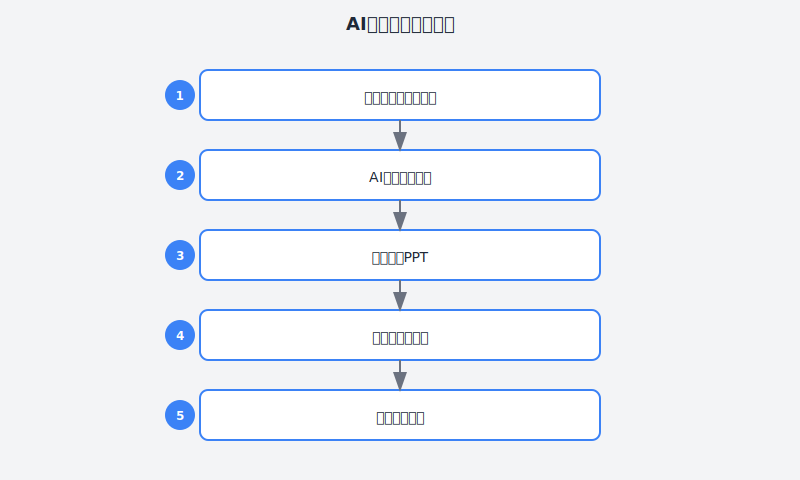

# 第10章：从PPT恐惧到演讲自如

> **AI辅助演讲与分享**

---

## 故事：小张的演讲噩梦

### 周三下午3点：突如其来的通知

小张盯着Slack上的消息，感觉血液瞬间凝固。

> "@小张 下周五的技术分享会，你来主讲《微服务架构演进实践》吧，45分钟。"

发消息的是技术总监老王。不是商量，是通知。

小张的手开始发抖。他知道这一天迟早会来——在公司干了两年全栈，从一个CRUD boy成长到能独立设计微服务架构，按理说确实该做个分享。但**公开演讲**这件事，对他来说就像噩梦。

上一次的演讲经历是大学毕业答辩。他准备了整整两周，结果上台后大脑一片空白，对着PPT念了15分钟，被导师打断三次。最后分数是全组倒数第二。

那之后，他暗暗发誓：**这辈子绝不主动上台。**

但职场不是学校，有些逃不掉。

---





### 周四：焦虑的开始

小张开始了他的"战前准备"——其实就是焦虑地刷手机。

"我做后端还行，讲架构设计？我怕是要丢脸丢到全公司。"

他打开Keynote，盯着空白画布发呆。两个小时过去，只写了个标题。

以往写代码的时候，他有清晰的思路：需求分析→技术方案→编码实现→测试上线。但做PPT？他完全不知道从何下手。

**他的困境是全方位的：**

- **结构困境**：45分钟该讲什么？怎么组织？开头说什么、结尾说什么？
- **内容困境**：自己做过的东西，怎么讲出来才能让别人听懂？讲太简单显得没水平，讲太复杂又怕大家听不懂。
- **表达困境**：他习惯了写代码时那种精确的、逻辑严密的表达，但演讲需要的是故事性、节奏感、互动性——这些他一概不会。
- **视觉困境**：PPT怎么做才专业？字体、配色、动画，他完全没有审美自信。

最可怕的是，他有个同事叫李哥，是公司的"演讲担当"。每次李哥分享，PPT精美得像苹果发布会，演讲流畅得像脱口秀，台下掌声不断。

"我要是讲得比李哥差太多，以后还怎么混？"

---

### 周五：偶然的转机

周五午休，小张在茶水间遇到了李哥。

"听说你要做技术分享？"李哥端着咖啡走过来。

"啊……是啊。"小张尴尬地笑笑，"我正在准备。"

"准备得怎么样了？"

"就……写了个标题。"小张老实交代。

李哥笑了："正常。我第一次做分享的时候，PPT是分享会前一天晚上才做完的。"

"但你现在做得那么好……"

"因为我后来发现了捷径。"李哥压低声音，"我用AI辅助准备演讲。"

"AI？"

"对。不是让AI写演讲稿，而是让它帮我：
- 梳理内容结构，把零散的经验组织成有逻辑的故事
- 生成PPT大纲，告诉我每一页该放什么
- 优化表达，把那些生硬的技术描述改得生动易懂
- 甚至还能帮我准备Q&A，预判听众可能会问的问题

最重要的是，"李哥顿了顿，"它帮我克服了最难的一步——**开始**。"

小张眼睛亮了。他不是没有内容可讲，微服务架构那套东西他确实摸透了。他只是不知道怎么**讲出来**。

"能详细说说吗？"

"来，我教你。"

---

### 周六：第一次AI辅助演讲准备

周六下午，小张按照李哥教的方法，开始了他的第一次AI辅助演讲准备。

**第一步：用AI梳理核心内容**

他没有直接让AI写演讲稿，而是先梳理自己要讲的核心内容。

```
我要做一个关于微服务架构演进的技术分享，时长45分钟。

我的核心经验：
1. 我们团队从单体架构迁移到微服务的过程
2. 迁移中遇到的3个关键问题：服务拆分粒度、数据一致性、服务间通信
3. 我们的解决方案和踩坑经验
4. 现在的架构图和性能数据

请帮我：
1. 把这些内容组织成一个有逻辑的故事线
2. 找出最能吸引听众的切入点
3. 识别可能让听众困惑的技术点，并给出通俗解释的方案
```

AI的回复让他眼前一亮：

> **故事线建议：**
> 
> **主线**：从"一个深夜的报警电话"开始——这是最能引发共鸣的切入点。讲述你们单体架构时代的痛点（扩展困难、部署风险、故障影响面大），然后引出微服务迁移的决策过程。
> 
> **三段式结构**：
> 1. **为什么做**（10分钟）：痛点共鸣 + 决策依据
> 2. **怎么做**（25分钟）：三个核心挑战的解决过程，用"踩坑-思考-解决"的叙事
> 3. **做得怎么样**（10分钟）：成果数据 + 经验总结 + 开放问题
> 
> **听众困惑点预判**：
> - "服务拆分粒度"容易讲得抽象，建议用具体业务场景举例
> - "数据一致性"技术性强，用"下单扣库存"的生活化例子引入
> - "服务间通信"涉及概念多，建议用对比表格简化

小张发现，AI帮他解决了一个核心问题：**把技术逻辑转换成故事逻辑**。

**第二步：用AI生成PPT大纲**

有了故事线，下一步是转化成具体的PPT结构。

```
基于以上故事线，请帮我生成详细的PPT大纲。

要求：
1. 总共15-20页，符合45分钟演讲节奏
2. 每页标注建议的演讲时长
3. 说明每页的核心信息和建议的视觉呈现方式（文字/图表/截图）
4. 标注需要准备的演讲者备注（也就是我自己要讲的口头内容）
```

AI生成的PPT大纲：

> **PPT大纲（共18页）**
> 
> **开场（3分钟）**
> - P1：封面（标题+副标题+个人信息）
> - P2：故事引入——"一个深夜的报警电话"（全屏大图+简短文字）
> 
> **第一部分：为什么做（10分钟）**
> - P3：单体架构时代的痛点（列表+老架构截图）
> - P4：那个深夜的故障复盘（时间线图+关键数据）
> - P5：决策过程——从讨论到立项（流程图）
> - P6：目标设定——我们要解决什么问题（3个目标，图标+简短描述）
> 
> **第二部分：怎么做（25分钟）**
> - P7：挑战1——服务拆分粒度（大标题页，过渡用）
> - P8：问题描述（业务场景图+痛点说明）
> - P9：我们的尝试和踩坑（对比图：第一次拆分方案 vs 实际问题）
> - P10：最终方案（新架构图+设计原则）
> 
> - P11：挑战2——数据一致性（大标题页）
> - P12：用"下单扣库存"理解分布式事务（生活化例子+流程图）
> - P13：我们的解决方案——最终一致性（架构图+关键代码片段）
> - P14：踩坑记录——那三次数据不一致的故障（时间线+教训）
> 
> - P15：挑战3——服务间通信（大标题页）
> - P16：同步vs异步vs消息队列（对比表格+使用场景）
> - P17：我们的选择和演进（架构演进图）
> 
> **第三部分：做得怎么样（7分钟）**
> - P18：成果数据（3-4个关键指标，大数字展示）
> - P19：架构全景图（当前架构，美观大图）
> - P20：经验总结——3个做对了的事，1个后悔的事（列表）
> 
> **结尾（5分钟）**
> - P21：开放问题——我们还在纠结的事（引发讨论）
> - P22：Q&A（简洁结束页）

小张看着这个大纲，心里踏实多了。以前他总觉得PPT是"艺术创作"，需要灵感。现在他发现，**好的PPT是工程设计**，有清晰的方法论可循。

**第三步：逐页准备内容**

有了大纲，小张开始一页一页地准备。

他先挑了最难的第12页——"用'下单扣库存'理解分布式事务"。这是整个演讲的技术难点，他担心讲不清楚。

```
请帮我准备P12的内容：用"下单扣库存"的生活化例子解释分布式事务。

要求：
1. 用讲故事的方式，从用户视角切入
2. 先描述问题场景，再引出技术概念
3. 语言口语化，避免生硬的技术术语
4. 为演讲者准备口头讲解的脚本（200字左右）

目标：让没有分布式系统背景的人也能听懂。
```

AI给出的内容：

> **P12内容：下单扣库存——分布式事务的入门课**
> 
> **页面视觉**：
> - 左侧：简化的电商下单流程图（用户→订单服务→库存服务）
> - 右侧：一个大问号图标
> - 底部：问题文字——"如果订单创建了，库存没扣掉，会发生什么？"
> 
> **演讲者脚本**：
> "好，我们来聊第二个挑战——数据一致性。这个听起来很技术，但其实你们每天都在经历。
> 
> 想象你在淘宝下单买了一件外套。点击'立即购买'后，系统做了两件事：第一，创建你的订单；第二，告诉仓库少一件库存。
> 
> 在单体架构时代，这两件事在同一个数据库里完成，要么都成功，要么都失败，不会出问题。
> 
> 但拆成微服务后，订单和库存是两个独立的服务，各自有自己的数据库。这时候就出问题了——如果订单创建成功了，但扣库存的时候网络抖了一下，没扣掉，会发生什么？
> 
> 用户付了钱，系统显示购买成功，但仓库里其实还有货，可能导致超卖。这就是分布式事务问题。"

小张读完，惊叹于AI把"分布式事务"这个晦涩的概念，用如此生活化的方式讲清楚了。他意识到，**好的技术演讲不是展示你懂多少，而是让听众懂多少**。

他用同样的方法，一页一页地准备好了全部内容。

**第四步：用AI优化演讲表达**

内容准备好了，小张开始担心另一个问题：**演讲时的表达**。

他习惯了写代码时那种"主语+谓语+宾语"的精确表达，但演讲需要的是节奏、停顿、情感。他怕讲出来像机器人念稿子。

```
请帮我优化以下演讲开场，让它更有感染力和节奏感：

原文：
大家好，我是小张，今天我要分享的是微服务架构演进实践。我将从为什么做、怎么做、做得怎么样三个部分来讲解。

要求：
1. 增加故事性和悬念
2. 加入适当的停顿标记（用……表示）
3. 语言更口语化，像是在聊天
4. 控制在100字以内
```

AI优化后的版本：

> "在座的各位……有没有经历过凌晨三点被报警电话叫醒？
> 
> （停顿2秒）
> 
> 去年冬天，我经历了一次。我们的单体应用挂了，影响了几万个用户。那次故障……直接推动了我们的微服务迁移。
> 
> 今天，我想分享这一年多我们踩过的坑、学到的经验。不讲理论，只讲真实的血泪史。"

小张试着读了一遍，确实有感觉多了。有悬念、有停顿、有情感，像是在讲故事，而不是念报告。

**第五步：用AI准备Q&A**

李哥告诉他，Q&A环节往往最能体现演讲者的功力。准备充分的Q&A，能让演讲的专业度提升一个档次。

```
请帮我预判以下技术分享可能遇到的10个问题，并给出简明扼要的回答要点：

分享主题：微服务架构演进实践
核心内容：从单体迁移到微服务的过程、三个关键挑战（服务拆分、数据一致性、服务通信）

要求：
1. 问题要覆盖不同层次（入门级、进阶级、挑战级）
2. 每个回答控制在3句话以内
3. 对于不知道答案的问题，给出诚实的回应方式
```

AI给出的Q&A准备：

> **预判问题与回答**
> 
> **入门级**
> 1. **Q：你们拆分了多少个服务？**
>    A：目前核心服务12个，边车服务8个。数量不是关键，关键是每个服务有清晰的业务边界。
> 
> 2. **Q：微服务对性能有影响吗？**
>    A：网络调用确实有开销。我们的P99响应时间从50ms增加到80ms，但在可接受范围内。
> 
> **进阶级**
> 3. **Q：服务拆分是怎么决策的？按业务域还是按技术层？**
>    A：按业务域。我们尝试过按技术层拆分（数据层、逻辑层、展示层），结果服务间调用太复杂，回退了。
> 
> 4. **Q：分布式事务用的什么方案？Seata？Saga？**
>    A：我们用的是消息队列实现最终一致性，没有引入Seata。主要是考虑到引入成本和维护复杂度。
> 
> 5. **Q：服务间通信用REST还是gRPC？**
>    A：内部服务用gRPC，外部暴露用REST。网关层做协议转换。
> 
> **挑战级**
> 6. **Q：如果重来一次，你们还会选微服务吗？**
>    A：以我们当时的业务规模，其实可以再等等。但我不后悔，因为团队在这个过程中成长了很多。
> 
> 7. **Q：单体应用怎么平滑迁移？有没有停机？**
>    A：我们是绞杀者模式，逐步替换。核心订单模块是双写过渡，花了3个月才完全切过去。
> 
> 8. **Q：微服务带来的运维复杂度怎么解决？**
>    A：这是最大的挑战。我们引入了K8s、Istio、Prometheus，团队也增加了2个SRE。
> 
> **不知道答案的问题**
> 9. **Q：你们有没有考虑用DDD（领域驱动设计）？**
>    A：坦白说，我们团队对DDD了解还不深，目前的拆分更多是经验驱动。您在这方面有经验吗？很想请教。
> 
> 10. **Q：你们的服务网格性能损耗是多少？**
>    A：具体数字我需要查一下，分享会后我单独发给您。这个问题确实很重要。
> 
> **回应不知道答案的技巧**：
> - 诚实承认："这个问题我目前没有深入研究过。"
> - 表达兴趣："您提到的这个方向我们也在关注。"
> - 后续跟进："分享会后我们可以单独聊聊，或者我整理好资料发给您。"

小张把这个Q&A清单打印出来，反复看了几遍。他发现，准备Q&A的过程，也是自己重新梳理知识的过程。

---

### 周二：PPT制作与排练

周二晚上，小张开始做PPT。

让他惊喜的是，因为有了AI生成的大纲和内容，做PPT变得异常简单。他不需要纠结"这一页放什么"，只需要按照大纲把内容填进去，然后选一个简洁的模板。

他只用了两个晚上就做完了18页PPT——这在以前是不敢想象的。

更重要的是，因为有了详细的演讲者脚本，**排练变得有的放矢**。

以前他排练就是对着PPT念，念完也不知道好坏。现在他可以：
- 按照脚本练习，确保每个技术点都讲清楚
- 控制时间，每页PPT控制在预定时长内
- 找同事帮忙试听，收集反馈

他找李哥帮忙看了一次排练。李哥给了三个建议：
1. 第8页的业务场景图太复杂，简化一下
2. 第18页的数据展示，把最重要的数字放大
3. 整体节奏可以再紧凑一些，留更多时间给Q&A

小张按照建议修改，又排练了两次。

---

### 周五：演讲日

周五下午，技术分享会。

小张提前半小时到场，检查设备、测试投屏、深呼吸。他的手心还是有点出汗，但比之前的恐慌状态好太多了。

李哥走过来，拍了拍他肩膀："放松，你准备得很充分。"

演讲开始了。

"在座的各位……有没有经历过凌晨三点被报警电话叫醒？"

他按照自己的脚本，一字一句地讲。当他说到"那次故障直接推动了我们的微服务迁移"时，他注意到台下有人点头——**他们在共鸣**。

讲"下单扣库存"的例子时，他看到了理解的表情。讲"数据不一致的三次故障"时，他听到了轻笑——**他们在代入**。

45分钟过得飞快。当他展示完架构全景图，说出"这就是我们一年多的成果"时，台下响起了掌声。

Q&A环节，有人问到了他准备过的问题，他对答如流。有人问到了他没准备的问题，他按照AI教的方式，诚实回应并承诺后续跟进。

最后，技术总监老王站起来说："分享得很清楚，特别是那个下单的例子，让我这个外行都听懂了。下次架构评审会，你也来分享一下。"

小张差点没控制住表情。

---

### 周末：复盘与收获

周末，小张做了复盘。

**这次演讲的成功，不在于他讲得有多精彩，而在于他找到了方法。**

他总结了一套**AI辅助演讲准备的工作流**：

| 阶段 | 任务 | AI辅助方式 | 时间投入 |
|:---:|:---|:---|:---:|
| 1 | 内容梳理 | 把零散经验组织成故事线 | 1小时 |
| 2 | PPT大纲 | 生成详细的分页大纲 | 30分钟 |
| 3 | 逐页内容 | 准备每页的脚本和视觉建议 | 3-4小时 |
| 4 | 表达优化 | 优化演讲语言，增加感染力 | 1小时 |
| 5 | Q&A准备 | 预判问题，准备回答 | 1小时 |
| 6 | 制作与排练 | 制作PPT，反复排练 | 3-4小时 |
| **总计** | | | **10-12小时** |

对比以前：
- 以前准备一次演讲，他要花2-3周，而且效果还不一定好
- 现在用AI辅助，一周左右就能准备得很充分

更重要的是，**他克服了对演讲的恐惧**。

他发现，演讲不是"天赋"，而是"技能"——有方法、有套路、可练习。AI帮他降低了门槛，让他能把精力放在真正重要的事情上：**讲好故事，传递价值**。

---

## 理论：AI辅助演讲的4层模型

小张的实践，可以用一个系统性的模型来总结。我们把AI辅助演讲分为4个层次：

### 第1层：内容层——让演讲有干货

这是演讲的基础。没有内容，再华丽的表达也是空中楼阁。

**核心作用**：AI帮你把零散的经验、技术知识，组织成有逻辑的、可传播的内容。

**适用场景**：
- 你做过某个项目，但不知道怎么提炼成演讲素材
- 你懂很多技术细节，但讲出来总是太琐碎或太跳跃
- 你担心讲的内容听众不感兴趣或听不懂

**使用技巧**：

**① 故事线设计**

技术演讲最大的敌人是"流水账"。AI可以帮你找到最有吸引力的叙事角度。

```
我有以下技术经验，请帮我设计一个适合技术分享的叙事线：

经验内容：
[你的项目/技术经验]

目标听众：[描述听众背景]
分享时长：[时长]

要求：
1. 找到一个能引发共鸣的切入点
2. 设计"冲突-高潮-解决"的故事结构
3. 标注每部分的情绪节奏（紧张/轻松/悬疑/释然）
```

**② 内容颗粒度控制**

技术演讲需要在"深度"和"易懂"之间找到平衡。AI可以帮你做颗粒度调整。

```
以下是我准备的技术内容，请帮我做颗粒度调整：

原始内容：
[你的技术内容]

要求：
1. 识别过于细节、需要简化的部分
2. 识别过于笼统、需要展开的部分
3. 为每个技术概念设计一个生活化的类比
4. 标注需要可视化辅助的地方（图、表、代码）
```

### 第2层：结构层——让演讲有骨架

好的内容需要好的结构来承载。结构清晰的演讲，听众更容易跟上你的思路。

**核心作用**：AI帮你设计PPT结构、分页逻辑、过渡衔接。

**常见演讲结构模板**：

| 结构类型 | 适用场景 | 示例 |
|:---|:---|:---|
| **问题-解决型** | 技术方案分享 | "痛点 → 探索 → 方案 → 成果" |
| **故事型** | 项目复盘 | "背景 → 冲突 → 转折 → 结局 → 反思" |
| **教程型** | 技术入门 | "场景 → 原理 → 实践 → 踩坑 → 总结" |
| **对比型** | 技术选型 | "旧方案 → 新方案 → 对比 → 决策 → 结果" |
| **揭秘型** | 原理讲解 | "现象 → 猜想 → 验证 → 原理 → 应用" |

**使用技巧**：

**① PPT大纲生成**

```
基于以下故事线和内容，请帮我生成详细的PPT大纲：

故事线：
[你的故事线]

核心内容：
[你的核心内容]

要求：
1. 总页数控制在[X]页，符合[时长]演讲
2. 每页标注建议的演讲时长
3. 说明每页的核心信息和视觉呈现方式
4. 标注演讲者备注（口头讲解要点）
5. 标注需要过渡衔接的地方
```

**② 过渡设计**

好的过渡能让演讲流畅自然，避免"接下来我们讲……"的生硬切换。

```
请为以下两部分内容设计过渡语：

上一部分：[内容摘要]
下一部分：[内容摘要]

要求：
1. 用承上启下的方式，回顾上一部分并引出下一部分
2. 可以用问题、悬念或对比来过渡
3. 控制在3句话以内
```

### 第3层：表达层——让演讲有感染力

同样的内容，不同的表达方式，效果天差地别。

**核心作用**：AI帮你把生硬的技术语言，改得生动、有节奏、有感染力。

**适用场景**：
- 你写的演讲稿太像技术文档
- 你想增加一些幽默元素，但不知道怎么自然地插入
- 你需要控制演讲节奏，设计停顿和强调

**使用技巧**：

**① 口语化改写**

```
请帮我将以下技术内容改写成口语化的演讲表达：

原文：
[你的原文]

要求：
1. 去掉书面语和技术文档式的表达
2. 加入适当的口语化连接词（"其实……"、"大家想象一下……"、"这里有个坑……"）
3. 标注停顿和强调的位置
4. 控制在[字数]以内
```

**② 开场与结尾优化**

开场决定听众会不会认真听，结尾决定听众会不会记住。

```
请帮我优化以下演讲开场/结尾：

原文：
[你的原文]

要求：
1. 开场：用悬念、故事或问题引发兴趣，10秒内抓住注意力
2. 结尾：总结核心价值，留下印象或开放问题，引发思考
3. 语言简洁有力，避免套话
```

**③ 幽默元素设计**

技术演讲不需要全程搞笑，但适当的幽默能缓解气氛、增加记忆点。

```
请帮我在以下演讲中设计2-3个自然的幽默点：

演讲内容：
[内容摘要]

要求：
1. 幽默要自然，不要强行搞笑
2. 可以自嘲、调侃常见的程序员梗、用夸张对比
3. 不要冒犯任何群体
4. 标注插入位置
```

### 第4层：互动层——让演讲有对话感

演讲不是独角戏，而是与听众的对话。

**核心作用**：AI帮你预判听众反应、准备Q&A、设计互动环节。

**使用技巧**：

**① Q&A预判与准备**

```
请帮我预判以下技术演讲可能遇到的问题，并准备回答：

演讲主题：[主题]
核心内容：[内容摘要]
听众背景：[描述]

要求：
1. 预判5-10个问题，覆盖不同难度层次
2. 每个回答控制在3句话以内
3. 对于不知道答案的问题，给出诚实的回应模板
4. 标注哪些问题是"好问题"（值得深入展开）
```

**② 互动环节设计**

适当的互动能增加听众参与感。

```
请帮我在以下演讲中设计2-3个互动环节：

演讲内容：[内容摘要]
听众规模：[人数]

要求：
1. 互动形式可以是提问、举手表决、小测试等
2. 互动要自然，不要打断演讲节奏
3. 标注插入位置
4. 准备互动的引导语
```

---

## 实践：从0到1建立你的AI辅助演讲工作流

### Step 1：准备你的"演讲素材库"

不要等到要做演讲时才去挖素材，平时就要积累。

**素材来源**：

| 来源 | 如何转化为演讲素材 | 示例 |
|:---|:---|:---|
| **解决过的技术难题** | 记录问题现象、排查过程、解决方案 | "那次Redis缓存雪崩的72小时" |
| **参与过的技术项目** | 记录项目背景、技术选型、踩坑经验 | "从0到1搭建实时推送系统" |
| **学习新技术的过程** | 记录学习笔记、困惑与顿悟、实践经验 | "我花了两周理解Kafka，这是笔记" |
| **代码评审发现的问题** | 记录常见问题、最佳实践、改进思路 | "Code Review中反复出现的5个问题" |
| **技术决策的思考** | 记录决策背景、方案对比、最终选择 | "为什么我们放弃REST改用GraphQL" |

**AI辅助素材提炼**：

```
我有以下工作或学习经历，请帮我提炼成适合技术分享的素材：

经历描述：
[你的经历]

要求：
1. 提取最有分享价值的核心经验
2. 找出能引发听众共鸣的切入点
3. 识别可能的演讲角度（问题解决型、教程型、复盘型等）
4. 给出3个备选标题
```

### Step 2：设计你的"演讲模板"

不同类型的演讲，用不同的模板。

**模板示例：技术方案分享**

```markdown
# [演讲标题]

## 开场（10%时间）
- 钩子（故事/问题/数据）
- 自我介绍
- 演讲价值预告

## 第一部分：背景与问题（20%时间）
- 业务/技术背景
- 遇到的问题或挑战
- 问题的严重性或影响

## 第二部分：方案与实施（50%时间）
- 探索过程（尝试过什么、为什么失败）
- 最终方案（核心思路）
- 关键实现（技术细节，控制在必要程度）
- 踩坑记录（真实的挫折和教训）

## 第三部分：成果与反思（15%时间）
- 量化成果（数据说话）
- 经验总结（做对了什么、后悔什么）
- 开放问题（还在纠结的事）

## 结尾与Q&A（5%时间）
- 核心观点回顾
- 感谢与联系方式
- Q&A
```

**AI模板填充**：

```
请基于以下演讲模板，帮我填充内容大纲：

[模板内容]

我的素材：
[你的素材]

要求：
1. 每个部分给出具体内容要点
2. 标注需要可视化辅助的地方
3. 预估每个部分的时长
4. 标注可能的听众困惑点
```

### Step 3：建立你的"AI Prompt库"

把常用的Prompt整理成模板，准备演讲时直接复制使用。

**必备Prompt清单**：

| 用途 | Prompt模板 |
|:---|:---|
| **素材提炼** | "请帮我提炼以下经历成演讲素材……" |
| **故事线设计** | "请帮我设计以下内容的叙事线……" |
| **PPT大纲生成** | "请基于以下内容生成PPT大纲……" |
| **逐页内容** | "请帮我准备第X页的内容……" |
| **口语化改写** | "请帮我把以下内容改写成口语化表达……" |
| **开场优化** | "请帮我优化以下演讲开场……" |
| **结尾优化** | "请帮我优化以下演讲结尾……" |
| **Q&A准备** | "请帮我预判以下演讲可能遇到的问题……" |
| **过渡设计** | "请为以下内容设计过渡语……" |

**提示**：把这些Prompt存在你的笔记软件里，准备演讲时直接复制。

### Step 4：排练与反馈

AI可以帮你准备内容，但演讲技巧还需要练习。

**排练清单**：

- [ ] 第一次排练：通读脚本，熟悉内容（不需要计时）
- [ ] 第二次排练：计时，标记超时/时间不足的部分
- [ ] 第三次排练：脱稿，只记要点和结构
- [ ] 第四次排练：找同事/朋友试听，收集反馈
- [ ] 第五次排练：针对反馈修改后，完整过一遍

**AI辅助反馈分析**：

```
我的演讲脚本如下：
[你的脚本]

请帮我分析：
1. 哪些部分可能让听众困惑，需要简化或展开？
2. 哪些部分的节奏可能太快或太慢？
3. 有哪些地方可以增加互动或停顿？
4. 整体的语言风格是否一致？
```

### Step 5：现场演讲技巧

**开场前**：
- 提前到场，熟悉设备和场地
- 测试PPT播放、激光笔、麦克风
- 深呼吸，放松身体

**演讲中**：
- 眼神交流：不要只盯着屏幕，要扫视全场
- 声音控制：重点内容放慢语速、提高音量
- 肢体语言：适当走动，用手势强调重点
- 应对意外：PPT出错就坦诚说明，技术故障就即兴发挥

**Q&A环节**：
- 听清楚问题再回答，可以复述确认
- 不知道的问题诚实承认，承诺后续跟进
- 对于好问题，可以适当展开，展示深度

---

## 本章交付物

完成本章学习后，你应该产出以下成果：

### 交付物1：你的演讲素材库（至少5个素材）

格式示例：
```
1. [素材名称] - [类型] - [核心价值] - [适合演讲类型]
2. ...
```

### 交付物2：你的演讲Prompt库

至少包含以下Prompt：
- 素材提炼Prompt
- 故事线设计Prompt
- PPT大纲生成Prompt
- 口语化改写Prompt
- Q&A准备Prompt

### 交付物3：一次完整的AI辅助演讲准备实践

使用本章方法，完成一次技术分享的完整准备（从素材到PPT到排练）。

---

## 行动清单

- [ ] 整理你的"演讲素材库"，写下至少5个备选素材
- [ ] 设计你的"演讲模板"（至少1种演讲类型的模板）
- [ ] 建立你的"AI Prompt库"（把本章提供的Prompt整理成文档）
- [ ] 实践一次完整的AI辅助演讲准备流程
- [ ] 找一次机会（内部分享、技术沙龙、线上直播），实际做一次演讲
- [ ] 演讲后收集反馈，优化你的Prompt和流程

---

## 本章彩蛋

### 彩蛋1：3个让演讲开场惊艳的技巧

1. **"你们有没有……"开场**
   - 用一个听众普遍经历过的场景引发共鸣
   - 示例："你们有没有遇到过这种情况——代码上线前测试一切正常，上线后马上报警？"

2. **数字冲击开场**
   - 用一个具体的数字制造悬念
   - 示例："去年，我们的系统宕机了37次。其中36次，都是同一个原因。"

3. **故事悬念开场**
   - 讲一个片段，留下悬念
   - 示例："三个月前的一个凌晨，我收到了一条报警短信。当时的我不会想到，这条短信会改变我们整个团队的技术方向。"

### 彩蛋2：技术演讲PPT的3个设计原则

1. **一页一个观点**
   - 不要试图在一页里塞多个要点
   - 听众一次只能吸收一个信息

2. **字不如表，表不如图**
   - 能用图说明的，不要用表格
   - 能用表格说明的，不要用文字列表

3. **大字号原则**
   - 最后一排也能看清的最小字号是24pt
   - 关键数字用超大字号（60pt以上）

### 彩蛋3：应对紧张的小技巧

- **提前到场**：熟悉环境能大幅降低焦虑
- **找友善面孔**：演讲时找到几个表情友善的听众，对着他们讲
- **准备"开场5分钟"**：把开场背得滚瓜烂熟，开头顺了后面自然顺
- **接受紧张**：紧张是正常的，说明你在意。适度紧张能让你表现更好

---

> **小张的第10周复盘**：
> 
> "这次演讲让我明白了一个道理：
> 
> **演讲不是天赋，是技能。**
> 
> 以前我觉得那些演讲好的人都是天生的，我这种社恐程序员永远做不到。但用AI辅助准备后，我发现演讲是有方法、有套路的。
> 
> AI没有替我演讲，它只是帮我克服了最难的一步——**开始准备**。它帮我梳理内容、设计结构、优化表达，让我能把精力放在真正重要的事情上：讲好故事，传递价值。
> 
> 最重要的是，我不再害怕演讲了。因为我知道，下次需要演讲的时候，我有方法应对。"

---

**下一章预告**：第11章《5天学会一项新技术的魔法》——小陈将展示如何用AI加速学习新技术，从"面对文档大海捞针"到"精准高效掌握核心"。
