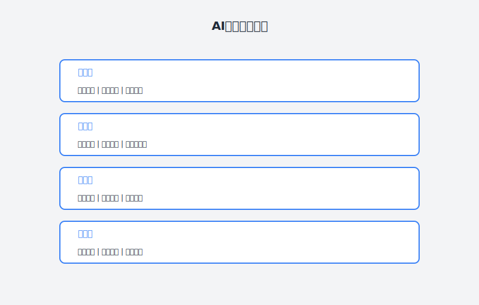

# 第11章：5天学会一项新技术的魔法

> **AI辅助学习**

---

## 故事：小陈的学习焦虑

### 周日上午：新项目的消息

小陈刷着手机，一条企业微信消息让他的好心情瞬间消失。

> "下周一开始，我们团队要接一个区块链溯源的新项目。小陈，你负责智能合约开发。"

发消息的是项目经理老刘。简单直接，不容置疑。

小陈盯着"区块链"三个字，感觉头皮发麻。

他知道区块链——比特币、以太坊、去中心化，这些概念他在新闻里听过无数次。但**开发智能合约**？他完全没接触过。

他在心里快速盘算：
- Solidity语言？没写过。
- 智能合约安全？一窍不通。
- Web3.js交互？听说过没用过。
- 测试网络、Gas费、钱包管理？全是黑箱。

"给我多久学习时间？"他回复。

"项目排期比较紧，周三要出技术方案，下周一要启动开发。"老刘说，"不过别担心，这个需求不复杂，你搞不定的随时问我。"

小陈苦笑。老刘是后端出身，对区块链的了解估计还不如他。

**5天，从零开始学会区块链开发？**

这要是放在以前，他肯定直接辞职了。

---





### 周日下午：绝望的开始

小陈决定先了解一下区块链开发到底是个什么鬼。

他打开Google，搜索"Solidity入门"。

结果让他更加绝望：
- 官方文档厚得像砖头，从头到尾看完估计要一个月
- 各种教程参差不齐，有的太浅（只会写Hello World），有的太深（直接讲EVM底层原理）
- 区块链知识树庞大得吓人：共识机制、密码学基础、P2P网络、经济模型……

他试图看了一个YouTube教程，结果讲师在前30分钟都在讲"什么是去中心化"——这些概念他早就懂了，但他需要的是**怎么写代码**。

"照这个进度，我周三连技术方案都写不出来。"

他想起上次学习新技术的经历。那是半年前，公司要引入GraphQL，他花了整整两周啃文档、看教程、写Demo，才算勉强上手。

**两周**，那是时间充裕的情况下。现在他只有**5天**。

他陷入了一种熟悉的焦虑：**想学的东西太多，时间太少，不知道从哪里开始**。

---

### 周日晚上：意外的救星

晚上，小陈约了好朋友大伟吃饭吐槽。

大伟是他们公司架构组的，平时话不多，但技术深度让人佩服。据说他上周刚用三天时间上手了一个全新的流式计算框架。

"你怎么做到的？"小陈问，"三天学会一个新框架？"

"我有秘密武器。"大伟神秘一笑。

"什么武器？"

"AI辅助学习。"

"又是AI？"小陈有点怀疑，"AI能帮我写代码，但学习这件事……不是得自己啃吗？"

"你理解错了。"大伟放下筷子，"AI不是替你学，它是你的**学习加速器**。

你想想，学习新技术最大的痛点是什么？"

小陈想了想：
- "知识体系太庞大，不知道从哪里开始"
- "文档太多，不知道哪些该看哪些不该看"
- "遇到问题卡住，找答案要翻半天"
- "学完了不知道怎么用，缺乏实践"

"对，这些都是。"大伟点头，"AI可以帮你解决这些问题：
- **个性化学习路径**：根据你的背景和项目需求，定制最短学习路径
- **智能知识筛选**：从海量文档中提炼核心知识，过滤噪音
- **即时答疑**：遇到任何问题，马上得到解释和示例
- **实践引导**：边学边练，用真实项目驱动学习

我用这套方法，上周三天学会了Flink。不是皮毛，是真的能上手写生产代码。"

小陈心动了。5天学会区块链开发，听起来像天方夜谭，但如果有方法……

"教教我。"

"来，我给你制定一个学习计划。"

---

### 周一早上：AI辅助学习启动

周一早上9点，小陈按照大伟教的方法，开始了他的"5天区块链速成计划"。

**第一步：用AI制定学习地图**

大伟告诉他，学习新技术最大的误区是"从头到尾看文档"。正确的做法是**先画地图，再选路径**。

```
我需要学习区块链智能合约开发，用于一个溯源项目。

我的背景：
- 3年Java后端开发经验
- 熟悉Spring Boot、MySQL、Redis
- 有基本的密码学概念（哈希、非对称加密）
- 没有区块链开发经验

项目需求：
- 开发一个溯源智能合约，记录商品从生产到销售的全流程
- 需要实现权限控制（只有特定角色可以写入数据）
- 需要和Java后端进行交互

时间：5天（周一到周五）

请帮我：
1. 列出学习区块链智能合约开发的完整知识地图
2. 根据我的背景和项目需求，标注哪些是必须学的、哪些可以暂时跳过
3. 设计一条最短学习路径，确保5天后能开始项目开发
4. 为每天分配具体的学习目标
```

AI的回复让他眼前一亮：

> **区块链智能合约开发知识地图**
> 
> **核心知识（必须掌握）**
> 1. **区块链基础概念**（2小时）
>    - 区块、链、共识机制（理解即可）
>    - 账户模型（EOA vs 合约账户）
>    - Gas机制（必须掌握，影响代码设计）
> 
> 2. **Solidity语言**（6小时）
>    - 基础语法（变量、函数、修饰器）
>    - 合约结构（状态变量、函数、事件）
>    - 权限控制（modifier、msg.sender）
>    - 存储类型（storage、memory、calldata）
>    - 常见数据结构（mapping、array、struct）
> 
> 3. **智能合约开发工具链**（3小时）
>    - Remix IDE（在线编写和测试）
>    - Hardhat/Foundry（本地开发环境）
>    - MetaMask（钱包管理）
>    - 测试网络（Goerli/Sepolia）
> 
> 4. **智能合约安全基础**（2小时）
>    - 重入攻击（Reentrancy）
>    - 整数溢出（Solidity 0.8+已解决，但需了解）
>    - 访问控制（你的项目核心）
> 
> 5. **合约与Java后端交互**（2小时）
>    - Web3j库（Java的Web3实现）
>    - 调用合约方法
>    - 事件监听
> 
> **可以暂时跳过的知识**
> - 共识算法细节（PoW、PoS原理）
> - EVM底层实现
> - 密码学数学原理
> - DeFi/NFT协议细节
> - Layer 2扩容方案
> - 跨链技术
> 
> **5天学习计划**
> 
> **Day 1（周一）：环境搭建 + Solidity基础**
> - 上午：安装MetaMask，申请测试币，熟悉Remix IDE
> - 下午：学习Solidity基础语法，完成第一个合约（Storage合约）
> - 晚上：练习：实现一个简单的Counter合约
> 
> **Day 2（周二）：Solidity进阶 + 权限控制**
> - 上午：学习modifier、mapping、struct
> - 下午：实现一个带权限管理的合约（多角色访问控制）
> - 晚上：练习：扩展你的合约，增加事件（Event）
> 
> **Day 3（周三）：安全基础 + 项目实践**
> - 上午：学习常见安全漏洞，理解重入攻击原理
> - 下午：开始编写溯源合约原型（核心数据结构）
> - 晚上：完善合约：实现数据写入和查询功能
> 
> **Day 4（周四）：工具链 + 测试**
> - 上午：搭建Hardhat环境，学习单元测试
> - 下午：为溯源合约编写完整测试用例
> - 晚上：部署到测试网络，验证合约功能
> 
> **Day 5（周五）：Java集成 + 收尾**
> - 上午：学习Web3j，实现Java调用合约
> - 下午：完成技术方案文档，整理学习笔记
> - 晚上：复盘，准备项目启动

小陈看着这个计划，心里踏实多了。

以前他学习新技术，总是陷入"文档大海"，今天看看这个、明天看看那个，一周过去还在第一章。现在有了清晰的地图，他知道**每天该学什么、学到什么程度**。

**第二步：用AI筛选学习资源**

有了学习地图，下一步是找学习资源。但大伟告诉他，不要自己瞎找，让AI帮你筛选。

```
基于以上学习计划，请帮我推荐每个主题的最佳学习资源：

要求：
1. 优先推荐官方文档和权威教程
2. 标注每个资源预计的学习时间
3. 说明每个资源的核心价值（不要重复推荐相似内容）
4. 对于初学者常见的"坑"，给出预警

格式：主题 → 推荐资源 → 学习时间 → 核心价值 → 注意事项
```

AI给出的资源清单：

> **Day 1资源推荐**
> 
> **MetaMask和测试网络**
> - 资源：MetaMask官方文档Getting Started部分
> - 时间：30分钟
> - 价值：最权威的钱包使用指南
> - 注意：测试币申请可能需要等几分钟，不要重复申请
> 
> **Remix IDE**
> - 资源：Remix官方文档Quick Start
> - 时间：30分钟
> - 价值：掌握在线开发环境的基本操作
> - 注意：Remix功能很多，先掌握Compile、Deploy、Debug三个核心功能
> 
> **Solidity基础**
> - 资源：CryptoZombies第1-3章（中文站）
> - 时间：2小时
> - 价值：游戏化学习，边玩边学基础语法
> - 注意：虽然有趣，但不要只玩不思考，建议边玩边做笔记
> 
> **Day 2资源推荐**
> 
> **权限控制**
> - 资源：OpenZeppelin Contracts文档（Access Control部分）
> - 时间：1小时
> - 价值：学习业界标准的权限控制实现
> - 注意：OpenZeppelin是标准库，生产环境建议直接使用，不要自己造轮子
> 
> **进阶Solidity**
> - 资源：Solidity by Example（官方示例库）
> - 时间：2小时
> - 价值：大量实战代码示例
> - 注意：优先看与权限、数据结构相关的示例

小陈发现，AI帮他避开了大量的"资源噪音"。以前他自己找教程，经常点开一个视频看了半小时，发现讲得太浅或太深。现在AI直接告诉他：**看这个、看这么多、重点看这部分**。

**第三步：开始Day 1的学习**

上午，小陈按照计划，先花30分钟设置了MetaMask，申请了Goerli测试币。然后又花了30分钟熟悉了Remix IDE。

下午，他开始学习Solidity基础。按照AI的推荐，他打开了CryptoZombies。

这是一款通过编写智能合约来打僵尸的游戏化教程。小陈一边玩一边学，遇到不懂的地方，他就问AI：

```
我在学习Solidity，遇到了一个概念不懂：

什么是"view"函数？和普通函数有什么区别？

请用Java程序员能理解的方式解释，并给一个具体的代码示例。
```

AI的回答：

> **view函数解释**
> 
> 类比Java：就像Java中的getter方法，只读不写。
> 
> 关键区别：
> - 普通函数：可能修改合约状态（就像Java中修改对象属性）
> - view函数：承诺不修改状态，只返回数据（就像Java中的纯查询方法）
> 
> 为什么需要view？
> - 调用view函数不需要发送交易（不需要Gas费）
> - 节点可以直接返回结果，不需要等待区块确认
> 
> **代码示例**：
> ```solidity
> contract Counter {
>     uint public count = 0;
>     
>     // 普通函数 - 修改状态，需要Gas
>     function increment() public {
>         count++;
>     }
>     
>     // view函数 - 只读，不需要Gas
>     function getCount() public view returns (uint) {
>         return count;
>     }
> }
> ```
> 
> 类比Java：
> ```java
> class Counter {
>     private int count = 0;
>     
>     // 类似普通函数 - 修改状态
>     public void increment() {
>         count++;
>     }
>     
>     // 类似view函数 - 只读
>     public int getCount() {
>         return count;
>     }
> }
> ```

小陈恍然大悟。用Java来类比，他一下子就理解了。

这种"即时答疑"的体验，和以前学习时"遇到问题→Google→翻5个页面→找到答案→理解答案"的流程完全不同。以前是**中断式学习**，现在是**流畅式学习**。

晚上，他完成了Day 1的练习任务：实现一个Counter合约。他写了代码，让AI帮忙检查：

```
请帮我检查以下Solidity代码是否有问题：

[代码]

要求：
1. 检查语法错误
2. 检查常见的安全隐患（如整数溢出、访问控制缺失）
3. 给出代码风格建议
4. 如果有更好的实现方式，请说明
```

AI不仅指出了他的一个小错误（忘记加visibility修饰符），还给出了优化建议（使用内置的counter模式）。

**第一天结束**，小陈对区块链开发已经有了基本的体感。这在以前是不敢想象的。

---

### 周二：进阶学习与项目结合

**Day 2的主题是权限控制**，这正是他项目中需要的核心功能。

上午，他按照AI推荐的资源，学习了OpenZeppelin的Access Control合约。这让他大开眼界——原来权限控制有这么多成熟的模式：Ownable（单一所有者）、Role-Based Access Control（基于角色）、AccessControl（灵活权限）。

下午，他开始尝试实现一个带权限管理的合约。但遇到了问题：

他的溯源项目需要三种角色：生产商、物流商、零售商。每种角色只能写入特定的数据字段。

他试图自己实现，但代码写得一团糟。

这时，AI又派上了用场：

```
我需要实现一个多角色权限控制的智能合约，用于商品溯源：

角色需求：
1. 生产商：可以写入商品生产信息（产地、生产日期、批次号）
2. 物流商：可以写入物流信息（运输路径、温度记录）
3. 零售商：可以写入销售信息（上架时间、价格）

数据结构：
- 商品ID -> 商品信息（struct）
- 每个商品信息包含：生产信息、物流信息、销售信息

请帮我：
1. 设计合约的整体结构
2. 选择合适的权限控制模式（OpenZeppelin的哪个合约？）
3. 给出核心功能的代码框架
4. 说明每个角色如何被授权和撤销
```

AI给出的设计方案：

> **方案设计**
> 
> **权限控制选择**：使用OpenZeppelin的AccessControl
> - 原因：支持多角色、可以动态授权/撤销、业界标准
> 
> **合约结构设计**：
> ```solidity
> // SPDX-License-Identifier: MIT
> pragma solidity ^0.8.0;
> 
> import "@openzeppelin/contracts/access/AccessControl.sol";
> 
> contract Traceability is AccessControl {
>     // 定义角色
>     bytes32 public constant PRODUCER_ROLE = keccak256("PRODUCER_ROLE");
>     bytes32 public constant LOGISTICS_ROLE = keccak256("LOGISTICS_ROLE");
>     bytes32 public constant RETAILER_ROLE = keccak256("RETAILER_ROLE");
>     
>     // 商品信息结构
>     struct ProductInfo {
>         // 生产信息
>         string origin;
>         uint256 productionDate;
>         string batchNumber;
>         
>         // 物流信息
>         string[] transportPath;
>         int256[] temperatureRecords;
>         
>         // 销售信息
>         uint256 listingTime;
>         uint256 price;
>         
>         // 元数据
>         bool exists;
>         address producer;
>     }
>     
>     // 存储：商品ID -> 商品信息
>     mapping(string => ProductInfo) public products;
>     
>     // 事件定义
>     event ProductCreated(string productId, address producer);
>     event LogisticsUpdated(string productId, address logistics);
>     event SalesUpdated(string productId, address retailer);
>     
>     constructor() {
>         // 部署者获得默认管理员角色
>         _grantRole(DEFAULT_ADMIN_ROLE, msg.sender);
>     }
>     
>     // 生产商：创建商品并写入生产信息
>     function createProduct(
>         string memory _productId,
>         string memory _origin,
>         uint256 _productionDate,
>         string memory _batchNumber
>     ) public onlyRole(PRODUCER_ROLE) {
>         require(!products[_productId].exists, "Product already exists");
>         
>         ProductInfo storage p = products[_productId];
>         p.origin = _origin;
>         p.productionDate = _productionDate;
>         p.batchNumber = _batchNumber;
>         p.exists = true;
>         p.producer = msg.sender;
>         
>         emit ProductCreated(_productId, msg.sender);
>     }
>     
>     // 物流商：更新物流信息
>     function updateLogistics(
>         string memory _productId,
>         string memory _path,
>         int256 _temperature
>     ) public onlyRole(LOGISTICS_ROLE) {
>         require(products[_productId].exists, "Product not found");
>         
>         products[_productId].transportPath.push(_path);
>         products[_productId].temperatureRecords.push(_temperature);
>         
>         emit LogisticsUpdated(_productId, msg.sender);
>     }
>     
>     // 零售商：更新销售信息
>     function updateSales(
>         string memory _productId,
>         uint256 _listingTime,
>         uint256 _price
>     ) public onlyRole(RETAILER_ROLE) {
>         require(products[_productId].exists, "Product not found");
>         
>         products[_productId].listingTime = _listingTime;
>         products[_productId].price = _price;
>         
>         emit SalesUpdated(_productId, msg.sender);
>     }
> }
> ```
> 
> **角色授权方式**：
> ```solidity
> // 授予生产商角色
> contract.grantRole(PRODUCER_ROLE, producerAddress);
> 
> // 撤销角色
> contract.revokeRole(PRODUCER_ROLE, producerAddress);
> 
> // 检查角色
> contract.hasRole(PRODUCER_ROLE, someAddress);
> ```

小陈看着这个设计方案，感觉像是有一个资深架构师在指导他。不仅代码结构清晰，还考虑到了他没想到的细节（如exists检查、事件定义）。

**他意识到，AI在这里扮演的角色是"导师"**——不是直接把答案塞给他，而是引导他理解设计思路、掌握核心概念。

晚上，他基于这个框架，扩展了合约功能，添加了更多事件和查询方法。

**第二天结束**，他已经完成了溯源合约的核心逻辑。这比原计划快了半天。

---

### 周三：安全与测试

**Day 3的主题是安全基础**，这是智能合约开发中最重要也最危险的部分。

上午，小陈学习了一个让他后背发凉的概念：**重入攻击（Reentrancy）**。

2016年，The DAO项目因为重入攻击被黑客盗走了360万ETH（当时价值6000万美元）。这个漏洞的原理是：合约在发送ETH后、更新余额前，被攻击者递归调用，重复提取资金。

小陈看完了攻击原理，问AI：

```
请帮我检查我昨天写的溯源合约是否有重入攻击风险：

[合约代码]

如果有风险，请说明：
1. 风险点在哪里
2. 如何修复
3. 防御重入攻击的最佳实践
```

AI检查后发现，他的合约目前没有重入风险（因为没有涉及ETH转账），但AI还是给他详细讲解了防御方法：

> **重入攻击防御**
> 
> **检查-生效-交互模式（Checks-Effects-Interactions）**
> ```solidity
> // 正确做法：先更新状态，再发送ETH
> function withdraw() public {
>     uint256 amount = balances[msg.sender];
>     
>     // 1. 检查
>     require(amount > 0, "No balance");
>     
>     // 2. 生效（先更新状态！）
>     balances[msg.sender] = 0;
>     
>     // 3. 交互（最后再做外部调用）
>     (bool success, ) = msg.sender.call{value: amount}("");
>     require(success, "Transfer failed");
> }
> ```
> 
> **使用ReentrancyGuard**
> ```solidity
> import "@openzeppelin/contracts/security/ReentrancyGuard.sol";
> 
> contract MyContract is ReentrancyGuard {
>     function withdraw() public nonReentrant {
>         // 这里的代码不会被执行两次
>     }
> }
> ```

下午，小陈开始写技术方案。他把这几天的学习成果整理成文档，包括：
- 合约架构设计
- 数据模型定义
- 权限控制方案
- 安全考虑
- 部署和测试计划

他把技术方案发给老刘。老刘回复："写得挺详细的，周四评审会上你来讲讲。"

小陈松了口气。他用3天时间，从零基础到写出技术方案，这在以前是不可能的。

---

### 周四：工具链与测试部署

**Day 4的主题是工具链和测试**。

上午，小陈按照计划搭建了Hardhat开发环境。相比Remix，Hardhat更适合团队开发：可以写测试脚本、可以本地模拟网络、可以自动化部署。

下午，他开始学习写测试。智能合约的测试和Java单元测试思路类似，但有一些区块链特有的概念：

```
我是Java程序员，熟悉JUnit。请用JUnit类比的方式，教我如何写Solidity合约的Hardhat测试：

包括：
1. 测试框架的基本结构（类似@Test注解）
2. 如何部署合约进行测试（类似@SpringBootTest）
3. 如何模拟不同用户进行操作（类似Mock用户）
4. 如何测试权限控制（验证只有特定角色可以调用）
5. 如何测试事件（验证事件是否正确触发）

请给出具体的代码示例。
```

AI给出的教程非常贴合他的背景：

> **Hardhat测试 vs JUnit**
> 
> **测试框架结构**
> ```javascript
> // JUnit风格
> @Test
> public void testCounter() {
>     Counter counter = new Counter();
>     counter.increment();
>     assertEquals(1, counter.getCount());
> }
> 
> // Hardhat风格
> describe("Counter", function() {
>     it("should increment counter", async function() {
>         const Counter = await ethers.getContractFactory("Counter");
>         const counter = await Counter.deploy();
>         await counter.increment();
>         expect(await counter.getCount()).to.equal(1);
>     });
> });
> ```

小陈很快上手了。他为溯源合约写了一套完整的测试用例，覆盖了所有核心功能和权限控制场景。

晚上，他把合约部署到了Goerli测试网。看着交易在区块链浏览器上被确认，他有一种奇妙的成就感——**他写的代码真的跑在区块链上了**。

---

### 周五：Java集成与复盘

**Day 5的主题是Java集成**。

上午，小陈学习了Web3j——Java与区块链交互的库。他发现，从Java后端调用智能合约，其实和调用REST API差不多：

```java
// 加载合约
Traceability contract = Traceability.load(
    contractAddress,
    web3j,
    credentials,
    DefaultGasProvider.GAS_PRICE,
    DefaultGasProvider.GAS_LIMIT
);

// 调用合约方法（只读）
ProductInfo product = contract.products(productId).send();

// 发送交易（写入）
TransactionReceipt receipt = contract.createProduct(
    productId, origin, productionDate, batchNumber
).send();
```

他写了一个简单的Java客户端，成功调用了部署在测试网上的合约。

下午，他整理了这几天的学习笔记，建立了他的"区块链开发知识库"。

**5天学习结束**，小陈的状态：
- ✅ 掌握了Solidity基础和进阶语法
- ✅ 理解了智能合约安全的核心概念
- ✅ 完成了溯源合约的开发和测试
- ✅ 实现了Java后端与合约的交互
- ✅ 产出了技术方案文档

他不敢说自己是区块链专家，但他**已经可以开始项目开发了**。

---

### 周末：总结与感悟

周末，小陈做了复盘。

**这次5天速成的成功，不在于他多聪明或多努力，而在于他找到了方法。**

他总结了一套**AI辅助学习的工作流**：

| 阶段 | 任务 | AI辅助方式 | 传统方式时间 | AI辅助时间 |
|:---:|:---|:---|:---:|:---:|
| 1 | 学习地图 | 根据背景和项目定制学习路径 | 1-2天（自己摸索） | 30分钟 |
| 2 | 资源筛选 | 从海量文档中提炼核心资源 | 1-2天（试错） | 20分钟 |
| 3 | 概念理解 | 即时答疑、类比解释 | 卡住可能几小时 | 即时 |
| 4 | 代码练习 | 代码检查、优化建议 | 调试可能半天 | 即时 |
| 5 | 项目实战 | 设计方案、代码框架 | 可能走弯路 | 高效 |
| **总计** | | | **2-3周** | **5天** |

他发现，AI辅助学习的核心价值在于：

1. **降低启动门槛**：不再被海量文档吓倒，有清晰的学习路径
2. **提高学习效率**：过滤噪音，聚焦核心，即时答疑
3. **加速实践落地**：边学边做，用项目驱动学习
4. **个性化指导**：根据背景（Java程序员）给出针对性的解释和建议

---

## 理论：AI辅助学习的4层模型

小陈的实践，可以用一个系统性的模型来总结。我们把AI辅助学习分为4个层次：

### 第1层：导航层——找到正确的学习路径

学习新技术最大的痛点是**不知道从哪里开始**。知识体系庞大，文档海量，初学者往往陷入"选择困难"。

**核心作用**：AI帮你绘制知识地图，规划最短学习路径。

**使用技巧**：

**① 个性化学习地图**

```
我需要学习[技术名称]，用于[项目场景]。

我的背景：
- [你的技术背景]
- [你的经验水平]

项目需求：
- [项目需求简述]

时间：[可用时间]

请帮我：
1. 列出该技术的完整知识地图
2. 根据我的背景和项目需求，标注优先级（必须学/应该学/可以跳过）
3. 设计最短学习路径
4. 为每个阶段分配具体时间和目标
```

**② 学习目标拆解**

```
基于以下学习目标，请帮我拆解成可执行的小任务：

目标：[学习目标]
时间：[可用时间]

要求：
1. 每天的学习目标要具体、可衡量
2. 标注每个任务的核心产出（如"完成XX练习"、"理解XX概念"）
3. 预留缓冲时间（20%）
```

### 第2层：资源层——筛选高质量学习资源

互联网上的学习资源太多，质量参差不齐。筛选资源本身就是一项耗时的工作。

**核心作用**：AI帮你从海量资源中筛选最适合你的。

**使用技巧**：

**① 资源推荐**

```
我要学习[技术/主题]，请帮我推荐学习资源：

我的背景：[描述]
当前水平：[入门/进阶/高级]
学习偏好：[视频/文档/书籍/实战]

要求：
1. 推荐3-5个核心资源，说明每个资源的学习时间和核心价值
2. 给出学习顺序建议
3. 标注每个资源的"坑"（常见学习误区或难点）
4. 如果资源是付费的，说明是否值得
```

**② 资源摘要**

```
请帮我总结以下学习资源的核心内容：

资源：[资源名称/链接]

要求：
1. 提取核心知识点（不超过10个）
2. 标注哪些内容可以跳过（因为我已有基础）
3. 标注哪些内容需要重点学习（与我的项目相关）
4. 生成学习笔记模板
```

### 第3层：理解层——深度理解核心概念

学习不只是看完文档，而是要真正理解。遇到不懂的概念，传统的做法是Google、翻文档、看Stack Overflow——耗时且容易被打断。

**核心作用**：AI作为24小时在线的导师，即时解答你的疑问。

**使用技巧**：

**① 概念解释（用已知理解未知）**

```
我在学习[新概念]，遇到了一个不懂的概念：[概念名称]。

请用[我已知的技术/概念]类比的方式解释：
1. 这个新概念是什么
2. 它和[已知概念]的相似之处
3. 它和[已知概念]的不同之处
4. 一个具体的代码/场景示例
```

**② 问题排查**

```
我在学习[技术]时遇到了问题：

问题描述：[描述]
错误信息：[如果有]
我的代码/配置：[相关代码]

请帮我：
1. 分析问题可能的原因
2. 给出排查步骤
3. 提供解决方案
4. 解释为什么会出现这个问题（帮助我理解原理）
```

**③ 知识扩展**

```
我学习了[概念/技术]，想深入了解：

请帮我：
1. 列出与这个概念相关的3-5个进阶主题
2. 解释这些主题为什么重要
3. 给出每个主题的学习资源推荐
4. 建议学习这些主题的最佳顺序
```

### 第4层：实践层——用项目驱动学习

学习的最终目的是应用。光学不练，很快就忘。

**核心作用**：AI帮你设计实践项目、检查代码、优化实现。

**使用技巧**：

**① 项目设计**

```
我想通过实战项目来学习[技术]，请帮我设计一个练习项目：

我的背景：[描述]
可用时间：[时间]
目标：[希望通过项目掌握什么]

要求：
1. 项目要有真实的业务场景，不要太玩具化
2. 项目规模要适合我的可用时间
3. 项目要覆盖[技术]的核心知识点
4. 给出项目的大致架构和关键功能点
5. 建议的实现步骤（从简单到复杂）
```

**② 代码检查**

```
请帮我检查以下[技术]代码：

[代码]

要求：
1. 检查语法/逻辑错误
2. 检查是否符合[技术]的最佳实践
3. 检查是否有性能或安全隐患
4. 给出代码风格建议
5. 如果有更好的实现方式，请说明
```

**③ 方案设计**

```
我需要设计一个[功能/系统]，使用[技术]实现：

需求描述：[需求]
约束条件：[约束]

请帮我：
1. 设计整体架构
2. 给出核心模块的实现方案
3. 说明关键技术选型理由
4. 指出可能的风险和应对措施
5. 给出代码框架或伪代码
```

---

## 实践：从0到1建立你的AI辅助学习工作流

### Step 1：准备你的"技术学习清单"

不要等到要学的时候才临时抱佛脚，平时就要积累想学的技术。

**技术来源**：

| 来源 | 如何转化为学习计划 | 示例 |
|:---|:---|:---|
| **工作需要** | 明确项目需求和 deadline | "新项目要用Kubernetes，两周内要上手" |
| **技术趋势** | 关注行业动态，提前布局 | "AI应用开发很火，想学习LangChain" |
| **技能短板** | 识别自己的技术盲区 | "不懂数据库优化，想系统学习" |
| **兴趣驱动** | 纯粹感兴趣的技术 | "想学习Rust，写高性能程序" |

**AI辅助技术评估**：

```
我有以下技术想学，请帮我评估优先级：

技术列表：
1. [技术1] - [学习动机]
2. [技术2] - [学习动机]

评估维度：
1. 对当前工作的价值（1-5分）
2. 学习难度（1-5分）
3. 时间投入（预估）
4. 职业发展前景

请给出学习优先级排序和建议的学习顺序。
```

### Step 2：设计你的"学习模板"

不同类型的技术，用不同的学习模板。

**模板示例：编程语言学习**

```markdown
# [语言名称]学习计划

## Phase 1：语法基础（第1-2天）
- 变量、数据类型、运算符
- 控制流（if/for/while）
- 函数定义和调用
- 基本数据结构（数组、字典/Map）

## Phase 2：核心特性（第3-4天）
- 面向对象/函数式特性
- 错误处理机制
- 模块/包管理
- I/O操作

## Phase 3：实践项目（第5-7天）
- 完成一个命令行工具
- 完成一个小型Web服务
- 代码审查和优化

## Phase 4：进阶主题（第8天起）
- 并发/并行编程
- 性能优化
- 测试和调试
- 部署和运维
```

**AI模板定制**：

```
请基于以下学习模板，帮我定制[技术]的学习计划：

[模板内容]

我的背景：[描述]
可用时间：[时间]
学习目标：[目标]

要求：
1. 根据我的背景调整内容深度（跳过我已知的部分）
2. 根据可用时间调整每个阶段的时间分配
3. 添加与我的学习目标相关的特定内容
4. 为每个阶段推荐核心学习资源
```

### Step 3：建立你的"AI Prompt库"

把常用的Prompt整理成模板，学习时直接复制使用。

**必备Prompt清单**：

| 用途 | Prompt模板 |
|:---|:---|
| **学习地图** | "请帮我制定[技术]的学习地图……" |
| **资源推荐** | "请帮我推荐学习[技术]的资源……" |
| **概念解释** | "请用[已知概念]类比解释[新概念]……" |
| **问题排查** | "我在学习[技术]时遇到了问题……" |
| **代码检查** | "请帮我检查以下[技术]代码……" |
| **项目设计** | "请帮我设计一个[技术]的练习项目……" |
| **方案设计** | "我需要用[技术]实现[功能]……" |
| **知识总结** | "请帮我总结[技术/概念]的核心要点……" |

**提示**：把这些Prompt存在你的笔记软件里，学习时直接复制。

### Step 4：建立学习节奏

学习不是一蹴而就的，需要持续的节奏。

**建议的学习节奏**：

| 时间段 | 任务 | AI辅助 |
|:---|:---|:---|
| **学习前15分钟** | 明确本次学习目标 | AI帮助拆解目标 |
| **学习中** | 学习核心内容，记录疑问 | AI即时答疑 |
| **学习后30分钟** | 做练习/小项目 | AI检查代码 |
| **每天结束前** | 总结当天学习内容 | AI帮助生成学习笔记 |
| **每周末** | 复盘本周学习，调整下周计划 | AI分析学习效果 |

### Step 5：建立个人知识库

学习的内容需要整理和沉淀，否则很快就忘。

**知识库结构建议**：

```
/技术学习
  /[技术名称]
    /01-学习地图.md      # AI生成的学习路径
    /02-核心概念.md      # 学习笔记
    /03-代码示例.md      # 代码片段
    /04-踩坑记录.md      # 问题和解决方案
    /05-项目实战.md      # 练习项目
    /06-资源清单.md      # 学习资源汇总
```

**AI辅助知识整理**：

```
请帮我整理以下学习内容成结构化的笔记：

我的学习笔记（碎片化）：
[你的零散笔记]

要求：
1. 按主题组织，建立知识索引
2. 提取核心概念和关键代码
3. 标注我还没理解清楚的地方
4. 生成知识卡片（适合快速复习）
```

---

## 本章交付物

完成本章学习后，你应该产出以下成果：

### 交付物1：你的技术学习清单（至少5个技术）

格式示例：
```
1. [技术名称] - [学习动机] - [优先级] - [计划学习时间]
2. ...
```

### 交付物2：你的AI学习Prompt库

至少包含以下Prompt：
- 学习地图Prompt
- 资源推荐Prompt
- 概念解释Prompt
- 代码检查Prompt
- 项目设计Prompt

### 交付物3：一次完整的AI辅助学习实践

使用本章方法，完成一次新技术的快速学习（从0到能上手项目）。

---

## 行动清单

- [ ] 整理你的"技术学习清单"，写下至少5个想学的新技术
- [ ] 设计你的"学习模板"（至少1种技术类型的模板）
- [ ] 建立你的"AI Prompt库"（把本章提供的Prompt整理成文档）
- [ ] 实践一次完整的AI辅助学习流程
- [ ] 建立你的个人技术知识库
- [ ] 定期复盘学习效果，优化学习方法

---

## 本章彩蛋

### 彩蛋1：费曼学习法 × AI

费曼学习法的核心是"用简单的语言向他人解释"。现在，AI就是你的"他人"。

**使用方法**：
1. 学习一个概念后，尝试向AI解释它
2. 让AI扮演"不懂的学生"，提出疑问
3. 根据AI的反馈，发现自己理解不够深入的地方
4. 反复迭代，直到能清晰解释

**示例Prompt**：
```
我刚学习了[概念]，现在向你解释：
[你的解释]

请扮演一个不懂这个概念的人，提出3个疑问或指出3个我解释不清楚的地方。
```

### 彩蛋2：间隔重复 × AI

对抗遗忘的最佳方法是间隔重复。AI可以帮你生成复习计划。

**示例Prompt**：
```
我今天学习了以下内容：
[学习内容]

请帮我设计一个间隔重复的复习计划：
1. 生成复习提醒（1天后、3天后、7天后、30天后）
2. 为每个复习点生成3-5个自测问题
3. 生成知识卡片（正面：问题，背面：答案）
```

### 彩蛋3：学习效果自检清单

学完一个技术后，用以下清单自检：

- [ ] 我能向一个不懂的人解释这个技术的核心概念
- [ ] 我能独立搭建开发环境
- [ ] 我能写出一个完整的Hello World级别的程序
- [ ] 我能实现一个稍微有点复杂度的功能
- [ ] 我能排查常见的错误和问题
- [ ] 我能说出这个技术的适用场景和局限性
- [ ] 我能对比这个技术和类似技术的优劣

如果有一项做不到，说明学习还有盲区，需要回去补。

---

> **小陈的第11周复盘**：
> 
> "5天学会区块链开发，这在以前我想都不敢想。
> 
> 但这次经历让我相信：**在AI时代，快速学习一门新技术是完全可能的。**
> 
> 关键不是更努力，而是更聪明。AI帮我节省了海量时间：
> - 不用再自己摸索学习路径
> - 不用再试错各种教程
> - 不用再为一个小问题卡几小时
> 
> 我可以把精力集中在真正重要的事情上：**理解和实践**。
> 
> 更重要的是，我不再害怕学习新技术了。因为我知道，无论遇到什么新技术，我都有方法在短时间上手。
> 
> **技术迭代越来越快，学习能力才是核心竞争力。**"

---

**下一章预告**：第12章《从技术宅到团队骨干的蜕变》——主角们将学习如何用AI提升团队协作效率，从单打独斗走向带领团队。
