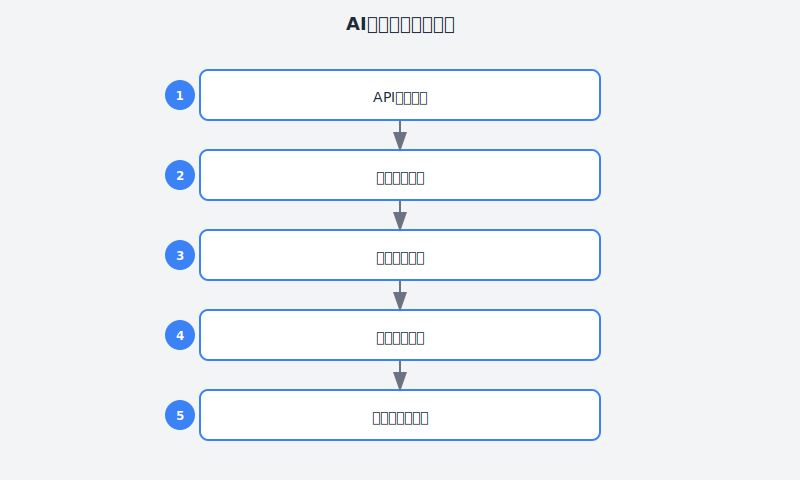

# 第13章：前端转后端，我的代码被同事夸了

> **AI辅助后端开发实战**

---

## 故事：小陈的后端初体验

### 周一：临危受命

"小陈，有个紧急任务。"项目经理李姐神色凝重地走过来。

"怎么了李姐？"

"后端组的小王突然离职了，他负责的用户权限模块还差一半没做完。下周就要上线，你看..."

小陈心里咯噔一下。他是前端啊，后端只是偶尔写个简单的API调用，真正的后端开发从来没做过。

"李姐，我是做前端的..."

"我知道，"李姐叹了口气，"但组里其他人手头都有项目，只有你能抽身。这样吧，后端组的张哥会带带你，你试试看？"

小陈硬着头皮接下任务。打开项目一看，他更懵了：

- **技术栈**：Node.js + NestJS + TypeScript + Prisma + PostgreSQL
- **已有代码**：十几个service文件，各种装饰器、依赖注入
- **需求文档**：一大半还没实现，包括RBAC权限、操作日志、数据导出

"我连NestJS的文档都没看过..."小陈感到一阵绝望。

但他很快冷静下来。上周用AI做前端项目，效率提升了10倍。后端开发，应该也能用AI辅助吧？

---





### 周二：用AI快速上手NestJS

周二一早，小陈找到后端组的张哥。

"张哥，我对NestJS不熟，能不能给我讲讲基础？"

张哥很热心："NestJS是个企业级的Node.js框架，核心理念是：
- 模块化（Module）
- 依赖注入（Dependency Injection）
- 装饰器（Decorator）
- 分层架构（Controller → Service → Repository）

你先看看官方文档，有问题随时问我。"

小陈道谢后回到座位，他没有直接看文档——太慢了。他打开Claude，开始用AI加速学习。

**第一步：快速掌握框架核心**

```
我需要快速掌握NestJS框架，用于后端API开发。

我的背景：
- 1年前端开发经验（React/TypeScript）
- 了解基本的Node.js和Express
- 不了解依赖注入、装饰器等概念

请帮我：
1. 用类比的方式解释NestJS的核心概念（与前端对比）
2. 列出开发API必须掌握的10个知识点
3. 提供一个最小可运行的CRUD示例
4. 推荐学习路径（按优先级排序）

要求：
- 结合我已有的前端知识做类比
- 不要罗列所有特性，聚焦最核心的
- 示例代码要完整，可以直接运行
```

AI的回复让小陈眼前一亮：

> **NestJS vs React 类比**：
> 
> | NestJS概念 | 对应React概念 | 说明 |
> |:---|:---|:---|
> | Module | 模块/组件树 | 组织代码的容器，有imports/exports |
> | Controller | 路由组件 | 处理HTTP请求，类似React Router的route handler |
> | Service | Hook/工具函数 | 业务逻辑封装，可被注入到Controller |
> | Decorator | Hook/高阶组件 | @Controller() @Get() 等类似@hook装饰器 |
> | DTO | TypeScript类型 | 定义数据传输对象的结构 |
> | Pipe | 校验中间件 | 类似表单验证逻辑 |
> | Guard | 权限路由守卫 | 类似React的PrivateRoute |
> | Interceptor | 切面/中间件 | 类似axios的拦截器 |

这个类比让小陈瞬间理解了NestJS的架构。他继续深入学习。

**第二步：分析现有代码**

小陈把项目里已有的代码丢给AI分析：

```
请帮我分析这个NestJS项目的代码结构：

[粘贴项目src目录结构和关键代码]

请分析：
1. 项目的分层架构是怎样的？
2. 有哪些设计模式在使用？
3. 代码规范是什么？（命名、目录组织等）
4. 我需要遵循哪些约定来添加新功能？
```

AI给出了详细的分析：

> 项目架构分析：
> 
> **分层结构**：
> - `controllers/` - HTTP层，处理请求/响应
> - `services/` - 业务逻辑层
> - `repositories/` - 数据访问层（使用Prisma）
> - `dto/` - 数据传输对象
> - `entities/` - 数据库实体定义
> - `guards/` - 权限守卫
> - `interceptors/` - 拦截器
> 
> **设计模式**：
> - Repository模式：数据访问抽象
> - Dependency Injection：依赖注入
> - DTO模式：输入输出类型安全

**第三步：生成第一个API**

有了基础理解，小陈开始实现第一个功能——用户管理的基础CRUD。

他先让AI生成完整的代码结构：

```
请帮我生成用户管理模块的完整代码，使用NestJS + Prisma。

功能需求：
1. 用户列表查询（支持分页、搜索、筛选）
2. 创建用户
3. 更新用户
4. 删除用户
5. 获取用户详情

技术要求：
- 使用NestJS的分层架构
- 使用Prisma作为ORM
- 使用class-validator进行参数校验
- 包含完整的DTO定义
- 包含单元测试

项目上下文：
[粘贴prisma schema和相关配置]

请生成以下文件：
1. user.controller.ts - 控制器
2. user.service.ts - 服务层
3. user.repository.ts - 数据访问层（可选，如果用Prisma可以直接在service里调用）
4. dto/create-user.dto.ts
5. dto/update-user.dto.ts
6. dto/query-user.dto.ts
7. user.module.ts
```

AI生成的代码质量让小陈惊讶：

```typescript
// user.controller.ts
import {
  Controller,
  Get,
  Post,
  Put,
  Delete,
  Body,
  Query,
  Param,
  ParseIntPipe,
  HttpStatus,
  HttpCode,
} from '@nestjs/common';
import { ApiTags, ApiOperation, ApiResponse } from '@nestjs/swagger';
import { UserService } from './user.service';
import { CreateUserDto } from './dto/create-user.dto';
import { UpdateUserDto } from './dto/update-user.dto';
import { QueryUserDto } from './dto/query-user.dto';

@ApiTags('用户管理')
@Controller('users')
export class UserController {
  constructor(private readonly userService: UserService) {}

  @Get()
  @ApiOperation({ summary: '获取用户列表' })
  @ApiResponse({ status: 200, description: '成功' })
  async findAll(@Query() query: QueryUserDto) {
    return this.userService.findAll(query);
  }

  @Get(':id')
  @ApiOperation({ summary: '获取用户详情' })
  async findOne(@Param('id', ParseIntPipe) id: number) {
    return this.userService.findOne(id);
  }

  @Post()
  @HttpCode(HttpStatus.CREATED)
  @ApiOperation({ summary: '创建用户' })
  async create(@Body() createUserDto: CreateUserDto) {
    return this.userService.create(createUserDto);
  }

  @Put(':id')
  @ApiOperation({ summary: '更新用户' })
  async update(
    @Param('id', ParseIntPipe) id: number,
    @Body() updateUserDto: UpdateUserDto,
  ) {
    return this.userService.update(id, updateUserDto);
  }

  @Delete(':id')
  @HttpCode(HttpStatus.NO_CONTENT)
  @ApiOperation({ summary: '删除用户' })
  async remove(@Param('id', ParseIntPipe) id: number) {
    return this.userService.remove(id);
  }
}
```

```typescript
// user.service.ts
import {
  Injectable,
  NotFoundException,
  ConflictException,
} from '@nestjs/common';
import { PrismaService } from '../prisma/prisma.service';
import { CreateUserDto } from './dto/create-user.dto';
import { UpdateUserDto } from './dto/update-user.dto';
import { QueryUserDto } from './dto/query-user.dto';
import * as bcrypt from 'bcrypt';

@Injectable()
export class UserService {
  constructor(private prisma: PrismaService) {}

  async findAll(query: QueryUserDto) {
    const { page = 1, pageSize = 10, keyword, status } = query;
    const skip = (page - 1) * pageSize;

    const where: any = {};
    if (keyword) {
      where.OR = [
        { username: { contains: keyword } },
        { email: { contains: keyword } },
      ];
    }
    if (status !== undefined) {
      where.status = status;
    }

    const [list, total] = await Promise.all([
      this.prisma.user.findMany({
        where,
        skip,
        take: pageSize,
        orderBy: { createdAt: 'desc' },
        select: {
          id: true,
          username: true,
          email: true,
          status: true,
          createdAt: true,
          roles: {
            select: {
              role: {
                select: { id: true, name: true },
              },
            },
          },
        },
      }),
      this.prisma.user.count({ where }),
    ]);

    return {
      list,
      total,
      page,
      pageSize,
      totalPages: Math.ceil(total / pageSize),
    };
  }

  async findOne(id: number) {
    const user = await this.prisma.user.findUnique({
      where: { id },
      include: {
        roles: {
          include: {
            role: true,
          },
        },
      },
    });

    if (!user) {
      throw new NotFoundException(`用户 #${id} 不存在`);
    }

    return user;
  }

  async create(createUserDto: CreateUserDto) {
    const { username, email, password, roleIds } = createUserDto;

    // 检查用户名和邮箱是否已存在
    const existing = await this.prisma.user.findFirst({
      where: {
        OR: [{ username }, { email }],
      },
    });

    if (existing) {
      throw new ConflictException('用户名或邮箱已存在');
    }

    // 加密密码
    const hashedPassword = await bcrypt.hash(password, 10);

    // 创建用户
    const user = await this.prisma.user.create({
      data: {
        username,
        email,
        password: hashedPassword,
        roles: {
          create: roleIds?.map((roleId) => ({
            role: { connect: { id: roleId } },
          })),
        },
      },
      include: {
        roles: {
          include: { role: true },
        },
      },
    });

    // 不返回密码
    const { password: _, ...result } = user;
    return result;
  }

  async update(id: number, updateUserDto: UpdateUserDto) {
    await this.findOne(id); // 确保用户存在

    const { roleIds, password, ...data } = updateUserDto;

    // 如果更新密码，需要加密
    if (password) {
      data.password = await bcrypt.hash(password, 10);
    }

    // 更新角色关联
    let roleUpdate: any = {};
    if (roleIds) {
      roleUpdate = {
        roles: {
          deleteMany: {},
          create: roleIds.map((roleId) => ({
            role: { connect: { id: roleId } },
          })),
        },
      };
    }

    const user = await this.prisma.user.update({
      where: { id },
      data: {
        ...data,
        ...roleUpdate,
      },
      include: {
        roles: {
          include: { role: true },
        },
      },
    });

    const { password: _, ...result } = user;
    return result;
  }

  async remove(id: number) {
    await this.findOne(id);
    await this.prisma.user.delete({ where: { id } });
  }
}
```

```typescript
// dto/create-user.dto.ts
import {
  IsString,
  IsEmail,
  MinLength,
  IsOptional,
  IsArray,
  IsInt,
  IsEnum,
} from 'class-validator';
import { ApiProperty, ApiPropertyOptional } from '@nestjs/swagger';
import { UserStatus } from '@prisma/client';

export class CreateUserDto {
  @ApiProperty({ description: '用户名' })
  @IsString()
  @MinLength(2)
  username: string;

  @ApiProperty({ description: '邮箱' })
  @IsEmail()
  email: string;

  @ApiProperty({ description: '密码' })
  @IsString()
  @MinLength(6)
  password: string;

  @ApiPropertyOptional({ description: '用户状态' })
  @IsOptional()
  @IsEnum(UserStatus)
  status?: UserStatus;

  @ApiPropertyOptional({ description: '角色ID列表' })
  @IsOptional()
  @IsArray()
  @IsInt({ each: true })
  roleIds?: number[];
}
```

小陈仔细阅读了生成的代码，质量非常高：
- 错误处理完善（NotFoundException, ConflictException）
- 密码加密处理
- 关联数据查询优化
- 返回数据过滤敏感字段（password）
- Swagger文档注解

他把代码提交给张哥审查，张哥看完后惊讶地说："你确定你是第一次写NestJS？这代码质量比小王写的还好。"

---

### 周三：攻克复杂需求——RBAC权限系统

基础CRUD做完了，接下来是最难的部分：RBAC（基于角色的访问控制）权限系统。

需求包括：
1. 角色管理（CRUD）
2. 权限管理（CRUD）
3. 角色-权限关联
4. 用户-角色关联
5. 权限检查Guard
6. 动态权限加载

小陈把这个复杂需求分解成小块，用AI逐个攻克。

**第一步：数据库设计**

```
请帮我设计RBAC权限系统的数据库Schema（Prisma格式）。

需求：
1. 用户可以拥有多个角色
2. 角色可以拥有多个权限
3. 权限支持菜单权限和操作权限
4. 支持权限分组
5. 支持数据权限（如只能查看本部门数据）

请生成完整的Prisma schema，包括：
- 所有模型定义
- 关联关系
- 索引优化
- 枚举类型
```

AI生成了完整的数据库设计：

```prisma
// schema.prisma

enum UserStatus {
  ACTIVE
  INACTIVE
  DISABLED
}

enum PermissionType {
  MENU      // 菜单权限
  BUTTON    // 按钮权限
  API       // 接口权限
  DATA      // 数据权限
}

enum DataScope {
  ALL         // 全部数据
  DEPARTMENT  // 本部门数据
  SELF        // 仅本人数据
  CUSTOM      // 自定义
}

model User {
  id        Int      @id @default(autoincrement())
  username  String   @unique
  email     String   @unique
  password  String
  status    UserStatus @default(ACTIVE)
  createdAt DateTime @default(now())
  updatedAt DateTime @updatedAt

  // 关联
  roles     UserRole[]
  departmentId Int?
  department   Department? @relation(fields: [departmentId], references: [id])

  @@map("users")
}

model Role {
  id          Int     @id @default(autoincrement())
  name        String  @unique
  code        String  @unique
  description String?
  status      Boolean @default(true)
  createdAt   DateTime @default(now())
  updatedAt   DateTime @updatedAt

  // 关联
  users       UserRole[]
  permissions RolePermission[]
  dataScope   DataScope @default(ALL)

  @@map("roles")
}

model Permission {
  id        Int      @id @default(autoincrement())
  name      String
  code      String   @unique
  type      PermissionType
  parentId  Int?
  sort      Int      @default(0)
  path      String?  // 路由路径或API路径
  component String?  // 前端组件路径
  icon      String?  // 菜单图标
  status    Boolean  @default(true)
  createdAt DateTime @default(now())

  // 自关联
  parent    Permission?  @relation("PermissionChildren", fields: [parentId], references: [id])
  children  Permission[] @relation("PermissionChildren")

  // 关联
  roles     RolePermission[]

  @@map("permissions")
}

model UserRole {
  userId    Int
  roleId    Int
  createdAt DateTime @default(now())

  user      User     @relation(fields: [userId], references: [id], onDelete: Cascade)
  role      Role     @relation(fields: [roleId], references: [id], onDelete: Cascade)

  @@id([userId, roleId])
  @@map("user_roles")
}

model RolePermission {
  roleId       Int
  permissionId Int
  createdAt    DateTime @default(now())

  role         Role       @relation(fields: [roleId], references: [id], onDelete: Cascade)
  permission   Permission @relation(fields: [permissionId], references: [id], onDelete: Cascade)

  @@id([roleId, permissionId])
  @@map("role_permissions")
}

model Department {
  id        Int     @id @default(autoincrement())
  name      String
  parentId  Int?
  sort      Int     @default(0)
  createdAt DateTime @default(now())

  // 自关联
  parent    Department?  @relation("DepartmentChildren", fields: [parentId], references: [id])
  children  Department[] @relation("DepartmentChildren")

  // 关联
  users     User[]

  @@map("departments")
}
```

**第二步：权限检查Guard**

```
请帮我实现一个权限检查Guard，用于保护API接口。

需求：
1. 通过@Permissions装饰器标记需要的权限
2. 从JWT token中获取当前用户
3. 查询用户的所有权限
4. 检查用户是否拥有所需权限
5. 支持超级管理员绕过检查
6. 如果没有权限，返回403错误

请生成完整的Guard代码和装饰器代码。
```

AI生成：

```typescript
// guards/permissions.guard.ts
import {
  Injectable,
  CanActivate,
  ExecutionContext,
  ForbiddenException,
} from '@nestjs/common';
import { Reflector } from '@nestjs/core';
import { PERMISSIONS_KEY } from '../decorators/permissions.decorator';
import { PrismaService } from '../prisma/prisma.service';

@Injectable()
export class PermissionsGuard implements CanActivate {
  constructor(
    private reflector: Reflector,
    private prisma: PrismaService,
  ) {}

  async canActivate(context: ExecutionContext): Promise<boolean> {
    // 获取需要的权限
    const requiredPermissions = this.reflector.getAllAndOverride<string[]>(
      PERMISSIONS_KEY,
      [context.getHandler(), context.getClass()],
    );

    // 如果没有标记权限，允许访问
    if (!requiredPermissions || requiredPermissions.length === 0) {
      return true;
    }

    // 获取当前用户
    const { user } = context.switchToHttp().getRequest();
    if (!user) {
      throw new ForbiddenException('未登录');
    }

    // 超级管理员直接通过
    if (user.isAdmin) {
      return true;
    }

    // 查询用户的所有权限
    const userWithRoles = await this.prisma.user.findUnique({
      where: { id: user.userId },
      include: {
        roles: {
          where: { role: { status: true } },
          include: {
            role: {
              include: {
                permissions: {
                  where: { permission: { status: true } },
                  include: { permission: true },
                },
              },
            },
          },
        },
      },
    });

    // 收集所有权限code
    const userPermissions = new Set<string>();
    userWithRoles?.roles.forEach((userRole) => {
      userRole.role.permissions.forEach((rolePermission) => {
        userPermissions.add(rolePermission.permission.code);
      });
    });

    // 检查是否拥有所有需要的权限
    const hasAllPermissions = requiredPermissions.every((permission) =>
      userPermissions.has(permission),
    );

    if (!hasAllPermissions) {
      throw new ForbiddenException('没有权限执行此操作');
    }

    return true;
  }
}
```

```typescript
// decorators/permissions.decorator.ts
import { SetMetadata } from '@nestjs/common';

export const PERMISSIONS_KEY = 'permissions';

export const Permissions = (...permissions: string[]) =>
  SetMetadata(PERMISSIONS_KEY, permissions);
```

**第三步：权限服务**

```
请帮我生成权限管理相关的Service代码：

1. PermissionService - 权限CRUD、权限树查询
2. RoleService - 角色CRUD、角色权限分配
3. AuthService扩展 - 登录时返回用户权限列表

要求：
- 完整的业务逻辑
- 权限缓存（使用Redis）
- 权限树形结构处理
```

AI生成了完整的权限服务代码，包括缓存优化和树形结构处理。

---

### 周四：数据权限与操作日志

权限系统基本完成了，但还有两个复杂需求：数据权限和操作日志。

**数据权限**：用户只能看到特定范围的数据（全部/本部门/仅自己）

**操作日志**：记录用户的所有操作，用于审计

小陈继续用AI辅助实现。

```
请帮我实现数据权限控制功能。

需求：
1. 不同角色可以配置不同的数据范围（ALL/DEPARTMENT/SELF/CUSTOM）
2. 在查询数据时自动应用数据范围过滤
3. 使用装饰器@DataScope标记需要数据权限控制的方法
4. 通过拦截器自动处理数据范围

请生成：
1. DataScope装饰器
2. DataScopeInterceptor拦截器
3. DataScopeService服务
4. 使用示例
```

```
请帮我实现操作日志功能。

需求：
1. 通过@Log装饰器标记需要记录日志的操作
2. 自动记录：操作用户、操作时间、操作类型、请求参数、响应结果、执行时长
3. 支持异步记录，不影响接口性能
4. 日志存储到数据库

请生成：
1. Log装饰器
2. LogInterceptor拦截器
3. OperationLogService服务
4. 数据库模型
```

AI生成的代码涵盖了所有需求，小陈只需要做一些微调就能使用。

---

### 周五：代码审查与惊喜

周五，小陈把所有的代码提交给张哥做最终审查。

张哥花了半天时间仔细review，最后在小陈的工位旁边坐下：

"小陈，我得跟你说件事。"

小陈紧张起来："张哥，是不是代码有问题？"

"问题？"张哥笑了，"你的代码质量让我惊讶。我给你说说几个亮点：

1. **分层清晰** - Controller/Service/DTO分离得很好
2. **类型安全** - TypeScript类型定义完整，没有滥用any
3. **错误处理** - 异常处理到位，错误信息友好
4. **性能考虑** - 查询优化、权限缓存都考虑到了
5. **安全意识** - 密码加密、敏感字段过滤都做到了
6. **可测试性** - 依赖注入写得规范，方便单元测试

说实话，这水平已经超过很多有两三年经验的后端了。"

小陈不好意思地挠挠头："其实...我用AI辅助写的。"

"AI？"张哥愣了一下，然后恍然大悟，"难怪。不过..."

他认真地说："用AI的人很多，但能写出这种质量的代码，说明你不是无脑复制。你理解每一行代码的含义，知道为什么要这样设计。AI只是放大器，核心还是你自己的能力。"

他顿了顿："下周的项目例会，你来给团队分享一下这套RBAC权限系统的实现吧。"

---

## 理论：AI辅助后端开发的核心方法

小陈的经历展示了AI辅助后端开发的完整流程。让我们系统化总结这个方法。

### 后端开发的复杂性来源

| 复杂性来源 | 说明 | AI辅助价值 |
|:---|:---|:---:|
| 框架学习成本 | NestJS/Express/Fastify等框架概念多 | ⭐⭐⭐ |
| 数据库设计 | 表结构、关联关系、索引优化 | ⭐⭐⭐ |
| 业务逻辑 | 复杂的业务流程、状态管理 | ⭐⭐ |
| 安全考虑 | 认证、鉴权、防SQL注入等 | ⭐⭐⭐ |
| 性能优化 | 查询优化、缓存策略 | ⭐⭐ |
| 错误处理 | 异常捕获、错误码设计 | ⭐⭐⭐ |

### AI辅助后端开发的4个阶段

```
阶段1：框架学习（1-2天）
├── 用AI快速理解框架核心概念
├── 生成最小可运行示例
└── 建立知识框架

阶段2：代码分析（0.5天）
├── 用AI分析现有项目结构
├── 理解代码规范
└── 识别设计模式

阶段3：功能开发（主要阶段）
├── 用AI生成代码骨架
├── 人工审查和调整
├── 迭代优化
└── 生成测试用例

阶段4：代码审查（0.5天）
├── 用AI辅助检查代码质量
├── 安全检查
└── 性能检查
```

### Prompt工程：后端开发的黄金模板

```markdown
## 1. 技术栈声明
- 框架：NestJS / Express / Fastify
- ORM：Prisma / TypeORM / Sequelize
- 数据库：PostgreSQL / MySQL / MongoDB
- 缓存：Redis
- 其他：Swagger / JWT / class-validator

## 2. 功能需求
详细描述功能点，包括：
- 输入输出
- 业务规则
- 边界条件
- 错误场景

## 3. 代码规范
- 文件命名
- 目录结构
- 错误处理规范
- 日志规范

## 4. 参考示例
提供项目中的类似代码作为参考

## 5. 输出要求
明确需要生成的文件清单
```

### 数据库设计的AI辅助流程

```
Step 1: 需求分析
"请帮我分析以下业务需求，提取数据实体和关系：
[业务需求描述]"

Step 2: 生成Schema
"基于以上分析，生成Prisma/TypeORM schema，包括：
- 所有模型定义
- 关联关系
- 索引优化
- 枚举类型"

Step 3: 审查优化
"请审查这个schema，关注：
- 是否有冗余字段
- 索引是否合理
- 关联关系是否正确
- 是否支持未来扩展"
```

---

## 实践：建立你的AI后端开发工作流

### Step 1：框架速通

用AI在1-2天内快速掌握新框架：

```
请用类比的方式解释[NestJS/Express/Fastify]的核心概念：
- 与[你熟悉的框架]对比
- 最小可运行示例
- 10个必须掌握的知识点
- 常见陷阱
```

### Step 2：项目分析

```
请分析这个后端项目的代码结构：
[粘贴项目结构]

请说明：
1. 分层架构
2. 设计模式
3. 代码规范
4. 如何添加新功能
```

### Step 3：功能开发

```
请帮我实现[功能名称]：

功能需求：
[详细描述]

技术要求：
[技术栈]

代码规范：
[规范说明]

参考示例：
[相关代码]

请生成：
[文件清单]
```

### Step 4：代码审查

```
请审查这段后端代码：
[粘贴代码]

关注：
1. 安全问题（SQL注入、XSS、CSRF等）
2. 性能问题（N+1查询、循环查询等）
3. 错误处理
4. 代码规范
5. 可测试性
```

---

## 本章交付物

完成本章后，你应该拥有：

1. **后端开发Prompt库**
   - 框架学习Prompt
   - 数据库设计Prompt
   - API开发Prompt
   - 代码审查Prompt

2. **RBAC权限系统模板**
   - 数据库Schema
   - Guard实现
   - 权限服务
   - 使用示例

3. **一次完整后端项目经验**
   - 从0到1用AI辅助完成后端开发
   - 理解核心概念和设计模式

---

## 行动清单

- [ ] 选择一个后端框架（NestJS/Express/Fastify）
- [ ] 用AI辅助快速学习框架核心概念
- [ ] 实现一个完整的CRUD模块
- [ ] 设计一个包含关联关系的数据库Schema
- [ ] 实现JWT认证和权限控制
- [ ] 用AI审查你的后端代码
- [ ] 编写单元测试

---

## 本章彩蛋

### 彩蛋1：Prisma Schema一键生成

从业务描述直接生成完整Schema：

```
请根据以下业务描述，生成Prisma Schema：

业务：电商平台
- 用户系统：用户、地址、收藏
- 商品系统：商品、分类、SKU、库存
- 订单系统：订单、订单项、支付记录
- 营销系统：优惠券、秒杀活动

要求：
- 完整的模型定义
- 正确的关联关系
- 合理的索引
- 软删除支持
```

### 彩蛋2：API文档自动生成

让AI帮你生成Swagger文档：

```
请为以下API生成完整的Swagger文档注解：

[粘贴Controller代码]

要求：
- 每个接口都有@ApiOperation
- 参数都有@ApiProperty
- 响应都有@ApiResponse
- 包含示例数据
```

### 彩蛋3：SQL优化助手

```
请优化以下Prisma查询：

[粘贴查询代码]

当前问题：
- 查询速度慢
- 内存占用高

请提供：
1. 问题分析
2. 优化方案
3. 优化后的代码
```

---

> **小陈的后端开发心得**：
> 
> "周一接到任务的时候，我觉得自己肯定搞不定。
> 周五代码审查的时候，张哥夸我代码质量高。
> 
> 这一周让我明白了几件事：
> 1. 技术栈不是壁垒，学习能力才是
> 2. AI可以帮你快速跨越'不会'到'会'的距离
> 3. 后端开发的核心不是语法，而是设计思维
> 4. 用AI辅助不代表不动脑，反而需要更强的代码审查能力
> 
> 最重要的是，我证明了：
> **一个前端开发者，用AI辅助，可以写出让后端同事称赞的代码。**
> 
> 这不是取代后端，而是打破边界。
> 未来的开发者，不该被'前端'或'后端'定义。
> 我们应该被'解决问题的能力'定义。"

---

**下一章预告**：第14章《让遗留项目焕发新生的手术》——小陈将面对一个充满技术债务的遗留项目，学习如何用AI辅助进行代码重构、技术栈升级和架构改造，让老项目焕发新生。
