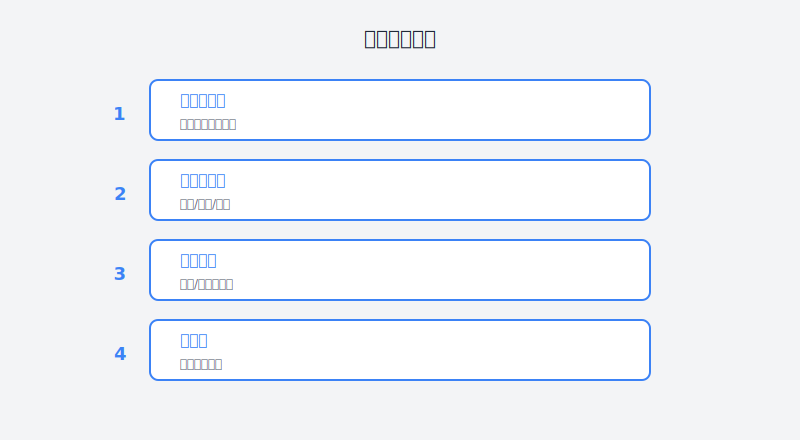

# 第15章：在Bug进入仓库前就抓住它

> **AI辅助代码审查——前端开发的守护防线**

---

## 故事：小王的代码审查噩梦

### 周一上午：又一只Bug溜进了生产环境

小王盯着生产环境的错误监控面板，脸色铁青。

"又是空指针异常。"他咬着牙说，"上周代码审查的时候怎么没发现？"

这个bug很简单——一个本该做非空判断的地方漏掉了。但就是这么简单的问题，导致了用户支付失败，客服工单爆了，产品经理在微信群里疯狂@他。

"这不是你的错。"隔壁工位的老李探过头来，"上周那次审查你请病假了，是小张帮你审的。"

"小张呢？"

"他那天要上线三个需求，代码审查就是走个形式，看了一眼就过了。"

小王叹了口气。这种情况他不是第一次见了：

- **审查流于形式**：大家都忙，代码审查变成"看了一眼，LGTM（Looks Good To Me）"
- **问题发现太晚**：有些bug在审查时没发现，上线后才暴露
- **审查质量不稳定**：取决于当天审查者的心情、时间和精力
- **重复性问题**：同样的错误，不同的人反复犯

"我们是不是该做点什么？"小王自言自语。

---





### 周二：第一次听说AI代码审查

周二的技术分享会上，架构组的老大提了一个新工具。

"最近我们在试点AI代码审查工具，"老大说，"不是替代人工审查，而是作为辅助。在代码进入人工审查前，先过一遍AI检查。"

"效果怎么样？"小王问。

"试点团队的数据显示，AI在代码提交阶段拦截了约40%的问题，人工审查的负担减轻了不少，而且漏网之鱼明显少了。"

小王眼睛亮了。如果能在代码进入仓库前就发现问题，那生产环境的bug应该会大幅减少。

"我想试试。"他说。

---

### 周三：搭建AI代码审查流水线

周三，小王开始研究如何把AI代码审查集成到团队的开发流程中。

他调研了几种方案：

| 方案 | 优点 | 缺点 | 适用场景 |
|:---|:---|:---|:---|
| **IDE插件** | 实时反馈，即写即查 | 依赖开发者自觉 | 个人开发习惯养成 |
| **Git Hook** | 提交前强制检查 | 可能拖慢提交速度 | 团队强制规范 |
| **CI/CD集成** | 自动化，不遗漏 | 反馈稍延迟 | 团队流程标准化 |
| **PR审查工具** | 与代码审查结合 | 问题发现较晚 | 作为人工审查的辅助 |

小王决定采用**多层级防御**策略：

1. **IDE层**：开发时实时检查（最快反馈）
2. **提交前**：Git Hook拦截明显问题（强制规范）
3. **CI层**：自动化检查（不遗漏）
4. **PR层**：AI生成审查摘要（辅助人工审查）

**第一步：IDE实时检查**

小王在Cursor中配置了AI代码检查功能。现在当他写完一段代码，AI会自动分析：

```javascript
// 小王刚写的代码
function calculateTotal(price, quantity) {
  return price * quantity;
}
```

AI提示：
> ⚠️ **潜在问题**：参数缺少类型检查和默认值
> - `price`和`quantity`可能为`undefined`或`null`
> - 建议添加参数校验或默认值

```javascript
// AI建议的改进
function calculateTotal(price, quantity) {
  if (typeof price !== 'number' || typeof quantity !== 'number') {
    throw new TypeError('price and quantity must be numbers');
  }
  return price * quantity;
}
```

"这个提示挺有用的，"小王想，"以前这种边界情况经常漏掉。"

**第二步：Git Hook提交前检查**

小王配置了一个pre-commit hook，在代码提交前自动运行AI检查：

```bash
#!/bin/sh
# .husky/pre-commit

echo "🤖 正在运行AI代码检查..."

# 获取暂存区的文件
STAGED_FILES=$(git diff --cached --name-only --diff-filter=ACM | grep -E '\.(js|jsx|ts|tsx)$')

if [ -n "$STAGED_FILES" ]; then
  # 调用AI检查API
  npx ai-code-review --files "$STAGED_FILES" --level=error
  
  if [ $? -ne 0 ]; then
    echo "❌ AI检查发现严重问题，请修复后重新提交"
    exit 1
  fi
fi

echo "✅ AI检查通过"
```

现在，如果AI发现了严重问题，提交会被拦截：

```
$ git commit -m "feat: 添加用户支付功能"
🤖 正在运行AI代码检查...

检查文件：src/payment/PaymentForm.jsx

❌ 发现1个严重问题：
   第42行：用户输入未做XSS过滤直接插入DOM
   
   当前代码：
   element.innerHTML = userInput;
   
   安全风险：可能导致XSS攻击
   
   建议修复：
   element.textContent = userInput;
   
❌ AI检查发现严重问题，请修复后重新提交
```

**第三步：CI/CD集成**

小王还在CI流程中集成了AI代码审查，确保所有进入主分支的代码都经过检查：

```yaml
# .github/workflows/ai-code-review.yml
name: AI Code Review

on:
  pull_request:
    types: [opened, synchronize]

jobs:
  ai-review:
    runs-on: ubuntu-latest
    steps:
      - uses: actions/checkout@v3
      
      - name: AI Code Review
        uses: ai-code-review-action@v1
        with:
          github_token: ${{ secrets.GITHUB_TOKEN }}
          openai_api_key: ${{ secrets.OPENAI_API_KEY }}
          review_level: 'detailed'
          check_security: true
          check_performance: true
```

现在，每次提交PR，AI会自动审查并发表评论：

---

**🤖 AI Code Review Bot** commented:

### 审查摘要

**文件**: `src/components/UserProfile.jsx`

#### 🔴 安全问题
- **第23行**: 用户ID直接拼接到API URL中，存在注入风险
  ```javascript
  // 当前代码
  fetch(`/api/users/${userId}`)
  
  // 建议修改
  const encodedId = encodeURIComponent(userId);
  fetch(`/api/users/${encodedId}`)
  ```

#### 🟡 性能建议
- **第45行**: `useEffect`依赖数组可能不完整，可能导致闭包陷阱
  - 当前依赖: `[userId]`
  - 建议添加: `fetchUserData`

#### 🟢 代码风格
- 函数`formatDate`可以提取为独立工具函数，提高复用性

---

**第四步：PR审查辅助**

最后，小王配置了一个AI工具，在人工审查前自动生成审查摘要：

```
📋 PR审查助手

变更概览：
- 新增文件: 3个
- 修改文件: 12个
- 删除文件: 1个
- 总行数变化: +450, -120

关键变更：
1. 新增PaymentService模块（核心业务逻辑）
2. 修改User组件状态管理
3. 更新API路由配置

⚠️ 需要特别关注：
- PaymentService涉及资金计算，请仔细核对精度处理
- 用户权限检查逻辑有变更，请验证边界情况

建议审查重点：
□ 资金计算的四舍五入逻辑
□ 权限检查的完备性
□ 错误处理的覆盖度
```

这个摘要帮助审查者快速了解PR的重点，提高审查效率。

---

### 周四：实战检验

周四，小王接到了一个新需求：在用户支付页面添加优惠券功能。

他写完了代码，准备提交。在提交前，Git Hook触发了AI检查：

```
$ git commit -m "feat: 添加优惠券功能"
🤖 正在运行AI代码检查...

检查文件：src/payment/CouponSelector.jsx, src/services/payment.js

⚠️ 发现2个警告：

1. src/payment/CouponSelector.jsx:34
   useEffect中使用了async函数但没有正确处理错误
   
   当前代码：
   useEffect(async () => {
     const coupons = await fetchCoupons();
     setCoupons(coupons);
   }, []);
   
   问题：async useEffect不会自动捕获错误，可能导致未处理的rejection
   
   建议修复：
   useEffect(() => {
     const loadCoupons = async () => {
       try {
         const coupons = await fetchCoupons();
         setCoupons(coupons);
       } catch (error) {
         console.error('Failed to load coupons:', error);
         setError('优惠券加载失败');
       }
     };
     loadCoupons();
   }, []);

2. src/services/payment.js:56
   浮点数运算可能产生精度问题
   
   当前代码：
   const finalPrice = originalPrice - discountAmount;
   
   建议：使用专门的金额计算库（如decimal.js）或转换为整数计算
   
请输入 y 继续提交，或 n 取消并修复问题：
```

小王选择了取消，按照AI的建议修复了问题。

"这两个问题如果在人工审查中，很可能会被忽略，"小王想，"特别是浮点数精度问题，太隐蔽了。"

修复后重新提交，顺利通过。

---

### 周五：团队推广

周五的站会上，小王分享了他的AI代码审查实践。

"这周我用了AI辅助代码审查，发现效果确实不错。"小王说，"有几个数据想和大家分享：

- 我个人在开发阶段拦截了8个问题
- 提交前拦截了3个问题（包括1个精度计算bug）
- 这周我提交的代码，人工审查的返工次数从平均2.3次降到了0.5次
- 最 importantly，没有bug流落到生产环境"

"有点意思，"产品经理说，"如果团队都用上，是不是bug率能大幅下降？"

"理论上是的，"小王说，"但要注意，AI审查不是万能的。它主要能发现：

- 明显的语法和逻辑错误
- 常见的安全漏洞（XSS、注入等）
- 性能隐患（不必要的重渲染、循环中的重复计算等）
- 代码风格问题

但它发现不了：

- 业务逻辑错误（比如优惠券规则理解错了）
- 复杂的设计问题
- 需求理解偏差

所以，人工审查还是必要的，AI只是帮我们做第一层过滤。"

团队决定试点推广，先在前端组试行一个月。

---

## 理论知识：AI代码审查深度解析

### AI代码审查能发现哪些问题？

根据小王的实践和行业数据，AI代码审查在以下类别表现较好：

| 问题类别 | 检出率 | 示例 |
|:---|:---:|:---|
| **安全漏洞** | 85%+ | XSS、SQL注入、敏感信息泄露 |
| **逻辑错误** | 60-70% | 空指针、数组越界、类型错误 |
| **性能隐患** | 70-80% | 不必要的重渲染、内存泄漏 |
| **代码风格** | 90%+ | 命名规范、代码重复 |
| **最佳实践** | 75%+ | 不符合框架推荐模式 |

但在以下类别表现有限：

| 问题类别 | 检出率 | 原因 |
|:---|:---:|:---|
| **业务逻辑错误** | 20-30% | AI不理解业务规则 |
| **架构设计问题** | 10-20% | 需要全局上下文判断 |
| **需求理解偏差** | <10% | AI不知道原始需求 |

### AI代码审查的工作原理

```
┌─────────────────────────────────────────────────────────────┐
│                    AI代码审查流程                           │
├─────────────────────────────────────────────────────────────┤
│                                                             │
│  1. 代码解析                                                 │
│     ↓ 将代码转换为AST（抽象语法树）                          │
│                                                             │
│  2. 上下文分析                                               │
│     ↓ 理解代码结构、依赖关系、数据流                         │
│                                                             │
│  3. 模式匹配                                                 │
│     ↓ 识别已知的问题模式（安全漏洞、反模式等）               │
│                                                             │
│  4. 语义分析                                                 │
│     ↓ 理解代码意图，发现逻辑错误                             │
│                                                             │
│  5. 建议生成                                                 │
│     ↓ 针对发现的问题给出修复建议                             │
│                                                             │
└─────────────────────────────────────────────────────────────┘
```

### 多层防御体系

AI代码审查最有效的方式是作为**多层防御体系**的一部分：

```
┌─────────────────────────────────────────────────────────────┐
│                    代码质量防御体系                         │
├─────────────────────────────────────────────────────────────┤
│                                                             │
│  第一层：IDE实时检查 (秒级反馈)                              │
│  ├── 语法错误                                               │
│  ├── 类型错误                                               │
│  └── 简单逻辑错误                                           │
│                                                             │
│  第二层：提交前检查 (分钟级反馈)                             │
│  ├── 安全漏洞扫描                                           │
│  ├── 代码规范检查                                           │
│  └── 单元测试                                               │
│                                                             │
│  第三层：CI自动化检查 (提交后反馈)                           │
│  ├── 全面静态分析                                           │
│  ├── 安全深度扫描                                           │
│  └── 集成测试                                               │
│                                                             │
│  第四层：PR审查 (人工+AI)                                    │
│  ├── AI生成审查摘要                                         │
│  ├── 人工业务逻辑审查                                       │
│  └── 架构设计审查                                           │
│                                                             │
└─────────────────────────────────────────────────────────────┘
```

### 常见AI代码审查工具对比

| 工具 | 类型 | 优点 | 缺点 | 成本 |
|:---|:---|:---|:---|:---:|
| **GitHub Copilot Chat** | IDE集成 | 与编辑器深度集成 | 功能较基础 | $ |
| **CodeRabbit** | PR审查 | 详细的审查报告 | 延迟稍高 | $$ |
| **Amazon CodeGuru** | 云原生 | AWS集成好 |  vendor lock-in | $$ |
| **SonarQube + AI** | 自托管 | 可定制性强 | 需要维护 | $$$ |
| **OpenAI/Claude API** | 自定义 | 最灵活 | 需要自己开发 | 按量 |

---

## 实践：搭建你的AI代码审查系统

### Step 1：选择适合的工具

根据你的团队规模和需求：

**个人开发者/小团队**：
- IDE插件：GitHub Copilot, Cursor
- Git Hook: simple-git-hooks + OpenAI API

**中型团队**：
- CodeRabbit或类似SaaS工具
- 配合CI/CD集成

**大型团队/企业**：
- 自研AI审查系统
- 结合SonarQube等静态分析工具

### Step 2：设计审查规则

不要盲目启用所有规则，要根据团队情况定制：

**前端团队建议的审查重点**：

```yaml
# ai-review-config.yml
rules:
  security:
    - no-innerHTML-with-user-input
    - no-eval
    - no-document-write
    - require-https-for-sensible-data
    
  performance:
    - no-unused-deps-in-useEffect
    - memoize-expensive-calculations
    - avoid-anonymous-functions-in-render
    
  reliability:
    - require-error-handling-in-async
    - no-floating-promises
    - require-default-props
    
  maintainability:
    - max-function-length: 50
    - max-file-length: 300
    - require-jsdoc-for-public-api
```

### Step 3：编写有效的审查Prompt

如果你使用OpenAI/Claude API自定义审查，Prompt很关键：

**基础Prompt模板**：

```
你是一位资深前端代码审查专家。请审查以下代码，重点关注：
1. 安全漏洞（XSS、注入、敏感信息泄露等）
2. 逻辑错误（空指针、数组越界等）
3. 性能隐患（不必要的重渲染、内存泄漏等）
4. React/Vue最佳实践

对于每个发现的问题，请提供：
- 问题描述
- 严重程度（严重/警告/建议）
- 具体位置（文件名和行号）
- 修复建议代码

代码文件：
```
{filename}
{code}
```
```

**进阶Prompt（带上下文）**：

```
你是一位资深前端架构师。请审查以下代码变更。

## 变更背景
{pr_description}

## 相关文件
{related_files}

## 变更代码
```diff
{diff}
```

请从以下维度进行审查：
1. **安全性**：是否有潜在的安全漏洞？
2. **正确性**：逻辑是否正确，边界情况是否处理？
3. **性能**：是否有性能隐患？
4. **可维护性**：代码是否清晰，是否易于维护？
5. **测试**：是否需要补充测试？

对于每个发现的问题，请按以下格式输出：
### [严重程度] 问题标题
- **位置**：文件:行号
- **描述**：具体问题
- **建议**：如何修复
- **修复代码**：
```代码```
```

### Step 4：集成到工作流

**Git Hook配置示例**：

```javascript
// .husky/pre-commit
const { execSync } = require('child_process');
const path = require('path');

const stagedFiles = execSync('git diff --cached --name-only --diff-filter=ACM')
  .toString()
  .trim()
  .split('\n')
  .filter(f => /\.(js|jsx|ts|tsx)$/.test(f));

if (stagedFiles.length === 0) {
  process.exit(0);
}

console.log('🤖 正在运行AI代码审查...');

try {
  const result = execSync(
    `npx ai-code-review --files ${stagedFiles.join(' ')}`,
    { encoding: 'utf-8', stdio: 'pipe' }
  );
  console.log(result);
  console.log('✅ AI审查通过');
} catch (error) {
  console.error('❌ AI审查发现问题：');
  console.error(error.stdout || error.message);
  process.exit(1);
}
```

### Step 5：持续优化

**收集反馈，调整规则**：

```
每月回顾：
1. AI发现了多少问题？
2. 有多少误报（AI说有问题，实际没问题）？
3. 有多少漏报（AI没发现，人工发现了）？
4. 团队的反馈如何？

根据数据调整：
- 误报率高的规则 → 调整或禁用
- 漏报多的类别 → 加强检查
- 团队反馈 → 优化Prompt和流程
```

---

## 本章交付物

完成本章后，你应该拥有：

1. **AI代码审查配置文件**
   - 适合你团队技术栈的审查规则
   - Git Hook或CI集成配置

2. **审查Prompt库**
   - 至少3个针对不同场景的审查Prompt
   - 标准化的问题分类和严重级别定义

3. **审查流程文档**
   - 团队AI代码审查规范
   - 问题处理流程（发现→修复→验证）

---

## 行动清单

- [ ] 评估你当前的代码审查流程，找出痛点
- [ ] 选择一个AI代码审查工具进行试用
- [ ] 为你的团队设计审查规则配置
- [ ] 编写或收集审查Prompt模板
- [ ] 在IDE中配置实时AI检查
- [ ] 配置Git Hook提交前检查
- [ ] 与团队讨论并推广AI辅助审查
- [ ] 建立审查效果追踪机制

---

## 本章彩蛋

### 彩蛋1：一个神奇的审查Prompt

这个Prompt能让AI扮演"偏执狂安全专家"，专门挑刺：

```
你是一位极度偏执的安全专家，你的唯一目标是找出代码中所有可能的漏洞。

审查原则：
1. 假设所有输入都是恶意的
2. 假设所有外部依赖都会失效
3. 假设所有异步操作都会超时
4. 假设所有边界情况都会发生

请用"红队思维"审查以下代码，找出所有潜在问题——即使是很小概率的问题也要指出来。

代码：
```
{code}
```
```

用这个Prompt，你会发现很多平时注意不到的问题。

### 彩蛋2：前端常见安全漏洞清单

AI审查应该重点关注的10个前端安全问题：

1. **XSS（跨站脚本攻击）**
   - 危险：`innerHTML`, `document.write`, `eval`
   - 安全：`textContent`, 模板引擎自动转义

2. **不安全的URL跳转**
   - 危险：`window.location = userInput`
   - 安全：白名单校验

3. **敏感信息泄露**
   - 危险：console.log输出token、密码
   - 安全：生产环境关闭详细日志

4. **不安全的依赖**
   - 危险：使用过期的npm包
   - 安全：定期`npm audit`

5. **CSRF防护缺失**
   - 危险：敏感操作无token验证
   - 安全：使用SameSite Cookie + CSRF Token

6. **点击劫持**
   - 危险：页面可被嵌入iframe
   - 安全：设置X-Frame-Options

7. **不安全的存储**
   - 危险：localStorage存敏感信息
   - 安全：httpOnly Cookie

8. **原型链污染**
   - 危险：`_.merge({}, userInput)`
   - 安全：使用安全的合并库

9. **正则表达式DoS**
   - 危险：复杂的正则匹配用户输入
   - 安全：限制输入长度，使用安全的正则

10. **不安全的WebSocket**
    - 危险：ws://而非wss://
    - 安全：始终使用wss://

把这个清单交给AI，让它重点检查这些问题。

---

> **小王的AI审查月度总结**：
> 
> "用AI辅助代码审查一个月后，我们团队的bug率下降了约45%。
> 
> 最 surprising的是，AI发现的问题中，有30%是传统lint工具发现不了的逻辑错误。
> 
> 当然，AI也不是完美的。它偶尔会误报，也看不懂业务逻辑。但把它当作'第一遍审查员'，让代码在到达人工审查前就达到基本质量门槛，这个价值是巨大的。
> 
> 现在的流程是：
> 1. 我写代码
> 2. IDE实时检查（发现问题立即修复）
> 3. 提交前AI检查（拦截明显问题）
> 4. AI生成审查摘要（给人工审查者参考）
> 5. 人工审查（专注业务逻辑和架构）
> 
> 人工审查的负担轻了，但质量反而提高了。这才是AI该有的用法——不是替代人，而是让人专注于更有价值的工作。"

---

**下一章预告**：第16章《从10秒到100毫秒的优化之路》——小陈将挑战性能优化难题，用AI辅助找出性能瓶颈，实现页面加载速度的十倍提升。
