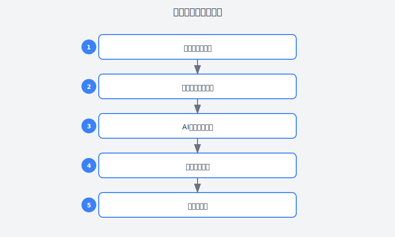

# 第22章：告别重复劳动的脚本自动化

> **运维篇——让机器替你干脏活累活**

---

## 故事：老周的重复劳动噩梦

### 周一早上9点：又是手工操作的一天

老周盯着屏幕上密密麻麻的服务器列表，叹了口气。

"今天要给50台服务器更新SSL证书，"他看着手里的工单，"每台都要登录、备份、替换、重启、验证..."

作为公司的资深运维工程师，老周已经在这个岗位上干了8年。8年时间里，他亲手处理过的重复性任务不计其数：

- 每天早上一上班，先登录十几台服务器查看磁盘空间
- 每周要给几十个应用打补丁、重启服务
- 每月要生成各种运维报表，从各种日志里提取数据
- 每季度要做一次全量备份验证

"这些活儿技术含量不高，但特别耗时间，"老周常常自嘲，"我就是个人肉脚本。"

他曾经尝试过写脚本自动化，但总是遇到各种问题：
- Bash脚本写起来语法晦涩，调试困难
- Python脚本虽然好用，但写出来要花不少时间
- 很多任务场景复杂，分支判断太多，脚本越写越乱
- 脚本写完过段时间自己都看不懂了

结果大部分任务还是靠手工操作，日复一日。

---

### 周二：一个意外的发现

周二下午，老周在茶水间遇到了开发组的小张。

"周哥，你最近看起来挺累的啊，"小张递过来一杯咖啡，"听说你还在手工登录服务器查日志？"

"别提了，"老周苦笑，"我想写个自动化脚本，但写着写着就放弃了。要处理的情况太多，脚本太复杂。"

"试试用AI帮你写？"小张说，"我现在写代码都用Cursor，连复杂的自动化脚本也是AI帮我写的。"

"AI写运维脚本？"老周有点怀疑，"运维脚本要处理服务器、网络、文件系统这些，AI能行吗？"

"试试看呗，反正不花钱，"小张说，"关键是要会用Prompt，你得告诉AI你的具体场景和需求。"

老周回到工位，决定试一试。他打开ChatGPT，思考了一下该怎么说。

他没有直接说"帮我写个脚本"，而是像小张教的那样，先描述清楚场景：

```
我需要写一个Python脚本来批量更新服务器的SSL证书。

场景：
- 有50台Linux服务器，IP列表存在ips.txt里
- 每台服务器需要用SSH登录，使用密钥认证
- 更新步骤：
  1. 备份现有证书（/etc/ssl/cert.pem 和 /etc/ssl/key.pem）
  2. 上传新证书到/tmp/目录
  3. 替换证书文件（需要sudo权限）
  4. 重启nginx服务
  5. 验证https是否正常（curl检查）
  6. 如果失败，自动回滚到备份的证书

要求：
- 并发执行，最多5台同时操作
- 每台操作要有详细日志
- 最后生成执行报告（成功/失败列表）
- 失败时要记录错误信息

请给我完整的、可直接运行的Python脚本。
```

两分钟后，AI给出了完整的代码。老周惊讶地发现，这段代码不仅结构清晰，还考虑了他没提到的一些细节：

```python
#!/usr/bin/env python3
"""
SSL证书批量更新脚本
并发执行，支持自动回滚
"""

import paramiko
import concurrent.futures
from pathlib import Path
import logging
from datetime import datetime
import subprocess
import sys

# 配置日志
logging.basicConfig(
    level=logging.INFO,
    format='%(asctime)s - %(levelname)s - %(message)s',
    handlers=[
        logging.FileHandler(f'ssl_update_{datetime.now():%Y%m%d_%H%M%S}.log'),
        logging.StreamHandler()
    ]
)
logger = logging.getLogger(__name__)

class SSLUpdater:
    def __init__(self, key_path, max_workers=5):
        self.key_path = key_path
        self.max_workers = max_workers
        self.results = {'success': [], 'failed': []}
    
    def update_server(self, ip):
        """更新单台服务器的SSL证书"""
        logger.info(f"开始处理服务器: {ip}")
        
        try:
            # 建立SSH连接
            client = paramiko.SSHClient()
            client.set_missing_host_key_policy(paramiko.AutoAddPolicy())
            client.connect(ip, username='root', key_filename=self.key_path, timeout=30)
            
            # 1. 备份现有证书
            backup_cmd = f"""
                backup_dir=/etc/ssl/backup_{datetime.now():%Y%m%d_%H%M%S}
                mkdir -p $backup_dir
                cp /etc/ssl/cert.pem $backup_dir/ 2>/dev/null || true
                cp /etc/ssl/key.pem $backup_dir/ 2>/dev/null || true
                echo $backup_dir
            """
            stdin, stdout, stderr = client.exec_command(backup_cmd)
            backup_dir = stdout.read().decode().strip()
            logger.info(f"[{ip}] 证书已备份到: {backup_dir}")
            
            # 2. 上传新证书（使用SFTP）
            sftp = client.open_sftp()
            sftp.put('new_cert.pem', '/tmp/cert.pem')
            sftp.put('new_key.pem', '/tmp/key.pem')
            sftp.close()
            logger.info(f"[{ip}] 新证书已上传到/tmp/")
            
            # 3. 替换证书文件
            replace_cmd = """
                sudo cp /tmp/cert.pem /etc/ssl/cert.pem && \
                sudo cp /tmp/key.pem /etc/ssl/key.pem && \
                sudo chmod 600 /etc/ssl/key.pem && \
                sudo chown root:root /etc/ssl/*.pem
            """
            stdin, stdout, stderr = client.exec_command(replace_cmd)
            exit_status = stdout.channel.recv_exit_status()
            
            if exit_status != 0:
                error = stderr.read().decode()
                raise Exception(f"替换证书失败: {error}")
            logger.info(f"[{ip}] 证书替换成功")
            
            # 4. 重启nginx
            stdin, stdout, stderr = client.exec_command('sudo systemctl restart nginx')
            exit_status = stdout.channel.recv_exit_status()
            
            if exit_status != 0:
                raise Exception(f"重启nginx失败: {stderr.read().decode()}")
            logger.info(f"[{ip}] nginx重启成功")
            
            # 5. 验证HTTPS
            verify_cmd = 'sleep 2 && curl -s -o /dev/null -w "%{http_code}" https://localhost'
            stdin, stdout, stderr = client.exec_command(verify_cmd)
            http_code = stdout.read().decode().strip()
            
            if http_code != '200':
                raise Exception(f"HTTPS验证失败，状态码: {http_code}")
            logger.info(f"[{ip}] HTTPS验证成功 (状态码: {http_code})")
            
            client.close()
            self.results['success'].append(ip)
            logger.info(f"✅ [{ip}] 更新成功")
            return True
            
        except Exception as e:
            logger.error(f"❌ [{ip}] 更新失败: {str(e)}")
            self.results['failed'].append({'ip': ip, 'error': str(e)})
            
            # 尝试回滚
            try:
                if 'backup_dir' in dir():
                    rollback_cmd = f"""
                        sudo cp {backup_dir}/cert.pem /etc/ssl/cert.pem 2>/dev/null || true
                        sudo cp {backup_dir}/key.pem /etc/ssl/key.pem 2>/dev/null || true
                        sudo systemctl restart nginx
                    """
                    client.exec_command(rollback_cmd)
                    logger.info(f"[{ip}] 已自动回滚到备份版本")
            except:
                pass
            
            return False
    
    def run(self, ip_list_file):
        """主执行函数"""
        # 读取IP列表
        with open(ip_list_file, 'r') as f:
            ips = [line.strip() for line in f if line.strip() and not line.startswith('#')]
        
        logger.info(f"开始批量更新SSL证书，共{len(ips)}台服务器，并发数: {self.max_workers}")
        
        # 并发执行
        with concurrent.futures.ThreadPoolExecutor(max_workers=self.max_workers) as executor:
            futures = {executor.submit(self.update_server, ip): ip for ip in ips}
            for future in concurrent.futures.as_completed(futures):
                ip = futures[future]
                try:
                    future.result()
                except Exception as e:
                    logger.error(f"[{ip}] 执行异常: {str(e)}")
        
        # 生成报告
        self.generate_report()
    
    def generate_report(self):
        """生成执行报告"""
        report = f"""
========================================
SSL证书批量更新报告
生成时间: {datetime.now():%Y-%m-%d %H:%M:%S}
========================================

总计: {len(self.results['success']) + len(self.results['failed'])}台
成功: {len(self.results['success'])}台
失败: {len(self.results['failed'])}台
成功率: {len(self.results['success'])/(len(self.results['success']) + len(self.results['failed']))*100:.1f}%

【成功列表】
"""
        for ip in self.results['success']:
            report += f"  ✅ {ip}\n"
        
        if self.results['failed']:
            report += "\n【失败列表】\n"
            for item in self.results['failed']:
                report += f"  ❌ {item['ip']} - {item['error']}\n"
        
        report += "\n========================================\n"
        
        # 保存报告
        report_file = f'ssl_report_{datetime.now():%Y%m%d_%H%M%S}.txt'
        with open(report_file, 'w') as f:
            f.write(report)
        
        logger.info(report)
        logger.info(f"详细报告已保存到: {report_file}")

if __name__ == '__main__':
    if len(sys.argv) < 2:
        print("用法: python ssl_updater.py <ip_list_file> [ssh_key_path]")
        print("示例: python ssl_updater.py ips.txt ~/.ssh/id_rsa")
        sys.exit(1)
    
    ip_file = sys.argv[1]
    key_path = sys.argv[2] if len(sys.argv) > 2 else '~/.ssh/id_rsa'
    
    updater = SSLUpdater(key_path)
    updater.run(ip_file)
```

老周看完代码，眼睛都亮了。

"这代码结构比我写的清楚多了，"他喃喃自语，"并发处理、错误处理、自动回滚、详细日志...这些我都想到了，但每次写都半途而废。"

他保存了代码，稍作修改（调整了证书路径），然后跑了一遍测试。20分钟后，50台服务器的SSL证书全部更新完成，生成了一份详细的执行报告。

"原来3小时的工作，现在20分钟搞定，"老周看着报告，心里盘算着，"而且比手工操作更可靠，不会漏掉哪台服务器。"

---

### 周三：脚本自动化的进阶

尝到了甜头，老周决定把更多重复性任务交给AI写脚本。

他列了一个清单：
1. 每日服务器巡检脚本（磁盘、内存、CPU检查）
2. 日志分析脚本（从海量日志里提取错误信息）
3. 批量用户管理脚本（创建/删除/修改用户权限）
4. 数据库备份验证脚本

他先尝试最复杂的那个——日志分析。

"这个需求比较复杂，"老周想，"得给AI足够详细的描述。"

```
我需要写一个日志分析脚本，用于从多个应用的日志文件中提取和分析错误信息。

日志文件特点：
- 分布在10台服务器上，路径格式: /var/log/apps/{app_name}/app.log
- 应用包括: order-service, payment-service, user-service, inventory-service
- 日志格式: 2024-01-15 14:32:15 [ERROR] com.example.OrderService - 错误信息
- 单文件大小从100MB到2GB不等
- 日志按天轮转，有app.log.1, app.log.2.gz等历史文件

分析需求：
1. 统计每个应用的ERROR、WARN、INFO数量（按小时分布）
2. 提取所有ERROR级别的完整堆栈跟踪
3. 识别最频繁的5种错误类型
4. 发现错误突增的时间段（与前一小时相比增长50%以上）
5. 生成可视化图表（HTML报告）

技术约束：
- 使用Python
- 要考虑大文件读取性能（不能一次性读入内存）
- 支持增量分析（只分析上次分析后新增的日志）
- 支持并行处理多台服务器
- 结果要保存为JSON和HTML两种格式

请给出完整的实现方案，包括：
1. 脚本架构设计
2. 核心代码实现
3. 配置说明
4. 使用示例
```

这次AI给出的回答更加详细，不仅有代码，还有架构设计。

老周看完这个方案，彻底服了。

"这不仅是一个脚本，简直是一个完整的产品，"他想，"模块化设计、增量分析、并发处理、可视化报告...让我自己写，至少得写一周。"

---

### 周四到周五：脚本库的积累

接下来的两天，老周疯狂地让AI帮他写脚本。

一周下来，老周积累了十几个实用的运维脚本。他把这些脚本整理成一个工具库，还写了一份使用文档。

---

## 理论知识：AI辅助脚本编写的方法论

### 脚本自动化的价值




| 维度 | 手工操作 | 脚本自动化 |
|:---|:---|:---|
| **时间成本** | 重复消耗 | 一次性投入 |
| **准确性** | 容易出错 | 一致可靠 |
| **可追溯性** | 难以审计 | 完整日志 |
| **扩展性** | 难以复制 | 批量执行 |
| **人员依赖** | 绑定个人 | 团队共享 |

### AI辅助脚本编写的核心原则

#### 原则1：描述场景，而非代码

**❌ 错误方式**：
```
帮我写一个Python脚本
```

**✅ 正确方式**：
```
我需要批量更新50台服务器的SSL证书。
场景：...
要求：...
```

#### 原则2：明确边界条件

脚本最容易出问题的地方是边界情况。向AI描述时，要说明：
- 异常情况怎么处理（网络超时、权限不足、文件不存在）
- 失败时是否回滚
- 并发数限制
- 日志级别要求

#### 原则3：要求模块化设计

让AI写出可维护的代码：
```
请使用面向对象方式设计，包含：
- 配置类（Config）
- 核心逻辑类（XXXManager）
- 结果报告类（Reporter）
```

#### 原则4：要求完整的错误处理

```
每个步骤都要有try-catch，失败时：
1. 记录详细错误信息
2. 尝试回滚或清理
3. 继续执行下一个，不要中断整体流程
4. 最后生成失败清单
```

### 脚本类型与AI Prompt模板

| 脚本类型 | 核心Prompt要素 | 示例场景 |
|:---|:---|:---|
| **批量操作** | 目标列表、操作步骤、并发控制、失败处理 | 批量部署、批量配置更新 |
| **数据采集** | 数据源、采集频率、存储格式、增量策略 | 日志收集、指标采集 |
| **监控告警** | 检查项、阈值、通知渠道、告警级别 | 服务器巡检、健康检查 |
| **报告生成** | 数据来源、统计维度、输出格式、可视化 | 日报、周报、月报 |
| **运维工具** | 操作对象、权限控制、审计日志、安全约束 | 用户管理、配置管理 |

**通用Prompt模板**：
```
我需要写一个[脚本类型]脚本，用于[一句话描述目标]。

【场景描述】
- 目标环境：[操作系统/服务器/应用]
- 目标数量：[数量级]
- 现有约束：[网络/权限/资源限制]

【功能需求】
1. [具体功能点1]
2. [具体功能点2]
3. ...

【技术要求】
- 语言：[Python/Bash/Go等]
- 并发：[是否需要并发，并发数]
- 错误处理：[失败时如何处理]
- 日志：[日志级别、输出位置]
- 报告：[输出格式、内容]

【边界条件】
- 异常情况：[网络超时/文件不存在/权限不足等]
- 失败策略：[重试/跳过/回滚]
- 安全约束：[权限最小化/敏感信息处理]

请给出完整的、可直接运行的代码，包含详细注释。
```

---

## 实践部分：常用脚本实战

### 实战1：服务器巡检脚本

**需求描述**：
```
我需要写一个每日服务器巡检脚本。

场景：
- 巡检20台Linux服务器
- 检查项：磁盘使用率、内存使用率、CPU负载、僵尸进程
- 告警阈值：磁盘>85%、内存>90%、负载>10、僵尸进程>0

要求：
- 使用Python
- 并发巡检（最多8台同时）
- 生成Markdown格式的巡检报告
- 超过阈值的项标红
- 支持钉钉机器人告警
- 记录到SQLite数据库便于历史查询
```

**AI生成的核心代码**：
```python
#!/usr/bin/env python3
"""
服务器每日巡检脚本
"""
import paramiko
import concurrent.futures
import sqlite3
from datetime import datetime
import json
import requests
from dataclasses import dataclass
from typing import List, Optional

@dataclass
class CheckResult:
    host: str
    disk_usage: float
    memory_usage: float
    cpu_load: float
    zombie_processes: int
    warnings: List[str]
    checked_at: datetime

def check_server(ip: str) -> CheckResult:
    """检查单台服务器"""
    client = paramiko.SSHClient()
    client.set_missing_host_key_policy(paramiko.AutoAddPolicy())
    
    try:
        client.connect(ip, username='monitor', key_filename='~/.ssh/monitor_key', timeout=30)
        
        # 获取磁盘使用率（最大分区）
        stdin, stdout, stderr = client.exec_command(
            "df -h | awk 'NR>1 && $1 ~ /^\/dev/ {print $5}' | sed 's/%//' | sort -nr | head -1"
        )
        disk_usage = float(stdout.read().decode().strip() or 0)
        
        # 获取内存使用率
        stdin, stdout, stderr = client.exec_command(
            "free | grep Mem | awk '{printf \"%.2f\", $3/$2 * 100.0}'"
        )
        memory_usage = float(stdout.read().decode().strip() or 0)
        
        # 获取CPU负载（5分钟平均）
        stdin, stdout, stderr = client.exec_command("uptime | awk -F'load average:' '{print $2}' | awk '{print $2}' | sed 's/,//'")
        cpu_load = float(stdout.read().decode().strip() or 0)
        
        # 获取僵尸进程数
        stdin, stdout, stderr = client.exec_command("ps aux | grep -c '[Zz]ombie'")
        zombie_processes = int(stdout.read().decode().strip() or 0)
        
        client.close()
        
        # 检查告警
        warnings = []
        if disk_usage > 85:
            warnings.append(f"磁盘使用率过高: {disk_usage}%")
        if memory_usage > 90:
            warnings.append(f"内存使用率过高: {memory_usage:.1f}%")
        if cpu_load > 10:
            warnings.append(f"CPU负载过高: {cpu_load}")
        if zombie_processes > 0:
            warnings.append(f"存在{zombie_processes}个僵尸进程")
        
        return CheckResult(
            host=ip,
            disk_usage=disk_usage,
            memory_usage=memory_usage,
            cpu_load=cpu_load,
            zombie_processes=zombie_processes,
            warnings=warnings,
            checked_at=datetime.now()
        )
        
    except Exception as e:
        return CheckResult(
            host=ip,
            disk_usage=0,
            memory_usage=0,
            cpu_load=0,
            zombie_processes=0,
            warnings=[f"连接失败: {str(e)}"],
            checked_at=datetime.now()
        )

def send_dingtalk_alert(webhook: str, results: List[CheckResult]):
    """发送钉钉告警"""
    alert_results = [r for r in results if r.warnings]
    
    if not alert_results:
        return
    
    content = "### 🚨 服务器巡检告警\n\n"
    for r in alert_results:
        content += f"**{r.host}**\n"
        for w in r.warnings:
            content += f"- ❌ {w}\n"
        content += "\n"
    
    message = {
        "msgtype": "markdown",
        "markdown": {
            "title": "服务器巡检告警",
            "text": content
        }
    }
    
    requests.post(webhook, json=message, timeout=10)
```

### 实战2：自动化备份验证脚本

**需求描述**：
```
我需要写一个数据库备份验证脚本。

场景：
- MySQL数据库每晚自动备份到对象存储
- 需要定期验证备份可用性
- 验证流程：下载备份->校验MD5->恢复到临时实例->执行测试查询

要求：
- 完整的验证流程
- 失败时发送告警
- 生成验证报告
- 清理临时资源
```

### 实战3：自动化部署脚本

**需求描述**：
```
我需要写一个蓝绿部署脚本。

场景：
- 应用部署在两台服务器上（蓝/绿）
- 部署流程：部署到备用环境->健康检查->切换流量->观察->下线旧版本
- 失败时自动回滚

要求：
- 零停机部署
- 自动回滚能力
- 详细的部署日志
- 支持灰度发布
```

---

## 本章交付物

完成本章后，你应该拥有：

1. **个人脚本库**（至少5个实用脚本）
   - 服务器巡检脚本
   - 日志分析脚本
   - 批量操作脚本
   - 备份验证脚本
   - 报告生成脚本

2. **脚本模板集**
   - 批量操作模板
   - 数据采集模板
   - 监控告警模板

3. **团队共享文档**
   - 脚本使用说明
   - 配置指南
   - 故障排查手册

---

## 行动清单

- [ ] 列出你工作中最常做的3个重复性任务
- [ ] 用AI为每个任务写一个自动化脚本
- [ ] 建立个人脚本库，统一存放和管理
- [ ] 为脚本编写使用文档
- [ ] 设置定时任务（cron）自动执行脚本
- [ ] 与团队分享你的脚本，收集反馈
- [ ] 建立脚本的版本管理机制（Git）

---

## 本章彩蛋

### 彩蛋1：Prompt优化技巧

**让AI代码更可靠的小技巧**：

1. **要求类型提示**：
```
请使用Python类型注解，所有函数参数和返回值都要有类型定义
```

2. **要求单元测试**：
```
请为关键函数编写单元测试用例，使用pytest框架
```

3. **要求配置化**：
```
不要硬编码参数，全部放到配置文件或环境变量中
```

4. **要求文档字符串**：
```
每个类和函数都要有Google风格的docstring
```

### 彩蛋2：常用运维脚本Prompt模板库

**Docker批量管理**：
```
写一个Docker容器批量管理脚本，功能包括：
- 批量清理未使用的镜像/容器/卷
- 批量重启指定标签的容器
- 批量导出容器日志
- 生成资源使用报告
```

**SSL证书到期检查**：
```
写一个SSL证书监控脚本，功能包括：
- 从域名列表读取待检查域名
- 检查证书到期时间
- 30天内到期的发送告警
- 生成证书状态报告
```

**云资源巡检**：
```
写一个多云资源巡检脚本（支持AWS/阿里云/腾讯云），功能包括：
- 检查未挂载的云盘
- 检查空闲的负载均衡
- 检查过期的快照
- 生成成本优化建议
```

### 彩蛋3：AI写脚本的边界

**AI擅长的**：
- 标准模式的代码（SSH、HTTP、文件操作）
- 清晰的逻辑流程（if-else、循环、异常处理）
- 常见的运维场景（备份、巡检、部署）

**AI不擅长的**：
- 特殊环境的细节（特定版本的系统命令）
- 复杂的业务逻辑（需要理解业务背景）
- 安全敏感的操作（需要人工审查）

**最佳实践**：
- AI生成初稿 → 人工审查 → 测试验证 → 生产使用
- 永远不要直接在生产环境运行AI生成的脚本，先测试
- 复杂脚本分模块让AI生成，然后人工整合

---

> **老周的脚本自动化总结**：
> 
> "一周时间，我用AI写了过去半年想写但没写的脚本。
> 
> 关键不是AI有多强，而是我终于学会了怎么跟AI描述问题。
> 
> 以前写脚本是从0开始，现在是从80%开始，我只需要做最后的调优和验证。
> 
> 现在的我，每天早上一到公司，邮箱里已经躺着昨晚自动生成的巡检报告。
> 
> 这才是运维工程师该有的样子。"

---

**下一章预告**：第23章《让"我本地是好的"成为历史》——老周将学习如何用AI辅助Docker与容器化，彻底解决环境不一致的问题。
