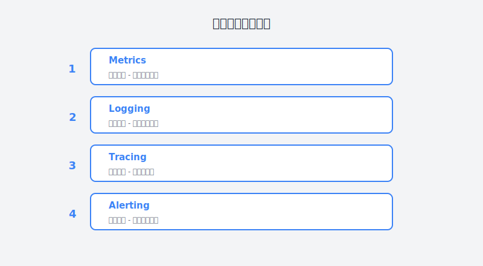

# 第25章：在用户发现之前解决问题

> **运维篇——AI辅助监控与智能运维**

---

## 故事：那个被老板打电话叫醒的凌晨

### 凌晨2点：故障发生了

老周被一阵刺耳的电话铃声惊醒。

"喂..."他迷迷糊糊地接起电话。

"老周！网站打不开了！"老板的声音里带着怒火，"已经有好几个客户打电话投诉了！"

老周一激灵，瞬间清醒。他手忙脚乱地打开电脑，登录监控系统。

"该死，服务确实挂了...而且已经挂了15分钟。"

为什么监控系统没有告警？他赶紧查看告警记录——原来阈值设置得太高，服务已经部分不可用，但还没触发告警。

"又是这种'温水煮青蛙'的故障，"老周一边排查一边自责，"早就应该优化监控策略的。"

等他恢复服务、写好故障报告，已经是凌晨4点了。躺在床上，他怎么也睡不着。

"被动救火的日子什么时候是个头？"

---





### 周一：从被动到主动

周一早上，老周顶着黑眼圈到公司。同事们都听说了昨晚的事，纷纷安慰他。

"这种故障谁都防不住，"小王说，"用户比监控更早发现问题，这是业界常态。"

"不对，"老周摇头，"有些公司的SRE做得就很好，故障发现时间以秒计。我们的监控太原始了。"

"那你打算怎么办？"

"我要重构整个监控体系，"老周下定决心，"而且这次我要用AI帮忙。"

他打开Claude，开始描述他的需求：

```
我需要设计一个完整的监控与告警系统。

当前痛点：
- 告警太多（平均每天50+条），大部分都是噪声
- 真正的问题发现不及时
- 故障根因定位慢，平均需要30分钟以上
- 没有预测能力，总是事后救火

技术环境：
- 30台Linux服务器
- 10个微服务应用（K8s部署）
- MySQL、Redis、Elasticsearch、Kafka
- Nginx网关

需要监控的维度：
1. 基础设施：CPU、内存、磁盘、网络
2. 应用层：QPS、延迟、错误率
3. 业务层：订单量、支付成功率
4. 依赖组件：数据库、缓存、消息队列

目标：
- 真正重要的告警不超过每天5条
- 故障发现时间<1分钟
- 根因定位时间<5分钟
- 能预测70%以上的潜在故障

请给出完整的设计方案，包括：
1. 监控架构设计
2. 关键指标和告警规则
3. 降噪和关联分析方案
4. 根因定位方案
5. 预测性维护方案
```

AI给出的方案非常系统，从采集到分析到告警，形成了一个完整的闭环。

---

### 周二：智能告警降噪

老周先从最头疼的问题入手——告警噪音。

"每天50多条告警，真正需要处理的也就2-3条，"他抱怨道，"其他都是抖动或者无关紧要的。"

他用AI生成了一个智能告警处理脚本，实现了：
- 抖动检测（5分钟内反复告警视为抖动）
- 维护窗口抑制
- 级联故障关联（数据库挂了导致应用报错，只报数据库）
- 已知问题抑制（历史上快速恢复的告警降级）

部署了这个处理器后，告警数量从每天50+条降到了5条左右，而且都是真正需要关注的。

---

### 周三：智能根因分析

告警降噪解决了，老周开始着手解决另一个痛点——根因定位。

"每次出故障，都要登录各种系统查日志、看指标，"老周说，"平均要30分钟才能定位问题。"

他用AI写了一个根因分析系统，能够：
1. 自动收集相关指标、日志、链路数据
2. 匹配已知故障模式
3. 使用AI进行推理分析
4. 给出根因定位和建议的修复步骤

使用后，根因定位时间从30分钟降到了5分钟以内。

---

### 周四到周五：预测性维护

最后，老周开始尝试更高级的功能——预测性维护。

"如果能在故障发生前就发现问题，那就真的从被动变主动了，"他想。

他用AI生成了一个预测模型，能够：
- 预测磁盘何时会满（基于使用趋势）
- 预测内存泄漏（基于内存增长模式）
- 预测容量瓶颈（基于增长趋势）

---

## 理论知识：智能监控与AIOps

### 监控的演进

| 阶段 | 特点 | 响应方式 |
|:---|:---|:---|
| **监控1.0** | 基础设施监控（CPU/内存/磁盘） | 被动响应 |
| **监控2.0** | 应用性能监控（APM） | 被动响应 |
| **监控3.0** | 业务监控 + 智能告警 | 主动发现 |
| **监控4.0** | AIOps - 预测与自愈 | 预测预防 |

### 智能监控的核心能力

1. **异常检测**：基于统计学或机器学习识别异常
2. **关联分析**：将相关告警聚类，找到根因
3. **模式识别**：识别已知的故障模式
4. **预测分析**：基于趋势预测未来故障
5. **根因定位**：自动分析故障根因

---

## 实践部分：智能监控实战

### 实战1：异常检测

```python
# 基于统计学的异常检测
def detect_anomaly(values, threshold=3):
    """使用3-sigma原则检测异常"""
    mean = np.mean(values)
    std = np.std(values)
    
    anomalies = []
    for i, v in enumerate(values):
        if abs(v - mean) > threshold * std:
            anomalies.append((i, v))
    
    return anomalies
```

### 实战2：告警关联

```python
# 基于时间和拓扑的告警关联
def correlate_alerts(alerts, time_window=300):
    """将相关告警聚类"""
    groups = []
    
    for alert in alerts:
        found = False
        for group in groups:
            if is_related(alert, group[0], time_window):
                group.append(alert)
                found = True
                break
        
        if not found:
            groups.append([alert])
    
    return groups
```

### 实战3：根因定位

```python
# 基于依赖拓扑的根因分析
def find_root_cause(alerts, dependency_graph):
    """在告警组中找根因"""
    # 按依赖层级排序（基础设施优先）
    sorted_alerts = sorted(alerts, 
                          key=lambda a: get_layer(a.source))
    
    return sorted_alerts[0]
```

---

## 本章交付物

完成本章后，你应该拥有：

1. **智能告警系统**
   - 告警降噪规则
   - 关联分析逻辑
   - 根因定位能力

2. **监控大盘**
   - 基础设施监控
   - 应用性能监控
   - 业务指标监控

3. **预测性维护**
   - 容量预测
   - 故障预测
   - 优化建议

---

## 行动清单

- [ ] 梳理当前所有监控告警，评估有效性
- [ ] 建立告警分级体系（P0/P1/P2/P3）
- [ ] 实施告警降噪（减少80%无效告警）
- [ ] 建立根因分析流程
- [ ] 配置预测性监控（磁盘/内存/容量）
- [ ] 建立故障响应手册
- [ ] 进行一次故障演练

---

## 本章彩蛋

### 彩蛋1：PromQL常用查询

```
# CPU使用率
100 - (avg(irate(node_cpu_seconds_total{mode="idle"}[5m])) by (instance) * 100)

# 内存使用率
(node_memory_MemTotal_bytes - node_memory_MemAvailable_bytes) / node_memory_MemTotal_bytes * 100

# 磁盘即将满的预测（7天内）
predict_linear(node_filesystem_avail_bytes[1h], 7*24*3600) < 0

# 应用错误率
sum(rate(http_requests_total{status=~"5.."}[5m])) / sum(rate(http_requests_total[5m]))
```

### 彩蛋2：智能告警Prompt模板

```
请帮我设计一个告警降噪规则，场景如下：
- [描述你的场景]
- [当前痛点]

要求：
1. 识别告警抖动
2. 关联相关告警
3. 抑制噪声告警
4. 找到根因
```

### 彩蛋3：监控巡检清单

```bash
#!/bin/bash
# 每日监控巡检脚本

echo "=== 监控巡检报告 ==="
echo "时间: $(date)"

# 检查磁盘
echo -e "\n📁 磁盘空间检查:"
df -h | grep -E '^/dev/' | awk '{print $5 " " $6}' | while read usage mount; do
  usage_num=${usage%%%}
  if [ $usage_num -gt 90 ]; then
    echo "❌ $mount: $usage (紧急)"
  elif [ $usage_num -gt 80 ]; then
    echo "⚠️  $mount: $usage (警告)"
  else
    echo "✅ $mount: $usage"
  fi
done

# 检查内存
echo -e "\n🧠 内存检查:"
mem_usage=$(free | grep Mem | awk '{printf "%.1f", $3/$2 * 100.0}')
echo "内存使用率: ${mem_usage}%"

# 检查僵尸进程
echo -e "\n👻 僵尸进程检查:"
zombie_count=$(ps aux | grep -c '[Zz]ombie')
if [ $zombie_count -gt 0 ]; then
  echo "⚠️  发现 $zombie_count 个僵尸进程"
else
  echo "✅ 无僵尸进程"
fi

echo -e "\n=== 巡检完成 ==="
```

---

> **老周的智能运维总结**：> 
> "以前我是'消防员'，哪里着火去哪里。> 
> 现在我是'预警员'，在火灾发生前就发现问题。> 
> AI没有替代我的判断，但它让我看得更远、更准。> 
> 最重要的是，我已经很久没有在凌晨被电话叫醒了。"

---

**下一章预告**：第26章《从一堆数据中发现金矿》——数据工程师小刘将登场，学习如何用AI辅助数据分析，从海量数据中挖掘业务价值。
