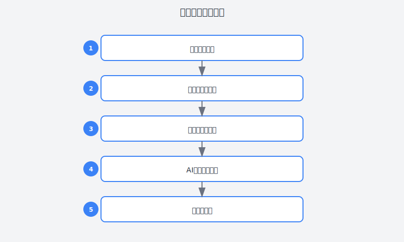

# 第26章：从一堆数据中发现金矿

> **AI辅助数据分析——让数据工程师从"表哥"变成"洞察者"**

---

## 故事：小刘的Excel地狱

### 周三下午3点：第47张报表

小刘盯着屏幕上密密麻麻的Excel表格，感觉眼睛都要瞎了。

"又来了，"他嘟囔着，"业务部要的上季度用户行为分析，周五就要。"

作为公司的数据工程师，小刘每天的工作就是和各种数据打交道。但说实话，他觉得自己更像是一个"数据搬运工"——

早上9点，产品经理发来消息："刘哥，帮我导一下昨天的新用户数据。"

上午10点，运营同事在群里@他："这个月的留存率能不能算一下？"

下午2点，老板在会议上说："给我做个 dashboard，要实时看核心指标。"

下午3点，他正盯着那张Excel表格发呆。

"我当初学数据分析是为了啥？"小刘开始怀疑人生。

他想起刚毕业那会，满脑子都是"数据驱动决策""洞察商业价值"这些高大上的词。他以为数据工程师的工作是这样的：

- 挖掘数据背后的商业洞察
- 构建预测模型预判趋势  
- 设计优雅的数据可视化
- 用数据讲述动人的故事

但现实是这样的：

- 80%的时间在写SQL，从几十个表里找数据
- 15%的时间在做Excel透视表和图表
- 5%的时间在开会解释"为什么这个数据对不上"

"最崩溃的是，"小刘跟同事吐槽，"我花了三天做的分析报告，老板看一眼就说'这个我知道'，然后问我'能不能下周每天给我发一版'。"

他尝试过学Python，pandas的API记住了又忘；试过Tableau， license太贵公司不给买；试过学机器学习，sklearn的参数比天书还难懂。

"难道我这辈子就是个'表哥'了吗？"小刘看着桌面上那47个Excel文件，陷入沉思。

---





### 周四上午：一个偶然的转机

转机发生在一个普通的周四上午。

小刘在技术群里看到有人在讨论"用AI做数据分析"，他第一反应是："AI能分析什么数据？不就是瞎编吗？"

但出于好奇，他还是点进去看了。一个网友分享了自己的经历：

> "以前我做一个用户画像分析要一周，现在用ChatGPT辅助，两天搞定。不是AI帮我写完了所有代码，而是它帮我做了80%的体力活——写SQL、洗数据、画图表，我只需要专注于解读结果。"

小刘心动了。反正死马当活马医，试试呗。

他打开ChatGPT，决定拿手头这个"用户行为分析"任务试水。

---

### 周四下午：第一次AI辅助分析

小刘深吸一口气，开始描述他的需求：

```
我需要分析上季度用户行为数据，找出提升留存的机会点。

数据情况：
- 用户表：100万+用户，包含注册时间、渠道、设备、地理位置
- 行为表：每天500万+条事件，包含页面浏览、点击、购买等
- 订单表：每天10万+订单，包含金额、商品、支付状态

业务背景：
我们是一个电商平台，最近30日留存率从25%掉到了18%，老板很着急。

请帮我设计一个完整的分析方案，包括：
1. 需要计算哪些核心指标
2. 需要写哪些SQL查询
3. 用什么方法找出留存下降的原因
4. 如何可视化结果
5. 分析报告的框架
```

小刘点击发送，心里还有点忐忑——AI真的懂数据分析吗？

几分钟后，ChatGPT的回复让他瞪大了眼睛。

**第一步：核心指标体系**

AI先帮他梳理了一套完整的指标体系：

```markdown
【用户规模指标】
- DAU/MAU（日活/月活）
- 新增用户数
- 累计注册用户数

【留存指标】
- 次日留存率
- 7日留存率
- 30日留存率
- 留存曲线（Cohort Analysis）

【行为指标】
- 人均启动次数
- 人均使用时长
- 核心功能使用率
- 页面跳出率

【商业指标】
- 转化率（浏览→下单→支付）
- ARPU（用户平均收入）
- GMV（成交总额）
- 客单价
```

"这比我平时考虑得全面多了，"小刘心想，"我一般就看看留存率和GMV。"

**第二步：SQL查询方案**

然后是详细的SQL查询：

```sql
-- 1. 留存率计算（Cohort分析）
WITH user_cohorts AS (
    SELECT 
        user_id,
        DATE(register_date) as cohort_date,
        device_type,
        channel
    FROM users
    WHERE register_date >= DATE_SUB('2024-01-01', INTERVAL 90 DAY)
),
user_activity AS (
    SELECT 
        user_id,
        DATE(event_time) as active_date
    FROM events
    WHERE event_time >= DATE_SUB('2024-01-01', INTERVAL 90 DAY)
    GROUP BY user_id, DATE(event_time)
),
retention AS (
    SELECT 
        uc.cohort_date,
        uc.device_type,
        uc.channel,
        COUNT(DISTINCT uc.user_id) as total_users,
        COUNT(DISTINCT CASE WHEN ua.active_date = uc.cohort_date THEN uc.user_id END) as d0,
        COUNT(DISTINCT CASE WHEN ua.active_date = DATE_ADD(uc.cohort_date, INTERVAL 1 DAY) THEN uc.user_id END) as d1,
        COUNT(DISTINCT CASE WHEN ua.active_date = DATE_ADD(uc.cohort_date, INTERVAL 7 DAY) THEN uc.user_id END) as d7,
        COUNT(DISTINCT CASE WHEN ua.active_date = DATE_ADD(uc.cohort_date, INTERVAL 30 DAY) THEN uc.user_id END) as d30
    FROM user_cohorts uc
    LEFT JOIN user_activity ua ON uc.user_id = ua.user_id
    GROUP BY uc.cohort_date, uc.device_type, uc.channel
)
SELECT 
    cohort_date,
    device_type,
    channel,
    total_users,
    ROUND(d1 * 100.0 / total_users, 2) as retention_d1,
    ROUND(d7 * 100.0 / total_users, 2) as retention_d7,
    ROUND(d30 * 100.0 / total_users, 2) as retention_d30
FROM retention
ORDER BY cohort_date DESC, retention_d30 ASC;

-- 2. 用户行为路径分析（找出流失前的最后行为）
WITH user_last_session AS (
    SELECT 
        user_id,
        MAX(event_time) as last_active_time,
        COUNT(DISTINCT session_id) as total_sessions,
        COUNT(CASE WHEN event_type = 'purchase' THEN 1 END) as purchase_count,
        COUNT(CASE WHEN page_url LIKE '%checkout%' THEN 1 END) as checkout_visits,
        SUM(CASE WHEN event_type = 'page_view' THEN 1 ELSE 0 END) as page_views
    FROM events
    WHERE event_time >= DATE_SUB(NOW(), INTERVAL 60 DAY)
    GROUP BY user_id
),
churned_users AS (
    SELECT user_id
    FROM users
    WHERE last_login_date <= DATE_SUB(NOW(), INTERVAL 7 DAY)
      AND register_date >= DATE_SUB(NOW(), INTERVAL 90 DAY)
)
SELECT 
    '流失用户' as user_group,
    AVG(total_sessions) as avg_sessions,
    AVG(purchase_count) as avg_purchases,
    AVG(checkout_visits) as avg_checkout_visits,
    AVG(page_views) as avg_page_views
FROM user_last_session uls
JOIN churned_users cu ON uls.user_id = cu.user_id

UNION ALL

SELECT 
    '留存用户' as user_group,
    AVG(total_sessions) as avg_sessions,
    AVG(purchase_count) as avg_purchases,
    AVG(checkout_visits) as avg_checkout_visits,
    AVG(page_views) as avg_page_views
FROM user_last_session uls
WHERE uls.user_id NOT IN (SELECT user_id FROM churned_users);
```

小刘看着这些SQL，惊了——这些查询比他平时写的复杂多了，但逻辑非常清晰。特别是那个Cohort分析的SQL，他以前一直想写但不会写。

**第三步：Python分析脚本**

AI还给了Python代码，用于更复杂的分析：

```python
import pandas as pd
import numpy as np
import matplotlib.pyplot as plt
import seaborn as sns
from datetime import datetime, timedelta
import pymysql
from sklearn.ensemble import RandomForestClassifier
from sklearn.model_selection import train_test_split
import warnings
warnings.filterwarnings('ignore')

# 设置中文字体
plt.rcParams['font.sans-serif'] = ['SimHei', 'Arial Unicode MS']
plt.rcParams['axes.unicode_minus'] = False

class UserRetentionAnalyzer:
    """用户留存分析器"""
    
    def __init__(self, db_config):
        self.db_config = db_config
        self.conn = None
        
    def connect(self):
        """连接数据库"""
        self.conn = pymysql.connect(**self.db_config)
        print("✅ 数据库连接成功")
        
    def load_data(self):
        """加载数据"""
        # 加载留存数据
        retention_sql = """
        SELECT 
            cohort_date,
            device_type,
            channel,
            total_users,
            retention_d1,
            retention_d7,
            retention_d30
        FROM retention_summary
        WHERE cohort_date >= DATE_SUB(NOW(), INTERVAL 90 DAY)
        """
        self.retention_df = pd.read_sql(retention_sql, self.conn)
        
        # 加载用户特征数据
        features_sql = """
        SELECT 
            u.user_id,
            u.device_type,
            u.channel,
            DATEDIFF(NOW(), u.register_date) as user_age_days,
            COUNT(DISTINCT e.session_id) as total_sessions,
            COUNT(CASE WHEN e.event_type = 'purchase' THEN 1 END) as purchase_count,
            COALESCE(SUM(o.order_amount), 0) as total_spend,
            AVG(f.rating) as avg_rating,
            CASE WHEN u.last_login_date >= DATE_SUB(NOW(), INTERVAL 7 DAY) THEN 0 ELSE 1 END as is_churned
        FROM users u
        LEFT JOIN events e ON u.user_id = e.user_id 
            AND e.event_time >= DATE_SUB(NOW(), INTERVAL 30 DAY)
        LEFT JOIN orders o ON u.user_id = o.user_id 
            AND o.order_time >= DATE_SUB(NOW(), INTERVAL 30 DAY)
        LEFT JOIN feedback f ON u.user_id = f.user_id
        WHERE u.register_date >= DATE_SUB(NOW(), INTERVAL 90 DAY)
        GROUP BY u.user_id, u.device_type, u.channel, u.register_date, u.last_login_date
        """
        self.features_df = pd.read_sql(features_sql, self.conn)
        print(f"📊 加载了 {len(self.retention_df)} 条留存数据, {len(self.features_df)} 个用户特征")
        
    def analyze_retention_trend(self):
        """分析留存趋势"""
        # 按时间聚合
        daily_retention = self.retention_df.groupby('cohort_date').agg({
            'total_users': 'sum',
            'retention_d1': 'mean',
            'retention_d7': 'mean',
            'retention_d30': 'mean'
        }).reset_index()
        
        # 绘制趋势图
        fig, axes = plt.subplots(2, 2, figsize=(16, 12))
        
        # 1. 留存率趋势
        axes[0, 0].plot(daily_retention['cohort_date'], daily_retention['retention_d1'], 
                        marker='o', label='次日留存', linewidth=2)
        axes[0, 0].plot(daily_retention['cohort_date'], daily_retention['retention_d7'], 
                        marker='s', label='7日留存', linewidth=2)
        axes[0, 0].plot(daily_retention['cohort_date'], daily_retention['retention_d30'], 
                        marker='^', label='30日留存', linewidth=2)
        axes[0, 0].set_title('留存率趋势变化', fontsize=14, fontweight='bold')
        axes[0, 0].set_xlabel('注册日期')
        axes[0, 0].set_ylabel('留存率 (%)')
        axes[0, 0].legend()
        axes[0, 0].grid(True, alpha=0.3)
        
        # 2. 分渠道留存对比
        channel_retention = self.retention_df.groupby('channel')['retention_d30'].mean().sort_values(ascending=False)
        channel_retention.plot(kind='bar', ax=axes[0, 1], color='steelblue')
        axes[0, 1].set_title('各渠道30日留存率对比', fontsize=14, fontweight='bold')
        axes[0, 1].set_xlabel('渠道')
        axes[0, 1].set_ylabel('30日留存率 (%)')
        axes[0, 1].tick_params(axis='x', rotation=45)
        
        # 3. 分设备留存对比
        device_retention = self.retention_df.groupby('device_type')['retention_d30'].mean().sort_values(ascending=False)
        device_retention.plot(kind='bar', ax=axes[1, 0], color='coral')
        axes[1, 0].set_title('各设备类型30日留存率对比', fontsize=14, fontweight='bold')
        axes[1, 0].set_xlabel('设备类型')
        axes[1, 0].set_ylabel('30日留存率 (%)')
        
        # 4.  cohort热力图
        cohort_pivot = self.retention_df.pivot_table(
            values='retention_d30', 
            index='channel', 
            columns='device_type', 
            aggfunc='mean'
        )
        sns.heatmap(cohort_pivot, annot=True, fmt='.1f', cmap='YlOrRd', ax=axes[1, 1])
        axes[1, 1].set_title('渠道×设备留存率热力图', fontsize=14, fontweight='bold')
        
        plt.tight_layout()
        plt.savefig('retention_analysis.png', dpi=150, bbox_inches='tight')
        print("📈 留存分析图表已保存")
        return fig
    
    def identify_churn_factors(self):
        """识别流失因素（使用机器学习）"""
        # 准备特征
        feature_cols = ['user_age_days', 'total_sessions', 'purchase_count', 'total_spend']
        X = self.features_df[feature_cols].fillna(0)
        y = self.features_df['is_churned']
        
        # 训练随机森林模型
        X_train, X_test, y_train, y_test = train_test_split(X, y, test_size=0.2, random_state=42)
        model = RandomForestClassifier(n_estimators=100, random_state=42, max_depth=10)
        model.fit(X_train, y_train)
        
        # 特征重要性
        importance_df = pd.DataFrame({
            'feature': feature_cols,
            'importance': model.feature_importances_
        }).sort_values('importance', ascending=False)
        
        print("\n🔍 流失影响因素排序：")
        for idx, row in importance_df.iterrows():
            print(f"  {row['feature']}: {row['importance']:.3f}")
        
        # 可视化
        plt.figure(figsize=(10, 6))
        sns.barplot(data=importance_df, x='importance', y='feature', palette='viridis')
        plt.title('用户流失影响因素重要性', fontsize=14, fontweight='bold')
        plt.xlabel('重要性')
        plt.tight_layout()
        plt.savefig('churn_factors.png', dpi=150)
        
        return importance_df
    
    def generate_insights(self):
        """生成业务洞察"""
        insights = []
        
        # 1. 留存率变化
        recent_retention = self.retention_df[self.retention_df['cohort_date'] >= 
                                              (datetime.now() - timedelta(days=30))]['retention_d30'].mean()
        older_retention = self.retention_df[(self.retention_df['cohort_date'] < 
                                              (datetime.now() - timedelta(days=30))) & 
                                             (self.retention_df['cohort_date'] >= 
                                              (datetime.now() - timedelta(days=60)))]['retention_d30'].mean()
        
        retention_change = recent_retention - older_retention
        insights.append(f"📊 近30日平均30日留存率为 {recent_retention:.1f}%，相比前30日 {'上升' if retention_change > 0 else '下降'}了 {abs(retention_change):.1f}个百分点")
        
        # 2. 最佳渠道
        best_channel = self.retention_df.groupby('channel')['retention_d30'].mean().idxmax()
        best_channel_rate = self.retention_df.groupby('channel')['retention_d30'].mean().max()
        insights.append(f"🏆 留存表现最佳的渠道是 {best_channel}，30日留存率达到 {best_channel_rate:.1f}%")
        
        # 3. 问题渠道
        worst_channel = self.retention_df.groupby('channel')['retention_d30'].mean().idxmin()
        worst_channel_rate = self.retention_df.groupby('channel')['retention_d30'].mean().min()
        if worst_channel_rate < best_channel_rate * 0.7:
            insights.append(f"⚠️ {worst_channel}渠道的留存率({worst_channel_rate:.1f}%)明显低于平均水平，建议重点优化")
        
        # 4. 设备差异
        mobile_retention = self.retention_df[self.retention_df['device_type'] == 'mobile']['retention_d30'].mean()
        desktop_retention = self.retention_df[self.retention_df['device_type'] == 'desktop']['retention_d30'].mean()
        if mobile_retention < desktop_retention * 0.8:
            insights.append(f"📱 移动端留存率({mobile_retention:.1f}%)显著低于桌面端({desktop_retention:.1f}%)，建议检查移动端体验")
        
        return insights

# 使用示例
if __name__ == '__main__':
    db_config = {
        'host': 'localhost',
        'user': 'analyst',
        'password': 'your_password',
        'database': 'analytics',
        'charset': 'utf8mb4'
    }
    
    analyzer = UserRetentionAnalyzer(db_config)
    analyzer.connect()
    analyzer.load_data()
    
    # 分析留存趋势
    analyzer.analyze_retention_trend()
    
    # 识别流失因素
    analyzer.identify_churn_factors()
    
    # 生成洞察
    print("\n💡 核心洞察：")
    for insight in analyzer.generate_insights():
        print(f"  • {insight}")
```

小刘看着这套完整的方案，心里只有一个字：服。

"这比我平时做的分析专业太多了，"他想，"不仅考虑了我想不到的维度，还给出了可执行的优化建议。"

---

### 周五：惊艳交付

周五上午，小刘把报告交给了产品经理小王。

小王翻开报告，越看越惊讶："这...这是你做的？"

"嗯，用了一些新工具辅助，"小刘谦虚地说，"效率提高了不少。"

"这也太专业了，"小王指着报告里的Cohort分析图表，"这个留存曲线我们之前一直想算但不知道怎么算。还有这个机器学习分析，居然能识别出影响留存的关键因素！"

更让小王惊讶的是最后一节的优化建议。

"这些建议都很具体啊，"小王说，"比如这个'针对注册后24小时未活跃用户发送唤醒推送'，我们可以马上做起来。"

"对，我还写了一个SQL查询，可以直接导出目标用户列表，"小刘说，"运营团队可以马上开始测试。"

老板在下午的会议上看到这份报告，也很满意："小刘，这次分析做得很深入。以前你的报告我也看过，数据都有，但总是缺少洞察。这次不一样了，不仅有数据，还有原因分析和解决方案。"

小刘心里暗爽。他知道，这份报告的成功80%要归功于AI的辅助。但更重要的是，他明白了数据分析的真正价值不在于"做图表"，而在于"发现洞察"。

---

### 第二周：建立AI辅助分析工作流

尝到甜头后，小刘开始系统性地把AI融入到日常工作中。

他总结了**AI辅助数据分析的6个场景**：

#### 场景1：SQL生成与优化

以前写一个复杂的关联查询要查半天文档，现在直接描述需求：

```
我需要查询近30天每个用户的以下指标：
- 总登录次数
- 平均会话时长
- 购买次数和总金额
- 最后登录时间

数据表：
- users: user_id, username
- sessions: user_id, session_id, start_time, end_time
- orders: user_id, order_id, amount, order_time

请给出优化的SQL查询。
```

AI不仅给出查询，还会解释优化点：
- "使用LEFT JOIN而不是INNER JOIN，避免丢失无购买行为的用户"
- "在WHERE条件中使用索引字段"
- "使用COALESCE处理NULL值"

#### 场景2：数据清洗

数据清洗是最耗时的环节。现在小刘会让AI生成清洗脚本：

```
请帮我写一个Python函数清洗用户行为数据：

输入：DataFrame包含以下列
- user_id: 可能包含空值和重复值
- event_time: 可能包含异常时间（如2025年的数据）
- page_url: 可能包含大小写不一致的URL
- device_type: 可能包含拼写不一致（如'Mobile'和'mobile'）

要求：
1. 删除user_id为空的行
2. 处理异常时间（保留最近2年的数据）
3. URL统一转为小写
4. device_type标准化
5. 返回清洗后的数据和清洗报告
```

AI生成的代码比自己写的还健壮，包含各种边界情况处理。

#### 场景3：探索性分析（EDA）

面对一个新数据集，小刘会先让AI生成EDA方案：

```
我刚拿到一个电商交易数据集，包含订单信息、用户信息、商品信息。

请帮我设计探索性分析方案：
1. 需要查看哪些统计指标？
2. 需要画哪些图表？
3. 可能需要关注哪些异常点？
4. 请给出Python代码
```

AI会生成一套完整的EDA代码，包括：
- 数据概览（shape、dtype、missing value）
- 描述性统计
- 分布可视化（直方图、箱线图）
- 相关性分析
- 异常值检测

#### 场景4：可视化设计

小刘不擅长设计图表，现在他会描述需求让AI推荐：

```
我想展示用户留存率的周变化趋势，要求：
- 要看出趋势变化
- 要能对比不同渠道
- 要专业美观

请推荐合适的图表类型并给出Python代码。
```

AI会推荐"折线图+分面"或"热力图"，并给出matplotlib/seaborn/plotly的代码。

#### 场景5：报告撰写

分析报告的结构和措辞，小刘也会让AI辅助：

```
基于以下分析结果，帮我撰写报告的执行摘要：

[粘贴关键发现]

要求：
1. 不超过200字
2. 突出最重要的3个发现
3. 包含数据支撑
4. 语言简洁有力
```

#### 场景6：异常排查

遇到数据异常时，AI也能帮上忙：

```
我发现昨天的订单数据比前一天下降了30%，如何排查原因？

请给出排查思路：
1. 需要检查哪些维度？
2. 需要写哪些查询？
3. 可能的原因有哪些？
```

---

## 理论知识：AI辅助数据分析方法论

### 数据分析工作流的AI增强

传统的数据分析工作流 vs AI辅助的数据分析工作流：

```
传统流程：                              AI辅助流程：
━━━━━━━━━━━━━━━━━━━━━━━━━━━━━━━━━━━━━━━━━━━━━━━━━━━━━━━━━━━━━━━━
1. 理解业务问题 ─────────────────────── 1. 理解业务问题
        ↓                                    ↓  
2. 设计分析方案（靠自己经验） ───────── 2. AI辅助设计分析方案
        ↓                                    ↓
3. 写SQL/代码取数（查文档、试错） ──── 3. AI生成SQL/代码框架
        ↓                                    ↓
4. 数据清洗（手工处理） ────────────── 4. AI生成清洗脚本
        ↓                                    ↓
5. 分析建模（自己实现） ────────────── 5. AI提供分析方法建议
        ↓                                    ↓
6. 可视化（调样式调半天） ──────────── 6. AI生成可视化代码
        ↓                                    ↓
7. 撰写报告（憋文字） ──────────────── 7. AI辅助撰写框架
        ↓                                    ↓
8. 汇报（被质疑） ──────────────────── 8. AI预演可能的问题
━━━━━━━━━━━━━━━━━━━━━━━━━━━━━━━━━━━━━━━━━━━━━━━━━━━━━━━━━━━━━━━━
时间：3-5天                            时间：1-2天
质量：取决于个人经验                   质量：有AI兜底，下限提高
```

### AI在数据分析中的定位

**AI擅长的事**：
- ✅ 代码生成（SQL、Python、R）
- ✅ 语法检查和优化
- ✅ 提供分析思路和方法
- ✅ 生成标准化的报告模板
- ✅ 解释统计概念和算法原理

**AI不擅长的事**：
- ❌ 理解业务背景（需要人提供）
- ❌ 判断数据质量的业务影响
- ❌ 做最终的商业决策
- ❌ 承担分析错误的责任

**正确的协作模式**：

```
┌─────────────────────────────────────────────────────────────┐
│                     人机协作模式                           │
├─────────────────────────────────────────────────────────────┤
│                                                             │
│   人负责：                    AI负责：                       │
│   ─────────                  ─────────                      │
│   • 定义业务问题             • 生成分析代码                  │
│   • 提供业务背景             • 提供分析方法建议              │
│   • 验证分析结果             • 处理繁琐的数据处理            │
│   • 做最终决策               • 生成报告模板                  │
│   • 承担业务责任                                            │
│                                                             │
│   协作流程：                                                 │
│   人：定义问题 → 人：提供背景 → AI：生成方案 →              │
│   人：审查方案 → AI：执行分析 → 人：验证结果 →              │
│   AI：生成报告 → 人：完善汇报                                │
│                                                             │
└─────────────────────────────────────────────────────────────┘
```

### 常用Prompt模板

**模板1：完整分析项目**

```
请帮我完成一个完整的数据分析项目：

【业务背景】
[描述业务场景和问题]

【数据情况】
[列出数据表和字段]

【分析目标】
[明确要回答的业务问题]

【交付要求】
1. SQL查询（用于取数）
2. Python分析脚本（用于处理和建模）
3. 可视化方案
4. 分析报告框架
```

**模板2：SQL生成**

```
请帮我把以下业务需求转化为SQL：

【需求描述】
[描述需要什么数据]

【表结构】
[表名](字段1, 字段2, ...)

【要求】
- 使用标准SQL
- 添加详细注释
- 考虑性能优化（给出索引建议）
```

**模板3：数据清洗**

```
请帮我写一个Python函数清洗以下数据：

【数据描述】
[描述数据问题和格式]

【清洗要求】
[列出清洗规则]

【输出要求】
- 返回清洗后的DataFrame
- 返回清洗报告（删除了多少行、处理了多少异常值等）
```

**模板4：可视化**

```
请帮我生成以下数据的可视化代码：

【数据描述】
[描述数据结构]

【可视化目标】
[描述想展示什么信息]

【要求】
- 使用[matplotlib/seaborn/plotly]
- 包含标题、标签、图例
- 美观专业
```

**模板5：分析报告**

```
请帮我撰写数据分析报告的[某一部分]：

【分析结果】
[粘贴关键发现]

【报告要求】
- 目标读者：[描述]
- 风格要求：[正式/口语化]
- 字数限制：[字数]
```

---

## 实践部分：数据分析场景实战

### 场景1：用户留存分析（完整流程）

**业务问题**：某App的30日留存率持续下降，需要找出原因并提出优化建议。

**AI辅助分析流程**：

**Step 1：定义分析框架**

```
我需要分析用户留存率下降的原因。

背景：
- 30日留存率从25%下降到18%
- 主要下降发生在最近6周
- 期间产品没有大版本更新

请帮我设计分析框架：
1. 需要分析哪些维度？（时间、渠道、设备、用户属性等）
2. 需要计算哪些指标？
3. 需要用什么分析方法？
4. 分析步骤是什么？
```

**Step 2：生成SQL查询**

```
请基于以下分析框架生成SQL查询：

【分析框架】
1. 计算近12周的 cohort 留存率
2. 分渠道对比留存率变化
3. 分设备类型对比留存率
4. 找出流失用户的共同特征

【表结构】
- users(user_id, register_date, channel, device_type, last_login_date)
- events(user_id, event_time, event_type, session_id)

【要求】
- 使用MySQL语法
- 添加详细注释
- 考虑查询性能
```

**Step 3：生成Python分析代码**

```
请生成Python代码完成以下分析：

【输入数据】
- cohort留存数据（包含cohort_date, retention_d1/d7/d30）
- 用户特征数据（包含channel, device_type, activity_count等）

【分析任务】
1. 绘制留存率趋势图
2. 分渠道留存对比
3. 使用机器学习识别流失因素
4. 生成业务洞察

【输出要求】
- 完整的Python脚本
- 包含可视化
- 包含中文注释
```

**Step 4：生成报告框架**

```
请生成用户留存分析报告的框架：

【分析发现】
[粘贴关键发现]

【报告结构要求】
1. 执行摘要（200字以内）
2. 留存现状（图表+解读）
3. 流失原因分析（多维度）
4. 优化建议（短期+中期+长期）
5. 附录（数据口径、方法论）

【风格】专业但易懂，适合向产品和运营团队汇报
```

### 场景2：销售数据分析

**业务问题**：分析上季度销售数据，找出增长/下降的原因。

**Prompt示例**：

```
请帮我完成上季度销售数据分析：

【数据表】
- orders(order_id, user_id, amount, quantity, order_date, product_id, region, sales_rep)
- products(product_id, category, price, cost)
- users(user_id, register_date, type)

【分析目标】
1. 整体销售趋势（日/周/月）
2. 各品类销售表现
3. 区域对比分析
4. 销售员业绩排名
5. 增长/下降原因分析

【交付物】
1. SQL查询
2. Python分析和可视化脚本
3. 分析报告框架
```

### 场景3：异常检测

**业务问题**：系统检测到某指标异常波动，需要排查原因。

**Prompt示例**：

```
请帮我排查数据异常：

【异常描述】
昨天订单量比前天下降了30%，但流量没有明显下降。

【数据表】
- events(user_id, event_time, event_type, page_url)
- orders(order_id, user_id, amount, order_time, status)
- traffic_stats(date, pv, uv, bounce_rate)

【请提供】
1. 排查思路
2. 需要执行的SQL查询
3. 可能的原因列表
4. 验证方法
```

---

## 本章交付物

完成本章学习后，你应该拥有：

### 交付物1：SQL模板库

收集并整理常用的SQL查询模板：
- 留存分析模板
- 漏斗分析模板
- 用户画像分析模板
- RFM分析模板

### 交付物2：Python分析脚本集

建立自己的分析脚本库：
- 数据清洗脚本
- 探索性分析（EDA）脚本
- 可视化模板脚本
- 常用机器学习模型脚本

### 交付物3：分析报告模板

设计标准化的分析报告模板：
- 执行摘要模板
- 数据现状描述模板
- 洞察发现模板
- 优化建议模板

### 交付物4：Prompt库

整理常用的AI辅助Prompt：
- 分析框架设计Prompt
- SQL生成Prompt
- Python代码生成Prompt
- 报告撰写Prompt

---

## 行动清单

- [ ] 选择一个你当前正在做的分析任务，尝试用AI辅助完成
- [ ] 整理你常用的SQL查询，建立个人SQL模板库
- [ ] 设计一套自己的数据清洗脚本模板
- [ ] 尝试用AI生成一个完整的分析报告
- [ ] 向团队分享AI辅助数据分析的经验
- [ ] 建立个人的Prompt库，方便日常使用

---

## 本章彩蛋

### 彩蛋1：AI辅助数据分析的"黄金Prompt"

这是小刘总结的万能Prompt模板，几乎可以应对任何数据分析场景：

```
请帮我完成以下数据分析任务：

【业务背景】
[一句话描述业务场景]

【数据情况】
- 表1：字段说明
- 表2：字段说明

【分析目标】
1. [目标1]
2. [目标2]

【请提供】
1. 分析思路和方法
2. SQL查询（取数）
3. Python代码（分析+可视化）
4. 关键洞察和建议
```

### 彩蛋2：数据清洗的AI生成脚本

这是一个通用数据清洗脚本，可以用AI根据你的具体需求修改：

```python
import pandas as pd
import numpy as np

def auto_clean_dataframe(df, report=True):
    """
    自动清洗DataFrame
    
    参数：
        df: 输入的DataFrame
        report: 是否返回清洗报告
    
    返回：
        cleaned_df: 清洗后的DataFrame
        report: 清洗报告（如果report=True）
    """
    original_shape = df.shape
    cleaning_log = []
    
    # 1. 删除完全重复的行
    df = df.drop_duplicates()
    cleaning_log.append(f"删除重复行: {original_shape[0] - df.shape[0]} 行")
    
    # 2. 处理缺失值
    for col in df.columns:
        missing_count = df[col].isnull().sum()
        if missing_count > 0:
            if df[col].dtype in ['int64', 'float64']:
                # 数值型：用中位数填充
                fill_value = df[col].median()
                df[col].fillna(fill_value, inplace=True)
                cleaning_log.append(f"列 '{col}': 用中位数 {fill_value:.2f} 填充 {missing_count} 个缺失值")
            else:
                # 类别型：用众数填充
                mode_value = df[col].mode()
                if not mode_value.empty:
                    df[col].fillna(mode_value[0], inplace=True)
                    cleaning_log.append(f"列 '{col}': 用众数 '{mode_value[0]}' 填充 {missing_count} 个缺失值")
    
    # 3. 处理异常值（3-sigma原则）
    for col in df.select_dtypes(include=[np.number]).columns:
        mean = df[col].mean()
        std = df[col].std()
        lower_bound = mean - 3 * std
        upper_bound = mean + 3 * std
        
        outliers = df[(df[col] < lower_bound) | (df[col] > upper_bound)][col].count()
        if outliers > 0:
            df[col] = df[col].clip(lower_bound, upper_bound)
            cleaning_log.append(f"列 '{col}': 裁剪 {outliers} 个异常值到 [{lower_bound:.2f}, {upper_bound:.2f}]")
    
    # 4. 标准化列名
    original_columns = df.columns.tolist()
    df.columns = df.columns.str.lower().str.replace(' ', '_').str.replace('-', '_')
    if list(df.columns) != original_columns:
        cleaning_log.append(f"标准化列名: {original_columns} → {list(df.columns)}")
    
    if report:
        cleaning_report = {
            'original_shape': original_shape,
            'final_shape': df.shape,
            'rows_removed': original_shape[0] - df.shape[0],
            'cleaning_log': cleaning_log
        }
        return df, cleaning_report
    
    return df

# 使用示例
# cleaned_df, report = auto_clean_dataframe(df)
# print(f"清洗前: {report['original_shape']}, 清洗后: {report['final_shape']}")
# for log in report['cleaning_log']:
#     print(f"  - {log}")
```

### 彩蛋3：快速生成仪表板的Prompt

用这段Prompt可以快速生成一个Streamlit仪表板：

```
请帮我创建一个Streamlit数据仪表板，展示销售数据。

【数据】
- sales.csv 包含：date, region, product, amount, quantity

【仪表板要求】
1. 顶部显示关键指标（总销售额、总订单数、平均客单价）
2. 销售趋势折线图（按日期）
3. 区域销售对比柱状图
4. 产品销售占比饼图
5. 支持按日期范围和区域筛选

【输出】
完整的app.py代码
```

---

> **小刘的数据分析转型总结**：
> 
> "以前我觉得自己是个'数据民工'，每天的工作就是写SQL、做Excel表。
> 
> 现在我发现，AI把80%的体力活都接过去了，我真正的价值在于：
> - 理解业务问题
> - 设计分析思路  
> - 解读数据洞察
> - 提出可行建议
> 
> 数据分析不是'做图表'，而是'讲故事'——用数据讲一个让决策者信服的故事。
> 
> AI负责'怎么算'，我负责'算什么'和'算什么意思'。
> 
> 从'表哥'到'洞察者'，我只做了一件事：学会让AI帮我卷。"

---

**下一章预告**：第27章《用AI读懂用户的心声》——产品经理小李将学习如何用AI辅助用户研究和需求分析，从"拍脑袋"到"数据驱动"。