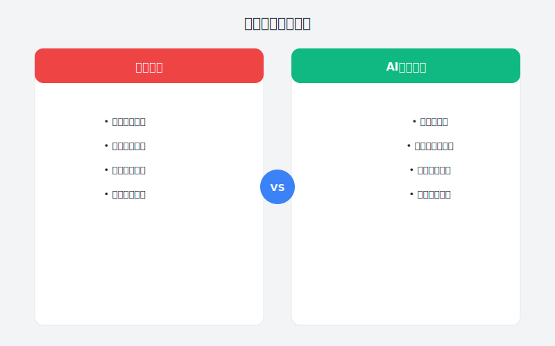

# 第28章：让技术选型会不再争论不休

> **AI辅助产品经理工作流——技术方案篇**

---

## 故事：那场无休止的技术选型会

### 周二：会议室里的"战争"

"我坚决反对用微服务！"

后端负责人老王的声音震得会议室玻璃都在颤。他面前的笔记本屏幕上，是一张被红色标记得密密麻麻的架构图。

"我们现在就5个开发，搞什么微服务？"老王指着屏幕，"服务拆分多了，调用链路复杂，出了问题定位都要半天。"

"可是单体架构的扩展性太差了，"技术负责人刘哥反驳，"上次大促，就是因为你这个'单体'搞不定高并发，我们临时加机器都来不及。"

"那是缓存策略的问题，不是架构的问题！"

"缓存能解决的问题，为什么还要用复杂的技术？"

"你才是把简单问题复杂化！"

阿强坐在会议桌的中间，感觉自己是夹在两座火山之间的一株小草。

这已经是第三次技术选型会了。前两次分别讨论了：
- 前端框架选Vue还是React（吵了2小时，没结论）
- 数据库用MySQL还是PostgreSQL（吵了1.5小时，没结论）

今天讨论架构选型，看样子又要无功而返。

"停一下，"阿强试图控场，"我们能不能理性地分析一下各自的优缺点？"

"我已经分析过了！"老王和刘哥异口同声，然后又同时瞪了对方一眼。

阿强叹了口气。他知道，继续下去不会有结果。这种技术选型会，最后往往变成"比谁嗓门大"或"比谁资历老"。

会议最终没有结论。大家约定"下周再讨论"，但每个人都知道，下周只会是今天的重复。

---





### 周三：转机出现

周三下午，阿强在公司内部的AI实践群里看到林姐分享的一篇文章：《用AI辅助技术选型：从情绪化争论到数据化决策》。

他眼睛一亮，赶紧点进去看。

林姐在文章里写道：

"技术选型会之所以变成'吵架会'，根本原因是缺乏**客观的评估框架**。每个人都在说'我觉得'，但'我觉得'是主观的，无法说服对方。"

"AI可以帮我们建立一个**多维度的评估体系**，把技术选型从'艺术'变成'工程'。"

她举了一个真实的例子：

"我们团队在选型消息推送方案时，面临三个选择：自建MQTT、使用云服务PUSH、或者使用开源的RocketMQ。

按照以前的做法，我们会开会很长时间，每个人发表意见，最后可能还是拍脑袋决定。

这次我换了个方法——让AI帮我做一个全面的评估矩阵。

我给AI的输入：
- 三个候选方案
- 我们的业务特点（日活100万，消息实时性要求高，预算有限）
- 评估维度（性能、成本、维护复杂度、生态成熟度、学习成本）
- 每个维度的权重

AI输出的评估矩阵让我惊讶：

| 维度 | 权重 | 自建MQTT | 云服务PUSH | RocketMQ |
|:---|:---:|:---:|:---:|:---:|
| 实时性 | 高 | 9/10 | 8/10 | 7/10 |
| 成本 | 高 | 4/10 | 7/10 | 8/10 |
| 维护复杂度 | 中 | 3/10 | 9/10 | 6/10 |
| 生态成熟度 | 中 | 6/10 | 9/10 | 8/10 |
| 学习成本 | 低 | 5/10 | 9/10 | 7/10 |
| **加权总分** | - | **6.2** | **8.2** | **7.3** |

基于这个矩阵，我们很快就达成了一致：选择云服务PUSH。

更重要的是，这个决策过程是**透明的、可追溯的**。如果有人质疑，我们可以清楚地说明：'根据评估，云服务PUSH在成本和维护复杂度上得分最高，而这正是我们当前最关注的两个维度。'"

阿强看完，立刻给林姐发了消息："这个方法太棒了！能详细教教我吗？"

---

### 周四：AI辅助技术选型的实战

周四，阿强决定用AI辅助的方法重新组织技术选型会。

他先私下找了老王和刘哥，分别了解了他们各自倾向的方案和顾虑。

- 老王倾向于单体架构，担心团队hold不住微服务的复杂度
- 刘哥倾向于微服务，担心单体架构无法满足未来的扩展需求

然后，他打开AI助手，开始构建评估框架。

**第一步：明确评估维度和权重**

```
我们需要为一个B2C电商平台选择后端架构，候选方案：
1. 单体架构（Spring Boot）
2. 微服务架构（Spring Cloud）
3. 模块化单体（Modular Monolith）

业务背景：
- 当前团队规模：5名后端开发
- 当前业务量：日活10万，日订单1万
- 预期增长：3年内日活100万，日订单10万
- 团队特点：年轻团队，技术能力中等，没有微服务经验

请帮我设计评估维度和权重。
```

AI给出了建议的评估维度：

**核心维度（权重共70%）**：
1. **开发效率**（20%）：当前团队能多快交付功能
2. **运维复杂度**（20%）：需要多少运维投入
3. **扩展能力**（15%）：能否支撑业务增长
4. **团队适配性**（15%）：是否符合团队当前能力

**次要维度（权重共30%）**：
5. 性能表现（10%）
6. 生态成熟度（10%）
7. 长期演进（10%）

阿强觉得这个维度设计很合理。他让老王和刘哥各自调整一下权重，看是否有分歧。

有趣的是，两个人对权重的看法基本一致：在当前阶段，开发效率和运维复杂度最重要。

**第二步：方案评分**

```
基于以上评估维度，请对三个候选方案进行评分（1-10分），并说明理由。

评分要求：
1. 基于我们团队的实际情况（5人团队、无微服务经验）
2. 考虑3年内的业务发展（从10万日活到100万日活）
3. 每个分数都要有具体的依据

输出格式：
维度名：
- 单体：X分（理由）
- 微服务：X分（理由）
- 模块化单体：X分（理由）
```

AI给出的详细评分让阿强眼前一亮。

**开发效率**：
- 单体：8分（代码集中，调试方便，部署简单）
- 微服务：4分（需要处理服务间调用、分布式事务，学习成本高）
- 模块化单体：7分（代码模块化，但部署仍是单体）

**运维复杂度**：
- 单体：9分（单应用部署，监控简单）
- 微服务：3分（需要服务发现、配置中心、链路追踪等基础设施）
- 模块化单体：8分（部署与单体相同，但代码组织更清晰）

**扩展能力**：
- 单体：5分（只能整体扩展，无法针对热点服务优化）
- 微服务：9分（可独立扩展热点服务，资源利用率高）
- 模块化单体：6分（后期可平滑迁移到微服务）

**团队适配性**：
- 单体：9分（技术栈简单，团队熟悉）
- 微服务：3分（需要学习大量新概念，出错概率高）
- 模块化单体：7分（需要一定的模块化设计能力）

...（其他维度略）

**第三步：加权计算与结果分析**

```
基于以上评分，请计算加权总分，并给出最终建议。

权重：
- 开发效率：20%
- 运维复杂度：20%
- 扩展能力：15%
- 团队适配性：15%
- 性能表现：10%
- 生态成熟度：10%
- 长期演进：10%

输出：
1. 三个方案的最终得分
2. 各方案的优劣势总结
3. 针对我们情况的具体建议
4. 如果选择某方案，需要注意的事项
```

AI的计算结果：

| 方案 | 加权总分 |
|:---|:---:|
| 单体架构 | **7.4** |
| 微服务架构 | **5.1** |
| 模块化单体 | **7.1** |

**AI的建议**：

"基于评估结果，**单体架构**在当前阶段得分最高。主要原因：
1. 团队规模小（5人），微服务的 overhead 不划算
2. 团队缺乏微服务经验，学习成本高
3. 当前业务量（10万日活）单体完全可以支撑

但建议采用**模块化单体**的代码组织方式，为未来拆分微服务做准备。

**演进路径建议**：
当前（10万日活）：单体架构，模块化代码
↓
中期（50万日活）：单体+部分服务拆分（如将消息推送独立）
↓
远期（100万日活）：逐步演进到微服务"

---

### 周五：数据驱动的技术选型会

周五下午，阿强组织了新一轮技术选型会。

这次，他准备了一份PPT，第一页就是那个评估矩阵。

"各位，上两次会议我们讨论了很久都没有结论。这次我想换一种方式——用数据说话。"

老王和刘哥对视一眼，都露出好奇的表情。

阿强展示了评估维度和权重："我们先一起确认一下，这些维度是否覆盖了我们的关注点？权重是否合理？"

大家讨论后，微调了权重（将"运维复杂度"从20%降到15%，将"扩展能力"从15%升到20%），但整体框架得到了认可。

然后阿强展示了评分结果。

"这些分数不是我拍脑袋定的，而是基于每个方案在我们实际情况下的表现。大家看看有没有明显不合理的地方？"

老王指着"微服务-团队适配性-3分"："我觉得这个偏低，我们团队学习能力挺强的。"

"好的，那我们讨论一下，"阿强说，"如果给5分，最终结果会有什么变化？"

他现场用AI重新计算了一下，微服务的总分从5.1变成了5.5，仍然低于单体和模块化单体。

"看来即使调整这个分数，结论也不会改变。"老王耸耸肩，接受了结果。

刘哥则关注了"扩展能力"维度："单体只有5分，是不是太低了？"

"这是基于单体只能整体扩展的限制，"阿强解释，"如果业务量激增，我们可能需要为整个单体扩容，而不能只扩容订单模块。"

"但模块化单体能平滑迁移到微服务，这一点很关键，"刘哥说，"我支持这个方案。"

经过一小时的讨论，大家达成了一致：
- **当前阶段**：采用单体架构
- **代码组织**：采用模块化设计，按业务域拆分模块
- **演进路线**：明确未来拆分的条件和计划

会议结束时，老王主动说："这次会议效率真高。以前吵架是因为没有共同语言，现在有了评估框架，讨论起来清晰多了。"

刘哥也点头："数据化的评估让我更信服。虽然我还是觉得微服务更好，但我承认现在不是最佳时机。"

阿强长舒一口气。这场持续三周的技术选型之争，终于画上了句号。

---

### 周末：复盘与方法论沉淀

周六下午，阿强在家整理这次技术选型的经验。

他总结了**AI辅助技术选型的标准流程**：

**Step 1：明确候选方案**
- 收集所有可行的技术方案
- 不要过早排除任何选项

**Step 2：设计评估维度**
- 技术维度：性能、可用性、安全性、扩展性
- 业务维度：开发效率、运维成本、学习成本
- 团队维度：技术栈匹配度、团队熟悉度

**Step 3：确定权重**
- 根据项目特点和阶段确定权重
- 建议让决策相关方共同参与权重制定

**Step 4：方案评分**
- 对每个方案在每个维度上评分（1-10）
- 评分要有具体依据
- 可以邀请多方参与评分，取平均或讨论

**Step 5：计算与决策**
- 加权计算总分
- 总分最高的不一定是最终选择，但提供了决策依据
- 考虑风险因素和长期演进

**Step 6：制定实施计划**
- 明确选择后的实施步骤
- 制定回滚方案
- 确定验证指标

阿强在笔记里写道：

"AI在技术选型中的价值，不是替我们做决定，而是帮助我们**结构化思考、客观化评估、透明化决策**。

以前的技术选型，往往是几个核心人员拍脑袋决定，其他人被动接受。即使决策是对的，也难以服众。

现在有了评估框架，每个人都能看到决策的依据，也都能参与到讨论中。这不仅提高了决策质量，还增强了团队的认同感。"

---

## 理论知识：AI辅助技术选型方法论

### 为什么技术选型会陷入争论？

| 问题 | 原因 | AI的解决方案 |
|:---|:---|:---|
| **情绪化决策** | 个人偏好、过往经验影响判断 | 数据化评估，减少主观因素 |
| **信息不完整** | 对不同方案了解不全面 | AI快速收集整理各方案信息 |
| **标准不统一** | 每个人关注的重点不同 | 明确评估维度和权重 |
| **结果难预测** | 难以量化评估各方案的影响 | 基于场景分析给出量化评分 |
| **决策不透明** | 决策过程说不清道不明 | 结构化的评估过程可追溯 |

### AI辅助技术选型的4层价值

#### 第1层：信息收集——快速了解候选方案

**核心作用**：AI帮你快速收集和整理各技术方案的关键信息。

**使用场景**：
- 对某领域技术不熟悉，需要快速入门
- 需要了解某技术的最新发展趋势
- 对比多个相似技术方案的差异

**使用方法**：
```
我需要了解[技术领域]的主要解决方案。

背景：
[业务场景、技术栈、团队情况]

请提供：
1. 主流技术方案清单（3-5个）
2. 每个方案的核心特点
3. 各方案的适用场景
4. 社区活跃度和维护状态
5. 学习曲线和团队适配性

输出格式：对比表格
```

#### 第2层：评估框架——建立客观标准

**核心作用**：基于项目特点，建立多维度的评估框架。

**使用场景**：
- 需要进行技术选型决策
- 需要说服团队接受某个方案
- 需要文档化决策过程

**使用方法**：
```
我们需要在[候选方案A]和[候选方案B]之间做选择。

项目背景：
[团队规模、业务规模、技术栈、约束条件]

请帮我设计评估框架：
1. 评估维度（覆盖技术、业务、团队三个层面）
2. 各维度的权重建议
3. 每个维度的评分标准
4. 可能的评分分歧点和讨论建议
```

#### 第3层：场景分析——量化方案表现

**核心作用**：基于具体场景，分析各方案的优劣势。

**使用场景**：
- 评估某方案是否适合当前项目
- 预测某方案在特定场景下的表现
- 比较多个方案在关键指标上的差异

**使用方法**：
```
请基于以下场景，分析[候选方案]的表现：

场景描述：
[具体业务场景、用户量、数据量、性能要求]

分析维度：
1. 性能表现（吞吐量、延迟、资源占用）
2. 可维护性（代码复杂度、调试难度、文档完善度）
3. 可扩展性（水平扩展能力、功能扩展能力）
4. 风险因素（技术债务、供应商锁定、社区风险）

输出：
- 各维度评分（1-10）及理由
- 与[另一方案]的对比
- 适用场景总结
```

#### 第4层：决策支持——辅助最终决策

**核心作用**：基于评估结果，提供决策建议和实施方案。

**使用场景**：
- 综合评估后需要做出最终选择
- 需要制定实施计划
- 需要准备汇报材料

**使用方法**：
```
基于以下评估结果，请给出最终决策建议：

[粘贴评估矩阵或各维度评分]

请输出：
1. 推荐方案及理由
2. 备选方案及适用场景
3. 实施建议（关键步骤、注意事项、回滚方案）
4. 风险预警（可能出现的问题及应对）
5. 验证指标（如何证明选择是正确的）
```

### 常见技术选型场景的Prompt模板

#### 场景1：前端框架选型

```
我们需要为新的管理后台项目选择前端框架。

候选方案：Vue 3、React 18、Svelte

项目背景：
- 团队规模：3名前端开发
- 团队经验：2年Vue 2经验，无React经验
- 项目规模：中等（约50个页面）
- 性能要求：首屏加载<2秒
- 长期维护：需要维护3年以上

请输出：
1. 评估维度和权重建议
2. 各方案在每个维度的评分
3. 最终推荐及理由
4. 如果选择非Vue方案，迁移成本分析
```

#### 场景2：数据库选型

```
我们需要为电商平台选择数据库方案。

候选方案：MySQL、PostgreSQL、MongoDB

业务特点：
- 数据类型：结构化数据为主（订单、商品、用户），部分半结构化数据（商品属性）
- 读写比例：读:写 = 9:1
- 事务要求：订单操作需要强事务支持
- 扩展需求：需要支持分库分表

请输出：
1. 各方案在事务、性能、扩展性方面的对比
2. 针对我们业务的适用性评分
3. 推荐方案及架构建议
```

#### 场景3：云服务选型

```
我们需要选择云服务商部署新的业务系统。

候选方案：阿里云、腾讯云、AWS

约束条件：
- 预算：年预算50万以内
- 合规要求：数据需要在国内
- 技术栈：Kubernetes + 微服务
- 特殊需求：需要CDN、消息队列、对象存储

请输出：
1. 各服务商的核心差异
2. 针对我们需求的成本估算
3. 推荐方案及注意事项
```

---

## 实践案例：完整的技术选型工作流

### 案例：消息队列选型

**背景**：电商平台需要引入消息队列，用于订单处理、库存同步、消息通知。

**候选方案**：RabbitMQ、RocketMQ、Kafka

**Step 1：信息收集**

```
请介绍消息队列的主流方案：RabbitMQ、RocketMQ、Kafka。

请对比：
1. 核心特点和设计目标
2. 性能指标（吞吐量、延迟）
3. 功能特性（消息可靠性、顺序性、事务支持）
4. 运维复杂度
5. 社区活跃度和支持情况
```

**Step 2：评估框架设计**

```
基于以下业务需求，设计消息队列的评估框架：

业务需求：
- 订单消息：需要高可靠、顺序性、事务支持
- 日志消息：高吞吐、可接受部分丢失
- 通知消息：低延迟、高可用

团队情况：
- 有1名熟悉RabbitMQ的开发
- 无专职运维，需要低维护成本

请输出：
1. 评估维度（技术、业务、运维）
2. 各维度权重
3. 评分标准
```

**Step 3：方案评分**

```
基于以上评估框架，请对三个方案进行评分。

输出格式：
维度名（权重）：
- RabbitMQ：X分（理由）
- RocketMQ：X分（理由）
- Kafka：X分（理由）

最后输出加权总分和排序。
```

**Step 4：决策建议**

```
基于评分结果，请给出最终建议：

1. 推荐方案及核心理由
2. 如果选择该方案，实施步骤建议
3. 可能的风险和应对
4. 验证指标（如何评估选型是否成功）
```

---

## 本章交付物

完成本章后，你应该拥有：

1. **技术选型评估模板**
   - 标准化的评估维度
   - 可复用的权重设置
   - 评分标准说明

2. **技术选型Prompt库**
   - 信息收集Prompt
   - 框架设计Prompt
   - 方案评分Prompt
   - 决策支持Prompt

3. **技术选型会议模板**
   - 会议议程模板
   - 决策记录模板
   - 行动计划模板

---

## 行动清单

- [ ] 回顾过去的一次技术选型，用评估框架重新评估
- [ ] 针对当前面临的技术选型问题，使用AI辅助分析
- [ ] 建立团队的技术选型决策流程
- [ ] 收集和整理常用的技术选型Prompt
- [ ] 在下次技术选型会上实践数据化决策方法

---

## 本章彩蛋

### 彩蛋1：技术选型的3个常见陷阱

**陷阱1：过度工程化**

❌ 错误：为10万日活的系统选择能支撑1000万日活的方案。

✅ 正确：选择能满足当前需求+1年增长的方案，保持演进能力。

**陷阱2：追新求异**

❌ 错误：选择最新、最酷的技术，不考虑团队熟悉度。

✅ 正确：新技术要有明确的收益，且团队有能力驾驭。

**陷阱3：忽视长期成本**

❌ 错误：只看开发成本，不看运维成本和学习成本。

✅ 正确：综合评估TCO（总拥有成本），包括开发、运维、培训。

### 彩蛋2：让AI评估更准确的技巧

**技巧1：提供充足的上下文**

❌ 不好的输入：
"帮我选一个前端框架。"

✅ 好的输入：
"我需要为一个日活50万的电商APP选择前端框架。团队有3名前端，都有2年Vue经验，无React经验。项目需要支持H5和小程序，首屏加载要求<1.5秒。"

**技巧2：要求AI说明理由**

不要只问"哪个好"，要问"为什么好"。

```
请对比Vue和React，并说明：
1. 在什么场景下Vue更合适？为什么？
2. 在什么场景下React更合适？为什么？
3. 针对我们的情况，哪个更合适？具体理由是什么？
```

**技巧3：多轮迭代优化**

第一轮：生成初步评估
第二轮：针对争议点深入分析
第三轮：完善实施建议

### 彩蛋3：阿强的技术选型检查清单

```markdown
## 技术选型检查清单

### 评估前
- [ ] 明确业务需求和约束条件
- [ ] 收集团队技术能力和偏好
- [ ] 列出所有候选方案
- [ ] 确定评估维度和权重

### 评估中
- [ ] 每个方案都基于相同维度评估
- [ ] 评分有明确依据
- [ ] 考虑短期和长期影响
- [ ] 分析风险和应对

### 评估后
- [ ] 决策过程文档化
- [ ] 制定实施计划
- [ ] 准备回滚方案
- [ ] 确定验证指标

### 实施后
- [ ] 监控验证指标
- [ ] 收集团队反馈
- [ ] 记录经验教训
- [ ] 更新技术选型知识库
```

---

**下一章预告**：第29章《让项目进度不再失控》——阿强将学习如何用AI辅助项目管理，让项目按时交付不再是碰运气。
