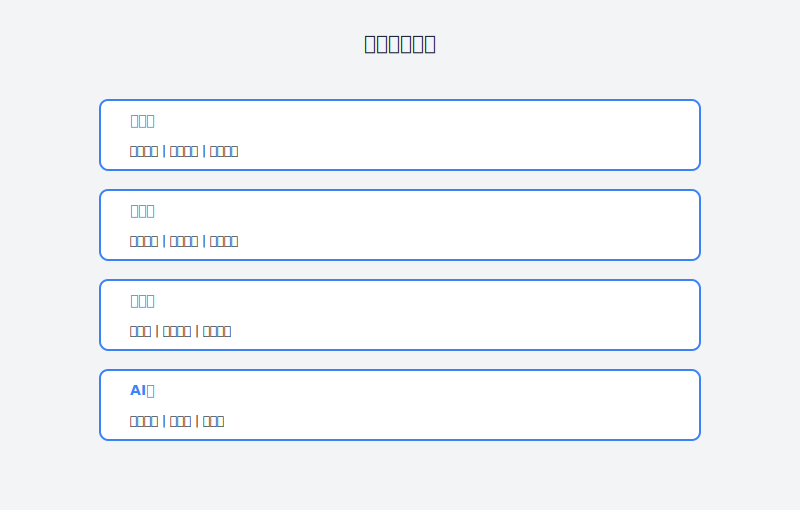

# 第30章：让产品×开发×设计不再扯皮

> **AI辅助产品经理工作流——团队协作篇**

---

## 故事：那场混乱的项目

### 周一：设计稿评审会上的"惊喜"

"这个设计稿和我们理解的需求不一致啊。"

开发负责人老王皱着眉头，指着投影屏幕上的设计稿。

设计师小林愣了一下："哪里不一致？我就是按照PRD做的啊。"

"PRD里说'商品卡片支持左右滑动查看更多图片'，但你这个设计是点击放大，"老王翻到PRD的某一页，"第3.2节，你看。"

小林凑过去看了看，然后掏出手机："可是阿强在微信上跟我说改成点击放大的..."

阿强感觉所有人的目光都转向了他。他的脑子飞快地转着——他确实在微信上跟小琳说过这个修改，但那是两周前的事了，而且他忘了更新PRD。

"我...确实说过，"阿强承认，"但我忘记同步到文档里了。"

老王叹了口气："那现在怎么办？我们按照PRD开发的话，做出来就是左右滑动。但设计稿是点击放大。"

"要不就按设计稿做吧？"小林说，"点击放大体验更好。"

"可是我们已经开发了一半了，"老王说，"左右滑动的逻辑都写好了。"

会议室里的气氛变得凝重。

这是阿强负责的项目中第N次出现"理解不一致"的问题了。

上次是开发理解的"用户管理"和运营理解的"用户管理"范围不一样——开发只做了一级权限，运营需要的是多级权限。

上上次是测试理解的"完成"和开发理解的"完成"标准不一样——开发认为功能能跑就行，测试认为必须覆盖所有边界情况。

上上上次...

阿强已经数不过来了。

"为什么我们总是在扯皮？"阿强在当天的日记里写道，"每个人都觉得自己是对的，但做出来的东西总是和预期不一致。"

---





### 周二：一场意外的启发

周二下午，阿强参加了一个关于"AI提升协作效率"的内部分享。

分享者是公司新入职的AI产品经理小陈，她之前在字节跳动工作过。

"我发现一个有趣的现象，"小陈说，"团队协作中的大部分问题，不是'不愿意合作'，而是'信息不一致'。"

"产品经理想的是A，设计师理解成B，开发实现成C，测试验收时发现都不是。"

"传统的解决办法是'多开会、多沟通'，但会议越多，信息越乱。因为信息散落在各种地方——会议记录、微信群、邮件、文档..."

"我现在的做法是：用AI作为'信息中枢'，确保每个人看到的信息是一致的。"

她展示了一个案例。

**传统流程**：
1. 产品写PRD
2. 设计师看PRD做设计
3. 开发看PRD+设计稿开发
4. 测试看PRD写用例

**问题**：每个人都只看了自己关注的部分，对整体理解不一致。

**AI辅助流程**：
1. 产品写PRD
2. AI生成"角色视角版"PRD（给设计师看的版本、给开发看的版本、给测试看的版本）
3. AI检查各角色理解是否一致
4. AI生成"统一认知确认书"，各角色确认

"关键是这个步骤——"小陈指着第四步，"让每个人确认他们理解了什么。很多时候，你以为说清楚了，其实对方理解的是另一回事。"

"AI可以帮我们发现这些'理解偏差'，在开发前就解决掉。"

阿强听得入神。这不正是他需要的吗？

---

### 周三：AI辅助需求对齐

周三，阿强决定在新项目中实践这个方法。

**第一步：生成多角色视角的需求文档**

阿强先写好了PRD，然后让AI生成不同角色的"定制化版本"。

```
基于以下PRD，请生成不同角色的需求理解版本。

原始PRD：
[PRD全文]

请输出：

1. **设计师视角版**：
   - 关注页面结构、交互流程、视觉要求
   - 列出所有需要设计稿的页面
   - 标注需要特别关注的交互细节

2. **开发视角版**：
   - 关注数据模型、接口设计、技术要点
   - 列出需要开发的模块和接口
   - 标注需要特别注意的技术难点

3. **测试视角版**：
   - 关注验收标准、测试场景、边界情况
   - 列出需要测试的功能点
   - 标注需要重点验证的场景

4. **运营视角版**：
   - 关注使用流程、数据指标、异常处理
   - 列出日常操作流程
   - 标注需要培训的内容
```

AI生成的多角色版本让阿强自己都惊讶。

**设计师视角版**清晰地列出了：
- 页面清单（共12个页面，其中3个是复杂交互页面）
- 需要设计规范的组件（按钮、表单、卡片等）
- 需要特别说明的交互逻辑（如下拉刷新、加载更多）

**开发视角版**整理出了：
- 数据模型清单（用户表、订单表、商品表等）
- 接口清单（共28个接口，标注了优先级）
- 技术难点提示（如并发控制、缓存策略）

**测试视角版**提取了：
- 功能测试点（156个测试点）
- 边界情况清单（空数据、超大数据、异常网络等）
- 需要自动化的测试场景

阿强把这些文档分别发给了设计师、开发、测试，大家都说"第一次看到这么清晰的需求"。

**第二步：理解一致性检查**

文档发出后，阿强让AI做了一件更重要的事——检查各角色的理解是否一致。

```
我已经将PRD的不同视角版本分别发给了设计、开发、测试。

现在收到了他们的反馈：

设计师反馈：
[设计师的理解摘要]

开发反馈：
[开发的理解摘要]

测试反馈：
[测试的理解摘要]

请帮我分析：
1. 各角色对需求的理解是否存在分歧？
2. 如果有，具体在哪里？
3. 可能导致什么后果？
4. 建议如何对齐？
```

AI的分析发现了几个潜在的分歧点：

**分歧1：商品下架的处理逻辑**
- 产品理解：商品下架后，已在购物车中的商品保留，但标注"已下架"
- 开发理解：商品下架后，购物车中该商品自动移除
- 风险：实现与用户预期不符，引发投诉

**分歧2：订单取消的时间限制**
- 产品PRD："订单在一定时间内可取消"
- 测试理解：所有订单支付前都可取消
- 开发理解：只有未发货订单可取消
- 风险：验收标准不一致，测试通过但业务逻辑错误

**分歧3：数据统计的口径**
- 产品定义："日活跃用户"=当日有操作的用户
- 运营理解："日活跃用户"=当日登录的用户
- 风险：数据报表与实际业务感知不一致

阿强看到这些分析，倒吸一口凉气。这些分歧如果带到开发阶段，又会是一轮又一轮的扯皮。

他立刻组织了一个简短的对齐会，把这几个分歧点逐一澄清，并更新到PRD中。

**第三步：生成统一认知确认书**

对齐后，阿强让AI生成了一份"统一认知确认书"：

```
请基于以下已对齐的需求，生成统一认知确认书。

对齐后的需求：
[更新后的PRD]

确认书要求：
1. 列出核心需求点（用一句话概括）
2. 列出各角色的职责边界
3. 列出关键决策点和决策依据
4. 列出已解决的分歧和解决方案
5. 列出需要持续关注的风险点

格式：正式的确认文档，各角色需签字（或电子确认）
```

生成的确认书清晰地记录了：
- 这个项目要解决什么问题
- 每个人要做什么、做到什么标准
- 之前有过什么分歧、怎么解决的
- 还有哪些不确定的地方需要持续关注

设计师、开发、测试都签了字。阿强说："这是咱们项目的'宪法'，有分歧就翻出来看看。"

---

### 周四：AI辅助设计-开发协作

设计稿完成后，阿强继续用AI辅助设计到开发的交接。

**场景1：设计稿检查清单**

```
请基于以下设计稿描述，生成开发需要的设计交付物检查清单。

设计稿：[描述或链接]

检查清单要求：
1. 基础交付物（是否齐全）
2. 页面清单（是否完整）
3. 交互说明（是否清晰）
4. 设计规范（是否统一）
5. 特殊说明（是否有标注）

输出：可勾选的检查清单
```

AI生成的检查清单帮助开发快速检查设计稿的完整性，避免开发到一半发现"缺个状态设计"或"没标注间距"。

**场景2：设计转开发的详细说明**

```
请基于以下设计稿，生成给开发的详细实现说明。

设计稿：[描述]

要求：
1. 页面结构描述（HTML结构建议）
2. 样式说明（关键尺寸、颜色、字体）
3. 交互逻辑（状态变化、动画细节）
4. 响应式要求（不同屏幕的适配）
5. 技术实现建议（可用组件、库推荐）
```

这份说明文档让开发小王感叹："以前看设计稿要猜的东西，现在都写清楚了。"

**场景3：设计-开发理解对齐**

阿强让AI做了一件更聪明的事——检查开发对设计稿的理解是否正确。

```
开发基于设计稿写了技术方案，请检查是否与设计方案一致。

设计方案：
[设计稿关键信息]

开发技术方案：
[开发的技术方案]

请检查：
1. 页面结构是否与设计一致？
2. 交互实现是否与设计意图一致？
3. 是否有遗漏的设计细节？
4. 是否有过度实现或简化的地方？
```

AI发现开发对"下拉刷新"的理解有偏差——设计希望是"微信式的下拉刷新"（有弹性的回弹效果），但开发方案里写的是"普通的下拉刷新"（简单的loading图标）。

这个细节如果不提前对齐，开发完成后再改成本就高了。

---

### 周五：AI辅助测试协作

到了测试阶段，AI继续发挥作用。

**场景1：自动生成测试用例**

```
请基于以下PRD，生成完整的测试用例。

PRD：[关键功能描述]

测试用例要求：
1. 功能测试用例（正常流程）
2. 边界测试用例（异常数据、极端情况）
3. 兼容性测试用例（不同设备、浏览器）
4. 性能测试用例（响应时间、并发）
5. 安全测试用例（权限、注入等）

格式：测试用例编号、前置条件、操作步骤、预期结果、优先级
```

AI生成的测试用例覆盖了阿强没想到的很多场景，比如：
- 网络断开时的错误处理
- 快速连续点击的防抖处理
- 后台返回异常数据的容错处理

**场景2：测试-开发缺陷沟通**

以前测试提bug，经常因为描述不清楚导致开发复现不了。阿强让AI帮忙优化bug描述：

```
请基于以下bug信息，生成标准化的bug报告。

原始描述：[测试提供的bug信息]

优化要求：
1. 清晰的标题（问题+场景）
2. 复现步骤（编号列表，每步一个操作）
3. 预期结果 vs 实际结果
4. 环境信息（设备、系统、版本）
5. 截图/录屏建议
6. 严重程度评估
```

标准化的bug报告让开发复现效率提升了很多。

**场景3：验收标准对齐**

```
请生成功能验收检查清单。

功能：[功能描述]

检查清单要求：
1. 开发自测项（开发完成前必须验证）
2. 测试验证项（测试必须覆盖）
3. 产品验收项（产品必须确认）
4. 设计验收项（设计必须确认）

每项都要有明确的验收标准（通过/不通过的判断依据）
```

这份清单让"完成"的定义变得清晰——开发说"我做完了"，测试知道要验什么，产品知道要收什么。

---

### 周五晚上：协作的新体验

周五晚上，阿强回顾这一周的项目进展，心情和往常很不一样。

以前周五，他总是筋疲力尽，因为一周都在处理各种"理解不一致"导致的返工、扯皮、救火。

这周虽然也很忙，但忙的是"推进项目"，而不是"解决内耗"。

他在项目群里发了一条消息：

"这周的协作体验怎么样？大家反馈一下？"

设计师小林："感觉需求清晰多了，而且前期对齐花了时间，后面改稿少了。"

开发老王："开发方案评审的时候就能把问题暴露出来，而不是写到一半才发现理解错了。"

测试小张："测试用例覆盖更全面了，而且bug描述标准化后，和开发沟通顺畅多了。"

阿强看着这些反馈，心里暖暖的。

他终于找到了团队协作的正确打开方式——不是靠更多的会议，而是靠更清晰的信息对齐。

---

## 理论知识：AI辅助跨团队协作方法论

### 团队协作问题的根源分析

| 问题现象 | 根本原因 | AI解决方案 |
|:---|:---|:---|
| 需求理解不一致 | 信息不对称、表达不清晰 | 多角色视角文档、理解对齐检查 |
| 设计-开发脱节 | 设计意图传递不到位 | 设计转开发文档、理解检查 |
| 测试-开发扯皮 | 验收标准不明确 | 标准化测试用例、验收清单 |
| 频繁的需求变更 | 前期考虑不周 | AI辅助需求完整性检查 |
| 返工率高 | 问题发现太晚 | 早期分歧识别、前置对齐 |

### AI辅助协作的4层价值

#### 第1层：信息分发——确保信息一致

**核心作用**：将同一份需求转化为不同角色容易理解的形式。

**使用方法**：
```
基于以下PRD，生成多角色版本：

原始PRD：[内容]

请输出：
1. 设计师版（关注视觉、交互）
2. 开发版（关注技术实现）
3. 测试版（关注验收标准）
4. 运营版（关注业务流程）

要求：
- 各版本基于同一需求源，确保一致性
- 突出该角色关注的信息
- 过滤不相关的细节
```

#### 第2层：理解对齐——发现认知偏差

**核心作用**：检查各角色对需求的理解是否一致。

**使用方法**：
```
请分析以下各角色的反馈，识别理解分歧：

产品意图：[原始需求]

设计师理解：[设计师反馈]
开发理解：[开发反馈]
测试理解：[测试反馈]

请输出：
1. 一致的部分
2. 分歧的部分（具体在哪里、什么程度）
3. 分歧可能导致的问题
4. 对齐建议
```

#### 第3层：协作流程——标准化交接

**核心作用**：在各环节之间建立标准化的交接物。

**使用方法**：

**设计-开发交接**：
```
请基于设计稿，生成开发交付物：

设计稿：[描述或链接]

交付物：
1. 切图清单（尺寸、格式、命名）
2. 标注说明（间距、颜色、字体）
3. 交互说明（状态、动画、手势）
4. 响应式规则
5. 技术实现建议
```

**开发-测试交接**：
```
请基于技术方案，生成测试需要的信息：

技术方案：[内容]

交付物：
1. 功能清单（可测试的功能点）
2. 接口文档（如有）
3. 关键逻辑说明（容易出错的地方）
4. 自测报告（开发自测结果）
```

#### 第4层：质量保证——标准化验收

**核心作用**：建立清晰的验收标准和流程。

**使用方法**：
```
请生成完整的验收检查清单：

功能：[功能描述]

检查清单：
1. 开发自测清单（开发必须完成）
2. 功能测试清单（测试必须覆盖）
3. 体验验收清单（设计必须确认）
4. 业务验收清单（产品必须确认）

每项包含：检查点、验收标准、验收人
```

### 协作Prompt模板库

#### 场景1：需求澄清会准备

```
请基于以下PRD，生成需求澄清会的议程和材料。

PRD：[内容]

议程要求：
1. 核心需求概述（5分钟）
2. 各角色关注重点（各5分钟）
3. 关键决策点讨论（10分钟）
4. 风险和对齐（10分钟）

材料：
1. 一页纸需求摘要
2. 待确认问题清单
3. 初步排期建议
```

#### 场景2：设计评审准备

```
请基于设计稿，生成设计评审检查清单。

设计稿：[描述]

检查维度：
1. 需求覆盖度（是否覆盖所有PRD要求）
2. 交互完整性（所有状态是否都有设计）
3. 可实现性（是否有技术难点）
4. 一致性（是否符合设计规范）
5. 体验优化（是否有体验改进建议）

输出：可勾选的检查清单
```

#### 场景3：技术方案评审

```
请基于技术方案，生成评审要点。

技术方案：[内容]

评审维度：
1. 需求理解（是否正确理解需求）
2. 技术选型（是否合适）
3. 可行性（是否能按期完成）
4. 风险识别（是否有遗漏风险）
5. 测试友好性（是否方便测试）

输出：评审问题清单
```

---

## 实践案例：完整的协作工作流

### 案例：从需求到上线的全流程协作

**Step 1：需求阶段**

```
PRD完成后：
1. 生成多角色版本（设计版、开发版、测试版）
2. 分发并收集反馈
3. AI分析反馈，识别分歧
4. 召开对齐会，解决分歧
5. 生成统一认知确认书
```

**Step 2：设计阶段**

```
设计进行中：
1. AI检查设计稿完整性
2. 生成设计转开发文档
3. 开发预审设计稿，反馈技术可行性
4. AI检查设计与需求的一致性
```

**Step 3：开发阶段**

```
开发进行中：
1. AI检查技术方案与需求的一致性
2. 生成测试用例初稿
3. 每日站会后AI分析进度和风险
4. 生成周报
```

**Step 4：测试阶段**

```
测试阶段：
1. AI优化bug报告
2. AI分析缺陷模式，识别系统性问题
3. 生成验收检查清单
4. 各角色按清单验收
```

---

## 本章交付物

完成本章后，你应该拥有：

1. **多角色需求文档模板**
   - 设计师版模板
   - 开发版模板
   - 测试版模板
   - 运营版模板

2. **理解对齐检查清单**
   - 常见分歧点清单
   - 对齐会议程模板
   - 统一认知确认书模板

3. **协作流程标准化文档**
   - 设计-开发交接清单
   - 开发-测试交接清单
   - 验收检查清单

---

## 行动清单

- [ ] 在下一个项目中使用多角色需求文档
- [ ] 召开一次理解对齐会，实践分歧识别方法
- [ ] 建立设计-开发的标准化交接流程
- [ ] 使用AI生成测试用例，对比手动编写的效率
- [ ] 制定团队的验收标准清单

---

## 本章彩蛋

### 彩蛋1：团队协作的黄金法则

**法则1：信息对齐 > 频繁开会**

与其每天开1小时站会，不如花30分钟确保需求文档清晰、各角色理解一致。

**法则2：书面确认 > 口头约定**

所有重要决策都要落到文档上，防止"我记得你说..."的扯皮。

**法则3：早期发现 > 后期修复**

在设计阶段发现需求理解偏差，成本是1；在开发阶段发现，成本是10；在上线后发现，成本是100。

### 彩蛋2：AI协作的边界

**AI不能做**：
- 替代面对面的深度沟通
- 处理复杂的人际关系问题
- 做需要创造性判断的设计决策

**AI适合做**：
- 信息整理和格式化
- 一致性检查和提醒
- 标准化文档的生成

### 彩蛋3：阿强的协作检查清单

```markdown
## 项目启动检查清单

### 需求阶段
- [ ] PRD已完成并通过评审
- [ ] 多角色版本已生成并分发
- [ ] 各角色反馈已收集
- [ ] 理解对齐会已召开
- [ ] 统一认知确认书已签署

### 设计阶段
- [ ] 设计稿已完成
- [ ] 设计转开发文档已生成
- [ ] 开发已预审设计稿
- [ ] 设计与需求一致性已确认

### 开发阶段
- [ ] 技术方案已评审通过
- [ ] 测试用例已生成
- [ ] 开发自测清单已明确

### 测试阶段
- [ ] 测试用例已评审
- [ ] 验收检查清单已制定
- [ ] 各角色验收标准已确认
```

---

**下一章预告**：第31章《让新人不再问东问西的知识库》——阿强将学习如何用AI辅助构建团队知识库，让新人快速上手，让老员工的知识不再流失。
