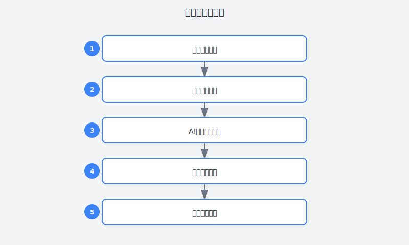

# 第31章：让新人不再问东问西的知识库

> **AI辅助产品经理工作流——知识管理篇**

---

## 故事：那个重复了一万遍的问题

### 周一：新同事的第N个"简单问题"

"阿强哥，这个订单状态流转的逻辑是什么？"

阿强抬起头，看着工位旁的新人小李。这是他本周第几次回答这个问题了？

第三次？还是第四次？

"看PRD的第3.2节，"阿强说，"里面有详细的流程图。"

"我看了，但还是有点不明白..."小李有些不好意思，"能不能给我讲一下？"

阿强叹了口气，放下手头的工作，开始讲解。十分钟后，小李终于明白了。

"谢谢阿强哥！"小李感激地说。

"没事，有问题就问，"阿强摆摆手，"不过这种问题其实文档里都有，下次可以先查查文档。"

"好的好的！"

阿强看着小李的背影，心里有点复杂。

他不是不愿意带新人，但同样的问题被反复问，确实消耗了大量时间。

- "我们的开发环境怎么搭建？"
- "这个接口的返回值格式是什么？"
- "测试环境的数据库账号密码是多少？"
- "这个bug应该提给谁？"
- "上线流程是什么样的？"

这些问题，文档里其实都有。但问题是——

**文档太多了，新人不知道该看哪个。**

**文档太老了，有些内容已经过时。**

**文档太散了，散落在各个地方（Confluence、石墨、飞书、本地文件夹）。**

**文档太长了，新人看了后面忘了前面。**

阿强想起自己当年入职的时候，也是一脸懵。带他的前辈离职了，他只能自己摸索，踩了无数坑才慢慢上手。

"一定要让新人能更快地上手，"阿强在心里说，"不然每次来新人都得花大量时间带，效率太低了。"

---





### 周二：偶遇知识管理高手

周二下午，阿强去其他部门找一个同事，偶然路过了一个正在开会的会议室。

会议室里，一个新人在做分享。

"我刚来两周，就把订单系统的代码看懂了，"新人说，"全靠我们团队的知识库。"

阿强停下了脚步。两周？看懂订单系统？

他知道那个订单系统有多复杂——核心业务逻辑，几十万行代码，各种历史遗留问题。他当年花了两个月才勉强理清。

会后，阿强找到了那个团队的负责人，问他们是怎么做的。

"我们用AI建了一个人人可以对话的知识库，"负责人说，"新人有问题直接问AI，90%的问题都能即时得到答案。"

"AI知识库？"

"对，"负责人解释，"我们把团队的所有文档、代码、会议纪要都喂给AI，然后AI就能回答问题。"

"比如新人问'订单取消的逻辑是什么'，AI会：
1. 从PRD中找到需求描述
2. 从代码中找到实现逻辑
3. 从历史讨论中找到相关决策记录
4. 整合成一个完整的回答

而且AI还能举一反三，主动告诉新人相关的知识点。"

阿强听得眼睛发亮。这不正是他需要的吗？

"能详细讲讲怎么做的吗？"

"没问题，"负责人说，"我整理了一套方法，核心有三个步骤：知识沉淀、知识组织、知识应用。"

---

### 周三：AI知识库建设实战

周三，阿强决定开始建设团队的知识库。

**第一步：知识盘点与沉淀**

阿强先让AI帮他盘点团队现有的知识资产：

```
请帮我盘点一个产品团队可能拥有的知识资产类型。

团队情况：
- 10人团队，负责电商后台产品
- 成立2年，经历多个项目
- 使用飞书、Confluence、GitLab等工具

请列出：
1. 各类知识资产的来源（哪里可能有知识）
2. 知识资产的类型（文档、代码、讨论记录等）
3. 知识资产的价值评估（哪些最重要）
4. 知识资产的现状评估（哪些可能缺失或过时）
```

AI给出的盘点清单让阿强意识到，团队的知识资产比他想象的多得多：

**显性知识**：
- PRD文档（50+份）
- 设计稿（200+份）
- 技术方案（30+份）
- 会议纪要（100+份）
- 培训材料（10+份）

**隐性知识**：
- 代码中的注释和实现逻辑
- 群聊中的讨论记录
- 邮件中的决策记录
- 个人的工作笔记

**关系型知识**：
- 谁负责哪个模块
- 哪个系统依赖哪个系统
- 历史上的决策原因

但问题是，这些知识都散落在各处，没有统一的管理。

**第二步：知识结构化**

阿强决定先把最重要的知识整理成结构化文档：

```
请帮我设计团队知识库的结构。

知识库目标：
- 帮助新人快速上手
- 帮助老员工查找信息
- 沉淀团队经验

请设计知识分类体系：
1. 一级分类（大的知识领域）
2. 二级分类（具体主题）
3. 每类知识的包含内容
4. 知识之间的关联关系

要求：
- 分类清晰，便于查找
- 覆盖新人上手的完整路径
- 包含实际工作中高频使用的信息
```

AI设计的知识库结构：

```
团队知识库
├── 01-新手上路
│   ├── 团队介绍（成员、职责、协作方式）
│   ├── 环境搭建（开发、测试、设计环境）
│   ├── 工具使用（Git、项目管理工具等）
│   └── 新人第一个任务指南
├── 02-产品知识
│   ├── 产品架构（系统架构图、模块说明）
│   ├── 核心流程（订单、支付、库存等）
│   ├── 业务规则（各类业务逻辑说明）
│   └── 历史决策（重大决策记录）
├── 03-项目文档
│   ├── 当前项目（进行中项目的文档）
│   ├── 历史项目（已完成项目的经验总结）
│   └── 项目模板（PRD模板、会议模板等）
├── 04-技术规范
│   ├── 接口规范
│   ├── 数据规范
│   ├── 设计规范
│   └── 代码规范
├── 05-常见问题
│   ├── 产品FAQ
│   ├── 技术FAQ
│   ├── 流程FAQ
│   └── 故障处理指南
└── 06-经验沉淀
    ├── 复盘总结
    ├── 最佳实践
    ├── 踩坑记录
    └── 工具推荐
```

阿强觉得这个结构很清晰，就开始按照这个结构整理团队的知识。

**第三步：AI知识助手**

有了知识库，阿强开始训练AI知识助手：

```
请基于以下知识库内容，回答用户问题。

知识库：
[已整理的知识文档]

用户问题：[具体问题]

回答要求：
1. 基于知识库内容回答
2. 如果知识库中没有，说明不知道
3. 回答要简洁、准确
4. 必要时提供相关文档链接
5. 对于复杂问题，给出步骤指引
```

阿强把团队的历史PRD、技术方案、会议纪要都喂给了AI，然后让AI回答一些常见问题测试效果。

**测试1**："订单取消的逻辑是什么？"

AI回答：
"订单取消涉及以下逻辑：

1. **可取消状态**：已下单未支付、已支付未发货
2. **不可取消状态**：已发货、已完成、已取消
3. **取消后处理**：
   - 库存：自动释放占用的库存
   - 支付：已支付的订单自动发起退款
   - 优惠券：使用的优惠券返还到用户账户
   - 积分：扣除赠送的积分

详细逻辑见《订单管理PRD》第4.3节 [链接]

相关知识点：
- 订单状态机：[链接]
- 退款流程：[链接]"

阿强很满意。这个回答比他自己口头讲得更全面、更有条理。

**测试2**："开发环境的搭建步骤是什么？"

AI给出了详细的步骤清单，包括：
- 前置条件（需要安装的软件）
- 详细步骤（每步的命令和截图）
- 常见问题（安装失败的解决方案）
- 验证方法（如何确认安装成功）

**第四步：知识库的持续更新**

阿强知道，知识库最大的挑战不是建设，而是**持续更新**。

他让AI帮忙建立了一套更新机制：

```
请帮我设计知识库的更新机制。

要求：
1. 谁负责更新（明确责任人）
2. 什么时候更新（触发条件）
3. 更新什么内容（范围）
4. 怎么确保更新质量
5. 怎么通知相关人员

输出：
1. 更新流程图
2. 各角色职责
3. 检查清单
```

AI设计的更新机制：

**更新触发条件**：
- 新项目启动：创建新的项目文档
- 需求变更：更新相关产品文档
- 流程变更：更新流程文档
- 新人问题：如果同一个问题被问3次以上，补充到FAQ
- 定期review：每月review一次，更新过时内容

**责任人**：
- 产品文档：产品经理
- 技术文档：技术负责人
- 流程文档：项目经理
- FAQ：轮流值日

**质量保证**：
- 新增文档必须经过review
- 变更必须说明原因
- 定期清理过时内容

---

### 周四：知识库上线与效果

周四，阿强把知识库正式上线，并推送给团队。

他在群里发了一条消息：

"团队知识库V1.0上线了！以后有问题先问知识库，找不到再问人。

知识库地址：[链接]

目前包含：
- 新人上手指南
- 产品核心流程
- 历史项目经验
- 常见问题FAQ

大家有问题随时反馈，持续完善！"

**效果立竿见影**：

新人小李第一个体验："太棒了！我问'怎么提测'，知识库给了完整的提测流程，还有检查清单。"

开发老王也发现价值："我查一个历史需求的设计思路，知识库直接给了当时的PRD和会议纪要，省得我去翻文件夹。"

甚至连设计小林都觉得有用："我查品牌色值，知识库直接给了设计规范，还关联了使用场景。"

最让阿强惊喜的是，知识库还能**被动完善**：

当有人在群里问了一个知识库里没有的问题，阿强会让AI自动生成答案并补充到知识库：

```
用户问了一个问题，知识库中没有相关答案。

问题：[问题]

我的回答：[回答]

请帮我：
1. 整理成标准的问题-答案格式
2. 补充相关的上下文信息
3. 确定应该放到知识库的哪个分类
4. 生成添加到知识库的markdown格式
```

这样，知识库就会越来越丰富、越来越有用。

---

### 周五：知识管理的进阶思考

周五晚上，阿强在整理这周的知识管理实践。

他总结了几点经验：

**1. 知识库的价值不只是"存放知识"，更是"激活知识"**

以前的知识躺在文件夹里，没人看。现在通过AI问答，知识被激活了、被使用了。

**2. 知识管理的核心是"降低查找成本"**

人不会用知识库，往往不是因为知识库内容少，而是因为"找起来太麻烦"。AI问答把查找成本降到了最低。

**3. 知识更新比知识沉淀更重要**

一份过时的文档，不如没有文档。建立更新机制，确保知识库的时效性。

**4. 知识是流动的，不是静止的**

知识在使用过程中会产生新的知识（比如问答中产生的新问题），要及时把这些新知识沉淀下来。

---

## 理论知识：AI辅助知识管理方法论

### 团队知识管理的痛点

| 痛点 | 表现 | AI解决方案 |
|:---|:---|:---|
| 知识分散 | 文档散落在各处 | 统一知识库，AI索引 |
| 知识过时 | 文档写了没人更新 | 定期review机制，AI辅助更新 |
| 查找困难 | 不知道哪个文档有答案 | AI问答，自然语言查询 |
| 隐性知识流失 | 老员工离职，知识带走 | 及时沉淀，问答记录 |
| 新人上手慢 | 没人带就不知道怎么干 | 新人指南+AI问答 |

### AI知识管理的4层价值

#### 第1层：知识沉淀——把隐性知识显性化

**核心作用**：将散落在各处的知识统一沉淀。

**使用方法**：
```
请帮我整理以下内容为标准知识文档。

原始内容：[会议记录/聊天记录/邮件等]

整理要求：
1. 提取核心信息（决策、结论、行动项）
2. 补充上下文（背景、原因、相关人员）
3. 结构化呈现（标题、列表、表格）
4. 添加标签（便于分类和检索）

输出格式：标准markdown文档
```

#### 第2层：知识组织——建立知识体系

**核心作用**：建立清晰的知识分类和关联。

**使用方法**：
```
请基于以下内容，设计知识分类体系。

现有知识：[知识清单]

要求：
1. 设计分类层级（不超过3级）
2. 确保MECE（相互独立，完全穷尽）
3. 建立知识间的关联关系
4. 设计标签体系

输出：
1. 分类树
2. 分类说明
3. 每类的代表内容
```

#### 第3层：知识应用——AI问答助手

**核心作用**：让知识可以被快速获取和使用。

**使用方法**：
```
你是一个团队知识助手，基于以下知识库回答问题。

知识库：[知识文档]

用户问题：[问题]

回答要求：
1. 基于知识库内容回答
2. 回答要简洁、准确
3. 必要时提供来源链接
4. 如果知识库中没有，说明不知道
5. 复杂问题给出步骤指引
```

#### 第4层：知识进化——持续更新优化

**核心作用**：确保知识的时效性和准确性。

**使用方法**：
```
请基于以下信息，分析知识库的更新需求。

新增知识：[新产生的知识]

现有知识库：[知识库内容]

请输出：
1. 需要新增的内容
2. 需要更新的内容
3. 需要删除的内容
4. 需要优化的结构
```

---

## 实践案例：从0到1建设团队知识库

### 案例：产品团队知识库建设

**Step 1：知识盘点**

```
请帮我盘点团队的知识资产。

团队信息：[团队情况]

盘点维度：
1. 显性知识（文档、代码等）
2. 隐性知识（经验、关系等）
3. 知识的位置和格式
4. 知识的价值和时效性

输出：知识资产清单
```

**Step 2：知识分类**

```
基于盘点结果，设计知识库结构。

要求：
1. 覆盖新人上手的完整路径
2. 包含高频使用的信息
3. 便于查找和扩展

输出：知识库分类树
```

**Step 3：知识录入**

```
请帮我整理以下内容为标准知识文档。

原始内容：[内容]

输出格式：
- 标题
- 摘要
- 正文（结构化）
- 相关链接
- 标签
- 更新记录
```

**Step 4：AI助手训练**

```
基于知识库，训练AI问答助手。

测试问题：
1. 新人常见问题
2. 业务流程问题
3. 历史决策问题
4. 技术实现问题

优化回答质量，直到满意。
```

**Step 5：更新机制**

```
设计知识库的更新机制。

包括：
1. 更新触发条件
2. 更新责任人
3. 更新流程
4. 质量保证
```

---

## 本章交付物

完成本章后，你应该拥有：

1. **团队知识库结构**
   - 分类体系
   - 文档模板
   - 标签体系

2. **AI知识助手**
   - 训练好的问答模型
   - 常见问题的标准回答

3. **知识管理流程**
   - 更新机制
   - 质量保证流程
   - 使用指南

---

## 行动清单

- [ ] 盘点团队现有的知识资产
- [ ] 设计知识库的分类结构
- [ ] 整理核心知识文档
- [ ] 训练AI知识助手
- [ ] 建立知识更新机制
- [ ] 推广知识库使用

---

## 本章彩蛋

### 彩蛋1：知识库建设的常见误区

**误区1：追求大而全**

❌ 一开始就想要把所有知识都整理进去，结果迟迟无法上线。

✅ 先上线核心知识（新人指南+FAQ），再逐步完善。

**误区2：只建不管**

❌ 知识库建好了就不管了，内容逐渐过时。

✅ 建立更新机制，定期review。

**误区3：只沉淀不应用**

❌ 知识躺在库里没人用。

✅ 通过AI问答、新人培训等方式激活知识。

### 彩蛋2：知识库的价值衡量

阿强设计的知识库价值衡量指标：

| 指标 | 衡量方式 | 目标 |
|:---|:---|:---:|
| 查询命中率 | 问题能在知识库找到答案的比例 | >80% |
| 问答满意度 | 用户对AI回答的满意度评分 | >4/5 |
| 新人上手时间 | 新人独立完成任务所需时间 | 缩短50% |
| 重复问题数 | 同一个问题被问的次数 | 减少70% |
| 知识更新率 | 每月更新的知识占比 | >10% |

### 彩蛋3：阿强的知识库Prompt模板

```markdown
## 知识整理Prompt

请帮我整理以下内容为标准知识文档。

原始内容：
{{content}}

输出格式：
---
title: [标题]
category: [分类]
tags: [标签]
author: [作者]
date: [日期]
---

## 摘要
[一句话摘要]

## 正文
[结构化内容]

## 相关链接
- [链接1]
- [链接2]

## 更新记录
- [日期] [更新内容]
```

---

**下一章预告**：第32章《一天完成一周的产品需求工作》——阿强将整合前面学到的所有方法，建立一套完整的AI辅助产品经理工作流，实现效率的质变。
