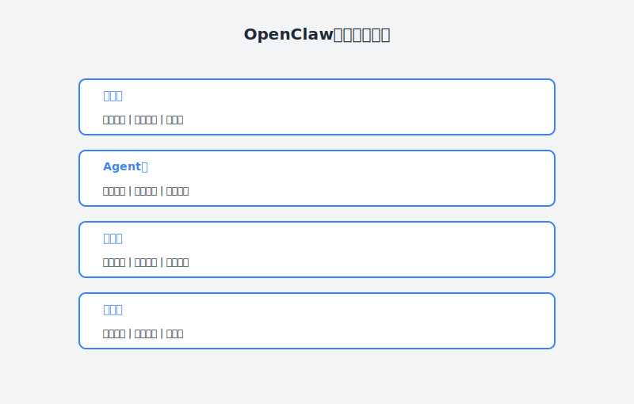
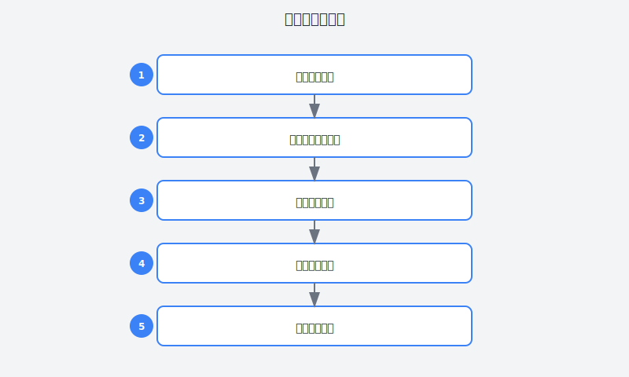

# 第33章：打造我的专属AI助理

> **AI Agent实战——用OpenClaw构建你的个人智能助手**

---

## 故事：小林的"数字分身"梦

### 周一上午：又一次重复劳动

小林盯着屏幕上第37封待回复的邮件，叹了口气。

"又是这些重复的问题，"他嘟囔着，"能不能有个助手帮我处理这些？"

作为公司的Agent开发者，小林每天的工作极其碎片化：

- 早上9点：查看昨晚的系统告警邮件
- 上午10点：回复各种技术咨询
- 中午12点：整理会议纪要和待办事项
- 下午2点：审查代码PR
- 下午4点：处理各种审批流程
- 晚上7点：总结今天的工作，规划明天

"我感觉自己像个机器人，"小林跟同事吐槽，"每天80%的时间都在做重复性的信息处理工作。"

他尝试过各种效率工具：
- 用Todoist管理任务，但经常忘记更新
- 用Zapier自动化流程，但不够灵活
- 用Notion整理知识，但检索效率低

"如果能有个真正懂我的AI助手就好了，"小林想，"它能：
- 自动帮我筛选重要邮件
- 回答常见的技术问题
- 帮我整理会议笔记
- 提醒我即将到期的任务
- 甚至帮我写代码审查意见'

但他试过市面上主流的AI助手，都不尽如人意：
- ChatGPT：虽然聪明，但没有记忆，每次都要重新交代背景
- Siri/Alexa：只能处理简单的指令，做不了复杂任务
- 各种Chatbot：太通用，不懂他的工作习惯

"我需要的是一个'数字分身'，"小林想，"它知道我的工作方式，记得我的偏好，能替我处理那些重复的工作。"

---







### 周二下午：遇见OpenClaw

转机发生在一个技术分享会上。

一位嘉宾在演示他的"个人AI助手"，小林看得目瞪口呆：

> "这是我自己搭的AI助手，它会：
> - 每天早上帮我总结昨晚的系统日志
> - 自动回复GitHub上常见的问题
> - 根据我的日历自动安排代码审查时间
> - 遇到紧急问题时直接给我发消息
> - 每周五自动生成工作总结"

"这是怎么做到的？"小林迫不及待地问道。

"用OpenClaw，"嘉宾说，"它是一个AI Agent框架，可以让你把各种工具和能力组合起来，打造专属的AI助手。"

小林眼睛亮了。他一直在找一个能深度定制、真正属于自己的AI助手。

---

### 周三晚上：第一次搭建

周三晚上，小林开始研究OpenClaw。

他先看了官方文档，了解了核心概念：

```
OpenClaw的核心思想：
━━━━━━━━━━━━━━━━━━━━━━━━━━━━━━━━━━━━━━━━
Agent = 大模型(LLM) + 工具(Tools) + 记忆(Memory) + 计划(Planning)

• LLM：负责理解意图、推理决策
• Tools：连接外部系统（邮件、日历、数据库等）
• Memory：保存上下文和历史信息
• Planning：拆解任务、制定执行计划
━━━━━━━━━━━━━━━━━━━━━━━━━━━━━━━━━━━━━━━━
```

"这不正是我需要的吗？"小林想。

他决定先从一个简单的场景开始：搭建一个"邮件助手"。

**第一步：安装OpenClaw**

```bash
# 安装OpenClaw CLI
pip install openclaw

# 初始化配置文件
openclaw init
```

**第二步：配置基础环境**

编辑 `~/.openclaw/config.yaml`：

```yaml
# 基础配置
name: "小林的AI助手"
model:
  provider: openai
  model: gpt-4
  temperature: 0.7

# 记忆配置
memory:
  type: sqlite
  path: ~/.openclaw/memory.db

# 工具配置
tools:
  - name: email
    config:
      imap_server: imap.gmail.com
      smtp_server: smtp.gmail.com
      username: ${EMAIL_USER}
      password: ${EMAIL_PASS}
  
  - name: calendar
    config:
      provider: google
      credentials: ~/.openclaw/calendar_creds.json
  
  - name: github
    config:
      token: ${GITHUB_TOKEN}
      default_repo: mycompany/project
```

**第三步：定义Agent的行为**

创建 `email_agent.yaml`：

```yaml
agent:
  name: "邮件助手"
  description: "帮助小林筛选和处理邮件"
  
  # 系统提示词
  system_prompt: |
    你是小林的专属邮件助手。你的职责是：
    
    1. 邮件筛选：
       - 识别重要邮件（老板、客户、紧急告警）
       - 过滤垃圾邮件和 newsletters
       - 标记需要回复的邮件
    
    2. 自动回复：
       - 对常见问题提供标准回复
       - 对技术咨询给出初步答复
       - 对会议邀请确认或建议替代时间
    
    3. 邮件摘要：
       - 每天上午9点生成昨日邮件摘要
       - 突出显示需要关注的邮件
       - 列出待回复清单
    
    小林的偏好：
    - 喜欢简洁直接的表达
    - 优先处理客户问题和生产故障
    - 技术问题尽量当天回复
    - 对内部流程邮件可以延迟处理
  
  # 触发器
  triggers:
    - type: schedule
      cron: "0 9 * * *"  # 每天上午9点
      action: daily_summary
    
    - type: event
      source: email
      filter: "subject contains 'URGENT' OR from contains 'ceo@'"
      action: immediate_notify
  
  # 技能
  skills:
    - name: classify_email
      description: "分类邮件重要性"
      prompt: |
        分析以下邮件，判断其重要性和类别：
        
        From: {from}
        Subject: {subject}
        Content: {content}
        
        请输出JSON格式：
        {
          "importance": "high/medium/low",
          "category": "customer/technical/internal/spam",
          "needs_reply": true/false,
          "reply_deadline": "今天/本周/不急",
          "summary": "一句话摘要"
        }
    
    - name: draft_reply
      description: "起草邮件回复"
      prompt: |
        为小林起草一封邮件回复。
        
        原始邮件：
        {original_email}
        
        小林的回复要点：
        {key_points}
        
        要求：
        - 语气专业但友好
        - 结构清晰，重点突出
        - 如果是技术问题，给出具体建议
  
  # 记忆
  memory:
    - type: short_term  # 当前对话上下文
    - type: long_term    # 长期学习的偏好
      topics:
        - 常用回复模板
        - 联系人关系
        - 邮件处理历史
```

**第四步：运行Agent**

```bash
# 启动邮件助手
openclaw run email_agent.yaml

# 看到输出：
# 📧 邮件助手已启动
# 📝 正在生成昨日邮件摘要...
# 📊 共处理47封邮件
#    - 重要：3封
#    - 需回复：5封
#    - 已自动回复：12封
# 📤 摘要已发送到小林的飞书
```

小林在飞书上收到了第一份邮件摘要：

```
📧 昨日邮件摘要 (2024-03-15)

━━━━━━━━━━━━━━━━━━━━━━━━━━━━━━━
🔴 重要邮件 (3封)
━━━━━━━━━━━━━━━━━━━━━━━━━━━━━━━
1. [客户-紧急] ABC公司反馈系统登录问题
   - 需要立即处理，已起草回复草稿
   - 建议：先检查认证服务日志

2. [老板] CEO询问Q1技术规划进展
   - 已标记为今日优先回复
   - 建议回复时间：今天上午

3. [告警] 生产环境数据库CPU使用率过高
   - 已自动转发给运维团队
   - 已确认告警恢复

━━━━━━━━━━━━━━━━━━━━━━━━━━━━━━━
🟡 待回复邮件 (5封)
━━━━━━━━━━━━━━━━━━━━━━━━━━━━━━━
1. [技术咨询] 关于微服务拆分的建议
   - 我起草了一个回复，请过目
   
2. [会议邀请] 架构评审会议
   - 与你日历冲突，建议改期到明天下午

...（共5封）

━━━━━━━━━━━━━━━━━━━━━━━━━━━━━━━
✅ 已自动处理 (12封)
━━━━━━━━━━━━━━━━━━━━━━━━━━━━━━━
- 8封 newsletters 已归档
- 3封内部通知 已标记已读
- 1封重复询问 已自动回复
```

小林惊呆了。这比他期望的还要好！

"它不仅分类了邮件，还给出了处理建议，甚至起草了回复，"小林想，"这才是真正的助手。"

---

### 周四：扩展能力

尝到了甜头，小林开始给助手添加更多能力。

#### 能力1：代码审查助手

创建 `code_review_agent.yaml`：

```yaml
agent:
  name: "代码审查助手"
  description: "帮助小林审查GitHub PR"
  
  system_prompt: |
    你是小林的代码审查助手。你的职责是：
    
    1. PR初筛：
       - 检查PR描述是否完整
       - 验证是否包含必要的测试
       - 检查代码风格是否符合规范
    
    2. 代码审查：
       - 识别明显的逻辑错误
       - 发现潜在的性能问题
       - 检查安全问题（如SQL注入、XSS）
       - 评估代码可维护性
    
    3. 审查报告：
       - 生成结构化的审查意见
       - 区分严重问题和建议改进
       - 给出具体的修改建议
    
    小林的代码标准：
    - Python遵循PEP8，使用black格式化
    - 必须包含单元测试
    - 核心逻辑必须有注释
    - API变更必须更新文档
    - 敏感操作必须有日志记录
  
  triggers:
    - type: webhook
      source: github
      event: pull_request.opened
      action: review_pr
  
  skills:
    - name: review_pr
      prompt: |
        请审查以下GitHub PR：
        
        PR信息：
        - 标题：{pr_title}
        - 描述：{pr_description}
        - 作者：{author}
        - 变更文件数：{files_changed}
        - 新增行数：{additions}
        - 删除行数：{deletions}
        
        代码变更：
        {diff_content}
        
        请按以下格式输出审查报告：
        
        ## 审查摘要
        - 状态：[通过/需要修改/需要讨论]
        - 严重程度：[严重/中等/轻微]
        - 预估审查时间：X分钟
        
        ## 发现的问题
        ### 🔴 严重问题
        1. [问题描述]
           - 位置：[文件:行号]
           - 建议：[具体修改建议]
           
        ### 🟡 建议改进
        1. [建议内容]
           - 理由：[为什么建议修改]
           
        ### ✅ 做得好的地方
        1. [正面评价]
        
        ## 行动清单
        - [ ] 修复严重问题
        - [ ] 考虑建议改进
        - [ ] 补充[具体]测试用例
```

#### 能力2：会议助手

创建 `meeting_agent.yaml`：

```yaml
agent:
  name: "会议助手"
  description: "帮助小林管理会议"
  
  system_prompt: |
    你是小林的会议助手。你的职责是：
    
    1. 会前准备：
       - 提前15分钟提醒会议
       - 总结与会者背景
       - 准备相关文档链接
    
    2. 会议纪要：
       - 记录关键决策
       - 跟踪行动项（Action Items）
       - 标记负责人和截止日期
    
    3. 会后跟进：
       - 整理会议纪要
       - 创建待办任务
       - 提醒即将到期的行动项
  
  triggers:
    - type: schedule
      cron: "*/15 * * * *"  # 每15分钟检查
      action: check_upcoming_meetings
    
    - type: event
      source: calendar
      event: meeting.ended
      action: generate_notes
  
  skills:
    - name: generate_meeting_notes
      prompt: |
        请根据以下会议录音/记录生成会议纪要：
        
        会议信息：
        - 主题：{meeting_title}
        - 时间：{meeting_time}
        - 参与者：{participants}
        
        会议内容：
        {transcript}
        
        请输出：
        
        # 会议纪要：[主题]
        
        ## 基本信息
        - 时间：[时间]
        - 参与者：[列表]
        - 时长：[时长]
        
        ## 关键决策
        1. [决策1]
        2. [决策2]
        
        ## 行动项
        | 任务 | 负责人 | 截止日期 | 优先级 |
        |-----|-------|---------|-------|
        | ... | ... | ... | ... |
        
        ## 讨论要点
        1. [要点1]
        2. [要点2]
        
        ## 下次会议
        - 时间：
        - 议题：
```

#### 能力3：日程规划助手

创建 `schedule_agent.yaml`：

```yaml
agent:
  name: "日程规划助手"
  description: "帮助小林优化每日日程"
  
  system_prompt: |
    你是小林的日程规划助手。你的职责是：
    
    1. 日程优化：
       - 避免会议过于集中
       - 保证深度工作时间
       - 合理安排休息时间
    
    2. 任务规划：
       - 根据优先级安排任务
       - 预估任务时间
       - 提醒即将到期的任务
    
    3. 每日总结：
       - 总结今日完成的工作
       - 规划明日优先事项
    
    小林的工作习惯：
    - 上午9-11点状态最好，安排重要任务
    - 下午容易犯困，适合开会
    - 需要每天至少2小时的深度工作时间
    - 周五下午不安排重要会议
  
  triggers:
    - type: schedule
      cron: "0 8 * * *"  # 每天上午8点
      action: plan_daily_schedule
    
    - type: schedule
      cron: "0 18 * * *"  # 每天下午6点
      action: daily_retrospective
  
  skills:
    - name: plan_daily_schedule
      prompt: |
        请为小林规划今天的日程。
        
        今日已有日程：
        {existing_events}
        
        待办任务：
        {todo_tasks}
        
        截止日期在本周的任务：
        {upcoming_deadlines}
        
        请输出：
        
        # 📅 今日日程规划
        
        ## 上午 (9:00-12:00)
        - 9:00-9:30 [任务1]
        - 9:30-11:00 [深度工作：任务2]
        - 11:00-12:00 [任务3]
        
        ## 下午 (14:00-18:00)
        ...
        
        ## 建议
        1. [优化建议]
        2. [风险提示]
```

---

### 周五：联动协作

单独的智能助手已经很强大了，但小林想要更多——让多个助手协同工作。

他设计了一个"Master Agent"来协调所有助手：

```yaml
agent:
  name: "主控助手"
  description: "协调各个专业助手，为小林提供统一服务"
  
  system_prompt: |
    你是小林的"数字分身"——主控助手。
    
    你的职责：
    1. 理解小林的意图，分发给合适的专业助手
    2. 整合各专业助手的输出，给出统一回复
    3. 学习小林的偏好，持续优化服务质量
    4. 主动发现并提醒重要事项
    
    你可以调用的专业助手：
    - @邮件助手：处理邮件相关任务
    - @代码助手：处理代码审查相关任务
    - @会议助手：处理会议相关任务
    - @日程助手：处理日程规划相关任务
    
    工作流程：
    1. 接收小林的需求
    2. 判断需要哪些助手参与
    3. 并行调用相关助手
    4. 整合结果，给出最终回复
  
  # 工作流程示例
  workflows:
    - name: morning_routine
      description: "每日晨间例行"
      steps:
        - call: email_agent.daily_summary
        - call: schedule_agent.plan_daily_schedule
        - call: meeting_agent.check_upcoming
        - combine: |
            生成晨间简报：
            
            ## 📧 邮件摘要
            {email_agent.output}
            
            ## 📅 今日日程
            {schedule_agent.output}
            
            ## 🗓️ 会议提醒
            {meeting_agent.output}
    
    - name: code_review_workflow
      description: "代码审查工作流"
      steps:
        - call: code_review_agent.review_pr
        - condition: "if code_review_agent.output.severity == 'high'"
          then:
            - call: email_agent.notify_urgent
              params:
                to: "小林"
                subject: "紧急：PR审查发现严重问题"
        - combine: |
            PR审查完成：
            
            {code_review_agent.output}
```

现在，小林只需要和"主控助手"对话：

```
小林：总结一下今天的情况

主控助手：
📊 今日概览 (2024-03-20)

📧 邮件：收到23封，已自动回复15封，需要你处理的3封
   - 紧急：1封（客户投诉）
   - 重要：2封（技术方案评审）

📅 日程：今天有4个会议，占用3.5小时
   - 上午10:00 架构评审（已准备材料）
   - 下午14:00 客户沟通（已整理背景）
   - 建议：下午16:00-18:00为深度工作时间

💻 代码：有3个PR等待审查
   - PR #1234：已通过自动审查，无严重问题
   - PR #1235：发现2个建议改进，已生成评论
   - PR #1236：需要你重点关注，涉及核心模块

✅ 待办：今天有5个任务
   - 高优先级3个，建议优先完成

需要我详细展开哪个部分？
```

---

## 理论知识：AI Agent构建方法论

### 什么是AI Agent？

AI Agent（智能体）是一个能够：
- **感知**环境（接收输入）
- **理解**意图（自然语言理解）
- **规划**行动（任务拆解）
- **执行**操作（调用工具）
- **学习**优化（反馈改进）

的智能系统。

```
┌─────────────────────────────────────────────────────────────┐
│                    AI Agent 架构                           │
├─────────────────────────────────────────────────────────────┤
│                                                             │
│   ┌─────────────┐                                           │
│   │   用户输入   │                                           │
│   └──────┬──────┘                                           │
│          ↓                                                  │
│   ┌──────────────────────────────────────┐                 │
│   │  LLM Core                            │                 │
│   │  • 意图理解                           │                 │
│   │  • 任务规划                           │                 │
│   │  • 推理决策                           │                 │
│   └──────────────┬───────────────────────┘                 │
│                  ↓                                          │
│   ┌──────────────┼──────────────┐                          │
│   ↓              ↓              ↓                          │
│ ┌──────┐    ┌──────┐    ┌──────┐                          │
│ │Tool 1│    │Tool 2│    │Tool 3│  ... 工具层              │
│ │Email │    │GitHub│    │Calendar                           │
│ └──────┘    └──────┘    └──────┘                          │
│                                                             │
│   ┌──────────────────────────────────────┐                 │
│   │  Memory System                       │                 │
│   │  • 短期记忆（当前对话）                │                 │
│   │  • 长期记忆（用户偏好）                │                 │
│   │  • 知识库（领域知识）                  │                 │
│   └──────────────────────────────────────┘                 │
│                                                             │
└─────────────────────────────────────────────────────────────┘
```

### OpenClaw的核心概念

#### 1. Agent定义

Agent是能力的最小单元，包含：
- **Identity**：身份和性格
- **Prompt**：系统提示词
- **Tools**：可调用的工具
- **Memory**：记忆系统
- **Triggers**：触发器

#### 2. Skill技能

Skill是Agent的具体能力：

```yaml
skill:
  name: "技能名称"
  description: "技能描述"
  
  # 输入参数定义
  parameters:
    - name: param1
      type: string
      required: true
    - name: param2
      type: number
      default: 10
  
  # 执行逻辑
  prompt: |
    请执行以下任务：
    参数1：{param1}
    参数2：{param2}
    
    要求：...
  
  # 后处理
  post_process:
    - type: json_parse
    - type: validate
      schema: ...
```

#### 3. Tool工具

Tool是Agent与外部世界交互的接口：

```yaml
tool:
  name: "邮件工具"
  type: email
  
  actions:
    - name: fetch_emails
      description: "获取邮件列表"
      parameters:
        folder: string
        limit: number
        since: datetime
    
    - name: send_email
      description: "发送邮件"
      parameters:
        to: string
        subject: string
        body: string
    
    - name: mark_read
      description: "标记已读"
      parameters:
        message_id: string
```

#### 4. Memory记忆

Memory让Agent有"记忆"：

```yaml
memory:
  # 短期记忆（当前会话）
  short_term:
    type: conversation
    max_turns: 20
  
  # 长期记忆（持久化）
  long_term:
    type: vector_store
    path: ~/.openclaw/memory
    
    # 记忆类型
    topics:
      - name: user_preferences
        description: "用户偏好"
      - name: conversation_history
        description: "历史对话"
      - name: learned_patterns
        description: "学习到的模式"
```

#### 5. Trigger触发器

Trigger让Agent能主动行动：

```yaml
triggers:
  # 定时触发
  - type: schedule
    cron: "0 9 * * *"
    action: morning_summary
  
  # 事件触发
  - type: event
    source: github
    filter: "event_type == 'pull_request' and action == 'opened'"
    action: review_pr
  
  # 条件触发
  - type: condition
    condition: "unread_emails > 10"
    action: alert_user
```

### 构建AI Agent的最佳实践

#### 原则1：从简单开始

不要一开始就构建复杂的Agent。先从一个简单的场景开始，逐步迭代。

```
迭代路径：
━━━━━━━━━━━━━━━━━━━━━━━━━━━━━━━━━━━━━━━━
第1周：单Agent，单一功能（如邮件分类）
第2周：添加更多技能（如自动回复）
第3周：添加记忆能力
第4周：添加触发器，实现主动服务
第5周：多Agent协作
━━━━━━━━━━━━━━━━━━━━━━━━━━━━━━━━━━━━━━━━
```

#### 原则2：明确的边界

每个Agent应该有明确的职责边界：

```
❌ 不好的设计：
一个Agent处理所有事情（邮件+代码+日程+...）

✅ 好的设计：
- 邮件助手：专注邮件处理
- 代码助手：专注代码审查
- 日程助手：专注日程规划
- 主控助手：协调各个助手
```

#### 原则3：人在回路

关键决策点需要人工确认：

```yaml
# 自动执行低风险操作
auto_execute:
  - classify_email
  - generate_summary
  - draft_reply

# 人工确认高风险操作
manual_confirm:
  - send_email
  - approve_pr
  - delete_data
```

#### 原则4：持续学习

Agent应该从反馈中学习：

```yaml
learning:
  # 从用户反馈学习
  feedback:
    - when: "user_edits_draft_reply"
      learn: "preferred_reply_style"
    
    - when: "user_overrides_classification"
      learn: "classification_rules"
  
  # 从行为模式学习
  patterns:
    - observe: "user_check_emails_time"
      learn: "preferred_schedule"
```

---

## 实践部分：OpenClaw实战指南

### 实战1：搭建第一个Agent

**目标**：创建一个简单的"日报生成器"

**步骤**：

1. **初始化项目**

```bash
mkdir my-first-agent
cd my-first-agent
openclaw init
```

2. **编写Agent配置**

创建 `daily_report_agent.yaml`：

```yaml
agent:
  name: "日报生成器"
  description: "自动生成每日工作日报"
  
  system_prompt: |
    你是一个日报生成助手。你的任务是根据用户一天的活动，生成一份结构化的工作日报。
    
    日报格式：
    # 📋 工作日报 - [日期]
    
    ## 今日完成
    - [任务1]
    - [任务2]
    
    ## 进行中
    - [任务]（进度：X%）
    
    ## 遇到的问题
    - [问题及解决方案]
    
    ## 明日计划
    - [计划1]
    - [计划2]
    
    ## 其他
    - [需要同步的信息]
  
  skills:
    - name: generate_report
      prompt: |
        请根据以下信息生成日报：
        
        今天的活动：
        {activities}
        
        明天的日程：
        {tomorrow_events}
        
        请按照系统提示词中的格式生成日报。
```

3. **运行Agent**

```bash
openclaw run daily_report_agent.yaml

# 交互式测试
> 今天的活动：上午参加架构评审会议，下午审查了3个PR，修复了一个生产bug
> 明天的日程：上午团队站会，下午客户需求沟通

# 输出：
# 📋 工作日报 - 2024-03-20
#
# ## 今日完成
# - 参加架构评审会议，确认Q2技术方案
# - 审查并合并3个PR（PR #1234, #1235, #1236）
# - 修复生产环境登录异常问题
#
# ## 进行中
# - 用户权限系统重构（进度：70%）
#
# ## 遇到的问题
# - 生产环境偶发登录失败，根因是Redis连接池耗尽，已优化连接池配置
#
# ## 明日计划
# - 参加团队站会（10:00）
# - 与ABC公司沟通需求（14:00）
# - 继续推进权限系统重构
```

### 实战2：添加工具能力

**目标**：让Agent能读取GitHub信息

**步骤**：

1. **配置GitHub工具**

编辑 `tools/github_tool.yaml`：

```yaml
tool:
  name: github
  type: api
  
  config:
    base_url: "https://api.github.com"
    auth:
      type: token
      token: ${GITHUB_TOKEN}
  
  actions:
    - name: get_pr_list
      endpoint: "/repos/{owner}/{repo}/pulls"
      method: GET
      parameters:
        state: { type: string, default: "open" }
        per_page: { type: number, default: 10 }
    
    - name: get_pr_diff
      endpoint: "/repos/{owner}/{repo}/pulls/{pr_number}"
      method: GET
      headers:
        Accept: "application/vnd.github.v3.diff"
```

2. **更新Agent使用工具**

```yaml
agent:
  name: "PR总结助手"
  
  tools:
    - github
  
  skills:
    - name: summarize_prs
      prompt: |
        请总结今天的PR情况。
        
        首先，调用github.get_pr_list获取今天的PR列表。
        然后，对每个PR调用github.get_pr_diff获取变更内容。
        最后，生成一份PR总结报告。
        
        报告格式：
        # 📊 今日PR总结
        
        ## 新增PR
        | PR | 作者 | 标题 | 状态 |
        |----|-----|------|-----|
        | ... | ... | ... | ... |
        
        ## 关键变更
        - [PR #X]: [变更摘要]
        
        ## 需要关注的PR
        - [PR #Y]: [关注原因]
```

### 实战3：多Agent协作

**目标**：创建"晨间简报"工作流

**步骤**：

1. **创建各个专业Agent**

```bash
# 邮件Agent
openclaw create agent --name email_agent --template email

# 日程Agent
openclaw create agent --name schedule_agent --template calendar

# 代码Agent
openclaw create agent --name code_agent --template github
```

2. **创建主控Agent**

```yaml
agent:
  name: "晨间简报助手"
  description: "每天早上生成一份综合简报"
  
  # 引入其他Agent作为工具
  agents:
    - email_agent
    - schedule_agent
    - code_agent
  
  workflows:
    - name: morning_briefing
      steps:
        - call:
            agent: email_agent
            skill: get_email_summary
            params:
              since: "yesterday 18:00"
        
        - call:
            agent: schedule_agent
            skill: get_today_schedule
        
        - call:
            agent: code_agent
            skill: get_pr_summary
        
        - combine:
            template: |
              # 🌅 晨间简报 - {{ date }}
              
              ## 📧 邮件 ({{ email_agent.unread_count }} 封未读)
              {{ email_agent.summary }}
              
              ## 📅 今日日程
              {{ schedule_agent.schedule }}
              
              ## 💻 代码
              {{ code_agent.summary }}
  
  triggers:
    - type: schedule
      cron: "0 9 * * *"
      action: workflows.morning_briefing
```

3. **运行工作流**

```bash
openclaw run morning_briefing.yaml
```

---

## 本章交付物

完成本章学习后，你应该拥有：

### 交付物1：个人AI助手

一个实际运行的AI助手，具备至少以下功能之一：
- 邮件处理助手
- 代码审查助手
- 日程规划助手
- 会议记录助手

### 交付物2：Agent配置文件集

```
my-ai-assistant/
├── config.yaml              # 主配置
├── agents/
│   ├── email_agent.yaml     # 邮件助手
│   ├── code_agent.yaml      # 代码助手
│   ├── meeting_agent.yaml   # 会议助手
│   └── master_agent.yaml    # 主控助手
├── tools/
│   ├── email_tool.yaml      # 邮件工具
│   └── github_tool.yaml     # GitHub工具
└── workflows/
    └── morning_routine.yaml # 晨间工作流
```

### 交付物3：个人Prompt库

整理常用的Prompt模板：
- 邮件分类Prompt
- 代码审查Prompt
- 日程规划Prompt
- 会议纪要Prompt

### 交付物4：使用文档

记录你的AI助手使用方法：
- 启动和停止命令
- 常用交互方式
- 自定义配置说明
- 故障排除指南

---

## 行动清单

- [ ] 安装OpenClaw并初始化配置
- [ ] 创建第一个简单的Agent（如日报生成器）
- [ ] 为Agent添加至少一个工具能力（如邮件、日历、GitHub）
- [ ] 设计并实现一个触发器（定时或事件触发）
- [ ] 创建多个Agent并尝试让它们协作
- [ ] 根据个人需求定制Agent的行为和偏好
- [ ] 记录使用心得，持续优化

---

## 本章彩蛋

### 彩蛋1：OpenClaw配置速查表

```yaml
# config.yaml 完整示例
name: "我的AI助手"
version: "1.0"

# LLM配置
model:
  provider: openai  # openai/anthropic/local
  model: gpt-4
  temperature: 0.7
  max_tokens: 2000

# 记忆配置
memory:
  short_term:
    type: buffer
    max_turns: 10
  long_term:
    type: vector_db
    provider: chroma
    path: ./memory

# 工具注册
tools:
  - name: email
    module: openclaw.tools.email
    config:
      imap_server: imap.gmail.com
  
  - name: github
    module: openclaw.tools.github
    config:
      token: ${GITHUB_TOKEN}

# 通道配置（飞书/Slack/钉钉等）
channels:
  - name: feishu
    type: lark
    webhook_url: ${FEISHU_WEBHOOK}
```

### 彩蛋2：常用Trigger表达式

```yaml
# 定时触发器
triggers:
  # 每天上午9点
  - type: schedule
    cron: "0 9 * * *"
  
  # 每周一上午
  - type: schedule
    cron: "0 9 * * 1"
  
  # 每小时
  - type: schedule
    cron: "0 * * * *"

# 事件触发器
triggers:
  # GitHub PR创建
  - type: webhook
    source: github
    event: pull_request
    filter: "action == 'opened'"
  
  # 邮件到达
  - type: event
    source: email
    filter: "subject contains '紧急'"
  
  # 条件触发
  - type: condition
    condition: "unread_count > 20"
    cooldown: "1h"  # 冷却时间
```

### 彩蛋3：Prompt优化技巧

```yaml
# 好的Prompt结构
skill:
  prompt: |
    # 角色定义
    你是[角色]，负责[职责]。
    
    # 背景信息
    当前情况：
    {context}
    
    # 具体任务
    请执行以下任务：
    1. [步骤1]
    2. [步骤2]
    
    # 输出格式
    请按以下格式输出：
    ```
    [格式示例]
    ```
    
    # 约束条件
    - [约束1]
    - [约束2]
```

---

> **小林的个人AI助手总结**：
> 
> "以前我觉得AI助手就是'智能音箱'，只能回答简单问题。
> 
> 现在我发现，真正的AI Agent是'数字分身'——它知道我的工作方式，
> 记得我的偏好，能替我处理80%的重复工作。
> 
> 我不再是一个人在战斗，我有一个7×24小时在线的助手团队：
> - 邮件助手帮我筛选和处理邮件
> - 代码助手帮我审查PR
> - 日程助手帮我规划时间
> - 主控助手协调一切
> 
> 这不是未来，这是现在。
> 让AI卷去吧，我终于可以专注于真正重要的事了。"

---

**下一章预告**：第34章《让多个AI Agent为我打工》——小林将学习如何让多个AI Agent协作完成复杂任务，打造真正的"AI团队"。