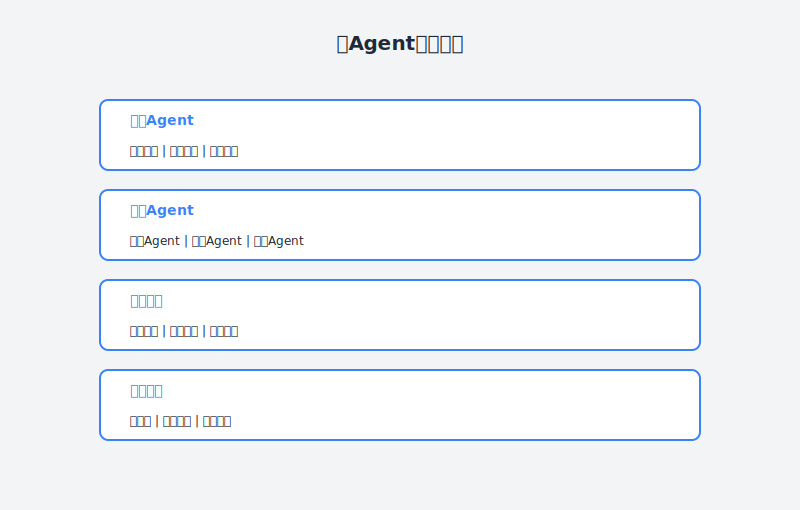

# 第34章：让多个AI Agent为我打工

> **多Agent协作——打造你的AI团队**

---

## 故事：从"单兵作战"到"团队协作"

### 周一：新挑战来了

小林盯着产品经理发来的需求文档，皱起了眉头。

"这个需求有点复杂啊，"他自言自语，"涉及到前端、后端、数据库、测试多个环节，还需要调研竞品、写技术方案、评审、开发、上线..."

作为技术负责人，小林习惯了独当一面。但最近他发现，工作越来越复杂，一个人的效率再高也有瓶颈。

"如果能像管理真人团队一样，让多个AI Agent协作完成这个需求就好了，"小林想。

他想起了上一章搭建的个人AI助手——邮件助手、代码助手、日程助手。它们各自擅长一个领域，但都是"单兵作战"。

"如果能让它们像团队一样协作，"小林眼睛亮了，"邮件助手负责沟通协调，代码助手负责开发，测试助手负责测试...这不就是一个AI团队吗？"

---





### 周二：设计AI团队架构

周二上午，小林开始设计他的"AI团队"。

他先在白板上画出了架构图：

```
┌─────────────────────────────────────────────────────────────────┐
│                      AI团队架构                                 │
├─────────────────────────────────────────────────────────────────┤
│                                                                 │
│                    ┌─────────────────┐                         │
│                    │   项目经理Agent  │                         │
│                    │  (Project Manager)│                         │
│                    └────────┬────────┘                         │
│                             │ 协调调度                         │
│           ┌─────────────────┼─────────────────┐                │
│           ↓                 ↓                 ↓                │
│    ┌─────────────┐   ┌─────────────┐   ┌─────────────┐        │
│    │ 需求分析Agent│   │ 技术方案Agent│   │  开发Agent  │        │
│    │   (BA)      │   │   (Arch)    │   │   (Dev)     │        │
│    └─────────────┘   └─────────────┘   └──────┬──────┘        │
│                                                 │               │
│                    ┌─────────────────┐         │               │
│                    │   测试Agent     │◄────────┘               │
│                    │   (QA)          │                         │
│                    └────────┬────────┘                         │
│                             │                                  │
│                    ┌────────┴────────┐                         │
│                    │   发布Agent     │                         │
│                    │   (Ops)         │                         │
│                    └─────────────────┘                         │
│                                                                 │
└─────────────────────────────────────────────────────────────────┘
```

"每个Agent就像一个团队成员，"小林想，"但它们之间需要：
1. 明确的分工
2. 标准化的交付物
3. 清晰的协作流程
4. 有效的沟通机制"

---

### 周三：实现多Agent协作

周三，小林开始用OpenClaw实现这个架构。

#### 第一步：定义角色和职责

**项目经理Agent (PM Agent)**

```yaml
agent:
  name: "项目经理Agent"
  role: project_manager
  description: "负责项目整体规划、进度跟踪和资源协调"
  
  responsibilities:
    - 接收用户需求，拆解成可执行的任务
    - 分配任务给各个专业Agent
    - 跟踪任务进度，识别风险
    - 整合各专业Agent的输出
    - 向用户汇报项目状态
  
  system_prompt: |
    你是AI团队的项目经理，负责协调各个专业Agent完成项目。
    
    你的管理原则：
    1. 任务拆解：将大需求拆解为可并行执行的小任务
    2. 依赖管理：明确任务间的依赖关系，合理安排顺序
    3. 质量控制：检查各Agent的交付物，确保符合标准
    4. 风险控制：识别潜在风险，提前制定应对方案
    5. 进度透明：实时向用户汇报项目进展
    
    输出格式：
    - 项目计划：任务列表、负责人、截止日期
    - 进度报告：已完成、进行中、阻塞的任务
    - 风险清单：潜在风险和应对措施
    
    协作方式：
    - 使用 @agent_name 的方式指派任务
    - 使用统一的交付物格式
    - 每日同步进度
  
  skills:
    - name: create_project_plan
      description: "创建项目计划"
      prompt: |
        请为以下需求创建项目计划：
        
        需求：{requirement}
        截止日期：{deadline}
        可用Agent：{available_agents}
        
        请输出：
        1. 任务拆解（WBS）
        2. 任务分配
        3. 时间线
        4. 依赖关系
        5. 风险点
    
    - name: track_progress
      description: "跟踪项目进度"
      prompt: |
        请根据以下任务状态生成进度报告：
        
        任务列表：
        {task_list}
        
        请输出：
        - 整体进度百分比
        - 已完成任务
        - 进行中任务
        - 阻塞任务及原因
        - 下一步计划
    
    - name: coordinate_agents
      description: "协调Agent协作"
      prompt: |
        需要协调以下Agent完成任务：
        
        当前任务：{current_task}
        需要协作的Agent：{agents}
        前置交付物：{deliverables}
        
        请：
        1. 明确各Agent的职责
        2. 定义交付物格式
        3. 设定检查点
```

**需求分析Agent (BA Agent)**

```yaml
agent:
  name: "需求分析Agent"
  role: business_analyst
  description: "负责需求分析和用户故事编写"
  
  responsibilities:
    - 分析用户需求的合理性
    - 编写用户故事和验收标准
    - 识别需求中的风险和模糊点
    - 输出需求规格说明书
  
  system_prompt: |
    你是AI团队的需求分析师，负责将用户需求转化为清晰的开发需求。
    
    分析原则：
    1. 用户导向：从用户价值角度分析需求
    2. 完整性：覆盖功能需求和非功能需求
    3. 可验证：每个需求都有明确的验收标准
    4. 可行性：评估技术可行性
    
    交付物：
    - 用户故事（User Stories）
    - 验收标准（Acceptance Criteria）
    - 需求规格说明书（SRS）
    - 风险清单
    
    输出格式：
    ```markdown
    # 需求分析文档
    
    ## 背景
    [背景描述]
    
    ## 用户故事
    ### Story 1: [标题]
    作为 [角色]，我希望 [功能]，以便 [价值]。
    
    **验收标准：**
    - [ ] Given [前提] When [操作] Then [结果]
    
    ## 非功能需求
    - 性能：[要求]
    - 安全：[要求]
    
    ## 风险
    | 风险 | 影响 | 缓解措施 |
    ```
  
  skills:
    - name: analyze_requirement
      description: "分析需求"
      prompt: |
        请分析以下需求：
        
        原始需求：
        {requirement}
        
        请输出：
        1. 需求理解（用一句话概括）
        2. 用户故事（2-5个）
        3. 验收标准（每个故事）
        4. 非功能需求
        5. 风险点
    
    - name: write_user_stories
      description: "编写用户故事"
      prompt: |
        请为以下功能编写用户故事：
        
        功能描述：{feature_description}
        目标用户：{target_users}
        
        请按以下格式输出：
        
        ## 用户故事
        
        ### Story 1: [标题]
        **作为** [角色]
        **我希望** [功能]
        **以便** [价值]
        
        **验收标准：**
        - [标准1]
        - [标准2]
        
        **优先级：** [高/中/低]
        **估算：** [故事点]
```

**技术方案Agent (Arch Agent)**

```yaml
agent:
  name: "技术方案Agent"
  role: architect
  description: "负责技术方案设计和技术选型"
  
  responsibilities:
    - 设计系统架构
    - 选择技术栈
    - 设计数据库模型
    - 定义接口规范
    - 评估技术风险
  
  system_prompt: |
    你是AI团队的架构师，负责设计技术方案。
    
    设计原则：
    1. 简洁性：避免过度设计
    2. 可扩展性：预留扩展空间
    3. 可维护性：代码结构清晰
    4. 性能：满足性能需求
    5. 安全：考虑安全因素
    
    交付物：
    - 架构设计文档
    - 技术选型报告
    - 数据库设计
    - API接口定义
    - 技术风险分析
    
    输出格式：
    ```markdown
    # 技术方案文档
    
    ## 架构设计
    [架构图描述]
    
    ## 技术选型
    | 层次 | 选型 | 理由 |
    
    ## 数据库设计
    [ER图/表结构]
    
    ## API设计
    [接口定义]
    
    ## 风险评估
    ```
  
  skills:
    - name: design_architecture
      description: "设计系统架构"
      prompt: |
        请为以下需求设计系统架构：
        
        需求：{requirement}
        用户规模：{user_scale}
        技术约束：{constraints}
        
        请输出：
        1. 系统架构图（文字描述）
        2. 模块划分
        3. 数据流
        4. 技术选型建议
        5. 部署架构
    
    - name: design_database
      description: "设计数据库"
      prompt: |
        请为以下功能设计数据库：
        
        功能：{feature}
        实体：{entities}
        
        请输出：
        1. ER图（文字描述）
        2. 表结构（含字段、类型、约束）
        3. 索引设计
        4. SQL建表语句
```

**开发Agent (Dev Agent)**

```yaml
agent:
  name: "开发Agent"
  role: developer
  description: "负责代码实现"
  
  responsibilities:
    - 根据技术方案编写代码
    - 编写单元测试
    - 代码自检和优化
    - 输出代码和开发文档
  
  system_prompt: |
    你是AI团队的开发工程师，负责实现功能代码。
    
    编码原则：
    1. 代码质量：遵循编码规范，可读性强
    2. 测试覆盖：核心逻辑必须有单元测试
    3. 错误处理：完善的异常处理
    4. 性能：关注性能瓶颈
    5. 安全：防范常见安全漏洞
    
    交付物：
    - 源代码
    - 单元测试
    - 开发文档
    - 部署说明
    
    编码规范：
    - Python: PEP8 + Black
    - JavaScript: ESLint + Prettier
    - 命名：有意义的命名
    - 注释：复杂逻辑必须有注释
  
  skills:
    - name: implement_feature
      description: "实现功能"
      prompt: |
        请实现以下功能：
        
        需求：{requirement}
        技术方案：{architecture}
        接口定义：{api_spec}
        
        请输出：
        1. 代码实现
        2. 单元测试
        3. 代码说明
    
    - name: review_code
      description: "代码自检"
      prompt: |
        请检查以下代码：
        
        代码：
        {code}
        
        检查项：
        - 语法错误
        - 逻辑错误
        - 安全问题
        - 性能问题
        - 代码风格
        
        请输出检查报告。
```

**测试Agent (QA Agent)**

```yaml
agent:
  name: "测试Agent"
  role: qa_engineer
  description: "负责测试用例设计和测试执行"
  
  responsibilities:
    - 设计测试用例
    - 编写自动化测试脚本
    - 执行测试并报告问题
    - 输出测试报告
  
  system_prompt: |
    你是AI团队的测试工程师，负责保证代码质量。
    
    测试原则：
    1. 全面性：覆盖正常和异常场景
    2. 自动化：优先自动化测试
    3. 可重复：测试结果稳定可重复
    4. 及时反馈：快速发现问题
    
    交付物：
    - 测试计划
    - 测试用例
    - 自动化测试脚本
    - 测试报告
    
    测试类型：
    - 单元测试
    - 集成测试
    - API测试
    - 性能测试
  
  skills:
    - name: design_test_cases
      description: "设计测试用例"
      prompt: |
        请为以下功能设计测试用例：
        
        功能：{feature}
        验收标准：{acceptance_criteria}
        
        请输出：
        1. 测试用例列表
        2. 测试数据
        3. 预期结果
    
    - name: write_test_scripts
      description: "编写测试脚本"
      prompt: |
        请为以下功能编写自动化测试脚本：
        
        功能：{feature}
        技术栈：{tech_stack}
        
        请使用 pytest/jest 编写测试脚本。
```

**发布Agent (Ops Agent)**

```yaml
agent:
  name: "发布Agent"
  role: devops_engineer
  description: "负责部署和运维"
  
  responsibilities:
    - 准备部署环境
    - 编写部署脚本
    - 执行发布流程
    - 监控发布状态
  
  system_prompt: |
    你是AI团队的DevOps工程师，负责发布和运维。
    
    发布原则：
    1. 自动化：一键部署
    2. 可回滚：保留回滚能力
    3. 零停机：蓝绿部署或滚动更新
    4. 可监控：完善的监控告警
    
    交付物：
    - 部署文档
    - CI/CD配置
    - 监控配置
    - 运维手册
  
  skills:
    - name: prepare_deployment
      description: "准备部署"
      prompt: |
        请为以下应用准备部署配置：
        
        应用：{application}
        技术栈：{tech_stack}
        部署环境：{environment}
        
        请输出：
        1. Dockerfile
        2. CI/CD配置（GitHub Actions/GitLab CI）
        3. 部署脚本
        4. 监控配置
```

#### 第二步：设计协作流程

创建 `collaboration_workflow.yaml`：

```yaml
workflow:
  name: "软件开发协作流程"
  description: "多Agent协作完成软件开发"
  
  # 流程触发条件
  trigger:
    type: user_request
    description: "用户提交新需求"
  
  # 流程步骤
  steps:
    # Step 1: PM接收需求，创建项目计划
    - step: 1
      name: "项目规划"
      agent: project_manager
      action: create_project_plan
      input:
        - requirement
        - deadline
      output:
        - project_plan
      next: [2, 3]
    
    # Step 2: BA分析需求（并行）
    - step: 2
      name: "需求分析"
      agent: business_analyst
      action: analyze_requirement
      input:
        - requirement
      output:
        - requirement_spec
      next: [4]
    
    # Step 3: Arch设计技术方案（并行）
    - step: 3
      name: "技术设计"
      agent: architect
      action: design_architecture
      input:
        - requirement
        - requirement_spec
      output:
        - architecture_doc
      next: [4]
    
    # Step 4: PM确认方案
    - step: 4
      name: "方案确认"
      agent: project_manager
      action: confirm_plan
      input:
        - requirement_spec
        - architecture_doc
      output:
        - confirmed_plan
      next: [5]
    
    # Step 5: Dev开发（并行可拆解）
    - step: 5
      name: "代码开发"
      agent: developer
      action: implement_feature
      input:
        - requirement_spec
        - architecture_doc
      output:
        - source_code
        - unit_tests
      next: [6]
    
    # Step 6: QA测试
    - step: 6
      name: "测试"
      agent: qa_engineer
      action: test_feature
      input:
        - source_code
        - requirement_spec
      output:
        - test_report
      decision:
        - if: "test_report.pass_rate >= 90%"
          then: 7
          else: 5
    
    # Step 7: Ops发布
    - step: 7
      name: "部署发布"
      agent: devops_engineer
      action: deploy
      input:
        - source_code
        - deployment_config
      output:
        - deployment_result
      next: [8]
    
    # Step 8: PM项目总结
    - step: 8
      name: "项目总结"
      agent: project_manager
      action: project_retrospective
      input:
        - project_plan
        - all_deliverables
      output:
        - project_summary
      next: []
  
  # 全局设置
  settings:
    # 自动执行低风险步骤
    auto_execute:
      - step_2
      - step_3
      - step_5
    
    # 人工确认高风险步骤
    manual_confirm:
      - step_4
      - step_7
    
    # 失败处理
    on_failure:
      action: notify_project_manager
      retry: 3
```

#### 第三步：实现Agent间通信

创建 `agent_communication.yaml`：

```yaml
# Agent间通信协议
communication:
  # 消息格式
  message_format:
    header:
      - message_id: "唯一标识"
      - from: "发送方Agent"
      - to: "接收方Agent"
      - timestamp: "发送时间"
      - message_type: "消息类型"
    body:
      - content: "消息内容"
      - context: "上下文信息"
      - deliverables: "交付物"
    
  # 消息类型
  message_types:
    - TASK_ASSIGNMENT: "任务分配"
    - DELIVERABLE: "交付物提交"
    - REVIEW_REQUEST: "审查请求"
    - REVIEW_FEEDBACK: "审查反馈"
    - STATUS_UPDATE: "状态更新"
    - BLOCKER: "阻塞问题"
  
  # 通信示例
  example_conversation:
    - message:
        from: project_manager
        to: business_analyst
        type: TASK_ASSIGNMENT
        content: |
          请分析以下需求：
          需求：用户需要一个文件上传功能
          截止日期：3天后
        
    - message:
        from: business_analyst
        to: project_manager
        type: DELIVERABLE
        content: |
          需求分析完成，详见附件。
        deliverables:
          - requirement_spec.md
    
    - message:
        from: project_manager
        to: architect
        type: TASK_ASSIGNMENT
        content: |
          请基于BA的需求分析设计技术方案。
        context:
          requirement_spec: requirement_spec.md
    
    - message:
        from: architect
        to: project_manager
        type: DELIVERABLE
        content: |
          技术方案已设计完成。
        deliverables:
          - architecture_doc.md
          - api_spec.yaml
```

---

### 周四：实战演练

周四，小林决定用一个真实需求来测试他的AI团队。

**需求**：为内部系统添加一个"员工请假申请"功能

**启动项目**：

```
小林：@project_manager 启动一个新项目

需求：为内部系统添加员工请假申请功能
- 员工可以提交请假申请
- 主管可以审批请假
- HR可以查看统计
- 需要与现有用户系统对接

截止日期：1周后

project_manager：收到，正在创建项目计划...

━━━━━━━━━━━━━━━━━━━━━━━━━━━━━━━━━━━━━
📋 项目计划已创建
━━━━━━━━━━━━━━━━━━━━━━━━━━━━━━━━━━━━━

项目名称：员工请假申请系统
周期：7天

任务拆解：
┌────┬────────────────┬────────────────┬──────────┐
│ 序号 │ 任务           │ 负责人         │ 截止日期 │
├────┼────────────────┼────────────────┼──────────┤
│ 1  │ 需求分析       │ @business_analyst│ Day 1    │
│ 2  │ 技术方案设计   │ @architect     │ Day 2    │
│ 3  │ 数据库设计     │ @architect     │ Day 2    │
│ 4  │ 后端API开发    │ @developer     │ Day 4    │
│ 5  │ 前端页面开发   │ @developer     │ Day 5    │
│ 6  │ 测试           │ @qa_engineer   │ Day 6    │
│ 7  │ 部署上线       │ @devops_engineer│ Day 7   │
└────┴────────────────┴────────────────┴──────────┘

依赖关系：
- 任务2依赖任务1
- 任务3依赖任务2
- 任务4、5依赖任务3
- 任务6依赖任务4、5
- 任务7依赖任务6

风险点：
- 与现有用户系统对接可能存在兼容性问题
- 审批流程逻辑较复杂

已开始执行任务1：需求分析
```

**BA分析需求**：

```
business_analyst：需求分析完成

━━━━━━━━━━━━━━━━━━━━━━━━━━━━━━━━━━━━━
📄 需求分析文档
━━━━━━━━━━━━━━━━━━━━━━━━━━━━━━━━━━━━━

## 用户故事

### Story 1: 提交请假申请
作为 员工
我希望 在系统中提交请假申请
以便 快速申请休假

验收标准：
- [ ] 员工可以选择请假类型（年假/病假/事假）
- [ ] 员工可以选择起止时间
- [ ] 员工可以填写请假事由
- [ ] 提交后生成申请单号
- [ ] 提交后通知主管

### Story 2: 审批请假申请
作为 主管
我希望 审批下属的请假申请
以便 管理团队出勤

验收标准：
- [ ] 主管可以看到待审批的申请列表
- [ ] 主管可以批准或驳回申请
- [ ] 审批后通知申请人和HR

### Story 3: 查看请假统计
作为 HR
我希望 查看全员的请假统计
以便 管理人力资源

验收标准：
- [ ] HR可以按部门查看请假统计
- [ ] HR可以按月份导出报表

## 非功能需求
- 性能：页面加载时间 < 2秒
- 安全：只有授权用户可以访问
- 可用性：99.9%可用性

## 风险
| 风险 | 影响 | 缓解措施 |
|-----|------|---------|
| 与用户系统对接失败 | 高 | 提前对接口进行POC验证 |
```

**Arch设计技术方案**：

```
architect：技术方案设计完成

━━━━━━━━━━━━━━━━━━━━━━━━━━━━━━━━━━━━━
🔧 技术方案文档
━━━━━━━━━━━━━━━━━━━━━━━━━━━━━━━━━━━━━

## 架构设计
采用前后端分离架构：
- 前端：React + Ant Design
- 后端：Node.js + Express
- 数据库：MySQL
- 缓存：Redis（会话存储）

## 数据库设计

### 表：leave_requests（请假申请表）
| 字段 | 类型 | 说明 |
|-----|------|------|
| id | BIGINT PK | 申请ID |
| employee_id | BIGINT FK | 员工ID |
| type | ENUM | 请假类型 |
| start_date | DATE | 开始日期 |
| end_date | DATE | 结束日期 |
| reason | TEXT | 请假事由 |
| status | ENUM | 状态（待审批/已批准/已驳回） |
| approver_id | BIGINT FK | 审批人ID |
| created_at | TIMESTAMP | 创建时间 |

## API设计

### POST /api/leaves
提交请假申请

Request:
```json
{
  "type": "annual",
  "start_date": "2024-04-01",
  "end_date": "2024-04-03",
  "reason": "家庭旅行"
}
```

Response:
```json
{
  "id": 12345,
  "status": "pending",
  "message": "申请已提交，等待审批"
}
```

### GET /api/leaves/pending
获取待审批列表

### PUT /api/leaves/{id}/approve
批准请假申请

## 技术风险
- 并发提交可能导致数据不一致，需要使用数据库事务
```

**Dev开发**：

```
developer：代码开发完成

━━━━━━━━━━━━━━━━━━━━━━━━━━━━━━━━━━━━━
💻 代码交付
━━━━━━━━━━━━━━━━━━━━━━━━━━━━━━━━━━━━━

## 后端代码
- controllers/leaveController.js
- services/leaveService.js
- models/LeaveRequest.js
- routes/leaves.js

## 前端代码
- components/LeaveRequestForm.jsx
- components/LeaveApprovalList.jsx
- pages/LeaveManagement.jsx

## 测试
- leaveController.test.js（覆盖率85%）
- LeaveRequestForm.test.jsx（覆盖率72%）

## 说明
- 已实现所有用户故事
- 已与现有用户系统对接
- 添加了输入验证和错误处理
```

**QA测试**：

```
qa_engineer：测试完成

━━━━━━━━━━━━━━━━━━━━━━━━━━━━━━━━━━━━━
✅ 测试报告
━━━━━━━━━━━━━━━━━━━━━━━━━━━━━━━━━━━━━

## 测试统计
- 总用例数：25
- 通过：24
- 失败：1
- 通过率：96%

## 失败用例
- TC-18: 并发提交测试
  - 期望：两个并发提交都能正确处理
  - 实际：偶现重复单号
  - 建议：添加唯一约束

## 测试类型
- [x] 单元测试
- [x] 集成测试
- [x] API测试
- [x] UI自动化测试

## 性能测试
- 页面加载时间：平均1.2秒 ✅
- API响应时间：平均200ms ✅

## 结论
基本功能测试通过，建议修复并发问题后发布。
```

**PM总结**：

```
project_manager：项目总结

━━━━━━━━━━━━━━━━━━━━━━━━━━━━━━━━━━━━━
📊 项目总结报告
━━━━━━━━━━━━━━━━━━━━━━━━━━━━━━━━━━━━━

项目名称：员工请假申请系统
状态：✅ 已完成
耗时：6天（提前1天）

## 完成情况
✅ 需求分析（1天）
✅ 技术方案（1天）
✅ 代码开发（2天）
✅ 测试（1天）
✅ 部署（1天）

## 交付物
- [x] 需求分析文档
- [x] 技术方案文档
- [x] 源代码
- [x] 测试报告
- [x] 部署文档

## 经验总结
1. Agent协作流程顺畅，各Agent职责清晰
2. 技术方案的提前设计帮助开发阶段少走了很多弯路
3. QA发现的并发问题需要在后续项目中重点关注

## 改进建议
1. 在架构设计阶段增加并发场景分析
2. 建立代码审查Agent，在开发阶段发现潜在问题
```

---

## 理论知识：多Agent协作系统

### 为什么需要多Agent协作？

单Agent的局限：
- **知识局限**：单个Agent难以掌握所有领域的知识
- **角色冲突**：一个Agent既要规划又要执行，容易混乱
- **效率瓶颈**：复杂任务串行执行，耗时长

多Agent协作的优势：
- **专业分工**：每个Agent专注一个领域
- **并行执行**：多个任务同时进行
- **质量保障**：Agent之间互相检查

```
单Agent vs 多Agent：

单Agent处理复杂需求：
用户 → Agent → 需求分析 → 技术设计 → 开发 → 测试 → 部署
         ↑___________________________________________↓
                        一个人干所有活

多Agent协作：
用户 → PM Agent ─┬→ BA Agent（需求分析）
                ├→ Arch Agent（技术设计）
                ├→ Dev Agent（开发）
                ├→ QA Agent（测试）
                └→ Ops Agent（部署）
                        团队协作，各取所长
```

### 多Agent协作架构

```
┌─────────────────────────────────────────────────────────────────┐
│                    多Agent协作系统                               │
├─────────────────────────────────────────────────────────────────┤
│                                                                 │
│  ┌───────────────────────────────────────────────────────────┐ │
│  │                    编排层 (Orchestration)                  │ │
│  │  • 任务拆解  • 资源调度  • 流程控制  • 异常处理              │ │
│  └──────────────────────┬────────────────────────────────────┘ │
│                         │                                       │
│    ┌────────────────────┼────────────────────┐                 │
│    ↓                    ↓                    ↓                 │
│ ┌──────────┐      ┌──────────┐      ┌──────────┐              │
│ │Agent 1   │      │Agent 2   │      │Agent 3   │   ...        │
│ │(BA)      │◄────►│(Arch)    │◄────►│(Dev)     │              │
│ └──────────┘      └──────────┘      └──────────┘              │
│       ▲                  ▲                  ▲                  │
│       └──────────────────┴──────────────────┘                  │
│                      消息总线                                    │
│                                                                 │
│  ┌───────────────────────────────────────────────────────────┐ │
│  │                    共享层 (Shared Services)                │ │
│  │  • 记忆存储  • 工具市场  • 知识库  • 监控日志               │ │
│  └───────────────────────────────────────────────────────────┘ │
│                                                                 │
└─────────────────────────────────────────────────────────────────┘
```

### Agent协作模式

#### 模式1：流水线模式（Pipeline）

适合有明确先后顺序的任务：

```
需求 → BA → Arch → Dev → QA → Ops → 上线
```

#### 模式2：主从模式（Master-Worker）

适合需要统一协调的复杂任务：

```
        ┌→ Worker 1
Master ─┼→ Worker 2
        ├→ Worker 3
        └→ Worker 4
```

#### 模式3：对等协作模式（Peer-to-Peer）

适合需要频繁协商的任务：

```
Agent 1 ◄──► Agent 2
   ▲            ▲
   └──► Agent 3 ◄─┘
```

#### 模式4：混合模式

实际项目中往往是多种模式的组合：

```
PM Agent（Master）
    │
    ├→ BA Agent（Worker）
    │      ↓
    │   Arch Agent（Worker）
    │      ↓
    │   Dev Agent（Worker）
    │      │
    │      ├→ 前端开发
    │      └→ 后端开发
    │         ↓
    │      QA Agent（Worker）
    │         ↓
    │      Ops Agent（Worker）
    │
    └→ 协调所有Agent
```

### 关键设计原则

#### 原则1：单一职责

每个Agent只做一件事：

```
❌ 不好的设计：
一个Agent既做需求分析，又做技术设计，又写代码

✅ 好的设计：
- BA Agent：只做需求分析
- Arch Agent：只做技术设计
- Dev Agent：只做代码实现
```

#### 原则2：标准化接口

Agent之间通过标准格式通信：

```yaml
# 标准交付物格式
deliverable:
  meta:
    id: "交付物ID"
    type: "交付物类型"
    author: "作者Agent"
    created_at: "创建时间"
    version: "版本"
  
  content:
    # 具体内容
  
  review:
    status: "pending/approved/rejected"
    reviewer: "审查者"
    comments: "审查意见"
```

#### 原则3：容错机制

单个Agent失败不影响整体：

```yaml
error_handling:
  retry:
    max_attempts: 3
    backoff: exponential
  
  fallback:
    - if: "agent_timeout"
      action: "escalate_to_human"
    
    - if: "agent_error"
      action: "retry_with_alternative_agent"
  
  rollback:
    - on_failure: "notify_all_agents"
    - on_failure: "restore_previous_state"
```

---

## 实践部分：多Agent协作实战

### 实战1：设计你的AI团队

**步骤**：

1. **识别角色**

列出你工作中的常见角色：
- 需求分析师
- 架构师
- 开发工程师
- 测试工程师
- 运维工程师
- 项目经理
- 产品经理

2. **定义职责**

为每个角色明确职责边界：

```yaml
roles:
  - name: business_analyst
    responsibilities:
      - 需求分析
      - 用户故事编写
    deliverables:
      - requirement_spec.md
    
  - name: architect
    responsibilities:
      - 技术方案设计
      - 数据库设计
    deliverables:
      - architecture_doc.md
```

3. **设计协作流程**

绘制流程图：

```
开始 → 需求分析 → 技术设计 → 开发 → 测试 → 部署 → 结束
         ↑__________↓              ↑______↓
          可并行                    有问题返回
```

### 实战2：实现Agent协作

**使用OpenClaw实现**：

```yaml
# team.yaml
multi_agent_system:
  name: "我的AI团队"
  
  agents:
    - name: project_manager
      config_file: agents/pm_agent.yaml
      
    - name: business_analyst
      config_file: agents/ba_agent.yaml
      
    - name: architect
      config_file: agents/arch_agent.yaml
      
    - name: developer
      config_file: agents/dev_agent.yaml
      
    - name: qa_engineer
      config_file: agents/qa_agent.yaml
  
  workflows:
    - name: software_development
      file: workflows/dev_workflow.yaml
    
    - name: bug_fix
      file: workflows/bugfix_workflow.yaml
```

### 实战3：监控和优化

**监控指标**：

```yaml
metrics:
  # 效率指标
  - task_completion_time
  - agent_utilization
  - workflow_success_rate
  
  # 质量指标
  - deliverable_acceptance_rate
  - rework_rate
  - bug_escape_rate
  
  # 协作指标
  - communication_overhead
  - coordination_bottlenecks
```

**优化策略**：

```
优化方向：
1. 任务分配优化：根据Agent负载动态分配
2. 并行度优化：识别可并行的任务
3. 质量门禁：在关键节点设置检查点
4. 知识共享：建立共享知识库
```

---

## 本章交付物

### 交付物1：AI团队设计文档

```
ai-team-design/
├── roles.md              # 角色定义
├── responsibilities.md   # 职责划分
├── workflows/            # 工作流程
│   ├── dev_workflow.yaml
│   └── bugfix_workflow.yaml
└── communication.md      # 通信协议
```

### 交付物2：Agent配置文件

```
ai-team/
├── config.yaml
├── agents/
│   ├── pm_agent.yaml
│   ├── ba_agent.yaml
│   ├── arch_agent.yaml
│   ├── dev_agent.yaml
│   └── qa_agent.yaml
└── workflows/
    └── software_development.yaml
```

### 交付物3：使用案例

记录至少一个完整的多Agent协作案例：
- 需求描述
- 协作过程
- 交付物
- 经验总结

---

## 行动清单

- [ ] 识别你的工作中的常见角色
- [ ] 设计你的AI团队架构
- [ ] 实现至少3个Agent
- [ ] 设计一个完整的协作流程
- [ ] 测试多Agent协作完成一个真实任务
- [ ] 优化Agent间的通信效率
- [ ] 建立团队协作的知识库

---

## 本章彩蛋

### 彩蛋1：Agent通信协议模板

```yaml
message:
  header:
    message_id: "uuid"
    correlation_id: "关联ID"
    from: "sender_agent"
    to: "receiver_agent"
    timestamp: "2024-03-20T10:00:00Z"
    priority: "high/medium/low"
  
  body:
    message_type: "TASK_ASSIGNMENT"
    
    task:
      id: "task_001"
      title: "需求分析"
      description: "..."
      deadline: "2024-03-21"
      
    context:
      original_requirement: "..."
      related_deliverables:
        - "doc_001"
    
    deliverables:
      expected:
        - name: "requirement_spec.md"
          format: "markdown"
          criteria: "..."
  
  attachments:
    - name: "背景资料.pdf"
      type: "file"
      url: "..."
```

### 彩蛋2：常见的多Agent反模式

```
❌ 反模式1：Agent职责不清
   两个Agent做同一件事，互相冲突

❌ 反模式2：通信过度
   Agent之间频繁通信，效率低下

❌ 反模式3：单点故障
   某个Agent失败导致整个流程阻塞

❌ 反模式4：缺乏监控
   不知道Agent在做什么，进度不可见

✅ 解决方案：
   - 明确职责边界
   - 批量通信，减少往返
   - 容错和回滚机制
   - 实时监控和告警
```

### 彩蛋3：多Agent调试技巧

```yaml
# 开启调试模式
debug:
  # 记录所有通信
  log_all_messages: true
  
  # 可视化工作流
  visualize_workflow: true
  
  # 单步执行
  step_by_step: true
  
  # Agent思考过程
  show_agent_thinking: true
```

---

> **小林的多Agent协作总结**：
> 
> "以前我觉得AI Agent就是'高级聊天机器人'。
> 
> 现在我发现，多Agent协作才是真正的'AI团队'——它们像真人团队一样分工协作，
> 互相检查，共同完成任务。
> 
> 我不再是一个人单打独斗，我有一个7×24小时在线的AI团队：
> - PM Agent帮我统筹规划
> - BA Agent帮我分析需求
> - Arch Agent帮我设计技术方案
> - Dev Agent帮我写代码
> - QA Agent帮我测试
> 
> 最神奇的是，它们之间能自动协作，我不需要 micromanage。
> 
> 这就是未来工作的样子——人负责决策，AI负责执行，Agent负责协作。"

---

**下一章预告**：第35章《批量改造50个文件的魔法》——小林将学习如何用AI批量处理代码，实现大规模重构和改造的自动化。