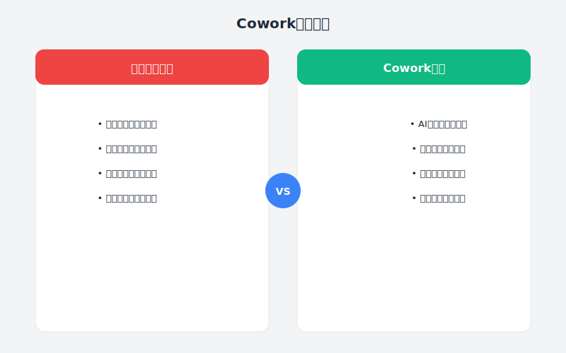

# 第36章：让团队效率提升40%的Cowork模式

> **团队AI协作新范式——从个人英雄到集体智慧**

---

## 故事：老吴的转型之痛

### 周一早晨：一个棘手的会议

老吴盯着会议室里的十几号人，心里盘算着这季度的OKR该怎么定。

作为技术负责人，他带这个团队已经三年了。从最初的5个人到现在的18人，团队规模翻了将近四倍，但效率增长却远远没有跟上人数增长。他清楚地知道那个尴尬的真相：团队越大，人效反而越低。

"大家说说看，"老吴开口，"我们Q2的核心目标是把新平台架构重构完成，同时保证线上稳定。按照现在的进度估算，需要多少人参与？"

架构师老王清了清嗓子："核心重构部分大概需要4个后端、3个前端，再加上测试和运维... 差不多10个人吧。"

"需要多久？"老吴追问。

"保守估计... 两个月？"老王的声音有些虚，"主要是耦合的地方太多了，大家得频繁对齐，沟通成本很高。"

老吴心里叹了口气。这种场景他已经见过太多次了：

- 需求评审会一开就是三小时，90%的时间都在争论细节
- 代码评审排队能排一周，PR积压严重
- 新人上手慢，老员工没时间带，形成恶性循环
- 每个人都在忙，但项目就是推不动

"我觉得，"一个声音打断了老吴的思绪，是新来的产品经理小林，"我们是不是该试试那个AI协作的东西？我听说隔壁组用AI辅助后，效率提升很明显。"

老吴看了小林一眼，没有说话。

他当然知道AI能提升效率。他自己用Cursor写代码，速度确实比以前快了不少。但团队层面怎么搞？让每个人都装个AI工具就完了？那不成了一盘散沙了？

会议结束后，老吴独自坐在工位上发呆。

"也许... 该换个思路了。"

---





### 周二：意外的启发

周二的部门负责人会议上，CTO分享了一个案例。

"你们听说过Cowork模式吗？"CTO在白板上写下这三个字，"不是Co-work（共同工作），而是Cowork——一种AI增强的团队协作范式。"

老吴竖起了耳朵。

"传统的团队协作，是人与人之间的信息传递。需求从产品经理到开发，设计从UI到前端，信息每传递一次就损失一部分，理解偏差越来越大。"

"Cowork模式的核心，是引入AI作为团队的'共享大脑'。AI不负责替人工作，而是负责：**统一理解、消除歧义、沉淀知识、加速反馈**。"

CTO展示了一张架构图：

```
传统模式：产品经理 → 开发 → 测试 → 上线
         （信息层层衰减）

Cowork模式：产品经理 + AI → 开发 + AI → 测试 + AI → 上线
           （AI作为共享上下文，减少信息损失）
```

"具体怎么操作？"老吴忍不住问。

"简单来说，就是把AI当作团队的'中央处理器'。"CTO解释，"需求文档先让AI解析标准化，代码评审让AI先过一遍给出建议，技术方案让AI帮助分析风险点。AI不替代任何人的决策，但把重复性、标准化的认知工作扛走了。"

老吴若有所思。

他想起自己团队的问题：其实每个人都很努力，但大量时间花在了**对齐理解**上——需求理解不一致要开会，代码规范不一致要评审，技术债务不一致要重构。

如果有个"智能层"能统一这些认知，会不会完全不同？

---

### 周三：第一次实验

周三，老吴决定小范围试验一下。

他选了一个正在进行的项目——用户权限系统的重构。这个项目刚好涉及前后端、产品、测试多个角色，是典型的协作密集型任务。

**第一步：建立AI共享上下文**

老吴把项目相关的文档、代码、设计稿整理到一起，创建了一个"项目知识库"：

```
/project-auth-refactor
├── /docs
│   ├── 需求文档.md
│   ├── 接口设计.md
│   ├── 数据库设计.md
│   └── 测试用例.md
├── /code
│   ├── backend/
│   └── frontend/
└── AI_CONTEXT.md  ← 这是关键
```

`AI_CONTEXT.md`里记录了项目的核心上下文：

```markdown
# 权限系统重构项目 - AI共享上下文

## 项目目标
将原有基于角色的权限系统(RBAC)升级为基于属性的权限系统(ABAC)，
支持更细粒度的权限控制。

## 核心约束
- 不能影响现有API接口（向后兼容）
- 数据库表结构可以调整，但需保留迁移方案
- 必须在3周内完成并上线

## 技术栈
- 后端：Node.js + TypeScript + Prisma
- 前端：React + TypeScript
- 数据库：PostgreSQL

## 关键术语统一
- Resource: 被访问的资源（如订单、用户数据）
- Action: 对资源的操作（read, write, delete）
- Condition: 访问的条件判断（如"只能看自己的数据"）
- Policy: 由Resource + Action + Condition组成的规则

## 验收标准
1. 所有现有功能正常工作（回归测试通过）
2. 新权限规则可以动态配置
3. 性能不下降（接口响应时间 < 200ms）
```

**第二步：需求评审AI化**

周三下午的需求评审会，老吴尝试了一种新方式。

产品经理小林先讲解需求，但大家没有像以前那样立刻开始讨论，而是先把需求文档发给AI分析。

老吴在共享屏幕上演示：

```
Prompt: 作为技术架构师，请分析以下需求文档，识别：
1. 可能的技术风险点
2. 模糊或不明确的需求描述
3. 与其他系统的潜在冲突
4. 需要进一步澄清的问题

需求文档：[粘贴]

上下文：[AI_CONTEXT.md的内容]
```

AI给出了分析结果：

> **技术风险点**：
> 1. 动态权限配置需要实时生效，但当前架构使用了权限缓存，可能存在延迟
> 2. ABAC规则的复杂度可能导致查询性能下降
> 
> **模糊需求**：
> 1. "支持灵活的权限组合"——具体支持多少层级的嵌套？
> 2. "管理员可以配置规则"——什么样的管理员？需要审批流程吗？
> 
> **潜在冲突**：
> 1. 与现有审计日志系统的字段定义可能不兼容
> 
> **待澄清问题**：
> 1. 权限变更是否需要版本控制？
> 2. 规则冲突时的优先级策略是什么？

会议室里安静了几秒。

老王第一个开口："这些问题... 确实很关键。要是以前，我们可能得开发到一半才发现。"

小林快速记下了待澄清的问题："我明天之前补充这些细节。"

老吴心里暗喜。这次需求评审只用了一小时，而以前类似的评审至少要三小时。更重要的是，讨论质量明显高了——大家都在聊真正关键的问题，而不是纠结表述不清的细节。

**第三步：代码协作AI化**

需求确定后，进入开发阶段。

老吴建立了一个规则：每个PR在提交给真人review之前，先让AI预审一遍。

他在GitHub Actions里加了一个工作流：

```yaml
name: AI Code Review
on:
  pull_request:
    types: [opened, synchronize]

jobs:
  ai-review:
    runs-on: ubuntu-latest
    steps:
      - uses: actions/checkout@v3
      - name: AI Code Review
        run: |
          # 调用AI API分析代码变更
          # 检查：规范符合度、潜在bug、性能问题、安全漏洞
          # 输出review报告作为评论
```

第一次运行时，AI给后端开发小李的PR提了这些意见：

> **规范问题**：
> - `permissionService.ts:45` - 函数名`check`过于笼统，建议改为`checkPermission`
> - `policyEvaluator.ts:23` - 缺少函数注释，建议补充JSDoc
> 
> **潜在问题**：
> - `authMiddleware.ts:67` - 未处理Promise rejection，可能导致未捕获的异常
> - `policyCache.ts:34` - 缓存未设置TTL，可能导致内存泄漏
> 
> **性能建议**：
> - `policyEvaluator.ts:89` - 嵌套循环遍历权限规则，复杂度O(n*m)，建议构建索引优化
> 
> **安全建议**：
> - `policyController.ts:112` - 用户输入直接拼接到SQL查询中，存在SQL注入风险

小李看着这些评论，又惊又喜："这比我review自己的代码还仔细... 而且第三条性能问题我确实没注意到。"

更妙的是，当小李修复了这些问题后，真人review的速度明显加快了。老王说："这些基础问题AI都帮你筛掉了，我只需要看架构设计层面的东西，省了不少时间。"

---

### 周四：惊人的发现

周四，老吴统计了一下这三天的情况，发现了一个有趣的数据。

**需求阶段**：
- 传统模式：需求评审3小时 + 后续澄清会议2小时 = 5小时
- Cowork模式：AI辅助评审1小时 + 澄清30分钟 = 1.5小时
- **节省70%**

**开发阶段**（以权限服务模块为例）：
- 预估工期：5天
- 实际工期：3天
- 代码review轮数：从平均3轮降到1.5轮
- **节省40%**

**沟通成本**：
- 群聊@所有人的次数：从每天20+次降到5次以下
- 大部分"这个字段什么意思""那个接口怎么用"的问题，直接问AI就能回答

老吴意识到，Cowork模式带来的不只是效率提升，更是**工作方式的质变**。

以前，团队就像一个 noisy 的广播网络，每个人都在发消息，每个人都在接收消息，信息冗余严重。

现在，AI像一个智能交换机，帮大家过滤、整理、分发信息，每个人只需要关注真正重要的东西。

---

### 周五：模式总结

周五下午，老吴召集团队开了个简短的复盘会。

"这周的实验，大家觉得怎么样？"

小李说："说实话，一开始我觉得是多此一举，但用下来发现确实省时间。特别是AI预审代码，很多低级错误当场就发现了，不用等review的时候被人指出来，挺尴尬的。"

小林说："需求阶段帮我发现了很多盲区。我写需求的时候觉得自己想得很清楚了，但AI一问，发现确实有些细节没考虑到。"

老王说："我review代码轻松多了。以前一个PR要看半小时，现在10分钟就能看完，因为基础问题AI都筛掉了。"

老吴点点头，在白板上写下了Cowork模式的核心要素：

---

## 理论：Cowork模式深度解析

### 什么是Cowork模式？

Cowork模式是一种**AI增强的团队协作范式**，其核心思想是：

> **让AI成为团队的"共享认知层"，统一信息理解，减少协作摩擦，放大集体智慧。**

与传统协作模式的对比：

| 维度 | 传统模式 | Cowork模式 |
|:---|:---|:---|
| 信息流转 | 人与人直接传递 | 经过AI统一处理后再传递 |
| 理解一致性 | 依赖个人理解能力 | AI标准化理解 |
| 知识沉淀 | 分散在文档和大脑中 | 集中化管理，AI可检索 |
| 反馈速度 | 依赖人工响应 | AI即时反馈 + 人工深度review |
| 扩展性 | 人数增加，协作成本指数级增长 | 人数增加，AI处理成本线性增长 |

### Cowork模式的三大支柱

#### 支柱1：共享上下文（Shared Context）

**问题**：团队成员各自为政，每个人脑海里的"项目全貌"都不一样。

**解决方案**：建立AI可读的共享上下文。

```
共享上下文的内容：
├── 项目目标与约束
├── 关键术语定义（统一语言）
├── 技术架构与决策记录
├── 编码规范与最佳实践
└── 常见问题与解决方案
```

**关键原则**：
- **单一数据源**：所有AI交互都基于同一份上下文
- **版本管理**：上下文随项目演进同步更新
- **可检索性**：AI能快速定位相关信息

#### 支柱2：AI预处理（AI Pre-processing）

**问题**：人工处理重复性、标准化的认知工作，浪费时间。

**解决方案**：让AI先做一轮筛选和整理。

```
预处理场景：
├── 需求分析 → AI识别风险点和模糊点
├── 代码评审 → AI检查规范和低级错误
├── 文档编写 → AI生成初稿，人工润色
├── 问题排查 → AI分析日志，定位可能原因
└── 知识问答 → AI基于上下文即时回答
```

**关键原则**：
- **不替代决策**：AI提供信息，人做决策
- **可解释性**：AI的输出要说明理由
- **可覆盖**：人有权覆盖AI的建议

#### 支柱3：人在回路（Human-in-the-Loop）

**问题**：完全自动化可能导致错误累积，失去控制。

**解决方案**：关键节点必须有人工确认。

```
人在回路的节点：
├── 需求确认：AI分析后，人工确认理解无误
├── 架构决策：AI提供选项，人工选择方案
├── 代码合入：AI预审后，人工做最终review
├── 发布上线：AI检查通过后，人工确认发布
└── 异常处理：AI无法处理的情况，转人工介入
```

### Cowork模式的协作流程

```
阶段1：需求对齐
产品写需求 → AI分析风险 → 团队确认 → 输出标准需求文档

阶段2：技术方案
开发设计架构 → AI评估可行性 → 团队评审 → 输出技术方案

阶段3：并行开发
开发写代码 ←→ AI实时辅助 & 代码预审 ←→ 开发自测

阶段4：质量把关
AI自动检查 → 人工review → AI验证修改 → 合入代码

阶段5：发布上线
AI预检发布清单 → 人工确认 → AI监控上线 → 人工待命
```

---

## 实践：Cowork模式落地指南

### 第一步：建立共享上下文

**1. 创建项目AI_CONTEXT.md**

每个项目都应该有一个AI_CONTEXT.md文件，放在项目根目录。

```markdown
# [项目名称] - AI共享上下文

## 项目概述
- 目标：一句话描述项目目标
- 范围：项目边界，什么做、什么不做
- 时间：关键里程碑

## 关键术语表
| 术语 | 定义 | 备注 |
|:---|:---|:---|
|  |  |  |

## 技术栈
- 后端：
- 前端：
- 数据库：
- 基础设施：

## 架构决策记录
### ADR-001: [决策标题]
- 背景：
- 决策：
- 原因：
- 影响：

## 编码规范
- 命名规范：
- 错误处理：
- 日志规范：
- 测试要求：

## 常见问题
### Q: [问题]
A: [答案]
```

**2. 维护上下文** 

- 每次迭代开始前，检查并更新AI_CONTEXT.md
- 新成员入职，先阅读AI_CONTEXT.md
- 重要决策，记录在ADR中

### 第二步：配置AI预处理工作流

**1. 需求评审AI助手**

```
Prompt模板：
你是一位经验丰富的技术架构师，请分析以下需求文档。

项目上下文：
[粘贴AI_CONTEXT.md]

需求文档：
[粘贴需求]

请输出：
1. 需求理解摘要（确认理解是否正确）
2. 技术风险点（列出可能的风险）
3. 模糊点识别（列出需要澄清的问题）
4. 估算建议（工作量估算及依据）
```

**2. 代码评审AI助手**

```
Prompt模板：
请对以下代码变更进行评审。

项目上下文：
[粘贴AI_CONTEXT.md的相关部分]

代码变更：
```diff
[粘贴diff]
```

评审维度：
1. 是否符合项目编码规范
2. 是否存在明显bug或异常处理问题
3. 性能是否有明显问题
4. 安全性是否有隐患
5. 可维护性（可读性、复杂度）

输出格式：
- 严重问题（必须修复）
- 建议优化（可选）
- 好评（做得好的地方）
```

**3. 技术问答AI助手**

```
Prompt模板：
基于以下项目上下文，回答问题。

项目上下文：
[粘贴AI_CONTEXT.md]

问题：[具体问题]

要求：
1. 如果上下文中有答案，直接回答
2. 如果上下文中没有，说明"需要补充信息"
3. 如果问题本身有歧义，请求澄清
```

### 第三步：建立人在回路机制

**1. AI输出审查清单**

```markdown
AI输出审查清单

□ 逻辑是否正确
□ 是否遗漏重要信息
□ 是否超出AI能力范围（如业务判断）
□ 是否存在安全/合规风险
□ 是否需要人工补充

审查结论：
- [ ] 完全采纳
- [ ] 部分采纳，修改如下：
- [ ] 不采纳，原因：
```

**2. 关键决策确认流程**

```
AI建议 → 负责人审查 → 团队确认（必要时） → 执行 → 复盘
```

---

## 本章交付物

完成本章后，你应该拥有：

1. **项目AI_CONTEXT.md模板** - 可直接使用的共享上下文模板
2. **AI协作Prompt库** - 需求评审、代码review、问答的Prompt
3. **Cowork模式检查清单** - 落地实施的步骤清单

---

## 行动清单

- [ ] 选择一个试点项目，创建AI_CONTEXT.md
- [ ] 在项目中试验AI辅助需求评审
- [ ] 配置AI代码预审流程
- [ ] 收集团队反馈，调整工作流
- [ ] 编写团队Cowork模式使用指南
- [ ] 在其他项目推广

---

## 本章彩蛋

### 彩蛋1：AI_CONTEXT.md的自动化生成

新项目创建AI_CONTEXT.md时，可以用AI来生成初稿：

```
请基于以下信息，生成一份AI_CONTEXT.md：

项目类型：[Web应用/移动App/微服务/...]
技术栈：[列出技术栈]
项目目标：[一句话描述]
已有文档：[列出已有文档]

生成的AI_CONTEXT.md应该包含：
1. 项目概述
2. 关键术语表（基于技术栈和目标推测）
3. 技术栈详情
4. 通用编码规范（基于技术栈）
5. 占位符标记需要填充的部分
```

### 彩蛋2：Cowork模式的扩展应用

除了研发协作，Cowork模式还可以用在：

- **运维协作**：AI分析告警，生成初步诊断报告，运维确认后执行
- **产品协作**：AI分析用户反馈，归类总结，产品确认后转化为需求
- **测试协作**：AI生成测试用例初稿，测试review后完善
- **客服协作**：AI生成回复建议，客服确认后发送

---

**下一章预告**：第37章《建设团队级AI工程平台》——老吴将把Cowork模式升级为团队级AI平台，探索Harness平台如何成为AI原生工程的基础设施。
