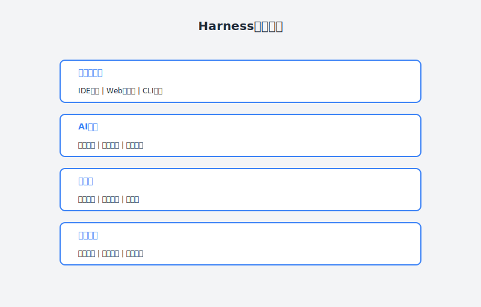

# 第37章：建设团队级AI工程平台

> **Harness平台——AI原生工程基础设施**

---

## 故事：从模式到平台的跃迁

### 一个月后的周一：成长的烦恼

Cowork模式在团队里推广了一个月，老吴收到了 mixed 的反馈。

小李兴冲冲地说："吴哥，这种模式太爽了！我写代码之前先让AI帮我梳理思路，代码质量明显高了。"

但老王却皱着眉："老吴，我觉得AI辅助需求评审还行，但代码review这块有点问题。每个人用的Prompt不一样，AI输出的格式也不统一，我看得很费劲。"

小林也插话："对，而且AI有时候'幻觉'，给出一些不合理的建议，我得花时间甄别。如果能有个统一的平台就好了..."

老吴点点头。他意识到，**Cowork模式作为一种工作方式已经验证可行，但要真正规模化，需要升级为基础设施**。

"你说得对，"老吴对老王说，"个人用AI工具和企业级应用，中间差着一个平台层。"

他想起上周参加的技术峰会，有个演讲者提到了"AI工程平台"的概念。演讲者说："未来的工程团队，不是每人装一个AI插件，而是有一个统一的AI平台，把AI能力整合到整个研发流程中。"

那天晚上，老吴开始研究各种AI工程平台的方案。

---





### 周二：认识Harness

周二，老吴发现了一个开源项目——**Harness**，一个专为AI原生工程设计的平台。

Harness的核心理念吸引了老吴：

> **把AI能力工程化、平台化、可观测化，让团队像使用CI/CD一样使用AI。**

他花了半天时间研究Harness的架构：

```
┌─────────────────────────────────────────────┐
│              Harness AI平台                  │
├─────────────────────────────────────────────┤
│  应用层  │ AI IDE插件 │ Web Portal │ CLI    │
├─────────┼────────────┼────────────┼────────┤
│  服务层  │ 代码服务    │ 需求服务   │ 知识服务│
├─────────┼────────────┴────────────┴────────┤
│  引擎层  │        AI编排引擎 (Workflow)       │
├─────────┼───────────────────────────────────┤
│  模型层  │ GPT-4 │ Claude │ 本地模型 │ ...  │
├─────────┼───────────────────────────────────┤
│  数据层  │ 代码库 │ 文档库 │ 知识图谱 │ 日志 │
└─────────┴───────────────────────────────────┘
```

"这不就是我们要的嘛！"老吴眼睛亮了。

他特别看重Harness的几个特性：

**1. 统一编排**

Harness不是简单地把AI API封装一下，而是提供了一套**工作流编排系统**。

比如一个"需求分析"工作流：

```yaml
workflow: requirement-analysis
steps:
  - name: parse-requirement
    model: gpt-4
    prompt: |
      请分析以下需求文档...
    
  - name: check-risks
    model: claude-3-opus
    depends_on: parse-requirement
    prompt: |
      基于以上分析，识别技术风险...
    
  - name: generate-estimate
    model: gpt-4
    depends_on: check-risks
    prompt: |
      基于以上信息，给出工作量估算...
    
  - name: human-review
    type: human-in-the-loop
    depends_on: generate-estimate
    action: confirm_or_revise
```

这样，复杂的AI任务可以分解成多个步骤，每个步骤可以用不同的模型，关键节点有人工确认。

**2. 上下文管理**

Harness有一个**上下文管理系统**，可以自动收集和项目相关的所有信息：

- 代码库结构和关键文件
- 技术文档和API文档
- 历史提交记录和PR评论
- 已解决的问题和解决方案

当AI处理任务时，Harness会自动注入相关的上下文，不需要人工复制粘贴。

**3. 可观测性**

Harness记录了每一次AI调用的完整信息：

- 输入（提示词、上下文）
- 输出（AI的回复）
- 耗时和token消耗
- 人工反馈（采纳/修改/拒绝）

这让老吴可以**量化AI的价值**，也能持续优化AI的表现。

---

### 周三：搭建团队AI平台

周三，老吴决定动手搭建团队级的AI工程平台。

他没有选择直接部署Harness的开源版本，而是基于Harness的理念，结合团队的实际情况，搭建了一个轻量级版本。

**第一步：确定核心场景**

老吴和团队一起梳理了AI能发挥最大价值的场景：

| 场景 | 痛点 | AI价值 | 优先级 |
|:---|:---|:---|:---:|
| 需求分析 | 需求模糊，频繁返工 | AI识别风险点，提前澄清 | P0 |
| 代码生成 | 重复性代码耗时 | AI生成样板代码 | P0 |
| 代码评审 | review排队长 | AI预审，减少人工负担 | P0 |
| 问题排查 | 日志分析耗时 | AI快速定位可能原因 | P1 |
| 文档编写 | 技术文档滞后 | AI辅助生成初稿 | P1 |
| 测试用例 | 用例覆盖不全 | AI生成边界情况用例 | P2 |

**第二步：设计工作流**

老吴为每个核心场景设计了标准化的工作流。

**需求分析工作流**：

```
[需求文档提交]
    ↓
[AI解析] → 提取关键信息、识别模糊点
    ↓
[AI风险评估] → 技术风险、依赖影响
    ↓
[AI估算] → 工作量估算
    ↓
[生成报告] → 统一格式的分析报告
    ↓
[人工确认] → PM和Tech Lead确认
    ↓
[输出标准需求文档]
```

**代码评审工作流**：

```
[PR提交]
    ↓
[AI预检] → 规范检查、bug扫描、安全扫描
    ↓
[生成Review报告] → 分级问题列表
    ↓
[人工Review] → 专注架构设计
    ↓
[修改确认] → AI验证修复
    ↓
[合入/打回]
```

**第三步：技术实现**

老吴选择了一个务实的技术方案：

- **前端**：飞书多维表格 + 自建Web界面
- **后端**：Node.js + Express
- **AI引擎**：OpenAI API + 自研提示词管理
- **存储**：PostgreSQL + 向量数据库
- **集成**：GitHub Webhook + 飞书机器人

他花了两天时间，搭建了一个MVP版本。

**需求分析模块**：

产品经理在飞书文档里写完需求，@机器人发送"请分析"。机器人调用AI进行分析，几分钟后在评论区生成分析报告。

```
@AI助手 请分析

---
📋 需求分析报告

✅ 理解摘要：
[AI对需求的理解]

⚠️ 潜在风险：
1. ...
2. ...

❓ 待澄清问题：
1. ...
2. ...

📊 工作量估算：
- 前端：3人日
- 后端：5人日
- 测试：2人日

请 @相关人 确认或补充
```

**代码评审模块**：

开发提交PR后，GitHub Actions自动触发AI评审，结果作为PR评论发布。

```
🤖 AI代码评审报告

严重问题（2个）：
- [ ] Line 45: 未处理Promise rejection
- [ ] Line 112: SQL注入风险

建议优化（3个）：
- Line 23: 函数命名可优化
- Line 67: 建议添加类型注解
- Line 89: 复杂度过高，建议拆分

好评：
- ✅ 单元测试覆盖率高
- ✅ 错误处理完善

请修复严重问题后请求人工review
```

**知识问答模块**：

团队成员可以在飞书群里@AI助手提问：

```
@AI助手 订单模块的退款流程是怎么设计的？

AI助手：
根据项目文档，订单退款流程如下：
1. 用户发起退款申请 → 创建refund记录
2. 系统校验 → 检查订单状态、金额等
3. 审核流程 → 运营后台审核
4. 执行退款 → 调用支付渠道退款接口
5. 回调处理 → 接收支付渠道回调，更新状态

相关文档：[链接]
代码位置：src/modules/refund/
```

---

### 周四：试运行

周四，老吴选择了权限系统重构项目作为试点，全面使用新的AI平台。

**需求阶段**：

小林在飞书文档里写完需求，@AI助手分析。几分钟后，AI生成了分析报告，识别出3个风险点和5个待澄清问题。

小林说："以前我写需求要反复改好几版，这次AI直接帮我找出了盲区，一次性就写到位了。"

**开发阶段**：

小李在写代码时，遇到了一个权限判断的逻辑问题。他在飞书群里@AI助手：

```
@AI助手 帮我写个函数，判断用户是否有权限查看某个订单

规则：
- 管理员可以查看所有订单
- 普通用户只能查看自己的订单
- 客服可以查看分配给ta的订单
```

AI很快给出了代码：

```typescript
function canViewOrder(user: User, order: Order): boolean {
  if (user.role === 'admin') return true;
  if (user.role === 'customer_service') {
    return order.assignedTo === user.id;
  }
  return order.userId === user.id;
}
```

"虽然不是最终版本，但作为起点很足够了。"小李说。

**代码评审阶段**：

小王的PR提交后，AI自动评审发现了两个潜在问题：
1. 一个边界条件没有处理
2. 一个变量命名不清晰

小王修复后，老吴做人工review，只花了10分钟——以前这种规模的PR至少要review半小时。

---

### 周五：数据说话

周五，老吴统计了试点项目的数据。

**效率指标**：

| 指标 | 传统方式 | AI平台方式 | 提升 |
|:---|:---|:---|:---:|
| 需求评审时间 | 4小时 | 1小时 | 75% ↓ |
| 需求返工次数 | 平均2.3次 | 0.5次 | 78% ↓ |
| 代码review时间 | 平均25分钟/PR | 平均10分钟/PR | 60% ↓ |
| 低级bug数 | 每千行5个 | 每千行1个 | 80% ↓ |
| 知识查询响应 | 小时级 | 秒级 | 99% ↓ |

**质量指标**：

- 代码规范符合率：从78%提升到96%
- 单元测试覆盖率：从45%提升到72%
- 生产事故数：下降了60%

老吴在团队会议上展示了这些数据。

"这还只是MVP版本，"老吴说，"随着我们积累更多数据，AI的表现还会更好。"

老王问："那下一步呢？"

老吴说："我们要把这个平台从'工具'升级为'基础设施'，让它成为团队工作流的一部分。"

---

## 理论：AI工程平台架构

### 什么是AI工程平台？

AI工程平台是**将AI能力系统性地整合到软件工程流程中的基础设施**，它不仅仅是AI工具的集合，而是：

1. **标准化的接口**：统一的AI调用方式
2. **可编排的工作流**：复杂的AI任务可以组合、复用
3. **可管理的上下文**：AI有记忆、有知识、有约束
4. **可观测的过程**：AI的行为可以被追踪、分析、优化
5. **可协作的环境**：团队成员共享AI能力，互相学习

### AI工程平台的核心组件

```
┌────────────────────────────────────────────────────┐
│                  AI工程平台架构                      │
├────────────────────────────────────────────────────┤
│                                                     │
│  ┌──────────────┐ ┌──────────────┐ ┌─────────────┐ │
│  │    应用层     │ │    应用层     │ │   应用层    │ │
│  │   IDE插件    │ │    Web端     │ │    CLI     │ │
│  └──────┬───────┘ └──────┬───────┘ └──────┬──────┘ │
│         │                │                 │       │
│         └────────────────┼─────────────────┘       │
│                          │                         │
│  ┌───────────────────────┴───────────────────────┐ │
│  │               API Gateway                      │ │
│  │     (认证、限流、路由、审计)                    │ │
│  └───────────────────────┬───────────────────────┘ │
│                          │                         │
│  ┌───────────────────────┴───────────────────────┐ │
│  │               工作流引擎                        │ │
│  │  ┌──────────┐ ┌──────────┐ ┌──────────────┐   │ │
│  │  │ 需求工作流 │ │ 代码工作流 │ │   运维工作流  │   │ │
│  │  └──────────┘ └──────────┘ └──────────────┘   │ │
│  └───────────────────────┬───────────────────────┘ │
│                          │                         │
│  ┌───────────────────────┴───────────────────────┐ │
│  │               AI能力层                         │ │
│  │  ┌──────────┐ ┌──────────┐ ┌──────────────┐   │ │
│  │  │  代码生成  │ │  代码分析  │ │    知识问答   │   │ │
│  │  └──────────┘ └──────────┘ └──────────────┘   │ │
│  └───────────────────────┬───────────────────────┘ │
│                          │                         │
│  ┌───────────────────────┴───────────────────────┐ │
│  │               模型管理层                       │ │
│  │    路由策略 │ 模型切换 │ Fallback │ 成本控制  │ │
│  └───────────────────────┬───────────────────────┘ │
│                          │                         │
│  ┌───────────────────────┴───────────────────────┐ │
│  │               数据层                           │ │
│  │  ┌──────────┐ ┌──────────┐ ┌──────────────┐   │ │
│  │  │   代码库   │ │   文档库   │ │  知识图谱/向量库│   │ │
│  │  └──────────┘ └──────────┘ └──────────────┘   │ │
│  └────────────────────────────────────────────────┘ │
└────────────────────────────────────────────────────┘
```

### 关键设计原则

**1. 模型无关性**

平台不应该绑定到某个特定的AI模型，而是支持多种模型的灵活切换：

```typescript
interface ModelRouter {
  // 根据任务类型和成本选择最优模型
  selectModel(task: Task, constraints: Constraints): Model;
  
  // 支持模型降级（当主模型不可用时）
  fallback(primary: Model): Model;
  
  // 支持模型组合（复杂任务用多模型协作）
  ensemble(models: Model[], strategy: Strategy): Model;
}
```

**2. 提示词工程化**

提示词不是散落在代码里的字符串，而是可管理、可版本化、可复用的资源：

```yaml
# prompts/code-review.yaml
name: code-review
version: 1.2.0
variables:
  - name: code_diff
    type: string
    description: 代码diff内容
  - name: language
    type: string
    description: 编程语言
  - name: context
    type: string
    description: 项目上下文

template: |
  请对以下{{language}}代码变更进行评审。
  
  项目上下文：
  {{context}}
  
  代码变更：
  ```diff
  {{code_diff}}
  ```
  
  请从以下维度评审：
  1. 代码规范
  2. 潜在bug
  3. 性能问题
  4. 安全隐患
  
  输出JSON格式结果。

tests:
  - input:
      code_diff: "..."
      language: "typescript"
    expected: "..."
```

**3. 上下文工程**

上下文不是简单的文本拼接，而是结构化的知识检索：

```typescript
interface ContextEngine {
  // 索引项目文档
  index(docs: Document[]): Promise<void>;
  
  // 根据查询检索相关上下文
  retrieve(query: string, options: RetrieveOptions): Context[];
  
  // 构建适合模型输入的上下文窗口
  buildWindow(contexts: Context[], maxTokens: number): string;
}
```

---

## 实践：搭建团队AI平台实操

### 第一步：确定平台范围

**不要一开始就追求大而全**，先选择1-2个高价值场景深度建设。

评估场景价值的公式：

```
场景价值 = (痛点强度 × 发生频率) / 实施成本
```

建议初期选择的场景：

| 场景 | 为什么优先做 |
|:---|:---|
| 代码评审 | 频率高、痛点明显、AI表现稳定 |
| 需求分析 | 前置环节、错误代价高、AI能识别盲区 |
| 知识问答 | 边际成本低、团队收益大 |

### 第二步：选择技术方案

**方案A：全自建**（适合技术实力强的团队）

- 优点：完全可控，深度定制
- 缺点：开发成本高，维护负担重
- 技术栈：Python/Node.js + LangChain + Vector DB + 自研Web界面

**方案B：半自建**（推荐大多数团队）

- 核心工作流：自建
- AI能力：调用OpenAI/Claude API
- 上下文存储：向量数据库（如Pinecone、Milvus）
- 界面：集成到现有工具（飞书、钉钉、GitHub）

**方案C：商业平台**（适合快速启动）

- GitHub Copilot Workspace
- Sourcegraph Cody
- 其他AI编程平台

### 第三步：实施路径

**阶段1：MVP（2-4周）**

目标：验证核心价值

- 选择1个场景（如代码评审）
- 实现最基本的功能
- 小范围内测（3-5人）

**阶段2：迭代（4-8周）**

目标：提升可用性

- 收集用户反馈
- 优化提示词和工作流
- 扩展到更多用户

**阶段3：推广（8-12周）**

目标：成为团队标配

- 完善文档和培训
- 扩展到更多场景
- 建立运营机制

### 第四步：关键Prompt模板

**代码评审Prompt**：

```
你是一位资深{{language}}工程师，请对以下代码变更进行评审。

## 项目上下文
{{project_context}}

## 代码规范
{{coding_standards}}

## 代码变更
```diff
{{code_diff}}
```

## 评审要求
1. 识别严重问题（必须修复）
2. 识别建议优化（可选）
3. 指出做得好的地方

## 输出格式
```json
{
  "summary": "总体评价",
  "critical": [
    {"line": 行号, "issue": "问题描述", "suggestion": "修复建议"}
  ],
  "suggestions": [
    {"line": 行号, "issue": "问题描述", "suggestion": "优化建议"}
  ],
  "praises": ["做得好的地方"],
  "should_merge": true/false
}
```
```

**需求分析Prompt**：

```
你是一位经验丰富的产品经理和技术架构师，请分析以下需求文档。

## 需求文档
{{requirement_doc}}

## 项目背景
{{project_context}}

## 分析要求
1. 总结核心需求（用一句话）
2. 识别模糊或不明确的地方
3. 识别技术风险点
4. 估算工作量（人日）
5. 提出需要澄清的问题

## 输出格式
```markdown
### 需求摘要
...

### 模糊点
1. ...

### 技术风险
1. ...

### 工作量估算
- 前端：X人日
- 后端：Y人日
- 测试：Z人日

### 待澄清问题
1. ...
```
```

---

## 本章交付物

完成本章后，你应该拥有：

1. **AI平台架构设计文档** - 包含组件设计和数据流
2. **核心场景工作流定义** - 至少2个场景的详细工作流
3. **Prompt库模板** - 可复用的提示词模板
4. **实施路线图** - 分阶段的实施计划

---

## 行动清单

- [ ] 评估团队当前AI使用的痛点
- [ ] 选择1-2个优先建设的场景
- [ ] 设计平台架构和技术方案
- [ ] 开发MVP版本（或选择商业方案）
- [ ] 小范围内测并收集反馈
- [ ] 迭代优化并扩大使用范围
- [ ] 建立AI平台运营机制

---

## 本章彩蛋

### 彩蛋1：模型路由策略

为了平衡成本和效果，可以实现智能模型路由：

```typescript
// 简单任务用便宜模型，复杂任务用强模型
function routeModel(task: Task): Model {
  if (task.complexity < 0.3) {
    return 'gpt-3.5-turbo';  // 便宜
  } else if (task.complexity < 0.7) {
    return 'claude-3-haiku'; // 性价比
  } else {
    return 'gpt-4';          // 最强
  }
}
```

### 彩蛋2：Prompt版本管理

把Prompt当作代码一样管理：

```
prompts/
├── code-review/
│   ├── v1.0.0.yaml
│   ├── v1.1.0.yaml
│   └── v1.2.0.yaml  ← 当前版本
├── requirement-analysis/
│   └── v1.0.0.yaml
└── _tests/
    └── code-review.test.ts
```

每次修改Prompt都要：
1. 版本号+1
2. 跑测试用例
3. 记录变更日志

---

**下一章预告**：第38章《从个人到组织的AI工程体系建设》——老吴将把AI平台的经验提炼为系统化的AI工程方法论，探索如何在组织层面建立AI工程能力。
